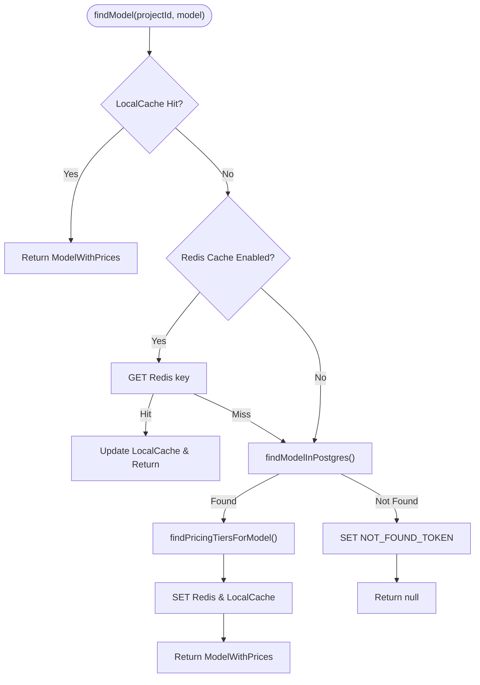
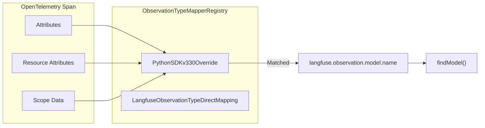

# Models & Pricing

<details>
<summary>관련 소스 파일</summary>

이 위키 페이지를 생성하기 위한 컨텍스트로 다음 파일들이 사용되었습니다.

- [packages/shared/AGENTS.md](packages/shared/AGENTS.md)
- [packages/shared/prisma/migrations/20241029130802_prices_drop_excess_index/migration.sql](packages/shared/prisma/migrations/20241029130802_prices_drop_excess_index/migration.sql)
- [packages/shared/src/encryption/signature.ts](packages/shared/src/encryption/signature.ts)
- [packages/shared/src/server/cache/index.ts](packages/shared/src/server/cache/index.ts)
- [packages/shared/src/server/cache/localCache.ts](packages/shared/src/server/cache/localCache.ts)
- [packages/shared/src/server/ingestion/modelMatch.ts](packages/shared/src/server/ingestion/modelMatch.ts)
- [packages/shared/src/server/ingestion/processEventBatch.ts](packages/shared/src/server/ingestion/processEventBatch.ts)
- [packages/shared/src/server/otel/ObservationTypeMapper.ts](packages/shared/src/server/otel/ObservationTypeMapper.ts)
- [packages/shared/src/server/otel/OtelIngestionProcessor.ts](packages/shared/src/server/otel/OtelIngestionProcessor.ts)
- [packages/shared/src/server/redis/otelIngestionQueue.ts](packages/shared/src/server/redis/otelIngestionQueue.ts)
- [web/src/__tests__/server/api/otel/otelMapping.servertest.ts](web/src/__tests__/server/api/otel/otelMapping.servertest.ts)
- [web/src/components/table/use-cases/models.tsx](web/src/components/table/use-cases/models.tsx)
- [web/src/components/table/use-cases/score-configs.tsx](web/src/components/table/use-cases/score-configs.tsx)
- [web/src/features/models/components/CloneModelButton.tsx](web/src/features/models/components/CloneModelButton.tsx)
- [web/src/features/models/components/EditModelButton.tsx](web/src/features/models/components/EditModelButton.tsx)
- [web/src/features/models/components/PriceBreakdownTooltip.tsx](web/src/features/models/components/PriceBreakdownTooltip.tsx)
- [web/src/features/models/components/pricing-tiers/TierPrefillButtons.tsx](web/src/features/models/components/pricing-tiers/TierPrefillButtons.tsx)
- [web/src/features/models/validation.ts](web/src/features/models/validation.ts)
- [web/src/features/public-api/types/models.ts](web/src/features/public-api/types/models.ts)
- [web/src/pages/api/public/models/[modelId]/index.ts](web/src/pages/api/public/models/[modelId]/index.ts)
- [web/src/pages/api/public/models/index.ts](web/src/pages/api/public/models/index.ts)
- [web/src/pages/api/public/otel/v1/traces/index.ts](web/src/pages/api/public/otel/v1/traces/index.ts)
- [web/src/server/api/routers/models.ts](web/src/server/api/routers/models.ts)
- [worker/AGENTS.md](worker/AGENTS.md)
- [worker/src/__tests__/localCache.test.ts](worker/src/__tests__/localCache.test.ts)
- [worker/src/__tests__/modelMatch.test.ts](worker/src/__tests__/modelMatch.test.ts)
- [worker/src/__tests__/signature.test.ts](worker/src/__tests__/signature.test.ts)
- [worker/src/constants/default-model-prices.json](worker/src/constants/default-model-prices.json)
- [worker/src/features/entityChange/entityChangeWorker.ts](worker/src/features/entityChange/entityChangeWorker.ts)
- [worker/src/queues/__tests__/otelDirectEventWrite.test.ts](worker/src/queues/__tests__/otelDirectEventWrite.test.ts)
- [worker/src/queues/entityChangeQueue.ts](worker/src/queues/entityChangeQueue.ts)
- [worker/src/queues/otelIngestionQueue.ts](worker/src/queues/otelIngestionQueue.ts)
- [worker/src/queues/shardedQueueRegistry.ts](worker/src/queues/shardedQueueRegistry.ts)
- [worker/src/scripts/upsertDefaultModelPrices.ts](worker/src/scripts/upsertDefaultModelPrices.ts)

</details>


이 페이지는 model definition과 pricing system을 문서화합니다. Langfuse가 model configuration을 저장하는 방식, observation의 `model` field를 해당 configuration에 matching하는 방식, cost 계산을 위해 pricing tier를 적용하는 방식, 그리고 UI와 API를 통해 management를 expose하는 방식을 설명합니다.

ingestion 중 token count가 계산되는 방식은 [Data Ingestion Pipeline (6)]()을 참조하세요. `Model`, `PricingTier`, `Price` table의 PostgreSQL schema는 [Data Architecture (3)]()를 참조하세요.

---

## 개요

Langfuse는 model definition library를 유지합니다. 각 definition에는 다음이 포함됩니다.
- incoming observation을 model과 연결하는 데 사용되는 **regex match pattern**.
- count가 제공되지 않았을 때 server-side token counting에 사용되는 **tokenizer configuration**.
- 서로 다른 usage type과 usage condition에 대한 per-token cost를 결정하는 하나 이상의 **pricing tier**.

model definition에는 두 category가 있습니다.

| Category | DB의 `projectId` | Maintainer | Editable |
|---|---|---|---|
| Langfuse-managed (built-in) | `NULL` | Langfuse | clone만 가능 |
| User-managed (custom) | Project UUID | User | edit / delete |

출처: [packages/shared/src/server/ingestion/modelMatch.ts:222-223](), [web/src/components/table/use-cases/models.tsx:59-60]()

---

## Data Architecture & Code Entities

model matching과 pricing logic은 raw ingestion string과 database entity 사이의 gap을 연결합니다.

**Model Entity Mapping:**

```mermaid
classDiagram
    class "IngestionEventType" {
        +string model
        +UsageDetails usage
    }
    class "findModel()" {
        <<Function>>
        +ModelMatchProps p
        +findModelInPostgres()
    }
    class "Model" {
        <<Prisma Entity>>
        +string modelName
        +string matchPattern
        +string tokenizerId
        +Json tokenizerConfig
    }
    class "PricingTier" {
        <<Prisma Entity>>
        +string name
        +boolean isDefault
        +PricingTierCondition[] conditions
        +int priority
    }
    class "Price" {
        <<Prisma Entity>>
        +string usageType
        +Decimal price
    }

    "IngestionEventType" ..> "findModel()" : "provides model string"
    "findModel()" --> "Model" : "matches via Regex"
    "Model" *-- "PricingTier" : "has many"
    "PricingTier" *-- "Price" : "has many"
```

출처: [packages/shared/src/server/ingestion/modelMatch.ts:17-25](), [web/src/features/models/validation.ts:48-59](), [worker/src/constants/default-model-prices.json:1-28]()

---

## Default Model Prices

built-in model definition은 JSON file에 정의되며 synchronization script를 통해 database에 seed됩니다.

**Source of truth**: `worker/src/constants/default-model-prices.json` [worker/src/constants/default-model-prices.json:1]()

`upsertDefaultModelPrices` script는 PostgreSQL `models` table이 codebase와 synchronized 상태를 유지하도록 이 file을 batch(default size 10)로 처리합니다 [worker/src/scripts/upsertDefaultModelPrices.ts:81-141]().

### Pricing Tiers & Usage Types
price는 USD 기준 cost-per-token으로 표현됩니다. 단일 model은 여러 `pricingTiers`를 가질 수 있습니다 [worker/src/constants/default-model-prices.json:14](). 모든 model은 정확히 하나의 default tier를 가져야 합니다 [worker/src/scripts/upsertDefaultModelPrices.ts:41-45]().

| Provider | Common Usage Types |
|---|---|
| OpenAI | `input`, `output`, `input_cached_tokens`, `input_cache_read` |
| Anthropic | `input`, `output`, `input_cache_read`, `input_cache_creation` |
| Legacy | `total` |

`gpt-4o`의 tier 예시:
```json
{
  "id": "b9854a5c92dc496b997d99d20_tier_default",
  "name": "Standard",
  "isDefault": true,
  "prices": {
    "input": 0.0000025,
    "input_cached_tokens": 0.00000125,
    "input_cache_read": 0.00000125,
    "output": 0.00001
  }
}
```
출처: [worker/src/constants/default-model-prices.json:14-28](), [worker/src/scripts/upsertDefaultModelPrices.ts:32-46]()

---

## Model Matching Algorithm

observation이 ingest되면(REST 또는 OTel을 통해) pipeline은 pricing을 resolve하기 위해 `findModel`을 호출합니다.

**Model Match Data Flow:**



### Multi-Level Caching
Langfuse는 high-volume ingestion을 처리하기 위해 model matching에 two-level caching strategy를 구현합니다.
1.  **L1 Local Cache**: Redis roundtrip을 줄이기 위한 짧은 TTL(default 10s)의 in-memory `LocalCache` instance [packages/shared/src/server/ingestion/modelMatch.ts:28-43]().
2.  **L2 Redis Cache**: consistency를 유지하기 위한 container 간 shared cache [packages/shared/src/server/ingestion/modelMatch.ts:179-206]().

### Regex Matching in Postgres
`findModelInPostgres` function은 POSIX regex match(`~` operator)를 사용해 ingest된 model string과 `match_pattern`이 matching되는 model을 찾습니다 [packages/shared/src/server/ingestion/modelMatch.ts:284-286]().

query는 project-specific model을 global model보다 우선시하며(`project_id ASC`), price versioning을 허용하기 위해 가장 최근 `start_date`를 선택합니다 [packages/shared/src/server/ingestion/modelMatch.ts:306-312]().

### Cache Invalidation
- **Locking**: `isModelMatchCacheLocked()`가 true를 반환하면 bulk update 중 stale data를 읽는 것을 방지하기 위해 Redis를 건너뜁니다 [packages/shared/src/server/ingestion/modelMatch.ts:187-193]().
- **Negative Caching**: unknown model에 대해 database hammering을 방지하기 위해 `NOT_FOUND_TOKEN`(`LANGFUSE_MODEL_MATCH_NOT_FOUND`)을 사용합니다 [packages/shared/src/server/ingestion/modelMatch.ts:204-206]().
- **Manual Clearing**: UI 또는 API를 통해 model이 update될 때 `clearModelCacheForProject`가 호출됩니다 [web/src/server/api/routers/models.ts:18]().

출처: [packages/shared/src/server/ingestion/modelMatch.ts:45-157](), [packages/shared/src/server/ingestion/modelMatch.ts:179-240](), [packages/shared/src/server/ingestion/modelMatch.ts:278-318]()

---

## OTel Model Mapping

OpenTelemetry ingestion의 경우 `OtelIngestionProcessor`는 span attribute에서 model information을 추출하기 위해 mapper registry를 사용합니다.

**OTel Attribute Mapping:**



`ObservationTypeMapperRegistry`는 priority order로 evaluate되는 여러 mapper를 관리합니다. 예를 들어 `PythonSDKv330Override` mapper(Priority 0)는 구버전 Python SDK(<= 3.3.0)가 `model_parameters` 또는 `usage_details` 같은 generation-like attribute를 포함하면서 observation type을 "span"으로 잘못 설정할 수 있는 case를 처리합니다 [packages/shared/src/server/otel/ObservationTypeMapper.ts:165-214]().

출처: [packages/shared/src/server/otel/OtelIngestionProcessor.ts:115-142](), [packages/shared/src/server/otel/ObservationTypeMapper.ts:165-214](), [web/src/__tests__/server/api/otel/otelMapping.servertest.ts:126-128]()

---

## UI Components & Management

model은 Langfuse Settings UI에서 관리됩니다. `ModelTable` component는 built-in model과 custom model 모두를 위한 searchable interface를 제공합니다 [web/src/components/table/use-cases/models.tsx:64-88]().

### Table Columns
model table은 key configuration attribute를 표시합니다.
- **Maintainer**: icon을 사용해 "Langfuse"(built-in) model과 "User"(custom) model을 구분합니다 [web/src/components/table/use-cases/models.tsx:135-151]().
- **Match Pattern**: ingestion matching에 사용되는 regex입니다 [web/src/components/table/use-cases/models.tsx:156-170]().
- **Prices**: usage type별 cost breakdown입니다(예: input, output) [web/src/components/table/use-cases/models.tsx:172-192]().
- **Last Used**: 해당 model을 사용한 latest generation의 start time이며, ClickHouse `observations` table에서 query됩니다 [web/src/components/table/use-cases/models.tsx:92-101](), [web/src/server/api/routers/models.ts:206-215]().

### Actions
- **Clone**: user는 Langfuse-managed model을 clone하여 custom version을 만들 수 있습니다 [web/src/components/table/use-cases/models.tsx:16]().
- **Test Match**: 특정 string이 model의 pattern과 match되는지 verify하기 위한 specialized button `TestModelMatchButton` [web/src/components/table/use-cases/models.tsx:30]().
- **Upsert**: model을 create하거나 edit하기 위한 `UpsertModelFormDialog` [web/src/components/table/use-cases/models.tsx:29]().

출처: [web/src/components/table/use-cases/models.tsx:110-212](), [web/src/server/api/routers/models.ts:194-222]()

---

## Configuration Reference

| Environment Variable | Description |
|---|---|
| `LANGFUSE_CACHE_MODEL_MATCH_ENABLED` | model matching을 위한 Redis(L2) caching을 enable/disable합니다 [packages/shared/src/server/ingestion/modelMatch.ts:182](). |
| `LANGFUSE_LOCAL_CACHE_MODEL_MATCH_ENABLED` | model matching을 위한 in-memory(L1) caching을 enable/disable합니다 [packages/shared/src/server/ingestion/modelMatch.ts:34](). |
| `LANGFUSE_LOCAL_CACHE_MODEL_MATCH_TTL_MS` | L1 local cache의 TTL(default 10,000ms) [packages/shared/src/server/ingestion/modelMatch.ts:28](). |
| `LANGFUSE_LOCAL_CACHE_MODEL_MATCH_MAX` | L1 local cache의 최대 item 수(default 20,000) [packages/shared/src/server/ingestion/modelMatch.ts:29](). |

출처: [packages/shared/src/server/ingestion/modelMatch.ts:27-43](), [packages/shared/src/server/ingestion/modelMatch.ts:182]()
