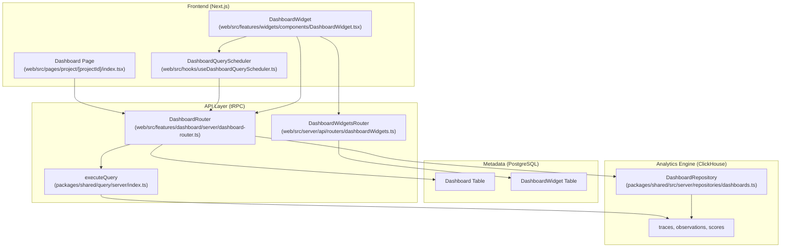
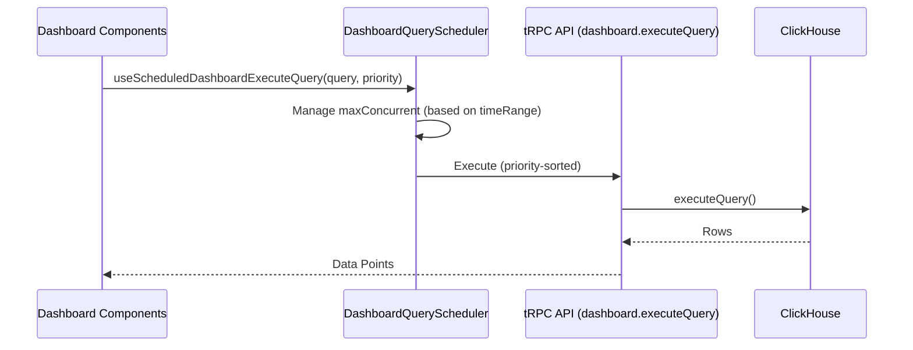

# Dashboard & Analytics

관련 소스 파일

이 위키 페이지를 생성하기 위한 컨텍스트로 다음 파일들이 사용되었습니다.

- [packages/shared/prisma/migrations/20250519145128_resize_dashboard_y_axis_components/migration.sql](packages/shared/prisma/migrations/20250519145128_resize_dashboard_y_axis_components/migration.sql)
- [packages/shared/prisma/migrations/20250520123737_add_single_aggregate_chart_type/migration.sql](packages/shared/prisma/migrations/20250520123737_add_single_aggregate_chart_type/migration.sql)
- [packages/shared/src/features/query/dataModel.ts](packages/shared/src/features/query/dataModel.ts)
- [packages/shared/src/index.ts](packages/shared/src/index.ts)
- [packages/shared/src/server/repositories/dashboards.ts](packages/shared/src/server/repositories/dashboards.ts)
- [packages/shared/src/server/services/DashboardService/DashboardService.ts](packages/shared/src/server/services/DashboardService/DashboardService.ts)
- [packages/shared/src/server/services/DashboardService/types.ts](packages/shared/src/server/services/DashboardService/types.ts)
- [packages/shared/src/tableDefinitions/mapDashboards.ts](packages/shared/src/tableDefinitions/mapDashboards.ts)
- [web/src/__tests__/server/dashboard-widget-version.servertest.ts](web/src/__tests__/server/dashboard-widget-version.servertest.ts)
- [web/src/__tests__/server/queryBuilderDashboards.servertest.ts](web/src/__tests__/server/queryBuilderDashboards.servertest.ts)
- [web/src/components/ui/chart.tsx](web/src/components/ui/chart.tsx)
- [web/src/features/dashboard/components/ChartScores.tsx](web/src/features/dashboard/components/ChartScores.tsx)
- [web/src/features/dashboard/components/LatencyChart.tsx](web/src/features/dashboard/components/LatencyChart.tsx)
- [web/src/features/dashboard/components/LatencyTables.tsx](web/src/features/dashboard/components/LatencyTables.tsx)
- [web/src/features/dashboard/components/ModelCostTable.tsx](web/src/features/dashboard/components/ModelCostTable.tsx)
- [web/src/features/dashboard/components/ModelSelector.tsx](web/src/features/dashboard/components/ModelSelector.tsx)
- [web/src/features/dashboard/components/ModelUsageChart.tsx](web/src/features/dashboard/components/ModelUsageChart.tsx)
- [web/src/features/dashboard/components/ScoresTable.tsx](web/src/features/dashboard/components/ScoresTable.tsx)
- [web/src/features/dashboard/components/SelectDashboardDialog.tsx](web/src/features/dashboard/components/SelectDashboardDialog.tsx)
- [web/src/features/dashboard/components/TracesBarListChart.tsx](web/src/features/dashboard/components/TracesBarListChart.tsx)
- [web/src/features/dashboard/components/TracesTimeSeriesChart.tsx](web/src/features/dashboard/components/TracesTimeSeriesChart.tsx)
- [web/src/features/dashboard/components/UserChart.tsx](web/src/features/dashboard/components/UserChart.tsx)
- [web/src/features/dashboard/components/hooks.ts](web/src/features/dashboard/components/hooks.ts)
- [web/src/features/dashboard/components/score-analytics/CategoricalScoreChart.tsx](web/src/features/dashboard/components/score-analytics/CategoricalScoreChart.tsx)
- [web/src/features/dashboard/components/score-analytics/NumericScoreHistogram.tsx](web/src/features/dashboard/components/score-analytics/NumericScoreHistogram.tsx)
- [web/src/features/dashboard/components/score-analytics/NumericScoreTimeSeriesChart.tsx](web/src/features/dashboard/components/score-analytics/NumericScoreTimeSeriesChart.tsx)
- [web/src/features/dashboard/components/score-analytics/ScoreAnalytics.tsx](web/src/features/dashboard/components/score-analytics/ScoreAnalytics.tsx)
- [web/src/features/dashboard/lib/chart-data-adapters.ts](web/src/features/dashboard/lib/chart-data-adapters.ts)
- [web/src/features/dashboard/lib/dashboard-utils.ts](web/src/features/dashboard/lib/dashboard-utils.ts)
- [web/src/features/dashboard/lib/dashboardUiTableToViewMapping.ts](web/src/features/dashboard/lib/dashboardUiTableToViewMapping.ts)
- [web/src/features/dashboard/server/dashboard-router.ts](web/src/features/dashboard/server/dashboard-router.ts)
- [web/src/features/widgets/chart-library/AreaChartTimeSeries.tsx](web/src/features/widgets/chart-library/AreaChartTimeSeries.tsx)
- [web/src/features/widgets/chart-library/BigNumber.tsx](web/src/features/widgets/chart-library/BigNumber.tsx)
- [web/src/features/widgets/chart-library/Chart.tsx](web/src/features/widgets/chart-library/Chart.tsx)
- [web/src/features/widgets/chart-library/DownloadButton.tsx](web/src/features/widgets/chart-library/DownloadButton.tsx)
- [web/src/features/widgets/chart-library/HistogramChart.tsx](web/src/features/widgets/chart-library/HistogramChart.tsx)
- [web/src/features/widgets/chart-library/HorizontalBarChart.tsx](web/src/features/widgets/chart-library/HorizontalBarChart.tsx)
- [web/src/features/widgets/chart-library/LineChartTimeSeries.tsx](web/src/features/widgets/chart-library/LineChartTimeSeries.tsx)
- [web/src/features/widgets/chart-library/PieChart.tsx](web/src/features/widgets/chart-library/PieChart.tsx)
- [web/src/features/widgets/chart-library/PivotTable.tsx](web/src/features/widgets/chart-library/PivotTable.tsx)
- [web/src/features/widgets/chart-library/VerticalBarChart.tsx](web/src/features/widgets/chart-library/VerticalBarChart.tsx)
- [web/src/features/widgets/chart-library/VerticalBarChartTimeSeries.tsx](web/src/features/widgets/chart-library/VerticalBarChartTimeSeries.tsx)
- [web/src/features/widgets/chart-library/utils.ts](web/src/features/widgets/chart-library/utils.ts)
- [web/src/features/widgets/components/DashboardGrid.tsx](web/src/features/widgets/components/DashboardGrid.tsx)
- [web/src/features/widgets/components/DashboardWidget.tsx](web/src/features/widgets/components/DashboardWidget.tsx)
- [web/src/features/widgets/components/SelectWidgetDialog.tsx](web/src/features/widgets/components/SelectWidgetDialog.tsx)
- [web/src/features/widgets/components/WidgetForm.tsx](web/src/features/widgets/components/WidgetForm.tsx)
- [web/src/features/widgets/components/WidgetTable.tsx](web/src/features/widgets/components/WidgetTable.tsx)
- [web/src/features/widgets/components/widgetFilterColumns.ts](web/src/features/widgets/components/widgetFilterColumns.ts)
- [web/src/features/widgets/constants/widgetFilterPresets.ts](web/src/features/widgets/constants/widgetFilterPresets.ts)
- [web/src/features/widgets/utils.ts](web/src/features/widgets/utils.ts)
- [web/src/features/widgets/utils/import-export-utils.clienttest.ts](web/src/features/widgets/utils/import-export-utils.clienttest.ts)
- [web/src/features/widgets/utils/import-export-utils.ts](web/src/features/widgets/utils/import-export-utils.ts)
- [web/src/features/widgets/utils/pivot-table-utils.ts](web/src/features/widgets/utils/pivot-table-utils.ts)
- [web/src/pages/project/[projectId]/dashboards/[dashboardId]/index.tsx](web/src/pages/project/[projectId]/dashboards/[dashboardId]/index.tsx)
- [web/src/pages/project/[projectId]/index.tsx](web/src/pages/project/[projectId]/index.tsx)
- [web/src/pages/project/[projectId]/widgets/[widgetId]/index.tsx](web/src/pages/project/[projectId]/widgets/[widgetId]/index.tsx)
- [web/src/pages/project/[projectId]/widgets/new.tsx](web/src/pages/project/[projectId]/widgets/new.tsx)
- [web/src/server/api/routers/dashboardWidgets.ts](web/src/server/api/routers/dashboardWidgets.ts)
- [web/src/utils/numbers.ts](web/src/utils/numbers.ts)

## 목적과 범위

Langfuse의 Dashboard & Analytics system은 LLM observability data를 시각화하고 분석하기 위한 flexible infrastructure를 제공합니다. user는 traces, observations, scores 전반에서 complex aggregation을 실행하는 widget으로 구성된 custom dashboard를 만들 수 있습니다. 이 system은 dual-database architecture 위에 build됩니다. PostgreSQL은 configuration(dashboard, widget definition, layout)을 저장하고, ClickHouse는 time-series 및 multi-dimensional analytics를 위한 high-performance engine 역할을 합니다.

---

## System Architecture & Data Flow

analytics engine은 PostgreSQL의 structured configuration과 ClickHouse의 high-cardinality event data 사이의 gap을 연결합니다. system은 fixed card가 있는 "Home" dashboard와 custom user-defined dashboard를 모두 지원합니다.

### Dashboard Data Flow

Title: Dashboard Data Request Flow

**출처:** [web/src/features/dashboard/server/dashboard-router.ts:1-41](), [web/src/pages/project/[projectId]/index.tsx:187-199](), [web/src/features/widgets/components/DashboardWidget.tsx:201-213](), [packages/shared/src/server/repositories/dashboards.ts:37-102](), [web/src/features/dashboard/server/dashboard-router.ts:23-29]()

---

## Data Modeling & View Declarations

Langfuse는 ClickHouse table complexity를 abstract하기 위해 "View Declarations"를 사용합니다. view는 사용 가능한 dimension(grouping field), measure(aggregatable metric), filter를 정의합니다.

### View Versioning (V1 vs V2)
system은 analytics engine의 두 version을 지원합니다. component는 feature flag나 widget requirement를 기반으로 `ViewVersion`("v1" 또는 "v2")을 결정합니다 [web/src/features/widgets/components/DashboardWidget.tsx:94-99]().
- **v1**: legacy ClickHouse schema에 mapping되는 standard view.
- **v2**: 대개 `events` table aggregation 또는 updated `traces`/`observations` logic을 활용하는 modern view [web/src/features/widgets/components/DashboardWidget.tsx:94-99]().
- **Automatic Upgrades**: v2 feature가 필요한 widget(`requiresV2`로 detect됨) 또는 `minVersion >= 2`인 widget은 자동으로 v2 engine을 강제합니다 [web/src/features/widgets/components/DashboardWidget.tsx:85-99]().

### Key Views
| View Name | Source Table | Primary Use Case |
| :--- | :--- | :--- |
| `traces` | `traces` | high-level request analytics와 latency [web/src/features/widgets/components/DashboardWidget.tsx:118-120](). |
| `observations` | `observations` | model usage, token cost, span-level latency [web/src/features/dashboard/components/ModelUsageChart.tsx:73-74](). |
| `scores-numeric` | `scores` | evaluation trend와 numeric feedback analysis [web/src/features/dashboard/server/dashboard-router.ts:193-200](). |
| `scores-categorical` | `scores` | categorical evaluation distribution [web/src/features/dashboard/server/dashboard-router.ts:207-212](). |

**출처:** [web/src/features/widgets/components/DashboardWidget.tsx:85-99](), [web/src/features/dashboard/components/ModelUsageChart.tsx:73-74](), [web/src/features/dashboard/server/dashboard-router.ts:193-212]()

---

## Custom Dashboard & Widget Model

Custom dashboard는 `WidgetPlacement` object를 포함하는 `definition` JSON으로 정의됩니다 [web/src/pages/project/[projectId]/dashboards/[dashboardId]/index.tsx:37-45]().

### Widget Placement and Grid
Dashboard는 12-column grid system을 사용합니다. `WidgetPlacement`는 다음을 정의합니다.
- `x`, `y`: grid 안의 position [web/src/pages/project/[projectId]/dashboards/[dashboardId]/index.tsx:40-41]().
- `x_size`, `y_size`: widget의 dimension [web/src/pages/project/[projectId]/dashboards/[dashboardId]/index.tsx:42-43]().
- `widgetId`: `DashboardWidget` configuration에 대한 foreign key [web/src/pages/project/[projectId]/dashboards/[dashboardId]/index.tsx:39]().

### Widget Types & Aggregations
`WidgetForm`은 user가 metric과 chart type을 configure할 수 있게 합니다 [web/src/features/widgets/components/WidgetForm.tsx:122-179]().
- **Time-Series**: `LINE_TIME_SERIES`, `BAR_TIME_SERIES` [web/src/features/widgets/components/WidgetForm.tsx:131-143]().
- **Total Value**: `NUMBER`(Big Number), `HORIZONTAL_BAR`, `VERTICAL_BAR`, `PIE`, `PIVOT_TABLE` [web/src/features/widgets/components/WidgetForm.tsx:123-130, 145-158, 166-178]().
- **Statistical**: `HISTOGRAM` [web/src/features/widgets/components/WidgetForm.tsx:159-165]().

`resolveAggregationAndChartType` function은 selected measure와 chart type 사이의 consistency를 보장합니다. 예를 들어 HISTOGRAM chart에는 `histogram` aggregation을 강제하고, measure가 histogram을 지원하지 않으면 `NUMBER`로 되돌립니다 [web/src/features/widgets/components/WidgetForm.tsx:198-230]().

**출처:** [web/src/pages/project/[projectId]/dashboards/[dashboardId]/index.tsx:37-45](), [web/src/features/widgets/components/WidgetForm.tsx:122-179, 198-230]()

---

## Filter Integration

Analytics query는 scoped view를 제공하기 위해 여러 source의 filter를 통합합니다.

### Filter Mapping
UI filter(예: "Trace Name")는 query되는 view에 따라 올바른 database column으로 mapping되어야 합니다. 이는 `mapLegacyUiTableFilterToView`가 처리합니다 [web/src/features/dashboard/lib/dashboardUiTableToViewMapping.ts:30](). 이 layer는 legacy UI label을 canonical view field로 변환합니다 [web/src/features/dashboard/server/dashboard-router.ts:121-125]().

### Common Filters
- **Time Range**: 모든 widget 전반에 `startTime` 또는 `timestamp` filter로 적용됩니다 [web/src/pages/project/[projectId]/index.tsx:142-156]().
- **Environment**: ClickHouse consistency를 보장하기 위해 `extractEnvironmentFilterFromFilters`와 `convertEnvFilterToClickhouseFilter`를 통해 별도로 처리됩니다 [packages/shared/src/server/repositories/dashboards.ts:17-35]().
- **Global Dashboard Filters**: user는 특정 dashboard에 persistent filter를 저장할 수 있으며, 이는 active UI filter와 merge됩니다 [web/src/pages/project/[projectId]/dashboards/[dashboardId]/index.tsx:81-82, 152-160]().

**출처:** [web/src/features/dashboard/lib/dashboardUiTableToViewMapping.ts:30](), [packages/shared/src/server/repositories/dashboards.ts:17-35](), [web/src/pages/project/[projectId]/index.tsx:142-166](), [web/src/pages/project/[projectId]/dashboards/[dashboardId]/index.tsx:152-160]()

---

## Query Scheduling & Performance

heavy dashboard load 중 UI lag와 database exhaustion을 방지하기 위해 Langfuse는 `DashboardQueryScheduler`를 구현합니다.

Title: Dashboard Query Scheduling Sequence

- **Concurrency Control**: `getDashboardQuerySchedulerMaxConcurrent`는 dashboard의 complexity/range를 기반으로 limit을 조정합니다 [web/src/pages/project/[projectId]/index.tsx:187-190]().
- **Priority**: "Model Usage" 같은 critical metric에는 specific priority(예: 1001)를 할당하여 secondary chart보다 먼저 load되게 할 수 있습니다 [web/src/features/dashboard/components/ModelUsageChart.tsx:118]().
- **SSE Support**: long-running query의 경우 system은 `shouldUseWidgetSSE`를 통해 Server-Sent Events(SSE)를 지원합니다 [web/src/features/widgets/components/DashboardWidget.tsx:216-221]().

**출처:** [web/src/pages/project/[projectId]/index.tsx:187-190](), [web/src/features/dashboard/components/ModelUsageChart.tsx:118](), [web/src/features/widgets/components/DashboardWidget.tsx:216-221]()

---

## Specialized Analytics Logic

### Scores & Numeric Histograms
Score는 `getScoreAggregate` 또는 V2 `getScoreAggregateV2`를 통해 aggregate됩니다 [web/src/features/dashboard/server/dashboard-router.ts:163-169]().
- **Histogram Conversion**: `clickhouseHistogramToChartData`는 ClickHouse의 `histogram()` output(tuple array: `lower_bound, upper_bound, count`)을 UI가 요구하는 `{ chartData, chartLabels }` shape로 변환합니다 [web/src/features/dashboard/server/dashboard-router.ts:137-161]().

### Cost and Latency Breakdown
- **Cost by Type**: `getObservationCostByTypeByTime`은 시간에 따른 per-key cost breakdown을 제공하기 위해 ClickHouse의 `cost_details`에 대해 `ARRAY JOIN`을 수행합니다 [packages/shared/src/server/repositories/dashboards.ts:134-160]().
- **Latency Percentiles**: `generationsLatenciesQuery` 같은 view는 performance distribution을 시각화하기 위해 percentile(p50, p90, p95, p99)을 활용합니다 [web/src/features/dashboard/components/LatencyTables.tsx:34-42]().

**출처:** [web/src/features/dashboard/server/dashboard-router.ts:137-169](), [packages/shared/src/server/repositories/dashboards.ts:134-160](), [web/src/features/dashboard/components/LatencyTables.tsx:34-42]()
