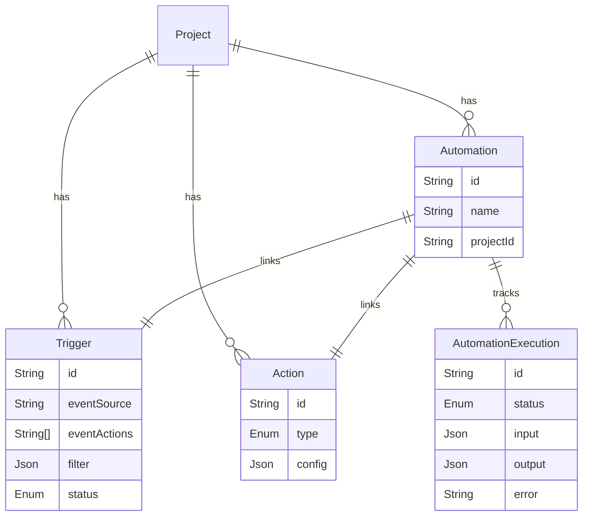
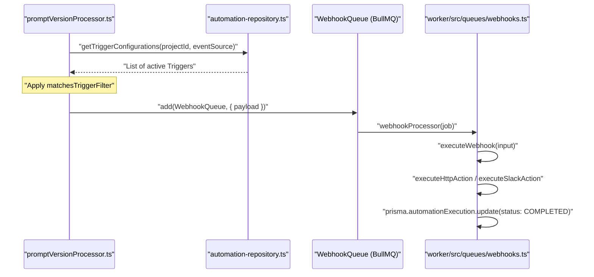

# Automation System

<details>
<summary>관련 소스 파일</summary>

이 위키 페이지를 생성하기 위한 컨텍스트로 다음 파일들이 사용되었습니다.

- [packages/shared/src/domain/automations.ts](packages/shared/src/domain/automations.ts)
- [packages/shared/src/domain/webhooks.ts](packages/shared/src/domain/webhooks.ts)
- [packages/shared/src/server/automations.test.ts](packages/shared/src/server/automations.test.ts)
- [packages/shared/src/server/automations.ts](packages/shared/src/server/automations.ts)
- [packages/shared/src/server/llm/baseUrlValidation.ts](packages/shared/src/server/llm/baseUrlValidation.ts)
- [packages/shared/src/server/outbound-url/fetch.ts](packages/shared/src/server/outbound-url/fetch.ts)
- [packages/shared/src/server/outbound-url/validation.ts](packages/shared/src/server/outbound-url/validation.ts)
- [packages/shared/src/server/repositories/automation-repository.ts](packages/shared/src/server/repositories/automation-repository.ts)
- [packages/shared/src/server/services/SlackService.ts](packages/shared/src/server/services/SlackService.ts)
- [packages/shared/src/server/webhooks/ipBlocking.ts](packages/shared/src/server/webhooks/ipBlocking.ts)
- [packages/shared/src/server/webhooks/validation.ts](packages/shared/src/server/webhooks/validation.ts)
- [web/src/__tests__/server/automations-trpc.servertest.ts](web/src/__tests__/server/automations-trpc.servertest.ts)
- [web/src/__tests__/server/datasets-trpc.servertest.ts](web/src/__tests__/server/datasets-trpc.servertest.ts)
- [web/src/__tests__/server/llm-api-key.servertest.ts](web/src/__tests__/server/llm-api-key.servertest.ts)
- [web/src/__tests__/server/slack-integration.servertest.ts](web/src/__tests__/server/slack-integration.servertest.ts)
- [web/src/__tests__/server/unit/utilities.servertest.ts](web/src/__tests__/server/unit/utilities.servertest.ts)
- [web/src/features/automations/components/actions/SlackActionForm.tsx](web/src/features/automations/components/actions/SlackActionForm.tsx)
- [web/src/features/automations/server/router.ts](web/src/features/automations/server/router.ts)
- [web/src/features/slack/app_manifest.json](web/src/features/slack/app_manifest.json)
- [web/src/features/slack/components/ChannelSelector.tsx](web/src/features/slack/components/ChannelSelector.tsx)
- [web/src/features/slack/components/SlackTestMessageButton.tsx](web/src/features/slack/components/SlackTestMessageButton.tsx)
- [web/src/features/slack/server/oauth-handlers.ts](web/src/features/slack/server/oauth-handlers.ts)
- [web/src/features/slack/server/router.ts](web/src/features/slack/server/router.ts)
- [web/src/pages/api/public/slack/install/index.ts](web/src/pages/api/public/slack/install/index.ts)
- [web/src/pages/api/public/slack/oauth/index.ts](web/src/pages/api/public/slack/oauth/index.ts)
- [web/src/pages/project/[projectId]/settings/integrations/slack.tsx](web/src/pages/project/[projectId]/settings/integrations/slack.tsx)
- [web/src/server/api/routers/utilities.ts](web/src/server/api/routers/utilities.ts)
- [worker/src/__tests__/ip-blocking.test.ts](worker/src/__tests__/ip-blocking.test.ts)
- [worker/src/__tests__/llm-base-url-validation.test.ts](worker/src/__tests__/llm-base-url-validation.test.ts)
- [worker/src/__tests__/outbound-connection-validation.test.ts](worker/src/__tests__/outbound-connection-validation.test.ts)
- [worker/src/__tests__/promptVersionProcessor.test.ts](worker/src/__tests__/promptVersionProcessor.test.ts)
- [worker/src/__tests__/slack-message-builder.test.ts](worker/src/__tests__/slack-message-builder.test.ts)
- [worker/src/__tests__/slack-processor.test.ts](worker/src/__tests__/slack-processor.test.ts)
- [worker/src/__tests__/url-normalization.test.ts](worker/src/__tests__/url-normalization.test.ts)
- [worker/src/__tests__/webhook-redirect-headers.test.ts](worker/src/__tests__/webhook-redirect-headers.test.ts)
- [worker/src/__tests__/webhook-redirect.test.ts](worker/src/__tests__/webhook-redirect.test.ts)
- [worker/src/__tests__/webhook-validation.test.ts](worker/src/__tests__/webhook-validation.test.ts)
- [worker/src/__tests__/webhooks.test.ts](worker/src/__tests__/webhooks.test.ts)
- [worker/src/features/entityChange/promptVersionProcessor.ts](worker/src/features/entityChange/promptVersionProcessor.ts)
- [worker/src/features/slack/slackMessageBuilder.ts](worker/src/features/slack/slackMessageBuilder.ts)
- [worker/src/queues/webhooks.ts](worker/src/queues/webhooks.ts)

</details>


이 페이지는 prompt와 기타 domain entity의 변경으로 trigger되는 event-driven action을 가능하게 하는 automation system을 문서화합니다. system은 trigger(event matcher와 filter), action(webhook, Slack notification, GitHub dispatch), automation(trigger-action pair)으로 구성됩니다. execution은 monitoring과 debugging을 위해 추적됩니다.

---

## 개요

**automation system**은 domain event(예: prompt update)가 configured trigger와 matching되고, matching되면 associated action을 실행하는 event-driven architecture를 구현합니다. system은 webhook(external URL로 HTTP POST), Slack message(channel notification), GitHub workflow dispatch의 세 가지 action type을 지원합니다.

**Key Components:**

- **Trigger**: automation이 언제 fire되어야 하는지 정의합니다(event source + event actions + optional filters). [packages/shared/prisma/schema.prisma:1476-1498]()
- **Action**: 무엇이 일어나야 하는지 정의합니다(configuration이 포함된 webhook, Slack, GitHub dispatch). [packages/shared/prisma/schema.prisma:1454-1474]()
- **Automation**: trigger를 action에 user-friendly name으로 연결합니다. [packages/shared/prisma/schema.prisma:1500-1515]()
- **AutomationExecution**: status, input/output, error와 함께 개별 execution instance를 추적합니다. [packages/shared/prisma/schema.prisma:1531-1560]()

**Execution Flow:**

1. Domain event가 발생합니다(예: 새 prompt version 생성). [worker/src/features/entityChange/promptVersionProcessor.ts:26-28]()
2. system은 `getTriggerConfigurations`를 통해 event source와 status가 matching되는 active trigger를 query합니다. [worker/src/features/entityChange/promptVersionProcessor.ts:38-42]()
3. matching trigger마다 `matchesTriggerFilter`를 적용해 event payload에 대한 condition을 evaluate합니다. [worker/src/features/entityChange/promptVersionProcessor.ts:53-56]()
4. filter가 match되면 system은 job을 `WebhookQueue`에 enqueue합니다. [worker/src/features/entityChange/promptVersionProcessor.ts:180-199]()
5. worker service의 `webhookProcessor`가 action을 process합니다. [worker/src/queues/webhooks.ts:49-58]()
6. execution status가 `AutomationExecution` table에서 `COMPLETED` 또는 `ERROR`로 update됩니다. [worker/src/queues/webhooks.ts:246-258]()

출처: [worker/src/features/entityChange/promptVersionProcessor.ts:26-200](), [worker/src/queues/webhooks.ts:49-258](), [packages/shared/prisma/schema.prisma:1454-1560]()

---

## Data Model

automation system은 configuration과 execution history를 PostgreSQL에 저장합니다.

### Core Entities

**Diagram: Automation Entity Relationship**


출처: [packages/shared/prisma/schema.prisma:1454-1560](), [packages/shared/src/domain/automations.ts:24-29]()

### Action Configuration

`Action.config` field는 type-specific parameter를 저장합니다. 보안을 위해 `secretKey`나 `githubToken` 같은 sensitive field는 database에 encrypted 상태로 저장됩니다. [packages/shared/src/domain/automations.ts:51-125]()

| ActionType | Key Config Fields | Code Entity |
|---|---|---|
| `WEBHOOK` | `url`, `apiVersion`, `secretKey`, `headers` | `WebhookActionConfigSchema` |
| `SLACK` | `channelId`, `channelName` | `SlackActionConfigSchema` |
| `GITHUB_DISPATCH` | `url`, `eventType`, `githubToken` | `GitHubDispatchActionConfigSchema` |

출처: [packages/shared/src/domain/automations.ts:51-125]()

---

## Execution Logic

Automation은 action type에 따라 specific handler로 route하는 `webhookProcessor`를 통해 asynchronously 실행됩니다. [worker/src/queues/webhooks.ts:61-113]()

### Webhook Execution
Webhook은 request가 internal metadata service나 unauthorized IP에 도달하지 않도록 `fetchWithSecureRedirects`를 사용합니다. [worker/src/queues/webhooks.ts:183-192]()
- **Signatures**: request에는 `secretKey`와 request payload를 사용해 `createSignatureHeader`로 생성된 `x-langfuse-signature` header가 포함됩니다. [worker/src/queues/webhooks.ts:14-15](), [worker/src/queues/webhooks.ts:262-267]()
- **Payload**: `PromptWebhookOutboundSchema`를 따릅니다. [packages/shared/src/domain/webhooks.ts:18-42]()
- **Headers**: custom header를 configure할 수 있으며 execution time에 decrypted됩니다. [worker/src/queues/webhooks.ts:250-252]()

### Slack Execution
Slack action은 `SlackService`를 사용해 configured channel로 message를 보냅니다. [worker/src/queues/webhooks.ts:89-93]()
- **Templates**: message는 `SlackMessageBuilder`를 사용해 build되며, `prompt-version` 같은 event에 대해 Block Kit formatting을 지원합니다. [worker/src/features/slack/slackMessageBuilder.ts:17-159]()
- **Escaping**: builder는 markdown injection을 방지하기 위해 `escapeSlackMrkdwn`을 사용합니다. [worker/src/features/slack/slackMessageBuilder.ts:7-12]()
- **Integration Mapping**: installation은 `projectId`를 Slack `teamId`에 mapping하는 `SlackIntegration` table에 저장됩니다. [packages/shared/src/server/services/SlackService.ts:143-158]()

### GitHub Dispatch Execution
GitHub repository에서 `repository_dispatch` event를 trigger합니다. [worker/src/queues/webhooks.ts:94-99]()
- **Auth**: action config에 제공된 decrypted `githubToken`을 사용합니다. [worker/src/queues/webhooks.ts:379-381]()
- **Payload Truncation**: payload가 GitHub의 64KB limit을 초과하면 truncate됩니다. [worker/src/queues/webhooks.ts:40-46]()

### Execution Tracking & Auto-Disabling
개별 run은 `AutomationExecution` table에 추적됩니다. [packages/shared/prisma/schema.prisma:1531-1560]()
system은 unreliable automation을 monitor하기 위해 `getConsecutiveAutomationFailures`를 통해 consecutive failure를 추적합니다. [web/src/features/automations/server/router.ts:49-70]()

출처: [worker/src/queues/webhooks.ts:61-413](), [worker/src/features/slack/slackMessageBuilder.ts:17-159](), [packages/shared/src/domain/webhooks.ts:18-49](), [packages/shared/src/server/services/SlackService.ts:143-158]()

---

## Trigger Matching

Trigger는 `getTriggerConfigurations` repository function을 사용해 domain event와 matching됩니다. [packages/shared/src/server/repositories/automation-repository.ts:105-135]()

**Diagram: Event to Execution Flow**


출처: [worker/src/features/entityChange/promptVersionProcessor.ts:38-42](), [packages/shared/src/server/repositories/automation-repository.ts:105-135](), [worker/src/queues/webhooks.ts:49-113](), [worker/src/queues/webhooks.ts:246-258]()

---

## UI Components

automation management interface는 `web/src/features/automations`에 있습니다.

- **AutomationsPage**: list/create/edit view를 관리하는 main container. [web/src/features/automations/components/automations.tsx]()
- **AutomationSidebar**: configured automation list를 표시합니다. [web/src/features/automations/components/AutomationSidebar.tsx]()
- **AutomationForm**: trigger와 action을 생성하고 update하기 위한 unified form. [web/src/features/automations/components/automationForm.tsx]()
- **WebhookActionForm**: header management를 포함한 webhook configuration을 위한 specialized form. [web/src/features/automations/components/actions/WebhookActionForm.tsx]()

**Diagram: Frontend Component Architecture**

```mermaid
graph TD
    "AutomationsPage" --> "AutomationSidebar"
    "AutomationsPage" --> "AutomationDetails"
    "AutomationsPage" --> "AutomationForm"
    "AutomationForm" --> "InlineFilterBuilder"
    "AutomationForm" --> "WebhookActionForm"
    "AutomationForm" --> "SlackActionForm"
```
출처: [web/src/features/automations/components/automations.tsx](), [web/src/features/automations/components/automationForm.tsx](), [web/src/features/automations/components/actions/WebhookActionForm.tsx]()

---

## Security

security는 automation system의 핵심이며, 특히 outbound request와 credential storage에서 중요합니다.

- **SSRF Protection**: webhook과 LLM base URL은 `validateWebhookURL`과 `validateLlmConnectionBaseURL`을 사용해 validate됩니다. [packages/shared/src/server/webhooks/validation.ts:30-52](), [packages/shared/src/server/llm/baseUrlValidation.ts:26-56]()
- **IP Blocking**: `isIPBlocked` function은 destination을 `BLOCKED_CIDRS`에 정의된 private/internal CIDR의 static deny-list(예: `127.0.0.0/8`, `169.254.0.0/16`)와 비교해 확인합니다. [packages/shared/src/server/webhooks/ipBlocking.ts:4-90]()
- **Hostname Blocking**: `localhost`, `host.docker.internal`, cloud metadata endpoint 같은 hostname은 `isHostnameBlocked`를 통해 명시적으로 blocked됩니다. [packages/shared/src/server/webhooks/ipBlocking.ts:109-144]()
- **Secure Fetch**: `fetchWithSecureRedirects`는 redirect도 validate되도록 보장해 redirect-based SSRF를 방지합니다. [packages/shared/src/server/outbound-url/fetch.ts:120-230]()
- **Encryption**: sensitive credential(secret, token, `secretKey`)은 storage 전에 `encrypt()`를 사용해 encrypted되고 execution time에 decrypted됩니다. [web/src/features/automations/server/router.ts:125-130](), [worker/src/queues/webhooks.ts:250-252]()
- **RBAC**: automation을 view하거나 modify하는 access는 `automations:read`와 `automations:CUD` scope로 제한됩니다. [web/src/features/automations/server/router.ts:58-62](), [web/src/features/automations/server/router.ts:82-86]()

출처: [packages/shared/src/server/webhooks/validation.ts](), [packages/shared/src/server/webhooks/ipBlocking.ts](), [packages/shared/src/server/llm/baseUrlValidation.ts](), [packages/shared/src/server/outbound-url/fetch.ts](), [web/src/features/automations/server/router.ts]()
