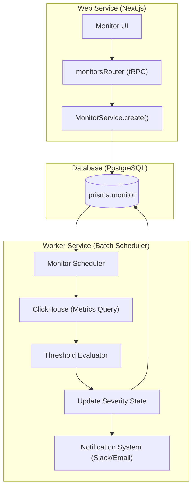
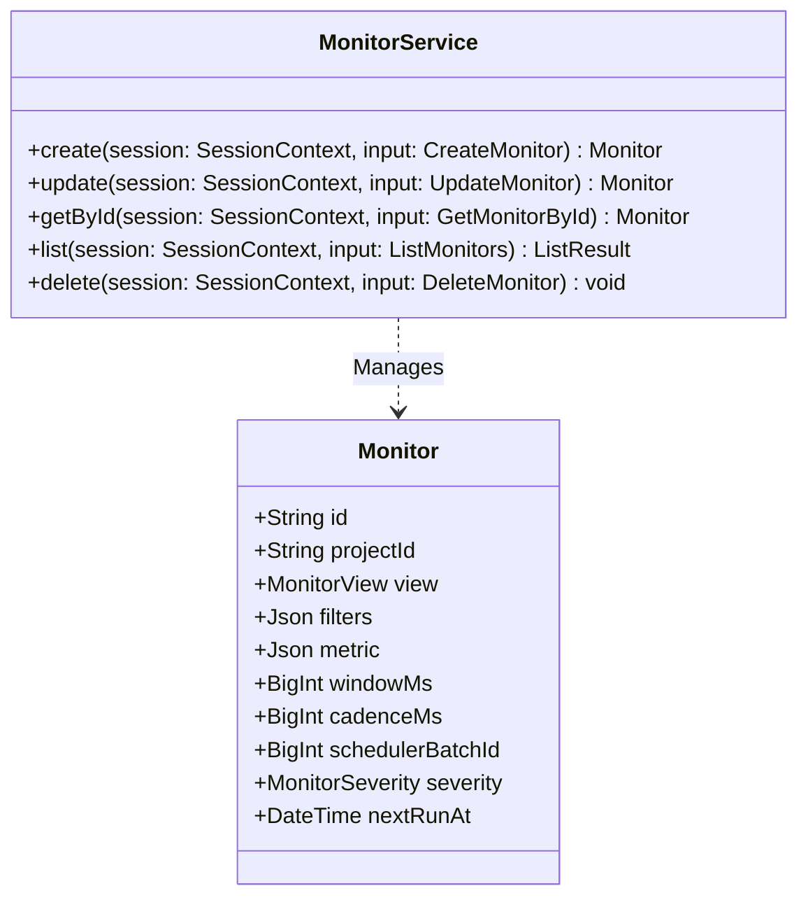

# Monitors & Alerting

관련 소스 파일

이 위키 페이지를 생성하기 위한 컨텍스트로 다음 파일들이 사용되었습니다.

- [packages/shared/AGENTS.md](packages/shared/AGENTS.md)
- [packages/shared/src/encryption/signature.ts](packages/shared/src/encryption/signature.ts)
- [packages/shared/src/features/monitors/service/helpers.test.ts](packages/shared/src/features/monitors/service/helpers.test.ts)
- [packages/shared/src/features/monitors/service/helpers.ts](packages/shared/src/features/monitors/service/helpers.ts)
- [packages/shared/src/features/monitors/service/service.ts](packages/shared/src/features/monitors/service/service.ts)
- [packages/shared/src/features/monitors/service/types.test.ts](packages/shared/src/features/monitors/service/types.test.ts)
- [packages/shared/src/features/monitors/service/types.ts](packages/shared/src/features/monitors/service/types.ts)
- [packages/shared/src/server/cache/index.ts](packages/shared/src/server/cache/index.ts)
- [packages/shared/src/server/cache/localCache.ts](packages/shared/src/server/cache/localCache.ts)
- [packages/shared/src/server/ingestion/modelMatch.ts](packages/shared/src/server/ingestion/modelMatch.ts)
- [web/src/__tests__/server/monitorService.servertest.ts](web/src/__tests__/server/monitorService.servertest.ts)
- [web/src/__tests__/server/monitors.servertest.ts](web/src/__tests__/server/monitors.servertest.ts)
- [web/src/features/feature-flags/available-flags.ts](web/src/features/feature-flags/available-flags.ts)
- [web/src/features/rbac/constants/projectAccessRights.ts](web/src/features/rbac/constants/projectAccessRights.ts)
- [worker/AGENTS.md](worker/AGENTS.md)
- [worker/src/__tests__/localCache.test.ts](worker/src/__tests__/localCache.test.ts)
- [worker/src/__tests__/modelMatch.test.ts](worker/src/__tests__/modelMatch.test.ts)
- [worker/src/__tests__/signature.test.ts](worker/src/__tests__/signature.test.ts)
- [worker/src/features/entityChange/entityChangeWorker.ts](worker/src/features/entityChange/entityChangeWorker.ts)
- [worker/src/queues/entityChangeQueue.ts](worker/src/queues/entityChangeQueue.ts)

Monitors feature는 Langfuse 안의 observability metric에 대한 threshold-based alerting을 제공합니다. user가 traces와 observations에 대한 periodic check를 정의하고, 이를 특정 threshold와 비교하며, metric이 정의된 limit을 초과할 때 notification을 trigger할 수 있게 합니다.

## 개요

Monitor는 Web service가 configuration(CRUD)을 관리하고 Worker service가 sharded batch system을 통해 periodic evaluation을 처리하는 dual-service architecture 위에 build됩니다. 

### Monitor Model
`Monitor` entity는 PostgreSQL에 저장되며 여러 key component로 구성됩니다.
- **View**: query할 data source(`observations`, `scores-numeric` 또는 `scores-categorical`). [packages/shared/src/features/monitors/service/helpers.ts:135-144]()
- **Filters**: data scope를 제한하는 criteria set(예: `environment = production`). [packages/shared/src/features/monitors/service/service.ts:48]()
- **Metric**: 특정 measure와 aggregation(예: `count`, `p95 latency`, `sum of tokens`). [packages/shared/src/features/monitors/service/service.ts:70]()
- **Window**: evaluation을 위한 lookback period(예: `5m`, `1h`, `1d`). [packages/shared/src/features/monitors/service/service.ts:49]()
- **Thresholds**: 정의된 `alert`(critical)와 `warning` value. [packages/shared/src/features/monitors/service/service.ts:74-75]()
- **Severity**: monitor의 현재 state(`ok`, `warning`, `alert`, `no-data` 또는 `unknown`). [packages/shared/src/features/monitors/service/helpers.ts:159-174]()
- **Renotify**: state가 unhealthy 상태로 유지될 때 repeated alert를 위한 configuration. [packages/shared/src/features/monitors/service/service.ts:77]()

출처: [packages/shared/src/features/monitors/service/service.ts:44-86](), [packages/shared/src/features/monitors/service/helpers.ts:135-174]()

---

## System Architecture & Data Flow

monitoring system은 PostgreSQL metadata layer와 ClickHouse metric을 연결합니다.

### Code to Entity Mapping

| System Name | Code Entity | File Path |
|:---|:---|:---|
| **Monitor Service** | `MonitorService` | `packages/shared/src/features/monitors/service/service.ts` |
| **Monitor Schema** | `MonitorSchema` | `packages/shared/src/features/monitors/service/types.ts` |
| **Prisma Model** | `model Monitor` | `packages/shared/prisma/schema.prisma` |
| **Scheduler Batch ID** | `calculateSchedulerBatchId` | `packages/shared/src/features/monitors/service/helpers.ts` |

### Evaluation Data Flow

다음 diagram은 Monitor가 configuration에서 periodic evaluation으로 전환되는 방식을 보여줍니다.

출처: [packages/shared/src/features/monitors/service/service.ts:43-86](), [packages/shared/src/features/monitors/service/helpers.ts:88-114]()

---

## MonitorService CRUD Operations

`MonitorService`는 monitor를 관리하기 위한 logic을 encapsulate합니다. filter normalization과 derived scheduling field 계산을 처리합니다.

### Key Functions
- `create(session, input)`: 새 monitor를 생성합니다. query shape를 기반으로 `schedulerBatchId`를 계산하고 `nextRunAt` timestamp를 결정합니다. [packages/shared/src/features/monitors/service/service.ts:44-86]()
- `update(session, input)`: user-editable field를 update합니다. `severity`나 `alertedAt` 같은 worker-owned lifecycle column은 의도적으로 overwrite하지 않습니다. [packages/shared/src/features/monitors/service/service.ts:88-135]()
- `getById(session, input)`: project-level scoping을 enforce하며 특정 monitor를 ID로 retrieve합니다. [packages/shared/src/features/monitors/service/service.ts:137-148]()
- `list(session, input)`: project의 paginated monitor를 fetch하며, `severity`, `status`, `alertedAt` 같은 column별 sorting을 지원합니다. [packages/shared/src/features/monitors/service/service.ts:150-175]()

### Filter Canonicalization
worker execution을 최적화하기 위해 filter는 `schedulerBatchId`로 hash되기 전에 "canonically" sort됩니다. 이를 통해 동일한 filter가 다른 순서로 있는 두 monitor가 같은 batch ID를 공유하여 worker가 ClickHouse query를 deduplicate할 수 있습니다. set-semantics operator(예: `any of`)의 경우 value array도 sort됩니다.
출처: [packages/shared/src/features/monitors/service/helpers.ts:48-82](), [packages/shared/src/features/monitors/service/service.ts:48-56]()

---

## Scheduler & Batch System

Monitor는 계산된 **Cadence**를 기반으로 periodic하게 evaluate됩니다.

### Cadence Calculation
system은 monitor의 window를 기반으로 evaluation frequency를 자동으로 결정합니다.
- **Sub-day windows**: 매 **1분**마다 evaluate됩니다. [packages/shared/src/features/monitors/service/helpers.ts:141-144]()
- **Day-to-Week windows**: 매 **30분**마다 evaluate됩니다. [packages/shared/src/features/monitors/service/helpers.ts:147-152]()
- **Week+ windows**: 매 **48시간**마다 evaluate됩니다. [packages/shared/src/features/monitors/service/helpers.ts:154-157]()

출처: [packages/shared/src/features/monitors/service/helpers.ts:88-92](), [packages/shared/src/features/monitors/service/helpers.test.ts:140-158]()

### State Management
Monitor는 `MonitorSeverity`를 통해 health를 추적합니다. state machine은 다음 사이를 transition합니다.
- `ok`: metric이 normal bound 안에 있습니다.
- `warning`: metric이 `warningThreshold`를 초과했습니다.
- `alert`: metric이 `alertThreshold`를 초과했습니다.
- `no-data`: window에 대해 반환된 data가 없습니다.
- `unknown`: first evaluation 전 initial state.

출처: [packages/shared/src/features/monitors/service/helpers.ts:159-174]()

### Implementation Details

출처: [packages/shared/src/features/monitors/service/service.ts:43-189](), [packages/shared/src/features/monitors/service/types.ts:42-56]()

---

## Integration with Notifications

monitor의 state가 변경되면 worker가 notification system을 trigger합니다.
- **Severity States**: transition은 `severityChangedAt`에 record됩니다. [packages/shared/src/features/monitors/service/service.ts:143]()
- **Renotify Logic**: `Monitor` model의 `renotify` field는 alert를 반복해야 하는지 configure합니다. [packages/shared/src/features/monitors/service/service.ts:77]()
- **In-App & External**: integration은 automation 및 notification system을 통해 관리됩니다.

## Permissions & RBAC

Monitor access는 다음 project-level scope로 관리됩니다.
- `monitors:read`: monitor와 현재 status를 view합니다.
- `monitors:CUD`: monitor configuration을 Create, Update, Delete합니다.

이 scope들은 기본적으로 `OWNER`, `ADMIN`, `MEMBER` role에 할당됩니다. `VIEWER` role은 `monitors:read`만 보유합니다.

출처: [web/src/features/rbac/constants/projectAccessRights.ts:81-82](), [web/src/features/rbac/constants/projectAccessRights.ts:142-143](), [web/src/features/rbac/constants/projectAccessRights.ts:259]()
