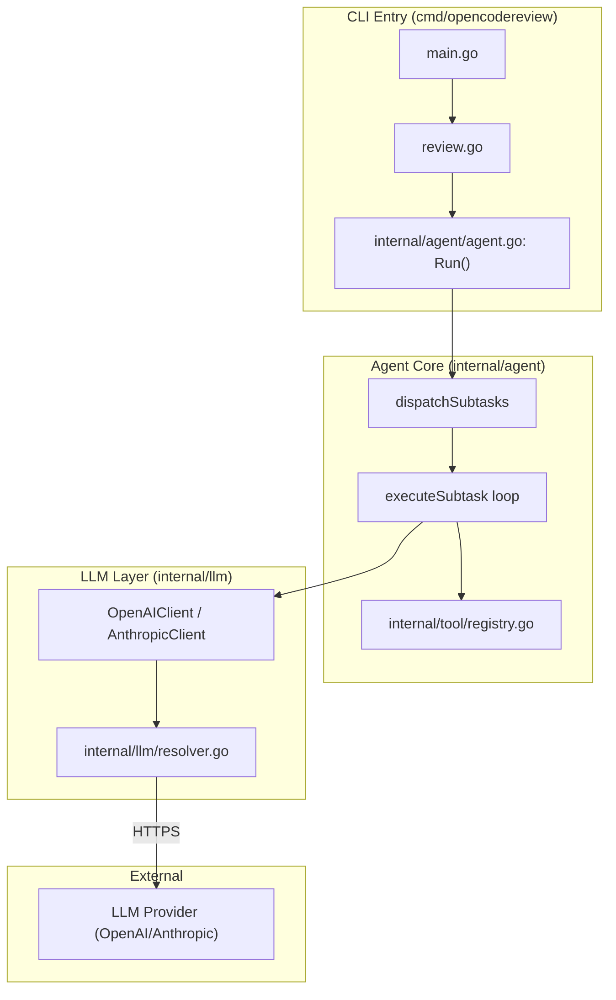
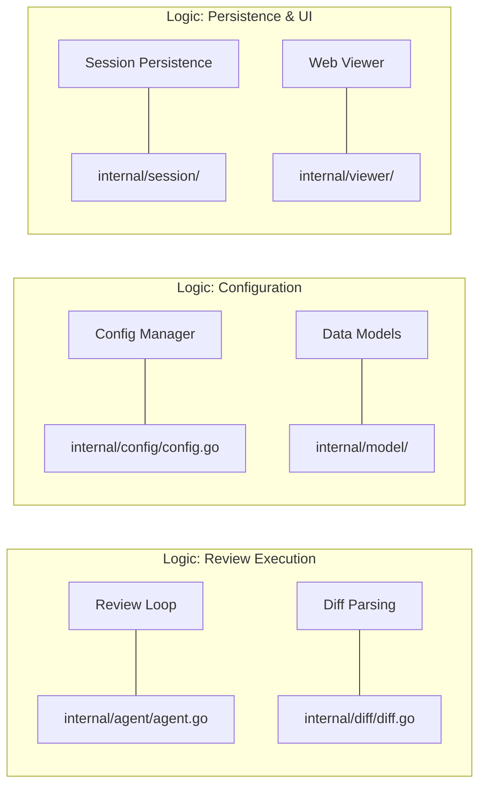

# OpenCodeReview 개요

관련 소스 파일

다음 파일들은 이 위키 페이지를 생성하기 위한 컨텍스트로 사용되었습니다.

- [CONTRIBUTING.md](CONTRIBUTING.md)
- [CONTRIBUTING.zh-CN.md](CONTRIBUTING.zh-CN.md)
- [README.md](README.md)
- [README.zh-CN.md](README.zh-CN.md)
- [package.json](package.json)

OpenCodeReview (OCR)는 Git diff에 대한 깊이 있고 컨텍스트를 인식하는 분석을 제공하도록 설계된 AI 기반 코드 리뷰 CLI입니다. 원래 Alibaba Group의 내부 도구로 개발되었으며, 결정론적 엔지니어링과 도구로 보강된 에이전트를 결합해 대규모 코드베이스를 처리하도록 개선되었습니다 [README.md:18-24]().

## OpenCodeReview란?

OCR은 원시 Git diff와 의미 있는 아키텍처 피드백 사이의 간극을 메웁니다. 다음과 같이 작동하는 가상의 시니어 개발자 역할을 합니다.
*   **diff 너머를 읽기**: 도구를 사용해 전체 파일 내용을 가져오고 코드베이스에서 상호 참조를 검색합니다 [README.md:22-23]().
*   **자율적으로 작동**: Large Language Model (LLM)을 추론 엔진으로 사용해 다단계 리뷰 파이프라인을 실행합니다 [README.md:40-42]().
*   **결정론적 엔지니어링**: 안정성과 커버리지를 보장하기 위해 파일 선택, 번들링, 규칙 매칭에 엄격한 제약을 사용합니다 [README.md:42-50]().

설치 및 초기 설정 지침은 **[시작하기](#1.1)**를 참조하세요.

## 상위 수준 아키텍처

이 시스템은 동시성 Agent 모델을 중심으로 구축되었습니다. `ocr review`를 통해 리뷰가 트리거되면 시스템은 변경된 파일을 식별하고 이를 worker pool에 디스패치합니다.

### 리뷰 파이프라인
에이전트는 구조화된 워크플로를 따릅니다.
1.  **계획 단계**: 중요한 변경의 경우, 에이전트는 아키텍처상 우려 사항을 식별하기 위해 초기 위험 분석을 수행합니다 [README.md:49-50]().
2.  **주 작업 루프**: 에이전트는 변경된 파일을 순회하며 `file_read` 또는 `code_search` 같은 도구를 활용해 컨텍스트를 수집합니다. `code_comment` 도구를 통해 피드백을 제출합니다 [README.md:56-57]().
3.  **메모리 압축**: 큰 컨텍스트를 처리하기 위해 에이전트는 3개 영역 분할 전략(Frozen, Compress, Active zones)을 사용해 대화 기록을 관리합니다.

### 코드 엔티티 관계도
이 다이어그램은 CLI 명령이 핵심 에이전트 로직을 트리거하고 LLM providers와 상호작용하는 방식을 보여줍니다.

**출처:** [README.md:111-127](), [CONTRIBUTING.md:111-126]().

## 핵심 개념

### 도구 사용 에이전트
LLM은 단순한 텍스트 생성기가 아닙니다. 대규모 프로덕션 데이터에서 추출된 목적 지향 도구 세트를 갖춘 에이전트입니다 [README.md:56-57]().

| 도구 | 목적 |
| :--- | :--- |
| `code_search` | 저장소 전체에서 regex 또는 텍스트 검색을 실행합니다. |
| `file_read` | repo 내 모든 파일의 특정 줄 범위를 읽습니다. |
| `file_read_diff` | 현재 변경에 관련된 다른 파일들의 diff를 검사합니다. |
| `code_comment` | 라인 단위 정밀도를 갖춘 구조화된 리뷰 코멘트를 제출합니다 [README.md:22-23](). |

### 시스템 리뷰 규칙
OCR은 파일을 특성에 따라 특정 리뷰 체크리스트와 매칭하는 규칙 엔진을 사용합니다. 이를 통해 모델의 주의를 집중시키고 정보 노이즈를 제거합니다 [README.md:48-49]().

### 코드-로직 매핑
다음 다이어그램은 저장소 탐색을 돕기 위해 내부 시스템 이름을 해당 코드 엔티티에 매핑합니다.

**출처:** [CONTRIBUTING.md:111-126](), [README.md:40-57]().

## 주요 하위 섹션

자세한 문서는 다음 하위 페이지들로 나뉩니다.

*   **[시작하기](#1.1)**: NPM, GitHub Release 또는 소스를 통한 설치 [README.md:62-107]()와 `ocr config`를 사용한 필수 LLM 연결 구성 [README.md:111-132]()을 다룹니다.
*   **[CLI 명령 참조](#1.2)**: `review`, `config`, `llm`, `rules`, `viewer`를 포함한 모든 `ocr` 하위 명령에 대한 완전한 가이드입니다 [README.md:222-231]().

기여하려는 개발자는 [CONTRIBUTING.md:1-219]() 가이드를 참조하세요.
