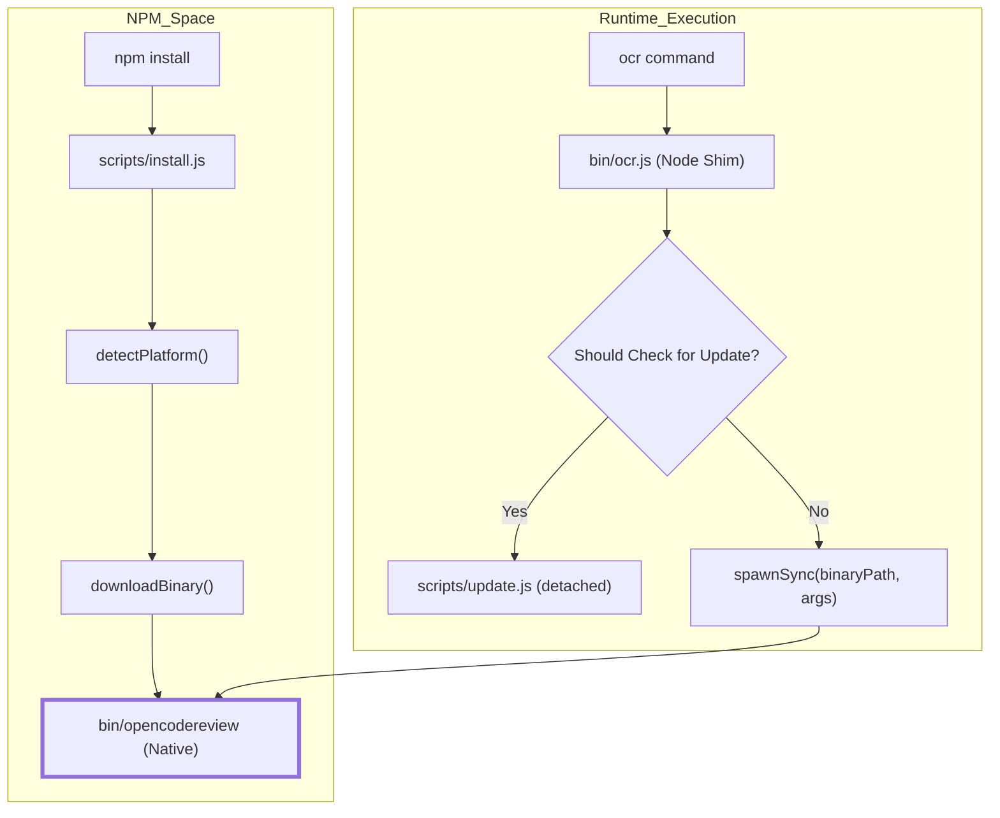
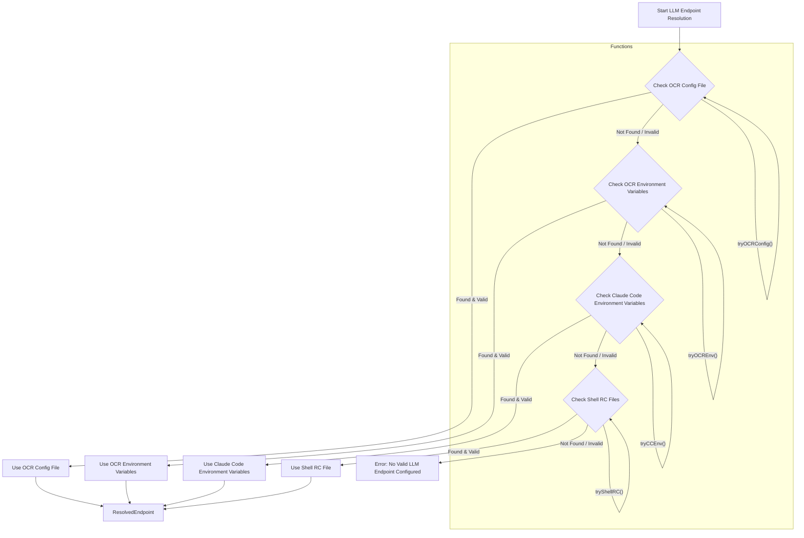

# 시작하기

<details>
<summary>관련 소스 파일</summary>

다음 파일들은 이 위키 페이지를 생성하기 위한 컨텍스트로 사용되었습니다.

- [.github/workflows/release.yml](.github/workflows/release.yml)
- [CONTRIBUTING.md](CONTRIBUTING.md)
- [CONTRIBUTING.zh-CN.md](CONTRIBUTING.zh-CN.md)
- [bin/ocr.js](bin/ocr.js)
- [cmd/opencodereview/config_cmd.go](cmd/opencodereview/config_cmd.go)
- [cmd/opencodereview/llm_cmd.go](cmd/opencodereview/llm_cmd.go)
- [internal/llm/resolver.go](internal/llm/resolver.go)
- [internal/llm/resolver_test.go](internal/llm/resolver_test.go)
- [internal/telemetry/config.go](internal/telemetry/config.go)
- [package.json](package.json)
- [scripts/install.js](scripts/install.js)
- [scripts/update.js](scripts/update.js)

</details>


이 페이지는 OpenCodeReview (OCR) 설치, Large Language Model (LLM) 백엔드 구성, 첫 자동 코드 리뷰 실행에 관한 기술적 세부 사항을 제공합니다.

## 설치 개요

OpenCodeReview는 주로 고성능 Go 바이너리를 감싸는 npm package로 배포됩니다. 설치 과정에는 호스트 플랫폼을 감지하고 적절한 컴파일된 실행 파일을 다운로드하는 Node.js shim이 포함됩니다.

### npm 설치
`npm install -g @alibaba/open-code-review`를 실행하면 다음 순서가 진행됩니다.
1. **Post-install 스크립트**: `package.json`은 `scripts/install.js`를 실행하는 `postinstall` hook을 정의합니다 [package.json:9-9]().
2. **플랫폼 감지**: 스크립트는 운영체제(Linux 또는 Darwin)와 아키텍처(amd64 또는 arm64)를 식별합니다 [scripts/install.js:27-51]().
3. **바이너리 가져오기**: `package.json`의 `ocrConfig.urlPattern`을 사용해 다운로드 URL을 구성하고 [package.json:18-19](), 바이너리를 다운로드한 뒤 `bin/` 디렉터리에 `opencodereview`라는 이름으로 저장합니다 [scripts/install.js:186-186]().
4. **체크섬 검증**: `checksumPattern`이 제공되면 `sha256sum.txt` 파일을 다운로드하고 로컬 바이너리를 예상 hash와 대조해 검증합니다 [scripts/install.js:191-218]().
5. **권한**: 스크립트는 JS shim과 다운로드된 바이너리 모두에 실행 권한(`0o755`)을 적용합니다 [scripts/install.js:168-174](), [scripts/install.js:187-189]().

### Bin Shim (ocr.js)
`ocr` 명령은 `bin/ocr.js`에 매핑됩니다 [package.json:5-7](). 이 파일은 먼저 업데이트를 확인한 뒤 [bin/ocr.js:12-32](), `child_process.spawnSync`를 사용해 네이티브 `opencodereview` 바이너리를 실행하고 모든 CLI 인자(`process.argv`), 환경 변수, 표준 I/O 스트림을 그대로 전달하는 경량 wrapper로 동작합니다 [bin/ocr.js:35-38]().

**데이터 흐름: 설치에서 실행까지**

Title: OCR Binary Installation and Execution Flow

출처: [package.json:1-29](), [scripts/install.js:1-254](), [bin/ocr.js:1-41](), [scripts/update.js:1-227]()

---

## 초기 LLM 구성

OCR이 작동하려면 LLM provider(Anthropic 또는 OpenAI-compatible)가 필요합니다. 구성은 `ocr config` 명령으로 관리되며 JSON 파일에 저장됩니다.

### 구성 저장소
기본 구성 파일은 `~/.opencodereview/config.json`에 있습니다 [cmd/opencodereview/config_cmd.go:12-18](). 이 파일은 LLM endpoint, 인증, 선호 언어에 대한 설정을 유지합니다.

### 주요 구성 필드
`Config` struct는 이 파일의 schema를 정의합니다.
| 필드 | 타입 | 설명 |
| :--- | :--- | :--- |
| `llm.url` | string | LLM provider의 API base URL입니다 [cmd/opencodereview/config_cmd.go:80-80](). |
| `llm.auth_token` | string | API Key / Bearer token입니다 [cmd/opencodereview/config_cmd.go:81-81](). |
| `llm.model` | string | 특정 model identifier입니다(예: `claude-3-5-sonnet`) [cmd/opencodereview/config_cmd.go:82-82](). |
| `llm.use_anthropic`| `*bool` | `true`(기본값)이면 Anthropic protocol을 사용합니다. `false`이면 OpenAI protocol을 사용합니다 [cmd/opencodereview/config_cmd.go:83-83](). |
| `llm.extra_body` | `map[string]any` | Vendor별 request body 필드입니다 [cmd/opencodereview/config_cmd.go:84-84](). |
| `language` | string | 리뷰 코멘트의 출력 언어입니다(비어 있으면 기본값은 Chinese) [cmd/opencodereview/config_cmd.go:76-76](). |
| `telemetry.enabled` | bool | telemetry의 master switch입니다 [cmd/opencodereview/config_cmd.go:90-90](). |
| `telemetry.exporter` | string | Telemetry exporter type: "console" 또는 "otlp" [cmd/opencodereview/config_cmd.go:91-91](). |
| `telemetry.otlp_endpoint` | string | OTLP collector address입니다 [cmd/opencodereview/config_cmd.go:92-92](). |
| `telemetry.content_logging` | bool | telemetry에 prompt/response content를 포함합니다 [cmd/opencodereview/config_cmd.go:93-93](). |

### CLI로 값 설정하기
`runConfigSet` 함수는 구성 파일 업데이트를 처리합니다. 기존 config를 로드하고, `setConfigValue`를 사용해 지정된 key를 업데이트한 뒤, 들여쓰기된 JSON을 디스크에 다시 씁니다 [cmd/opencodereview/config_cmd.go:39-67]().

예시:
```bash
ocr config set llm.model claude-3-5-sonnet-20241022
ocr config set llm.auth_token your-api-key
ocr config set telemetry.enabled true
```

출처: [cmd/opencodereview/config_cmd.go:11-179]()

### LLM Endpoint 해석 전략
`llm.ResolveEndpoint` 함수 [internal/llm/resolver.go:40-64]()는 정의된 우선순위에 따라 여러 소스를 확인해 LLM 구성을 결정합니다.

1.  **OCR config file**: `~/.opencodereview/config.json` [internal/llm/resolver.go:45-45](), 구체적으로 `llm` 섹션 [internal/llm/resolver.go:90-96](). 이는 `tryOCRConfig`가 처리합니다 [internal/llm/resolver.go:103-132]().
2.  **OCR environment variables**: `OCR_LLM_URL`, `OCR_LLM_TOKEN`, `OCR_LLM_MODEL`, `OCR_USE_ANTHROPIC` [internal/llm/resolver.go:23-28](). 이는 `tryOCREnv`가 처리합니다 [internal/llm/resolver.go:67-87]().
3.  **Claude Code environment variables**: `ANTHROPIC_BASE_URL`, `ANTHROPIC_AUTH_TOKEN`, `ANTHROPIC_MODEL` [internal/llm/resolver.go:31-34](). 이는 `tryCCEnv`가 처리합니다 [internal/llm/resolver.go:134-146]().
4.  **Shell RC files**: `~/.zshrc`, `~/.bashrc` 등의 `export` 문에서 `ANTHROPIC_*` 변수를 파싱합니다 [internal/llm/resolver.go:148-157](). 이는 `tryShellRC` [internal/llm/resolver.go:148-157]()와 `parseShellRC` [internal/llm/resolver.go:188-228]()가 처리합니다.

구성이 유효한 것으로 간주되려면 세 필드(`URL`, `Token`, `Model`)가 모두 비어 있지 않아야 합니다 [internal/llm/resolver.go:56-56](). 또한 `Model` 필드에서는 모든 `[<number>m]` suffix가 제거됩니다(예: `claude-opus-4-7[1m]`은 `claude-opus-4-7`이 됨) [internal/llm/resolver.go:184-186](), [internal/llm/resolver_test.go:10-30]().

Title: LLM Endpoint Resolution Flow

출처: [internal/llm/resolver.go:40-64](), [internal/llm/resolver.go:67-87](), [internal/llm/resolver.go:103-132](), [internal/llm/resolver.go:134-146](), [internal/llm/resolver.go:148-157](), [internal/llm/resolver.go:188-228]()

---

## 첫 리뷰 실행

구성이 완료되면 `ocr review` 명령이 리뷰 에이전트를 시작합니다.

### 실행 단계
1.  **연결 확인**: 에이전트는 구성된 `llm.url`에 접속을 시도합니다.
2.  **컨텍스트 수집**: OCR은 git repository를 자동으로 감지하고 diff 정보를 수집합니다.
3.  **에이전트 루프**: 시스템은 `Plan` 단계에 진입한 뒤, `Main Task Loop`에서 도구를 사용해 코드베이스를 탐색하고 코멘트를 생성합니다.

### LLM 연결 확인
전체 리뷰를 실행하지 않고 LLM 구성과 연결 상태를 확인하려면 `ocr llm test` 명령을 사용합니다 [cmd/opencodereview/llm_cmd.go:21-21](). 이 명령은 다음을 수행합니다.
1.  `~/.opencodereview/config.json`에서 애플리케이션 구성을 로드합니다 [cmd/opencodereview/llm_cmd.go:33-36]().
2.  위에서 설명한 우선순위 전략을 사용해 LLM endpoint를 해석합니다 [cmd/opencodereview/llm_cmd.go:38-41]().
3.  기본 테스트 대화 template을 로드합니다 [cmd/opencodereview/llm_cmd.go:43-46]().
4.  해석된 endpoint로 LLM client를 초기화합니다 [cmd/opencodereview/llm_cmd.go:61-61]().
5.  LLM에 테스트 chat completion request를 보냅니다 [cmd/opencodereview/llm_cmd.go:68-75]().
6.  구성의 출처, URL, 사용된 model, LLM의 response를 출력합니다 [cmd/opencodereview/llm_cmd.go:85-88]().

예시:
```bash
ocr llm test
```
이 명령은 해석된 LLM endpoint와 LLM의 sample response에 대한 세부 정보를 출력해 연결이 정상 동작함을 확인해 줍니다.

### 바이너리 설치 확인
설치와 `ocr` 바이너리에 접근 가능한지 확인하려면 다음을 사용합니다.
```bash
ocr version
```
이는 바이너리에 접근 가능함을 확인하고 build process 중 주입된 version string을 반환합니다 [scripts/install.js:231-231]().

**엔티티 매핑: 구성에서 코드까지**

Title: Configuration System Entity Mapping
```mermaid
graph LR
    subgraph "Natural Language Space"
        "User Config File"
        "LLM Settings"
        "Telemetry Settings"
    end

    subgraph "Code Entity Space"
        "User Config File" --- PATH["defaultConfigPath()"]
        "LLM Settings" --- STRUCT_LLM["LlmConfig struct"]
        "Telemetry Settings" --- STRUCT_TEL["TelemetryConfig struct"]
        
        SET_CMD["runConfigSet()"] --> LOAD["loadOrCreateConfig()"]
        LOAD --> UNMARSHAL["json.Unmarshal()"]
        SET_CMD --> SAVE["os.WriteFile()"]
    end
```
출처: [cmd/opencodereview/config_cmd.go:12-18](), [cmd/opencodereview/config_cmd.go:39-67](), [cmd/opencodereview/config_cmd.go:70-89]()

## 파일 요약
-   `bin/ocr.js`: npm package의 entry point입니다. 네이티브 바이너리를 spawn하고 update check를 처리합니다 [bin/ocr.js:1-41]().
-   `scripts/install.js`: 플랫폼별 바이너리 다운로드와 checksum verification을 처리합니다 [scripts/install.js:1-254]().
-   `scripts/update.js`: `opencodereview` 바이너리의 자동 update를 관리합니다 [scripts/update.js:1-227]().
-   `cmd/opencodereview/config_cmd.go`: configuration logic을 구현하고 `Config` schema를 정의합니다 [cmd/opencodereview/config_cmd.go:1-179]().
-   `cmd/opencodereview/llm_cmd.go`: LLM 연결을 확인하기 위한 `runLLMTest` 함수를 포함합니다 [cmd/opencodereview/llm_cmd.go:28-89]().
-   `internal/llm/resolver.go`: multi-source LLM endpoint resolution strategy를 구현합니다 [internal/llm/resolver.go:1-239]().
-   `package.json`: metadata를 포함하고 installation lifecycle을 트리거합니다 [package.json:1-29]().
