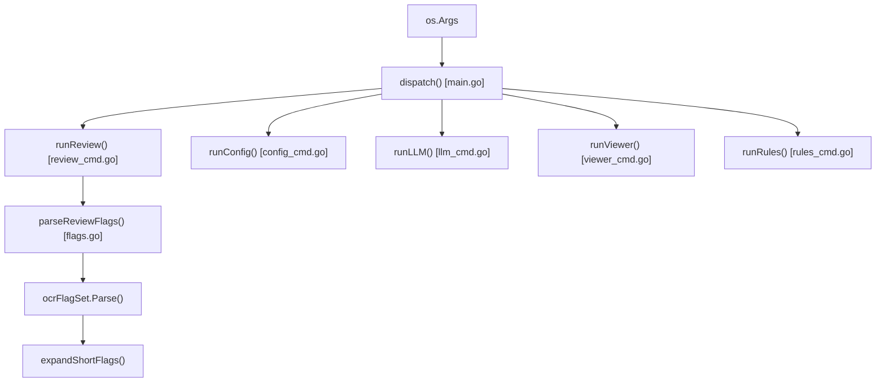
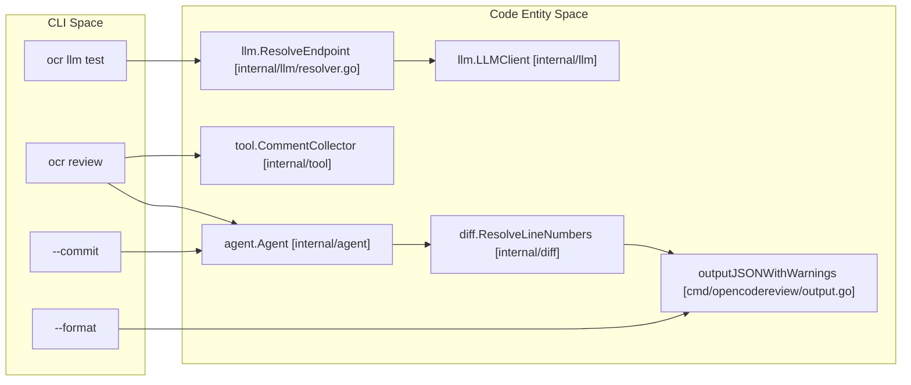
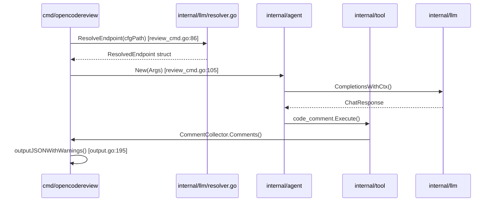

# CLI 명령 참조

관련 소스 파일

다음 파일들은 이 위키 페이지를 생성하기 위한 컨텍스트로 사용되었습니다.

- [cmd/opencodereview/config_cmd.go](cmd/opencodereview/config_cmd.go)
- [cmd/opencodereview/flags.go](cmd/opencodereview/flags.go)
- [cmd/opencodereview/git.go](cmd/opencodereview/git.go)
- [cmd/opencodereview/llm_cmd.go](cmd/opencodereview/llm_cmd.go)
- [cmd/opencodereview/main.go](cmd/opencodereview/main.go)
- [cmd/opencodereview/output.go](cmd/opencodereview/output.go)
- [cmd/opencodereview/review_cmd.go](cmd/opencodereview/review_cmd.go)
- [cmd/opencodereview/rules_cmd.go](cmd/opencodereview/rules_cmd.go)
- [cmd/opencodereview/version.go](cmd/opencodereview/version.go)
- [cmd/opencodereview/viewer_cmd.go](cmd/opencodereview/viewer_cmd.go)
- [internal/llm/resolver.go](internal/llm/resolver.go)
- [internal/llm/resolver_test.go](internal/llm/resolver_test.go)
- [internal/telemetry/config.go](internal/telemetry/config.go)

이 페이지는 OpenCodeReview (OCR) Command Line Interface에 대한 자세한 기술 참조를 제공합니다. 하위 명령 라우팅, flag parsing logic, CLI 계층과 핵심 agent 사이의 내부 데이터 흐름을 다룹니다.

## 명령 디스패칭

애플리케이션의 entry point는 `main.go`이며, telemetry와 embedded asset loader 같은 전역 상태를 초기화한 뒤 `dispatch()` 함수에 제어를 넘깁니다 [cmd/opencodereview/main.go:15-28](). `dispatch` 함수는 인자를 특정 하위 명령 handler로 라우팅합니다 [cmd/opencodereview/main.go:31-60]().

### 하위 명령 아키텍처
OCR은 custom flag set 구현인 `ocrFlagSet`을 사용합니다. 이는 표준 라이브러리 `flag` package를 감싸 shorthand flag(예: `--commit`의 `-c`)와 자동 help message 생성을 지원합니다 [cmd/opencodereview/flags.go:11-22]().

**명령 라우팅 맵:**
| 명령 | 별칭 | Handler 함수 | 목적 |
| :--- | :--- | :--- | :--- |
| `review` | `r` | `runReview` | 기본 AI review pipeline |
| `rules` | - | `runRules` | Review rules 검사 및 디버깅 |
| `config` | - | `runConfig` | 로컬 configuration key 관리 |
| `llm` | - | `runLLM` | 연결 및 model 테스트 |
| `viewer` | - | `runViewer` | WebUI session browser 실행 |
| `version` | - | `printVersion` | Build metadata 표시 |

**CLI 라우팅 데이터 흐름:**

**출처:** [cmd/opencodereview/main.go:31-60](), [cmd/opencodereview/flags.go:9-22](), [cmd/opencodereview/flags.go:79-92](), [cmd/opencodereview/rules_cmd.go:10-24]()

---

## `ocr review`

`review` 명령은 AI agent를 트리거하는 기본 인터페이스입니다. 세 가지 distinct git mode인 **Workspace**(기본값), **Ref Range**, **Single Commit**을 지원합니다.

### 플래그와 옵션
`reviewOptions` struct는 review session의 구성을 정의합니다 [cmd/opencodereview/flags.go:96-111]().

| 플래그 | Shorthand | 기본값 | 설명 |
| :--- | :--- | :--- | :--- |
| `--repo` | - | `.` | git repository의 root directory입니다 [cmd/opencodereview/flags.go:120](). |
| `--from` | - | - | Source ref입니다(`--to` 필요) [cmd/opencodereview/flags.go:121](). |
| `--to` | - | - | diff의 target ref입니다 [cmd/opencodereview/flags.go:122](). |
| `--commit` | `-c` | - | 특정 commit을 parent와 비교해 리뷰합니다 [cmd/opencodereview/flags.go:123](). |
| `--format` | `-f` | `text` | Output format: `text` 또는 `json` [cmd/opencodereview/flags.go:124](). |
| `--audience`| - | `human`| `human`(progress bars) 또는 `agent`(summary only) [cmd/opencodereview/flags.go:127](). |
| `--concurrency`| - | `8` | 동시 file review의 최대 개수입니다 [cmd/opencodereview/flags.go:125](). |
| `--timeout` | - | `10` | concurrent task당 timeout(분)입니다 [cmd/opencodereview/flags.go:126](). |
| `--background`| `-b` | - | LLM에 제공할 business/requirement context입니다 [cmd/opencodereview/flags.go:128](). |
| `--rule` | - | - | Custom system review rules JSON 경로입니다 [cmd/opencodereview/flags.go:119](). |
| `--preview` | `-p` | `false` | 리뷰될 파일을 미리 봅니다 [cmd/opencodereview/flags.go:130](). |

### 구현 세부 사항: 리뷰 초기화
`runReview`가 호출되면 다음 순서가 수행됩니다.
1. **Git 검증**: `requireGitRepo`를 사용해 대상 디렉터리가 유효한 git repository인지 확인합니다 [cmd/opencodereview/review_cmd.go:31-33]().
2. **Config 로딩**: 기본 template과 system rules를 로드합니다 [cmd/opencodereview/review_cmd.go:35-60]().
3. **Registry 설정**: `FileRead`, `CodeSearch`, `CodeComment` 도구를 포함하는 `tool.Registry`를 구성합니다 [cmd/opencodereview/review_cmd.go:94-103]().
4. **Agent 실행**: `agent.New`를 초기화하고 `ag.Run(ctx)`를 호출합니다 [cmd/opencodereview/review_cmd.go:105-141]().
5. **후처리**: `diff.ResolveLineNumbers`를 사용해 LLM이 제안한 code snippets를 다시 line numbers로 해석합니다 [cmd/opencodereview/review_cmd.go:148]().

**출처:** [cmd/opencodereview/review_cmd.go:21-182](), [cmd/opencodereview/flags.go:113-167]()

---

## `ocr rules`

`rules` 명령은 개발자가 glob pattern을 기반으로 특정 파일에 review rules가 어떻게 적용되는지 검사할 수 있게 합니다.

### 하위 명령
*   **`check <file-path>`**: 주어진 파일에 어떤 review rule이 적용되는지 보여줍니다. 여기에는 source layer(System, Global, Project 또는 Custom)와 매칭된 특정 pattern이 포함됩니다 [cmd/opencodereview/rules_cmd.go:26-79]().

**출처:** [cmd/opencodereview/rules_cmd.go:1-105]()

---

## `ocr llm`

`llm` 명령은 CLI와 구성된 LLM provider 사이의 연결을 디버깅하기 위한 utility를 제공합니다.

### 하위 명령
*   **`test`**: 구성된 model을 사용해 최소 대화를 실행하여 API keys, endpoints, protocol compatibility를 검증합니다 [cmd/opencodereview/llm_cmd.go:27-90]().

### 구현: 연결 테스트
`runLLMTest` 함수는 다음을 수행합니다.
1. 환경 변수와 local config files를 확인하는 `llm.ResolveEndpoint`를 통해 endpoint를 해석합니다 [cmd/opencodereview/llm_cmd.go:38-41]().
2. `testconnection` task configuration을 로드하고 language settings를 적용합니다 [cmd/opencodereview/llm_cmd.go:43-49]().
3. `llm.LLMClient`를 인스턴스화하고 `CompletionsWithCtx` request를 보냅니다 [cmd/opencodereview/llm_cmd.go:61-76]().

**출처:** [cmd/opencodereview/llm_cmd.go:13-90](), [internal/llm/resolver.go:40-64]()

---

## `ocr config`

`~/.opencodereview/config.json`에 저장되는 persistent configuration을 관리합니다.

### 구현: 구성 키
`setConfigValue` 함수는 다음 key들의 업데이트를 지원합니다 [cmd/opencodereview/config_cmd.go:126-172]().

| Key | Type | 설명 |
| :--- | :--- | :--- |
| `llm.url` | String | LLM API Endpoint URL |
| `llm.auth_token`| String | API Authentication Token |
| `llm.model` | String | Model identifier(예: `gpt-4o`) |
| `llm.use_anthropic`| Bool | Protocol toggle(True=Anthropic, False=OpenAI) |
| `language` | String | AI comments의 output language |
| `telemetry.enabled`| Bool | OpenTelemetry의 master switch |
| `telemetry.exporter`| String | `console` 또는 `otlp` |

**출처:** [cmd/opencodereview/config_cmd.go:72-179]()

---

## 출력 형식

OCR은 두 가지 주요 output format인 **Text**(standard out)와 **JSON**을 지원합니다.

### Text 출력
ANSI color codes와 word-wrapped content로 comments를 렌더링합니다 [cmd/opencodereview/output.go:34-51]().
*   **Diff 렌더링**: comment에 `ExistingCode`와 `SuggestionCode`가 포함되어 있으면, OCR은 `suggestdiff.ComputeLineDiff`를 사용해 line-level diff를 계산합니다 [cmd/opencodereview/output.go:156-163]().

### JSON 출력
comments, warnings, summary metrics를 포함하는 구조화된 `jsonOutput` object를 생성합니다 [cmd/opencodereview/output.go:174-180]().

**JSON Schema (`jsonSummary`):**
| 필드 | 타입 | 설명 |
| :--- | :--- | :--- |
| `files_reviewed`| Int64 | 처리된 파일 수입니다 [cmd/opencodereview/output.go:166](). |
| `comments` | Int64 | 생성된 전체 comments 수입니다 [cmd/opencodereview/output.go:167](). |
| `total_tokens` | Int64 | 전체 token consumption입니다 [cmd/opencodereview/output.go:168](). |
| `elapsed` | String| Wall-clock execution time입니다 [cmd/opencodereview/output.go:171](). |

**출처:** [cmd/opencodereview/output.go:1-238]()

---

## 기술 매핑: CLI에서 코드 엔티티까지

다음 다이어그램은 사용자 명령과 내부 코드 구현 사이의 간극을 연결합니다.

**CLI에서 내부 엔티티로의 매핑:**

**구현 데이터 흐름:**

**출처:** [cmd/opencodereview/review_cmd.go:86-124](), [cmd/opencodereview/output.go:195-227](), [internal/llm/resolver.go:40-64]()
