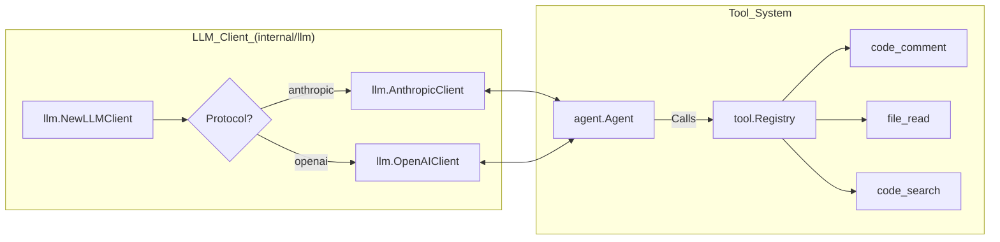

# 용어집

<details>
<summary>관련 소스 파일</summary>

다음 파일들은 이 위키 페이지를 생성하기 위한 컨텍스트로 사용되었습니다.

- [README.md](README.md)
- [internal/agent/agent.go](internal/agent/agent.go)
- [internal/agent/preview.go](internal/agent/preview.go)
- [internal/agent/preview_test.go](internal/agent/preview_test.go)
- [internal/agent/template_test.go](internal/agent/template_test.go)
- [internal/config/rules/system_rules.go](internal/config/rules/system_rules.go)
- [internal/config/rules/system_rules_test.go](internal/config/rules/system_rules_test.go)
- [internal/diff/resolver.go](internal/diff/resolver.go)
- [internal/diff/resolver_test.go](internal/diff/resolver_test.go)
- [internal/llm/client.go](internal/llm/client.go)
- [internal/llm/client_test.go](internal/llm/client_test.go)
- [internal/session/history.go](internal/session/history.go)
- [internal/session/persist.go](internal/session/persist.go)
- [internal/session/persist_test.go](internal/session/persist_test.go)
- [internal/tool/code_search.go](internal/tool/code_search.go)
- [internal/viewer/store.go](internal/viewer/store.go)

</details>


이 페이지는 OpenCodeReview (OCR) 시스템 내부의 codebase-specific terminology, domain concepts, architectural components에 대한 정의를 제공합니다. onboarding engineers가 high-level concepts와 Go codebase의 구현 사이의 mapping을 이해하기 위한 technical reference 역할을 합니다.

## Core Pipeline Concepts

### Review Agent
code review의 lifecycle을 관리하는 중앙 orchestrator입니다. git diff parsing, LLM communication, tool execution을 조율합니다.
*   **Implementation**: [internal/agent/agent.go:159-174]()의 `Agent` struct로 정의됩니다.
*   **Data Flow**: `LLMClient`, `Registry`, `SystemRule` 같은 dependencies를 보유하는 `Args`를 통해 초기화됩니다 [internal/agent/agent.go:48-122]().

### Plan Phase
큰 변경 사항에 대해 trigger되는 preliminary risk analysis stage입니다. diff가 특정 line threshold를 초과하면 agent는 상세 line-level reviews를 수행하기 전에 먼저 전체 impact를 분석합니다.
*   **Implementation**: `Args`의 `PlanToolDefs` field로 제어됩니다 [internal/agent/agent.go:79-81]().
*   **Logic**: agent는 prompt templates 내 plan guidance를 식별하고 관리하기 위해 `planBlockPattern`을 사용합니다 [internal/agent/agent.go:33-34]().

### Main Task Loop
LLM이 특정 파일을 review하는 primary execution phase입니다. LLM이 context를 수집하기 위해 tools를 호출하고 최종적으로 comments를 제출할 수 있는 multi-turn conversation loop입니다.
*   **Concurrency**: `MaxConcurrency`와 `ConcurrentTaskTimeout`을 통해 관리됩니다 [internal/agent/agent.go:97-101]().
*   **Subtask Execution**: 각 파일은 subtask로 처리되며, failures는 `subtaskFailed` atomic counters를 통해 추적됩니다 [internal/agent/agent.go:169]().

### Memory Compression
긴 conversations를 처리하기 위해 사용되는 context management strategy입니다. token count가 thresholds에 도달하면 agent는 context window를 확보하기 위해 conversation의 오래된 부분을 요약합니다.
*   **Thresholds**: `tokenSoftThreshold`(async background compression용 0.60)와 `tokenWarningThreshold`(immediate sync compression용 0.80) [internal/agent/agent.go:132-135]().
*   **Strategy**: message history에 대한 `frozenEnd`와 `compressEnd` markers를 결정하기 위해 `partitionResult`를 사용합니다 [internal/agent/agent.go:145-150]().

### Pipeline Execution Flow
다음 다이어그램은 CLI command에서 internal agent phases와 관련 data structures로 전환되는 과정을 보여줍니다.

**Review Pipeline Data Flow**
```mermaid
graph TD
    subgraph "CLI_Space"
        ["ocr_review"] --> ARGS["agent.Args"]
    end

    subgraph "Agent_Logic_(internal/agent/agent.go)"
        ARGS --> AGENT["Agent_struct"]
        AGENT --> DIFFS["agent.loadDiffs()"]
        DIFFS --> PLAN{"Plan_Required?"}
        PLAN -- "Yes" --> PHASE1["PlanTask"]
        PLAN -- "No" --> PHASE2["MainTask"]
        PHASE1 --> PHASE2
        
        subgraph "Per_File_Loop"
            PHASE2 --> LLM["llm.LLMClient"]
            LLM --> TOOL["agent.executeToolCall"]
            TOOL --> MEM{"Token_Limit?"}
            MEM -- "Threshold_Reached" --> COMP["MemoryCompressionTask"]
            COMP --> LLM
            TOOL -- "code_comment" --> COMM["CommentWorkerPool"]
        end
    end

    subgraph "Output_Space"
        COMM --> COLL["tool.CommentCollector"]
        COLL --> PERSIST["session.jsonlWriter"]
    end
```
출처: [internal/agent/agent.go:48-122](), [internal/agent/agent.go:132-150](), [internal/agent/agent.go:159-182](), [internal/session/history.go:15-23]()

---

## LLM & Tooling Terms

### Tool Registry
LLM이 Go functions를 호출할 수 있게 하는 mapping system입니다.
*   **Registry**: `Registry`는 `tool` package에 정의되어 있으며 agent가 subtasks를 dispatch하는 데 사용합니다 [internal/agent/agent.go:77]().
*   **Execution**: Tool calls는 session history에 `ToolResultRecord`로 기록됩니다 [internal/session/history.go:88-92]().

### LLM Client Interface
여러 protocols(Anthropic 및 OpenAI)를 지원하는 unified interface입니다.
*   **Interface**: `LLMClient`는 completions와 streaming을 위한 methods를 제공합니다 [internal/llm/client.go:36-40]().
*   **Normalization**: `OpenAIClient`와 `AnthropicClient` 모두 consistent endpoint paths를 보장하기 위해 URL normalization을 수행합니다 [internal/llm/client_test.go:7-91]().

### Comment Worker Pool
LLM conversation의 critical path 밖에서 review comments(line-range tracking, reflection, validation)를 처리해 latency를 줄이는 background execution pool입니다.
*   **Implementation**: `CommentWorkerPool`은 fixed-size worker pool을 관리합니다 [internal/agent/agent.go:176-182]().

**LLM and Tooling Interaction**

출처: [internal/llm/client.go:198-211](), [internal/agent/agent.go:74-85](), [internal/agent/agent.go:176-182]()

---

## Configuration & Domain Terms

### System Rules
JSON에 정의된 path-based review checklists입니다. Java와 SQL처럼 file types에 따라 서로 다른 review priorities를 적용할 수 있게 합니다.
*   **Resolution**: `SystemRule.Resolve(path)`는 file paths를 glob patterns와 매칭합니다 [internal/config/rules/system_rules.go:127-137]().
*   **Brace Expansion**: `*.{go,py}` 같은 patterns를 지원하며, 이는 multiple match targets로 확장됩니다 [internal/config/rules/system_rules.go:154-175]().

### Hunk
unified git diff 내부의 특정 changes block이며, line number resolution에 사용됩니다.
*   **Structure**: `Hunk`는 start lines와 line content를 포함합니다 [internal/diff/resolver.go:117-118]().
*   **Resolution**: `ResolveLineNumbers`는 LLM-suggested code를 diff hunks와 매칭해 absolute file positions를 찾습니다 [internal/diff/resolver.go:9-15]().

### JSONL Session
모든 interaction(request, response, tool call)이 `.jsonl` file로 streaming되는 persistence format입니다.
*   **Persistence**: `jsonlWriter`가 처리합니다 [internal/session/persist.go:19-32]().
*   **Path Encoding**: Repository paths는 disk에서 안전한 directory names를 만들기 위해 encoding됩니다(예: `/`를 `-`로 대체) [internal/session/persist.go:65-90]().
*   **Viewer**: `viewer` package는 WebUI용 `ViewSession`을 만들기 위해 이 files를 다시 읽습니다 [internal/viewer/store.go:197-201]().

---

## Abbreviations Table

| Abbreviation | Full Term | Context | Code Pointer |
| :--- | :--- | :--- | :--- |
| **OCR** | OpenCodeReview | project name 및 CLI command입니다. | [README.md:18-20]() |
| **JSONL** | JSON Lines | sessions를 위한 streaming persistence format입니다. | [internal/session/persist.go:16-19]() |
| **CWD** | Current Working Directory | sessions에서 repository root를 식별하는 데 사용됩니다. | [internal/session/persist.go:133]() |
| **LLM** | Large Language Model | backend intelligence(Claude, GPT 등)입니다. | [internal/llm/client.go:1-3]() |
| **UUID** | Universally Unique ID | `parentUuid`를 통해 session records를 chain하는 데 사용됩니다. | [internal/session/persist.go:52-63]() |

출처: [README.md:18-24](), [internal/session/persist.go:16-90](), [internal/llm/client.go:1-16](), [internal/agent/agent.go:159-174]()
