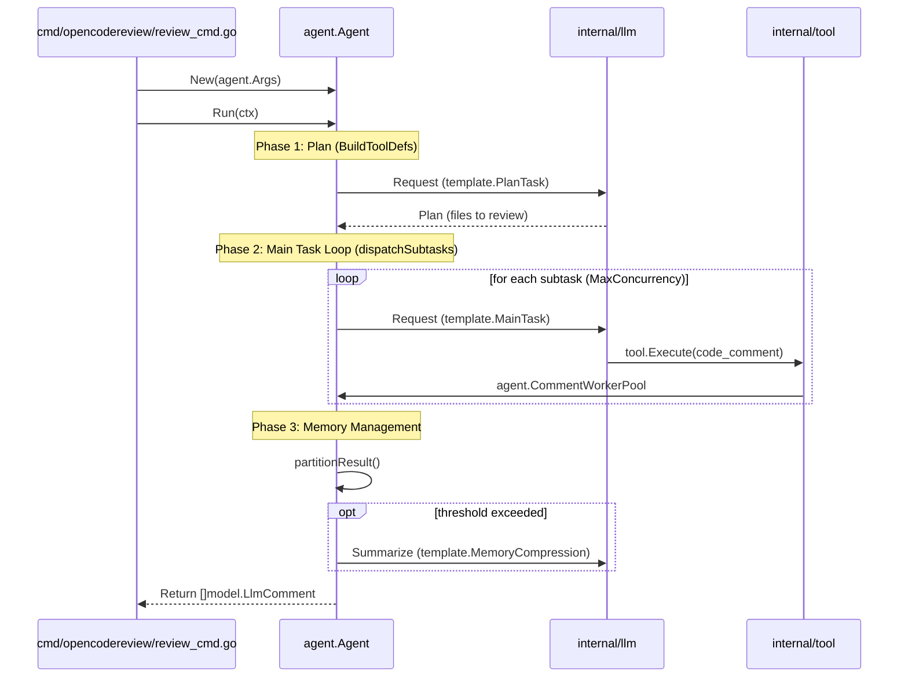

# 핵심 아키텍처

<details>
<summary>관련 소스 파일</summary>

다음 파일들은 이 위키 페이지를 생성하기 위한 컨텍스트로 사용되었습니다.

- [cmd/opencodereview/flags.go](cmd/opencodereview/flags.go)
- [cmd/opencodereview/git.go](cmd/opencodereview/git.go)
- [cmd/opencodereview/output.go](cmd/opencodereview/output.go)
- [cmd/opencodereview/review_cmd.go](cmd/opencodereview/review_cmd.go)
- [internal/agent/agent.go](internal/agent/agent.go)
- [internal/agent/preview.go](internal/agent/preview.go)
- [internal/agent/preview_test.go](internal/agent/preview_test.go)
- [internal/agent/template_test.go](internal/agent/template_test.go)
- [internal/model/diff.go](internal/model/diff.go)
- [internal/model/review.go](internal/model/review.go)
- [internal/tool/code_search.go](internal/tool/code_search.go)

</details>


OpenCodeReview (OCR) 시스템은 중앙 `Agent`가 관리하는 구조화된 다단계 리뷰 파이프라인을 중심으로 구축되었습니다. 이 아키텍처는 대규모 코드 변경을 관리 가능한 subtask로 나누고, 이를 동시에 실행하며, Large Language Model (LLM)의 context limit 안에 머무르기 위해 지능적인 메모리 관리 전략을 사용하도록 설계되었습니다.

## 리뷰 파이프라인 개요

리뷰 프로세스는 `internal/agent/agent.go`에서 조율되는 3단계 실행 모델을 따릅니다. 이 파이프라인은 LLM이 특정 파일 수준 리뷰로 들어가기 전에 먼저 변경의 전역 컨텍스트를 이해하도록 보장합니다.

1.  **계획 단계**: `Agent`는 LLM을 호출해 전체 diff를 분석하고 상위 수준의 리뷰 계획을 생성합니다. 이 단계는 어떤 파일이 중요하고, 어떤 파일을 건너뛸 수 있으며, 관련 변경을 어떻게 그룹화할지 식별합니다.
2.  **주 작업 루프**: 계획을 기반으로 `Agent`는 subtask를 디스패치합니다(대개 파일별 또는 모듈별). 이러한 subtask는 처리량을 극대화하기 위해 worker pool 모델을 사용해 동시에 실행됩니다.
3.  **메모리 압축**: 대화가 커짐에 따라 `Agent`는 token usage를 모니터링합니다. threshold에 도달하면 요약 작업을 트리거해 대화의 오래된 부분을 "memory" block으로 압축하고, active task를 위한 컨텍스트를 확보합니다.

실행 흐름과 동시성에 대한 자세한 내용은 [리뷰 에이전트](#2.1)를 참조하세요.

## 시스템 컴포넌트와 데이터 흐름

다음 다이어그램은 핵심 package들이 원시 Git repository에서 resolved review comments 집합으로 이동하기 위해 어떻게 상호작용하는지 보여줍니다.

### 아키텍처 엔티티 맵
이 다이어그램은 **Natural Language Space**("Tasks"와 "Rules" 같은 개념)와 **Code Entity Space**(struct와 함수)를 연결합니다.

```mermaid
graph TD
    subgraph "Input Layer"
        [GitRepo] -->|"-C repoDir"| Git["git cli"]
        Rules["rules.Resolver"]
        Tpl["template.Template"]
    end

    subgraph "Core Orchestration (internal/agent)"
        Ag["agent.Agent"]
        WP["agent.CommentWorkerPool"]
        Mem["agent.compressionJob"]
    end

    subgraph "Execution Space (internal/tool)"
        Reg["tool.Registry"]
        FR["tool.FileReader"]
        Coll["tool.CommentCollector"]
    end

    subgraph "Output Layer"
        Diff["diff.ResolveLineNumbers"]
        Hist["session.SessionHistory"]
    end

    Git -->|parsed into| Ag
    Rules -->|guides| Ag
    Tpl -->|configures| Ag
    
    Ag -->|dispatches| WP
    Ag -->|queries| Reg
    Reg -->|reads| FR
    Reg -->|writes| Coll
    Ag -.->|manages| Mem
    
    Coll -->|model.LlmComment| Diff
    Ag -->|logs events| Hist
    Diff -->|final comments| User["stdout.outputText"]
```
**출처:** [internal/agent/agent.go:159-174](), [cmd/opencodereview/review_cmd.go:105-124](), [cmd/opencodereview/review_cmd.go:148-155](), [internal/agent/agent.go:176-181]()

## 동시 실행 모델

OCR은 성능을 최적화하기 위해 두 가지 별도 동시성 메커니즘을 활용합니다.
*   **Subtask 동시성**: `agent.Run` 메서드는 `MaxConcurrency` 설정(기본값은 CPU count)을 사용해 file review를 위한 동시 LLM request 수를 제한합니다 [internal/agent/agent.go:97-98]().
*   **Comment Worker Pool**: 전용 `agent.CommentWorkerPool`은 `CODE_COMMENT` tool output을 critical path 밖에서 처리합니다. 이를 통해 시스템이 백그라운드에서 line-range tracking, reflection, suggestion validation을 수행하는 동안 LLM은 새로운 thought를 계속 생성할 수 있습니다 [internal/agent/agent.go:86-95](), [internal/agent/agent.go:176-181]().

## 컨텍스트 관리(3개 영역 전략)

LLM context window에 도달하지 않고 장시간 리뷰 세션을 유지하기 위해 OCR은 "Three-Zone" 메모리 전략을 구현합니다.
1.  **Frozen Zone**: 절대 압축되지 않는 system prompts와 필수 rules입니다.
2.  **Compress Zone**: LLM이 간결한 "memory" block으로 요약하는 과거 대화 round입니다.
3.  **Active Zone**: 즉시 필요한 컨텍스트를 위해 전체 세부 정보가 유지되는 가장 최근의 tool calls와 responses입니다.

시스템은 비동기 백그라운드 작업에는 `tokenSoftThreshold`(60%)를 기준으로, 즉시 동기 cleanup에는 `tokenWarningThreshold`(80%)를 기준으로 압축을 트리거합니다 [internal/agent/agent.go:131-135]().

자세한 내용은 [메모리 압축과 컨텍스트 관리](#2.2)를 참조하세요.

## Git 및 Diff 처리

Agent는 diff range(workspace, range 또는 commit)를 로드하고 이를 `model.Diff` 객체로 파싱하면서 시작합니다 [internal/agent/agent.go:52-61](), [internal/agent/preview.go:74-77](). 이 객체들은 도구가 LLM에 컨텍스트를 제공하는 데 사용되며, 나중에는 `diff.ResolveLineNumbers`가 LLM이 제안한 code snippets를 정확한 file line numbers로 다시 매핑하는 데 사용됩니다 [cmd/opencodereview/review_cmd.go:148-149]().

자세한 내용은 [Git Diff 처리](#2.3)를 참조하세요.

### 코드-로직 매핑
이 다이어그램은 내부 함수 호출이 3단계 파이프라인에 어떻게 매핑되는지 보여줍니다.


**출처:** [internal/agent/agent.go:158-174](), [cmd/opencodereview/review_cmd.go:141-145](), [internal/agent/agent.go:131-156](), [cmd/opencodereview/review_cmd.go:70-71]()

---
**출처:**
- `cmd/opencodereview/review_cmd.go` [lines 21-182]()
- `internal/agent/agent.go` [lines 47-181]()
- `internal/agent/preview.go` [lines 74-112]()
- `internal/model/review.go` [lines 3-12]()
