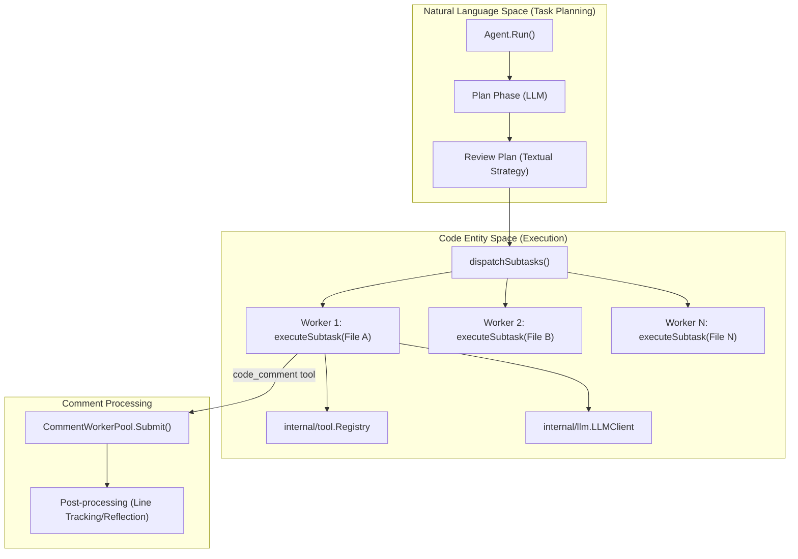
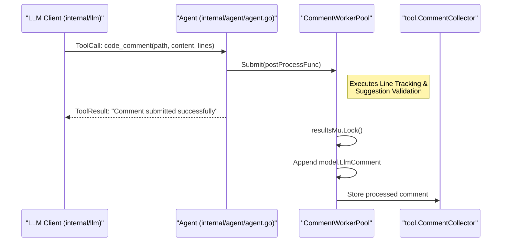

# 리뷰 에이전트

관련 소스 파일

다음 파일들은 이 위키 페이지를 생성하기 위한 컨텍스트로 사용되었습니다.

- [internal/agent/agent.go](internal/agent/agent.go)
- [internal/agent/preview.go](internal/agent/preview.go)
- [internal/agent/preview_test.go](internal/agent/preview_test.go)
- [internal/agent/template_test.go](internal/agent/template_test.go)
- [internal/stdout/stdout.go](internal/stdout/stdout.go)
- [internal/tool/code_search.go](internal/tool/code_search.go)

`Agent`는 OpenCodeReview 시스템의 중앙 orchestrator입니다. git diff 분석, 다단계 LLM 상호작용(Planning 및 Execution), 동시 task dispatching, 비동기 comment processing을 포함한 review session의 lifecycle을 관리합니다.

## Agent Struct

`Agent` struct는 parsed diffs, token usage metrics, session history를 포함해 review session의 상태를 유지합니다. 상위 수준 review logic과 기반 LLM/Git subsystem 사이의 bridge 역할을 합니다.

| 필드 | 타입 | 설명 |
| :--- | :--- | :--- |
| `args` | `Args` | Dependencies: LLM clients, tool registries, concurrency settings [internal/agent/agent.go:48-122](). |
| `diffs` | `[]model.Diff` | 파일 변경을 나타내는 parsed git diffs입니다 [internal/agent/agent.go:161](). |
| `session` | `*session.SessionHistory` | LLM conversations를 기록하기 위한 persistence layer입니다 [internal/agent/agent.go:165](). |
| `totalTokensUsed` | `int64` (Atomic) | 모든 phase에 걸친 cumulative token count입니다 [internal/agent/agent.go:166](). |
| `CommentWorkerPool` | `*CommentWorkerPool` | 중요하지 않은 comment post-processing을 offload하기 위한 pool입니다 [internal/agent/agent.go:176-184](). |

**출처:**
- `Agent` definition: [internal/agent/agent.go:159-174]()
- `Args` definition: [internal/agent/agent.go:48-122]()

---

## 리뷰 파이프라인 흐름

리뷰 프로세스는 LLM token limit 안에 머무르면서 context awareness를 극대화하도록 설계된 구조화된 파이프라인을 따릅니다.

### 1. 초기화 및 Diff 로딩
에이전트는 git commands를 사용해 변경된 파일을 식별하고 `diffs` slice를 채웁니다. 이는 LLM과 도구 모두에 컨텍스트를 제공합니다. `Preview()` method를 사용하면 `FileFilter` rules를 기준으로 어떤 파일이 리뷰되거나 제외될지 확인할 수 있습니다 [internal/agent/preview.go:74-112]().

### 2. 계획 단계
`plan_task`가 활성화되어 있으면 에이전트는 **Plan Phase**를 시작합니다.
- **목적**: LLM이 특정 파일로 들어가기 전에 전략을 세울 수 있도록 변경 사항의 전역 view를 제공합니다.
- **도구**: `PlanToolDefs`를 사용합니다 [internal/agent/agent.go:81]().
- **출력**: `{{plan_guidance}}` placeholder를 통해 `Main Task Loop`에 주입되는 텍스트 계획입니다 [internal/agent/agent.go:26-34]().

### 3. 주 작업 루프
에이전트는 subtask를 디스패치하는 **Main Task Loop**로 전환합니다.
- **dispatchSubtasks**: 동시성 모델을 관리하며, 파일을 그룹화하고 이를 `executeSubtask`로 디스패치합니다.
- **동시성**: `MaxConcurrency`로 제어됩니다(기본값은 CPU count) [internal/agent/agent.go:97-98]().

### 4. 메모리 관리
루프 중 에이전트는 `MaxTokens` 대비 token usage를 모니터링합니다.
- **Soft Threshold (60%)**: 비동기 background compression을 트리거합니다 [internal/agent/agent.go:133]().
- **Warning Threshold (80%)**: context overflow를 방지하기 위해 즉시 synchronous compression을 트리거합니다 [internal/agent/agent.go:134]().

**출처:**
- `Agent.Run` entry point: [internal/agent/agent.go:345]()
- Token thresholds: [internal/agent/agent.go:132-135]()
- Plan block handling: [internal/agent/agent.go:33-45]()

---

## 동시성과 Subtask 실행

에이전트는 여러 파일 또는 code module을 동시에 처리하기 위해 "Fan-out" 모델을 사용합니다.

### Subtask Dispatch Diagram
이 다이어그램은 `Agent`가 concurrent workers를 사용해 상위 수준의 "Review Task"를 "Code Entities"(Files/Diffs)로 연결하는 방식을 보여줍니다.

**출처:**
- `dispatchSubtasks` logic: [internal/agent/agent.go:616-728]()
- `executeSubtask`: [internal/agent/agent.go:731-860]()

---

## executeSubtask와 Tool-Use Loop

`executeSubtask` 내부에서 에이전트는 LLM이 다양한 도구(예: `file_read`, `code_search`, `code_comment`)를 호출할 수 있는 loop를 실행합니다.

1. **LLM Request**: 에이전트는 현재 message history와 `MainToolDefs`를 LLM에 보냅니다 [internal/agent/agent.go:83-84]().
2. **Tool Execution**: Tool calls는 `executeToolCall`이 처리합니다.
3. **특수 처리(code_comment)**: 도구가 `code_comment`이면, 에이전트는 해당 작업을 `CommentWorkerPool`에 offload합니다(구성된 경우). 그래서 comment가 background에서 검증되거나 추적되는 동안 LLM은 계속 request를 발행할 수 있습니다 [internal/agent/agent.go:86-95]().

**출처:**
- `executeToolCall`: [internal/agent/agent.go:941-1033]()
- `code_comment` tool logic: [internal/tool/code_comment.go:1-100]()

---

## CommentWorkerPool

`CommentWorkerPool`은 review process 중 LLM의 blocking을 해제하기 위해 사용되는 특수한 concurrency primitive입니다.

### 데이터 흐름: Comment Post-Processing
이 다이어그램은 `model.LlmComment` entity와 asynchronous processing pipeline 사이의 연관을 보여줍니다.

### 구현 세부 사항
- **Semaphore**: 활성 goroutine 수를 제한하기 위해 buffered channel `semaphore chan struct{}`를 사용합니다 [internal/agent/agent.go:185]().
- **Wait Group**: session이 끝나기 전에 모든 background task가 완료되도록 `sync.WaitGroup`을 사용합니다 [internal/agent/agent.go:186]().
- **Results Aggregation**: `resultsMu`로 보호되는 slice에 `model.LlmComment` 객체를 수집합니다 [internal/agent/agent.go:188]().

**출처:**
- `CommentWorkerPool` struct: [internal/agent/agent.go:176-191]()
- `Submit` method: [internal/agent/agent.go:207-224]()
- `Await` method: [internal/agent/agent.go:227-230]()

---

## 주요 메서드 요약

| Method | File:Line | 목적 |
| :--- | :--- | :--- |
| `New(args Args)` | [internal/agent/agent.go:312-343]() | agent, collector, default tools를 초기화합니다. |
| `Run(ctx context.Context)` | [internal/agent/agent.go:345-448]() | review process의 entry point입니다. |
| `Preview()` | [internal/agent/preview.go:74-112]() | diffs를 로드하고 filters를 적용해 리뷰될 항목을 보여줍니다. |
| `Submit(f func())` | [internal/agent/agent.go:207]() | comment task를 worker pool로 offload합니다. |
| `Await()` | [internal/agent/agent.go:227]() | 모든 background comments가 처리될 때까지 block합니다. |

**출처:**
- Method definitions: [internal/agent/agent.go:207-448]()
- Preview logic: [internal/agent/preview.go:74-112]()
