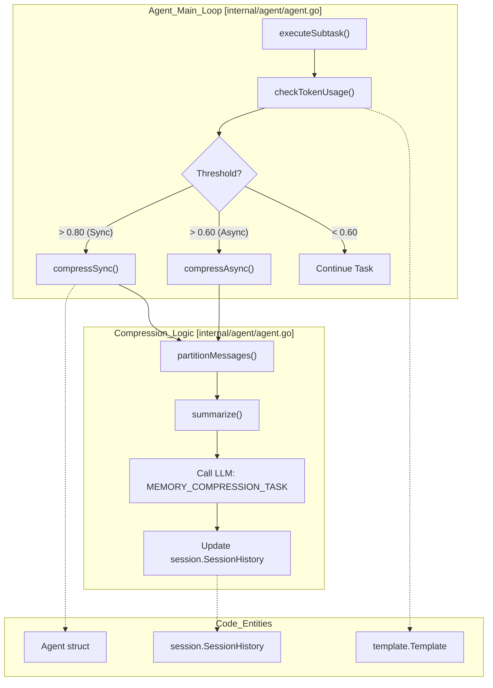
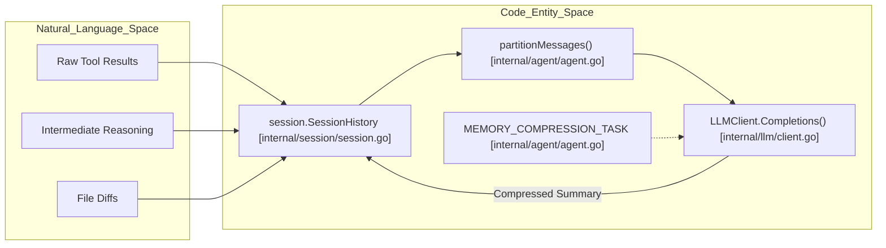

# 메모리 압축과 컨텍스트 관리

관련 소스 파일

다음 파일들은 이 위키 페이지를 생성하기 위한 컨텍스트로 사용되었습니다.

- [internal/agent/agent.go](internal/agent/agent.go)
- [internal/agent/preview.go](internal/agent/preview.go)
- [internal/agent/preview_test.go](internal/agent/preview_test.go)
- [internal/agent/template_test.go](internal/agent/template_test.go)
- [internal/llm/client.go](internal/llm/client.go)
- [internal/llm/client_test.go](internal/llm/client_test.go)
- [internal/tool/code_search.go](internal/tool/code_search.go)

`Agent`는 리뷰 프로세스 중 LLM과의 대화 기록을 유지합니다. tool call과 file read 수가 증가하면 context window가 포화될 수 있습니다. OpenCodeReview는 agent가 model token limit 안에 머무르면서 중요한 정보를 유지하도록 3개 영역 메모리 분할 전략과 자동 압축 메커니즘을 구현합니다.

## 컨텍스트 분할 전략

대화 기록은 메시지를 **Frozen**, **Compress**, **Active**라는 세 distinct zone으로 나누는 분할 전략을 통해 관리됩니다. 이 로직은 주로 `internal/agent/agent.go`에 구현되어 있습니다.

### 세 영역

| 영역 | 설명 |
| :--- | :--- |
| **Frozen** | 초기 system prompts와 첫 user task description입니다. agent가 핵심 지침이나 주요 리뷰 목표를 잃지 않도록 절대 압축되지 않습니다. |
| **Compress** | tool calls와 tool results를 포함하는 중간 대화 기록의 sliding window입니다. threshold에 도달하면 이 메시지들은 LLM으로 전송되어 단일 XML 형식 block으로 요약됩니다. |
| **Active** | 가장 최근 대화 "rounds"입니다. 현재 reasoning line에 대한 즉시 컨텍스트를 LLM에 제공하기 위해 원본 형태로 유지됩니다. |

### 분할 로직
`partitionMessages` 함수는 이러한 영역의 boundary를 결정합니다. 이 함수는 `round` struct를 식별하며, 하나의 round는 하나의 `assistant` message index와 그 뒤에 오는 0개 이상의 `tool` result message indices로 구성됩니다 [internal/agent/agent.go:139-142]().

1.  **Frozen Boundary**: 처음 두 메시지(System + Initial User Task)로 고정됩니다 [internal/agent/agent.go:275-276]().
2.  **Active Boundary**: 즉시 컨텍스트를 유지하기 위해 마지막 3개 round가 "Active"로 보존됩니다 [internal/agent/agent.go:282-284]().
3.  **Compressible Range**: Frozen boundary와 Active boundary 사이의 모든 항목은 요약 대상이 될 수 있습니다 [internal/agent/agent.go:304-306]().

**출처:** [internal/agent/agent.go:139-150](), [internal/agent/agent.go:263-315]()

## 압축 Threshold와 실행

압축은 `Template`에 정의된 `MaxTokens` 값을 기준으로 트리거됩니다 [internal/config/template/template.go:16-16](). agent는 `agent` package에 상수로 정의된 두 가지 특정 threshold를 사용합니다 [internal/agent/agent.go:132-135]().

*   **tokenSoftThreshold (0.60)**: **비동기** background compression을 트리거합니다. main review loop가 계속되는 동안 기록을 요약하기 위해 `compressionJob`이 시작됩니다 [internal/agent/agent.go:133-133]().
*   **tokenWarningThreshold (0.80)**: **동기** compression을 트리거합니다. context overflow를 방지하기 위해 압축이 완료될 때까지 main loop가 block됩니다 [internal/agent/agent.go:134-134]().

### Workflow: Async vs Sync Compression

`compressIfNecessary` 함수는 현재 token usage를 이러한 threshold와 비교합니다. 비동기 `pendingJob`이 이미 실행 중인 경우, warning threshold에 도달하면 agent는 해당 작업이 완료될 때까지 기다립니다 [internal/agent/agent.go:343-349]().

#### 컨텍스트 관리 흐름
다음 다이어그램은 `Agent`가 raw messages에서 compressed state로의 전환을 어떻게 관리하는지 보여줍니다.

Title: Context Management and Compression Flow

**출처:** [internal/agent/agent.go:132-135](), [internal/agent/agent.go:317-366](), [internal/config/template/template.go:12-21]()

## 요약 프롬프트와 XML 구조

압축이 트리거되면 agent는 `summarize` 함수를 호출합니다 [internal/agent/agent.go:387-387](). 이 함수는 `MEMORY_COMPRESSION_TASK` template을 사용해 LLM이 대화 기록을 압축하도록 안내합니다.

### 구조화된 요약 형식
LLM은 전문 code review assistant로 동작하고 구조화된 차원으로 정리된 요약을 제공하도록 지시받습니다.

1.  **식별된 코드 이슈**: 확인된 문제를 severity(HIGH/MEDIUM/LOW) 순으로 정렬한 목록입니다.
2.  **Tool Call 결론**: `file_read` 또는 `code_search` 같은 도구에서 얻은 핵심 발견 사항입니다.
3.  **완료된 작업**: 추가 follow-up이 필요 없는 항목입니다.
4.  **대기 중인 작업**: 시작했지만 완료되지 않은 조사입니다.
5.  **현재 초점**: 즉시 달성해야 할 목표를 설명하는 한 문장입니다.

### 요약 구현
`summarize` 함수는 식별된 `compress` range의 메시지를 가져와 LLM에 보내기 전에 `<context>` XML tag로 감쌉니다 [internal/agent/agent.go:404-413](). 결과는 요약된 XML block을 포함하는 `assistant` role의 단일 `Message`이며, session에서 원시 중간 기록을 대체합니다.

**출처:** [internal/agent/agent.go:387-422](), [internal/llm/client.go:48-53]()

## 데이터 흐름: 기록에서 압축된 상태까지

`Agent`는 conversation records의 lifecycle을 관리하기 위해 `SessionHistory`와 상호작용합니다.

Title: Memory Compression Data Transformation

### 주요 함수와 클래스

| Entity | 위치 | 역할 |
| :--- | :--- | :--- |
| `Agent` | `internal/agent/agent.go` | compression lifecycle을 조율하고 `totalTokensUsed`를 atomically 모니터링합니다 [internal/agent/agent.go:159-174](). |
| `partitionMessages` | `internal/agent/agent.go` | message role을 기준으로 기록을 Frozen, Compress, Active zone으로 나누는 로직입니다 [internal/agent/agent.go:263-315](). |
| `summarize` | `internal/agent/agent.go` | compression task를 위한 prompt를 준비하고 `LLMClient`를 호출합니다 [internal/agent/agent.go:387-422](). |
| `Template` | `internal/config/template/template.go` | compression threshold 계산에 사용되는 `MaxTokens` limit을 정의합니다 [internal/config/template/template.go:12-21](). |
| `SessionHistory` | `internal/session/session.go` | 현재 review session의 모든 `llm.Message` instance를 위한 underlying storage입니다 [internal/agent/agent.go:121-121](). |
| `compressionJob` | `internal/agent/agent.go` | `done` channel을 사용해 진행 중인 background compression operation을 추적합니다 [internal/agent/agent.go:153-156](). |

**출처:** [internal/agent/agent.go:132-174](), [internal/agent/agent.go:263-315](), [internal/agent/agent.go:387-422](), [internal/config/template/template.go:12-21]()
