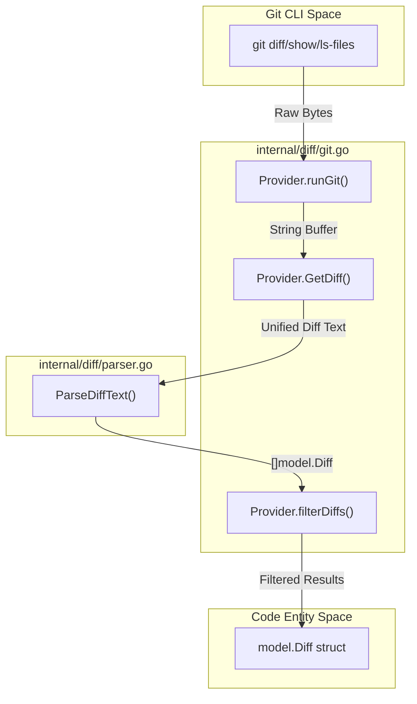
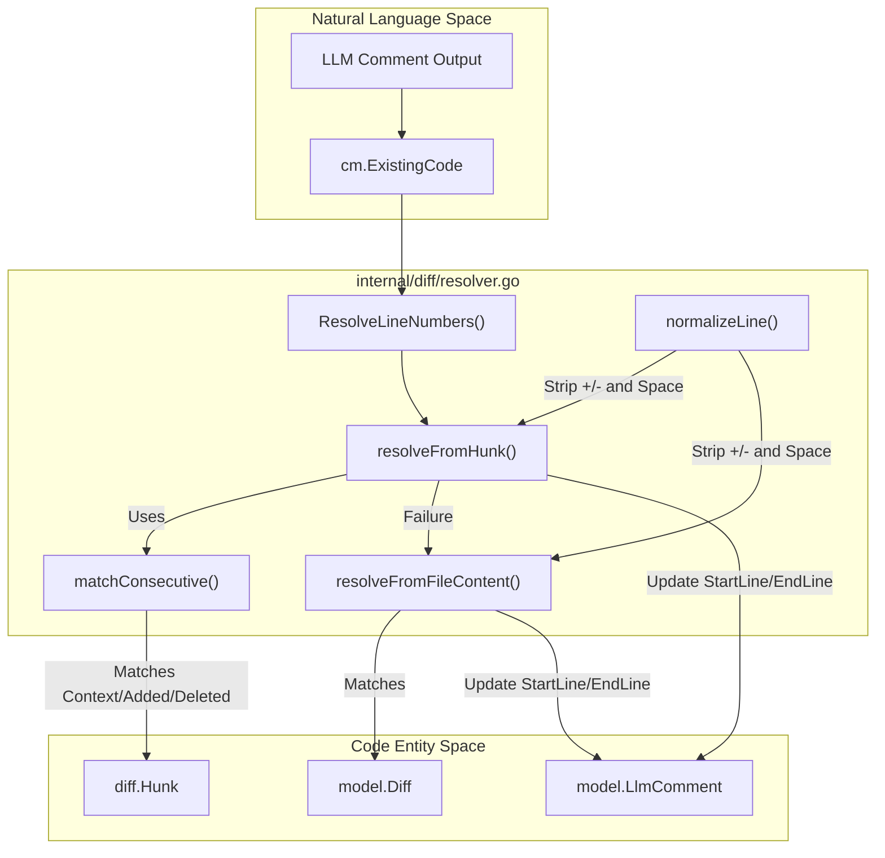

# Git Diff 처리

관련 소스 파일

다음 파일들은 이 위키 페이지를 생성하기 위한 컨텍스트로 사용되었습니다.

- [cmd/testdiff/main.go](cmd/testdiff/main.go)
- [internal/diff/git.go](internal/diff/git.go)
- [internal/diff/hunk.go](internal/diff/hunk.go)
- [internal/diff/hunk_test.go](internal/diff/hunk_test.go)
- [internal/diff/parser.go](internal/diff/parser.go)
- [internal/diff/relocation.go](internal/diff/relocation.go)
- [internal/diff/relocation_test.go](internal/diff/relocation_test.go)
- [internal/diff/resolver.go](internal/diff/resolver.go)
- [internal/diff/resolver_test.go](internal/diff/resolver_test.go)
- [internal/model/diff.go](internal/model/diff.go)
- [internal/tool/code_comment.go](internal/tool/code_comment.go)
- [internal/tool/file_find.go](internal/tool/file_find.go)
- [internal/viewer/static/style.css](internal/viewer/static/style.css)

Git Diff Processing 시스템은 repository에서 raw changes를 가져오고, 이를 구조화된 객체로 파싱하며, LLM이 생성한 피드백을 다시 특정 source code line numbers에 매핑하는 역할을 합니다. 이 subsystem은 외부 Git CLI와 내부 `model.Diff` 및 `model.LlmComment` entity 사이의 간극을 연결합니다.

## 1. Diff 검색과 Provider 모드

`internal/diff/git.go`의 `Provider` struct는 Git binary와의 상호작용을 처리합니다. 리뷰 대상 변경 사항을 결정하기 위해 세 가지 distinct operation mode를 지원합니다.

| 모드 | 설명 | 구현 |
| :--- | :--- | :--- |
| **Workspace** | 현재 commit되지 않은 변경 사항(staged, unstaged, untracked)입니다. | `ModeWorkspace` [internal/diff/git.go:37-37]() |
| **Commit** | 특정 commit이 parent와 비교해 도입한 변경 사항입니다. | `ModeCommit` [internal/diff/git.go:38-38]() |
| **Range** | common ancestor(`merge-base`)를 통해 계산된 두 refs 사이의 변경 사항입니다. | `ModeRange` [internal/diff/git.go:39-39]() |

### 데이터 흐름: Raw Git에서 model.Diff까지
`GetDiff()` 함수는 command execution과 이후 parsing을 조율합니다.

Title: Git Diff Retrieval Flow

**출처:** [internal/diff/git.go:103-155](), [internal/diff/parser.go:27-82]()

## 2. Unified Diff 파싱

parser는 unified diff text를 `model.Diff` 객체로 변환합니다. file metadata(paths, binary status, new/deleted status)를 추적하고 line prefix를 검사해 insertion/deletion counts를 계산합니다.

### 파일 수준 파싱
`ParseDiffText`는 여러 regular expressions를 사용해 file boundary와 property를 식별합니다.
* `diffHeaderRe`: `^diff --git a/(.+?) b/(.+)$` [internal/diff/parser.go:18-18]()
* `oldFileRe`: `^--- a/(.+)$` [internal/diff/parser.go:19-19]()
* `newFileRe`: `^\+\+\+ b/(.+)$` [internal/diff/parser.go:20-20]()

### Hunk 수준 파싱
각 file diff 내부에서 시스템은 "hunks"(`@@`로 시작하는 block)를 파싱합니다. `internal/diff/hunk.go`의 `ParseHunks` 함수는 변경의 coordinate system을 추출합니다.

| 필드 | 의미 |
| :--- | :--- |
| `OldStart` | source file의 시작 line number입니다(1-indexed). [internal/diff/hunk.go:26-26]() |
| `NewStart` | target file의 시작 line number입니다(1-indexed). [internal/diff/hunk.go:28-28]() |
| `Lines` | `HunkContext`, `HunkAdded` 또는 `HunkDeleted`를 포함하는 `HunkLine` slice입니다. [internal/diff/hunk.go:30-30]() |

**출처:** [internal/diff/parser.go:17-82](), [internal/diff/hunk.go:9-31]()

## 3. 경로 제외와 필터링

diff가 agent로 전달되기 전에 hardcoded directory ignores와 repository의 `.gitignore` 파일을 기준으로 필터링됩니다.

* **Hardcoded Ignores:** `node_modules/`, `vendor/`, `.git/` 같은 일반적인 디렉터리는 `providerDirIgnoreDirs`를 통해 항상 제외됩니다. [internal/diff/git.go:18-31]()
* **Gitignore Matching:** `matchGitignorePattern` 함수는 directory-only 및 file patterns 모두에 대해 표준 glob matching을 구현합니다. [internal/diff/git.go:195-233]()

**출처:** [internal/diff/git.go:176-249]()

## 4. Line Number Resolution

LLM은 정확한 line numbers를 제공하기보다 "Existing Code"를 인용해 review comments를 제공하는 경우가 많습니다. `internal/diff/resolver.go`의 `ResolveLineNumbers` 함수는 이러한 comments를 다시 파일에 매핑하기 위해 2단계 전략을 구현합니다.

### Stage 1: Hunk 기반 Resolution (`resolveFromHunk`)
이것이 기본 method입니다. diff의 `HunkContext`, `HunkAdded`, `HunkDeleted` lines 안에서 `ExistingCode`를 찾으려 시도합니다.
1. LLM의 `ExistingCode`를 `splitAndNormalize`로 정규화된 lines로 나눕니다. [internal/diff/resolver.go:88-88]()
2. `extractSideLines`를 사용해 side-specific lines(new-side 먼저, 그다음 old-side)를 추출합니다. [internal/diff/resolver.go:94-103]()
3. `matchConsecutive`를 사용해 target lines를 스캔하고, 1-indexed file line numbers를 반환합니다. [internal/diff/resolver.go:148-165]()

### Stage 2: 전체 Content Fallback (`resolveFromFileContent`)
hunk 기반 검색이 실패하면(예: LLM이 diff의 일부는 아니지만 컨텍스트로 제공된 code에 comment하는 경우), 시스템은 전체 `NewFileContent`를 line-by-line으로 스캔합니다. [internal/diff/resolver.go:169-196]()

### LLM 보조 Relocation
text 기반 matching이 실패하면 시스템은 `internal/diff/relocation.go`의 `ReLocateComment`를 사용할 수 있습니다. 이는 resolution logic을 재시도하기 전에 diff context를 기반으로 더 정확한 `existing_code` snippet을 다시 생성하도록 LLM을 호출합니다. [internal/diff/relocation.go:19-69]()

Title: Line Number Resolution Logic

**출처:** [internal/diff/resolver.go:12-55](), [internal/diff/resolver.go:82-112](), [internal/diff/resolver.go:117-145](), [internal/diff/resolver.go:169-196](), [internal/diff/relocation.go:19-69]()
