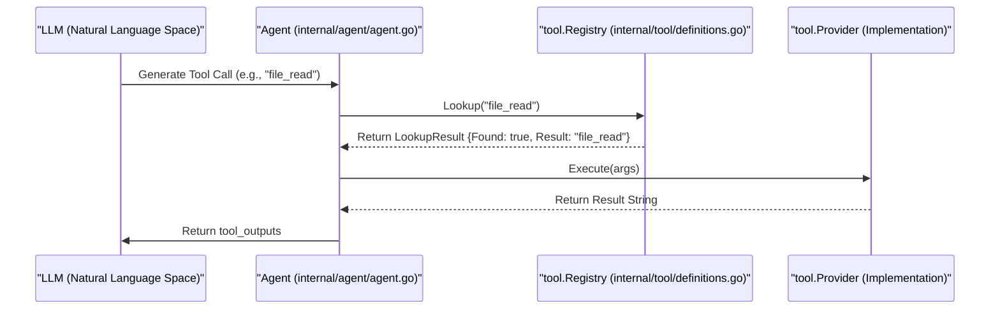

# Agent Tool System

<details>
<summary>관련 소스 파일</summary>

다음 파일들은 이 위키 페이지를 생성하기 위한 컨텍스트로 사용되었습니다.

- [internal/tool/definitions.go](internal/tool/definitions.go)
- [internal/tool/response_message.go](internal/tool/response_message.go)
- [internal/tool/stub.go](internal/tool/stub.go)

</details>


Agent Tool System은 LLM이 로컬 코드베이스와 상호작용하고 리뷰 발견 사항을 제출하는 인터페이스를 제공합니다. **Registry** pattern을 사용하는 decoupled architecture를 기반으로 구축되어, agent가 기반 구현에 결합되지 않고 file reading, code searching, commenting 같은 특정 capability를 호출할 수 있게 합니다.

## Tool Architecture

이 시스템은 도구를 식별하고 실행하는 방식을 정의하는 `Provider` interface를 중심으로 동작합니다. 각 도구는 인자 map을 받고 LLM의 context에 다시 공급될 string result를 반환하는 개별 기능 단위입니다.

### Registry Pattern
`Registry`는 중앙 dispatcher 역할을 합니다. `Agent` 초기화 중 다양한 tool providers가 등록됩니다. LLM이 tool call을 생성하면 `Agent`는 `Registry`에서 해당 `Provider`를 찾고 그 `Execute` method를 호출합니다.

### Core Components
| Component | 책임 | 위치 |
| :--- | :--- | :--- |
| `Tool` | 고유한 tool identifier(예: `file_read`)를 나타내는 value object입니다. | [internal/tool/definitions.go:6-8]() |
| `Provider` | `Tool()` 및 `Execute(map[string]any)` method를 요구하는 interface입니다. | [internal/tool/definitions.go:49-54]() |
| `Registry` | tool names를 `Provider` instances로 해석하기 위한 map 기반 store입니다. | [internal/tool/definitions.go:57-67]() |
| `ToolCallResult` | OpenAI-compatible IDs를 포함한 tool execution output의 container입니다. | [internal/tool/response_message.go:4-8]() |
| `BuiltinToolProvider` | 단순 함수로 구현된 도구를 위한 wrapper입니다. | [internal/tool/stub.go:18-21]() |
| `StubProvider` | 도구를 사용할 수 없을 때 사용되는 fallback provider입니다. | [internal/tool/stub.go:5-7]() |

### Tool Execution Flow

이 다이어그램은 tool request가 LLM에서 `Registry`를 거쳐 구체적인 `Provider`로 이동하는 방식을 보여줍니다.

**Tool Resolution and Execution**

출처: [internal/tool/definitions.go:49-76](), [internal/tool/response_message.go:4-8]()

## 사용 가능한 도구

시스템은 LLM이 코드베이스를 탐색하고 리뷰를 수행하는 데 사용하는 표준 도구 세트를 정의합니다. 이들은 file operations, search capabilities, feedback mechanisms로 분류됩니다.

| Tool Name | 목적 | 구현 범주 |
| :--- | :--- | :--- |
| `file_read` | 특정 파일의 전체 content를 읽습니다. | File and Code Tools |
| `file_find` | 디렉터리의 파일을 나열하거나 name pattern으로 검색합니다. | File and Code Tools |
| `file_read_diff` | 파일의 특정 git diff hunks를 읽습니다. | File and Code Tools |
| `code_search` | repository 전체에서 keyword search를 수행합니다. | File and Code Tools |
| `code_comment` | 특정 line/file에 review comment를 제출합니다. | Comment Collection |
| `task_done` | 현재 subtask가 완료되었음을 알립니다. | Built-in |

### 코드 엔티티 매핑

다음 다이어그램은 LLM의 tool calls를 이를 처리하는 내부 Go structures와 연결합니다.

**Tool Entity Mapping**
```mermaid
classDiagram
    class "ToolDefinitions" {
        <<Variable>>
        +FileRead: Tool
        +FileFind: Tool
        +CodeSearch: Tool
        +CodeComment: Tool
        +TaskDone: Tool
    }
    class "Registry" {
        +Register(Provider)
        +Lookup(string) LookupResult
    }
    class "BuiltinToolProvider" {
        +Execute(map[string]any)
    }
    class "StubProvider" {
        +Execute(map[string]any)
    }
    class "TaskCheckpoint" {
        +Data: string
        +Completed: bool
    }

    "ToolDefinitions" --> "Registry" : "Populates"
    "Registry" --> "BuiltinToolProvider" : "Dispatches to"
    "Registry" --> "StubProvider" : "Fallback for missing tools"
    "TaskDone" ..> "TaskCheckpoint" : "Signals Completion"
```
출처: [internal/tool/definitions.go:10-18](), [internal/tool/definitions.go:57-76](), [internal/tool/stub.go:5-28](), [internal/tool/response_message.go:10-20]()

## Subsystems

tool system은 두 가지 주요 functional area로 나뉩니다.

### File and Code Tools
이 도구들은 agent의 "눈"을 제공합니다. 공유 `FileReader` abstraction을 사용해 로컬 filesystem과 git state에 접근합니다. 큰 파일을 처리할 수 있도록 structured views(예: diffs)를 제공해 LLM context tokens를 절약하도록 설계되었습니다.
*   **주요 도구:** `file_read`, `file_find`, `file_read_diff`, `code_search`.
*   **자세한 내용은 [File and Code Tools](#3.1)를 참조하세요.**

### Comment Collection and code_comment Tool
`code_comment` tool은 review process의 기본 "output"입니다. LLM에 데이터를 반환하는 다른 도구들과 달리, 이 도구는 thread-safe `CommentCollector`로 데이터를 보냅니다. 이를 통해 agent는 여러 subtask를 동시에 처리하면서 모든 review findings를 단일 final report로 집계할 수 있습니다.
*   **주요 도구:** `code_comment`.
*   **자세한 내용은 [Comment Collection and code_comment Tool](#3.2)을 참조하세요.**

## Error Handling
LLM이 `Registry`에 등록되지 않은 도구를 호출하려고 하면 시스템은 표준 `NotAvailableMsg`를 반환합니다. 이는 LLM에 해당 도구를 사용할 수 없음을 알리고 유효한 대안을 시도하도록 유도하여, agent가 invalid tool calls의 loop에 빠지는 것을 방지합니다.
*   **출처:** [internal/tool/definitions.go:82-83](), [internal/tool/stub.go:13-15](), [internal/tool/response_message.go:23-24]()
