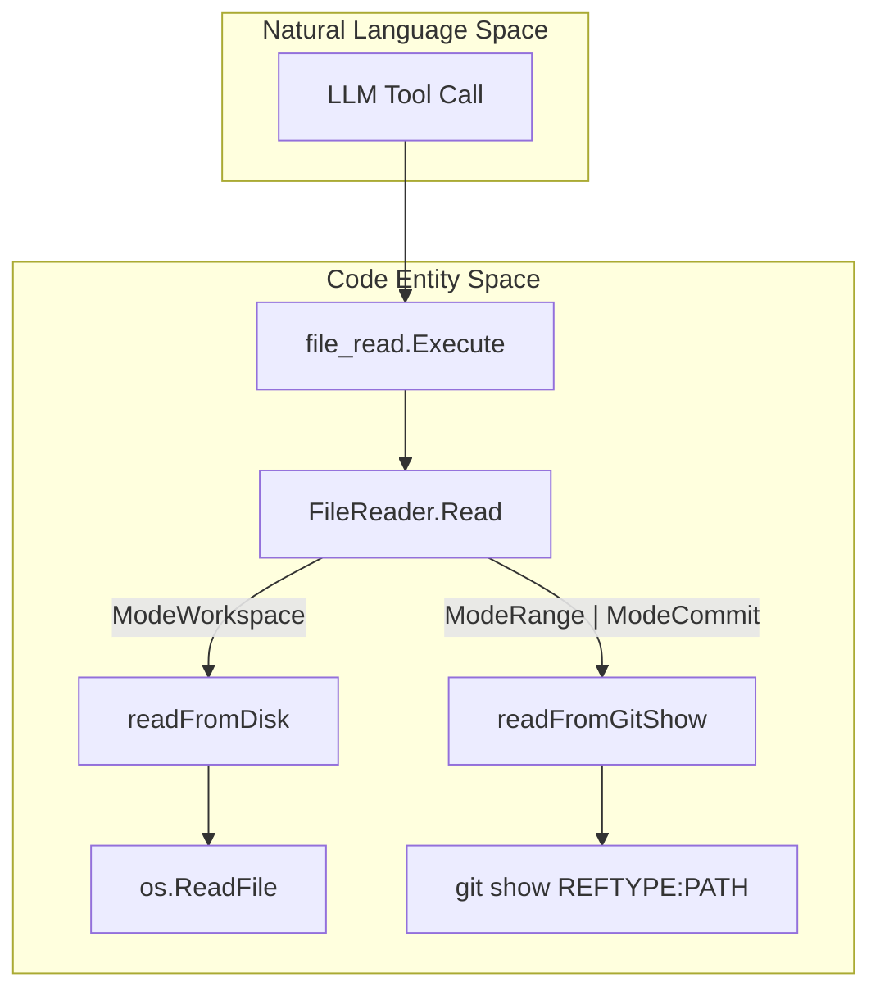
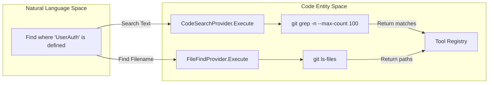

# 파일 및 코드 도구

관련 소스 파일

다음 파일들은 이 위키 페이지를 생성하기 위한 컨텍스트로 사용되었습니다.

- [internal/agent/agent.go](internal/agent/agent.go)
- [internal/agent/preview.go](internal/agent/preview.go)
- [internal/agent/preview_test.go](internal/agent/preview_test.go)
- [internal/agent/template_test.go](internal/agent/template_test.go)
- [internal/diff/git.go](internal/diff/git.go)
- [internal/diff/parser.go](internal/diff/parser.go)
- [internal/tool/code_search.go](internal/tool/code_search.go)
- [internal/tool/file_find.go](internal/tool/file_find.go)
- [internal/tool/file_read.go](internal/tool/file_read.go)
- [internal/tool/file_read_diff.go](internal/tool/file_read_diff.go)
- [internal/tool/filereader.go](internal/tool/filereader.go)

File and Code tools는 LLM Agent가 repository를 탐색하고, 특정 symbol을 찾고, 파일 content를 읽을 수 있게 합니다. 이 도구들은 서로 다른 review modes(Workspace, Range, Commit) 전반에서 일관성을 보장하는 통합 abstraction layer 위에 구축되어 있습니다.

## FileReader Abstraction

`FileReader` struct는 대부분의 코드 관련 도구가 사용하는 foundational component입니다. 사용자의 review context에 따라 file contents를 가져오는 복잡성을 추상화합니다 [internal/tool/filereader.go:49-56]().

### Review Modes
시스템은 세 가지 distinct operation mode를 지원합니다 [internal/tool/filereader.go:15-22]().
*   **ModeWorkspace**: local filesystem working tree에서 직접 파일을 읽습니다 [internal/tool/filereader.go:72-79]().
*   **ModeRange**: `git show`를 사용해 특정 git reference(일반적으로 `--to` branch)에 존재하는 파일을 읽습니다 [internal/tool/filereader.go:81-92]().
*   **ModeCommit**: 특정 commit hash에 존재하는 파일을 읽습니다 [internal/tool/filereader.go:81-92]().

**FileReader Data Flow**
"FileReader"는 상위 수준 read request를 OS 수준 file read 또는 Git commands로 변환합니다.

출처: [internal/tool/filereader.go:61-70](), [internal/tool/file_read.go:34-37]()

## File and Code Toolset

### 1. file_read
`FileReadProvider`는 agent가 파일의 특정 line을 읽을 수 있게 합니다. context window 고갈을 방지하기 위해 호출당 500 lines라는 hard limit을 적용합니다 [internal/tool/file_read.go:8-13]().

*   **Arguments**: `file_path` (string), `start_line` (int), `end_line` (int) [internal/tool/file_read.go:20-32]().
*   **Behavior**:
    *   `start_line`이 생략되면 기본값은 1입니다 [internal/tool/file_read.go:27-29]().
    *   `end_line`이 생략되면 파일 끝까지 읽습니다(500-line cap 적용) [internal/tool/file_read.go:30-32]().
    *   출력에는 metadata인 `IS_TRUNCATED`와 `LINE_RANGE`가 포함됩니다 [internal/tool/file_read.go:62-64]().
    *   Lines는 `lineNumber|content` 형식으로 반환됩니다 [internal/tool/file_read.go:66-68]().

출처: [internal/tool/file_read.go:19-73]()

### 2. file_find
`FileFindProvider`는 `git ls-files`를 사용해 이름 또는 pattern으로 파일을 찾습니다. 이는 agent가 익숙하지 않은 코드베이스를 탐색할 때 가장 먼저 사용하는 도구인 경우가 많습니다 [internal/tool/file_find.go:11-14]().

*   **Implementation**: tracked 및 untracked files를 모두 포함하면서 `.gitignore`를 준수하기 위해 `git ls-files --cached --others --exclude-standard`를 실행합니다 [internal/tool/file_find.go:60-63](). Range 또는 Commit mode에서는 `git ls-tree -r --name-only`를 사용합니다 [internal/tool/file_find.go:63-65]().
*   **Filtering**: noise를 줄이기 위해 binary files와 일반적인 generated artifacts를 자동으로 필터링합니다. `Makefile` 및 `Dockerfile` 같은 잘 알려진 extensionless files는 명시적으로 보존합니다 [internal/tool/file_find.go:92-108]().
*   **Constraints**: 결과는 처음 100 matches로 제한됩니다 [internal/tool/file_find.go:9-9]().

출처: [internal/tool/file_find.go:20-57](), [internal/tool/file_find.go:60-82]()

### 3. code_search
`CodeSearchProvider`는 `git grep`을 사용해 repository 전체에서 text-based search를 수행합니다 [internal/tool/code_search.go:12-15]().

*   **Implementation**: line numbers(`-n`)와 extended/perl regex support를 위한 flags와 함께 `git grep`을 감쌉니다 [internal/tool/code_search.go:46-58]().
*   **Ref Awareness**: `FileReader`가 Range 또는 Commit mode이면, `code_search`는 working tree 대신 특정 git ref를 자동으로 대상으로 삼습니다 [internal/tool/code_search.go:61-63]().
*   **Output**: Matches는 file path별로 그룹화되며, line number와 matching line content를 보여줍니다 [internal/tool/code_search.go:125-132]().

출처: [internal/tool/code_search.go:45-71](), [internal/tool/code_search.go:97-134]()

### 4. file_read_diff
`FileReadDiffProvider`는 리뷰 대상인 특정 변경 사항(diffs)에 대한 접근을 제공합니다 [internal/tool/file_read_diff.go:8-10]().

*   **Implementation**: 다른 도구와 달리 Git을 직접 호출하지 않습니다. agent의 initialization phase 중 채워지는 내부 `DiffMap`에서 읽으며, 이 map은 file paths를 raw diff text에 매핑합니다 [internal/tool/file_read_diff.go:9-12]().
*   **Use Case**: 현재 PR 또는 commit range의 정확한 modifications를 agent가 이해하는 데 사용됩니다 [internal/tool/file_read_diff.go:23-35]().

출처: [internal/tool/file_read_diff.go:16-42]()

## Tool Execution Architecture

모든 file tools는 provider pattern을 따릅니다. `Agent`는 `Tool` type을 기준으로 tool calls를 이러한 providers에 디스패치합니다.

**Search and Retrieval Flow**
이 다이어그램은 코드를 검색하려는 "Natural Language" intent와 Git commands의 "Code Entity" execution을 연결합니다.

출처: [internal/tool/code_search.go:21-43](), [internal/tool/file_find.go:20-57]()

### 제약과 한계 요약

| Tool | Limit | 구현 세부 사항 |
| :--- | :--- | :--- |
| `file_read` | 500 Lines | `fileReadMaxLines` constant [internal/tool/file_read.go:8]() |
| `file_find` | 100 Files | `fileFindMaxCount` constant [internal/tool/file_find.go:9]() |
| `code_search` | 100 Matches | `gitGrepMaxCount` constant [internal/tool/code_search.go:10]() |
| `file_read_diff` | None | startup 시 제공되는 git diff의 scope로 제한됩니다 |

출처: [internal/tool/file_read.go:8-13](), [internal/tool/file_find.go:9-14](), [internal/tool/code_search.go:10-15]()
