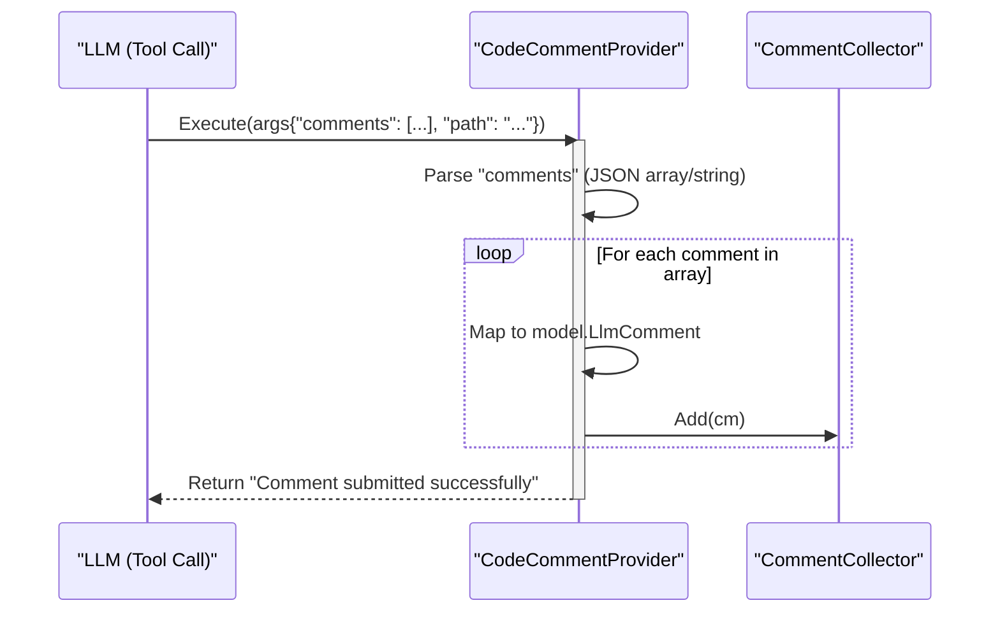
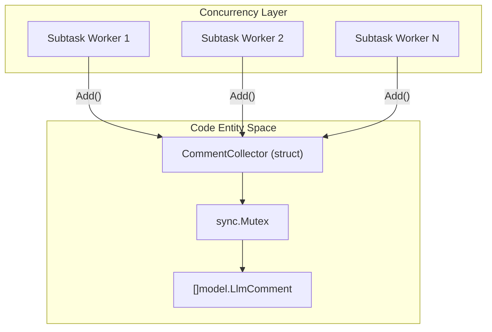

# Comment Collection 및 code_comment 도구

관련 소스 파일

다음 파일들은 이 위키 페이지를 생성하기 위한 컨텍스트로 사용되었습니다.

- [internal/diff/relocation.go](internal/diff/relocation.go)
- [internal/diff/relocation_test.go](internal/diff/relocation_test.go)
- [internal/model/review.go](internal/model/review.go)
- [internal/suggestdiff/diff.go](internal/suggestdiff/diff.go)
- [internal/tool/code_comment.go](internal/tool/code_comment.go)
- [internal/tool/comment_collector.go](internal/tool/comment_collector.go)
- [internal/viewer/static/style.css](internal/viewer/static/style.css)

이 페이지는 Large Language Model (LLM)이 리뷰 발견 사항을 OpenCodeReview (OCR) 시스템에 다시 제출하는 메커니즘을 설명합니다. `code_comment` tool, 이러한 comments의 thread-safe aggregation, suggestion과 line-number resolution을 관리하는 데 사용되는 내부 data structures를 다룹니다.

## 개요

리뷰 프로세스 중 LLM은 코드의 issue나 improvement를 식별합니다. 이를 보고하기 위해 `code_comment` tool을 호출합니다. 이 도구는 LLM의 자연어 reasoning과 OCR output layer가 요구하는 structured data 사이의 bridge 역할을 합니다. Comments는 여러 subtask에 걸쳐 비동기적으로 수집되며, 사용자에게 렌더링되기 전에 중앙의 thread-safe repository에 저장됩니다.

## code_comment 도구

`CodeCommentProvider`는 `code_comment` tool의 구현입니다 [internal/tool/code_comment.go:11-13](). LLM의 tool arguments를 파싱하고 이를 내부 `model.LlmComment` 객체로 변환하는 역할을 합니다.

### 구현 세부 사항
이 도구는 하나 이상의 comment object를 포함하는 `comments` array를 기대합니다. LLM이 JSON array를 string으로 이중 인코딩할 수 있는 경우도 처리합니다 [internal/tool/code_comment.go:35-45]().

LLM tool call에서 추출되는 주요 필드는 다음과 같습니다.
*   **`path`**: 리뷰 중인 file path입니다 [internal/tool/code_comment.go:68-70]().
*   **`content`**: 실제 review message 또는 critique입니다 [internal/tool/code_comment.go:56-58]().
*   **`suggestion_code`**: 기존 코드를 대체하기 위해 LLM이 제공하는 optional code snippet입니다 [internal/tool/code_comment.go:59-61]().
*   **`existing_code`**: suggestion이 대상으로 삼는 original code snippet입니다 [internal/tool/code_comment.go:62-64]().
*   **`thinking`**: 이 특정 comment에 대한 LLM의 internal reasoning입니다 [internal/tool/code_comment.go:65-67]().

### 데이터 흐름: Tool에서 Collector까지
다음 다이어그램은 `CodeCommentProvider`가 tool call을 처리하고 `CommentCollector`와 상호작용하는 방식을 보여줍니다.

**LLM Tool Execution Flow**

출처: [internal/tool/code_comment.go:11-79]()

## CommentCollector

`CommentCollector`는 Agent instance가 소유하는 thread-safe aggregator입니다 [internal/tool/comment_collector.go:9-14](). OCR Agent는 subtasks를 동시에 실행하므로 여러 goroutine이 동시에 comments를 제출하려고 시도할 수 있습니다.

### 주요 함수
*   **`Add(cm model.LlmComment)`**: `sync.Mutex`를 사용해 새 comment를 internal slice에 안전하게 append합니다 [internal/tool/comment_collector.go:22-26]().
*   **`Comments()`**: final rendering phase 중 race condition을 방지하기 위해 수집된 모든 comments의 deep copy를 반환합니다 [internal/tool/comment_collector.go:29-35]().

### 구조와 동시성
collector는 Agent 수준에서 isolation을 유지함으로써 서로 다른 repositories 또는 concurrent subtasks의 reviews가 서로 간섭하지 않도록 보장합니다.

**Comment Aggregation Architecture**

출처: [internal/tool/comment_collector.go:11-14](), [internal/tool/comment_collector.go:22-26]()

## Comment Relocation 및 Line Resolution

자동 코드 리뷰의 중요한 과제는 LLM의 `existing_code` snippet을 파일의 특정 line numbers로 다시 매핑하는 것입니다. OCR은 `diff` package를 통해 이를 위한 견고한 메커니즘을 제공합니다.

### Text-Based Matching
시스템은 먼저 `model.Diff` context 안에서 `existing_code` block을 찾아 `StartLine`과 `EndLine`을 resolve하려고 시도합니다 [internal/diff/relocation_test.go:65-80]().

### LLM-Assisted Relocation
text-based matching이 실패하면(예: LLM이 약간 부정확한 snippets를 제공한 경우) `ReLocateComment` 함수가 호출됩니다 [internal/diff/relocation.go:19-27]().
1.  **Context Construction**: file diff와 문제가 있는 `existing_code`를 포함하는 새 prompt를 구성합니다 [internal/diff/relocation.go:38-45]().
2.  **LLM Call**: comment의 의도와 일치하는 실제 diff의 정확한 verbatim snippet을 제공하도록 LLM에 요청합니다 [internal/diff/relocation.go:47-51]().
3.  **Extraction**: 시스템은 `extractCodeBlock`을 사용해 LLM의 markdown response에서 code를 추출합니다 [internal/diff/relocation.go:73-91]().
4.  **Retry**: 새로 얻은 snippet으로 line resolution을 다시 시도합니다 [internal/diff/relocation.go:64-66]().

출처: [internal/diff/relocation.go:19-91](), [internal/model/review.go:4-12]()

## Suggestion Diff Computation

LLM이 `suggestion_code`와 `existing_code`를 제공하면, OCR은 visual representation을 위해 `suggestdiff` package를 사용해 line-level diff를 계산합니다.

### Myers-style LCS
`ComputeLineDiff` 함수는 old code snippets와 new code snippets 사이의 차이를 찾기 위해 Myers-style Longest Common Subsequence (LCS) algorithm을 구현합니다 [internal/suggestdiff/diff.go:24-43]().

1.  **Normalization**: trivial whitespace 또는 casing differences를 무시하기 위해 `strings.EqualFold`와 `strings.TrimSpace`를 사용해 lines를 비교합니다 [internal/suggestdiff/diff.go:37-38]().
2.  **Backtracking**: algorithm은 DP table을 역추적해 `DiffLine` objects의 sequence를 생성합니다 [internal/suggestdiff/diff.go:49-61]().
3.  **Line Types**: 각 result line은 `DiffContext`, `DiffAdded`, `DiffDeleted`로 분류됩니다 [internal/suggestdiff/diff.go:10-14]().

| Line Type | 설명 |
| :--- | :--- |
| `DiffContext` | context로 사용되는 변경되지 않은 코드입니다. |
| `DiffAdded` | LLM이 제안한 새 코드입니다. |
| `DiffDeleted` | 제거될 원본 코드입니다. |

출처: [internal/suggestdiff/diff.go:7-20](), [internal/suggestdiff/diff.go:24-68]()

## Output Layer Integration

review tasks가 완료되면 수집된 comments가 `CommentCollector`에서 retrieval됩니다.

1.  **Retrieval**: Agent는 모든 결과를 모으기 위해 `collector.Comments()`를 호출합니다 [internal/tool/comment_collector.go:29]().
2.  **Rendering**: comments는 session persistence layer로 전달되고 WebUI 또는 CLI를 통해 렌더링됩니다. WebUI는 이러한 comments를 file 및 task type별로 그룹화하기 위해 `.file-accordion`과 `.task-main` 같은 특정 CSS classes를 사용합니다 [internal/viewer/static/style.css:134-141](), [internal/viewer/static/style.css:228-232]().

출처: [internal/tool/comment_collector.go:29-35](), [internal/viewer/static/style.css:134-249]()
