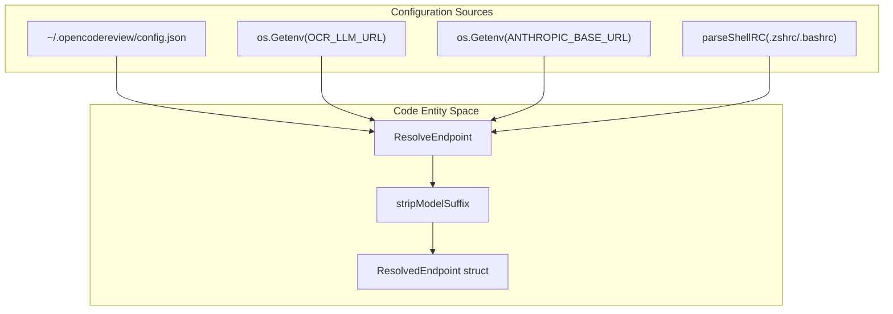

# LLM Client Layer

관련 소스 파일

다음 파일들은 이 위키 페이지를 생성하기 위한 컨텍스트로 사용되었습니다.

- [cmd/opencodereview/config_cmd.go](cmd/opencodereview/config_cmd.go)
- [cmd/opencodereview/llm_cmd.go](cmd/opencodereview/llm_cmd.go)
- [internal/llm/client.go](internal/llm/client.go)
- [internal/llm/client_test.go](internal/llm/client_test.go)
- [internal/llm/resolver.go](internal/llm/resolver.go)
- [internal/llm/resolver_test.go](internal/llm/resolver_test.go)
- [internal/llm/usage_resolver.go](internal/llm/usage_resolver.go)
- [internal/telemetry/config.go](internal/telemetry/config.go)

LLM Client Layer는 OpenCodeReview (OCR)와 다양한 Large Language Model providers 사이의 통신을 추상화하는 역할을 합니다. protocol translation, endpoint discovery, retries를 통한 reliable delivery, 정밀한 token accounting의 복잡성을 처리합니다.

## 개요

OCR은 통합 `LLMClient` interface를 통해 LLM과 상호작용합니다 [internal/llm/client.go:36-40](). 이 interface 덕분에 시스템의 나머지 부분은 기반 provider가 Anthropic의 Messages API인지 OpenAI Chat Completions API인지에 관계없이 provider를 의식하지 않아도 됩니다.

### 주요 기능
*   **Dual-Protocol Support**: `AnthropicClient`와 `OpenAIClient` 모두에 대한 native implementations입니다 [internal/llm/client.go:199-211]().
*   **Unified Messaging**: simple string content와 complex multi-part content blocks(예: tool results)를 모두 처리하는 공유 `Message` struct입니다 [internal/llm/client.go:48-62]().
*   **Resilience**: 일시적인 network errors 또는 rate limits를 처리하기 위한 내장 exponential backoff retry logic입니다 [internal/llm/client.go:23]().
*   **Token Management**: 정확한 local token counting과 context window 관리를 위해 `tiktoken`과 통합됩니다 [internal/llm/client.go:213-221]().
*   **Usage Extraction**: 다양한 vendor-specific response formats에서 token usage를 추출하기 위해 여러 JSON path를 탐색하는 견고한 `resolveUsage` utility입니다 [internal/llm/usage_resolver.go:52-82]().

### LLM 통신 흐름

다음 다이어그램은 `LLMClient`가 상위 수준 agent logic을 특정 API implementations와 어떻게 연결하는지 보여줍니다.

**LLM Request Pipeline**

```mermaid
graph TD
    subgraph "Natural Language Space"
        A["Agent.Run"] -- "ChatRequest" --> B["LLMClient (Interface)"]
    end

    subgraph "Code Entity Space"
        B -- "NewLLMClient (Factory)" --> FACTORY["internal/llm/client.go"]
        FACTORY -- "Protocol: anthropic" --> C["AnthropicClient.Completions"]
        FACTORY -- "Protocol: openai" --> D["OpenAIClient.Completions"]
        
        C -- "POST /v1/messages" --> E["Anthropic API"]
        D -- "POST /v1/chat/completions" --> F["OpenAI-Compatible API"]
        
        E -- "JSON Response" --> C
        F -- "JSON Response" --> D
    end

    C -- "ChatResponse" --> B
    D -- "ChatResponse" --> B
```

출처: [internal/llm/client.go:36-40](), [internal/llm/client.go:198-211](), [internal/llm/client.go:145-151]()

---

## Endpoint Resolution 및 Protocol Selection

OCR은 LLM 구성을 해석하기 위해 multi-tiered strategy를 사용합니다. 특정 priority order에 따라 여러 source에서 유효한 `URL`, `Token`, `Model`을 찾으려고 시도합니다.

1.  **OCR Config File**: `~/.opencodereview/config.json`에 위치합니다 [internal/llm/resolver.go:45](), [internal/llm/resolver.go:103-132]().
2.  **OCR Environment Variables**: `OCR_LLM_URL`, `OCR_LLM_TOKEN`, `OCR_LLM_MODEL` [internal/llm/resolver.go:23-28](), [internal/llm/resolver.go:67-87]().
3.  **Claude Code Environment**: `ANTHROPIC_BASE_URL`, `ANTHROPIC_AUTH_TOKEN`, `ANTHROPIC_MODEL` 지원 [internal/llm/resolver.go:31-35](), [internal/llm/resolver.go:135-146]().
4.  **Shell RC Files**: exported Anthropic credentials를 찾기 위해 `~/.zshrc`, `~/.bashrc`, `~/.profile`을 자동으로 parsing합니다 [internal/llm/resolver.go:149-158](), [internal/llm/resolver.go:188-228]().

`ResolveEndpoint` 함수는 source와 `OCR_USE_ANTHROPIC` 같은 explicit overrides를 기반으로 `Protocol`("anthropic" 또는 "openai")을 결정합니다 [internal/llm/resolver.go:76-84](). 또한 ANSI escape codes나 suffixes를 제거해 model names를 자동으로 정리합니다 [internal/llm/resolver.go:184-186]().

자세한 내용은 [Endpoint Resolution and Protocol Selection](#4.1)을 참조하세요.

**Configuration Resolution Strategy**

출처: [internal/llm/resolver.go:40-64](), [internal/llm/resolver.go:13-20](), [internal/llm/resolver.go:184-186]()

---

## HTTP Client, Streaming, Token Counting

client layer는 `StreamCompletion`을 통한 streaming responses용 Server-Sent Events (SSE) 지원을 포함해 견고한 HTTP handling을 제공합니다 [internal/llm/client.go:39]().

### Request Handling
*   **Retries**: 시스템은 failed requests에 대해 exponential backoff로 최대 10회 retry를 수행합니다 [internal/llm/client.go:23]().
*   **Timeouts**: `ClientConfig`를 통한 configurable timeouts는 agent가 무기한 멈추지 않도록 보장합니다 [internal/llm/client.go:188-194]().
*   **User Agent**: 모든 request에는 OCR version과 provider를 식별하는 custom `User-Agent`가 포함됩니다 [internal/llm/client.go:27-33]().

### Token Counting 및 Usage
OCR은 token을 local에서 세기 위해 `tiktoken`을 사용합니다. 이는 token usage가 특정 thresholds를 초과할 때 트리거되는 "Memory Compression" 시스템에 중요합니다. `modelTokenizerCache`는 효율성을 위해 encoders(예: `cl100k_base`)가 requests 전반에서 재사용되도록 보장합니다 [internal/llm/client.go:214-221]().

또한 `UsageInfo` struct는 prompt tokens, completion tokens, cache hits/writes를 포함해 API responses의 상세 metadata를 캡처합니다 [internal/llm/usage_resolver.go:9-15]().

자세한 내용은 [HTTP Client, Streaming, and Token Counting](#4.2)을 참조하세요.

---

## 데이터 구조

| Struct | 목적 |
| :--- | :--- |
| `ChatRequest` | completion을 위한 messages, tools, model parameters를 포함합니다. |
| `Message` | 대화의 한 turn을 나타냅니다. `Role`, `Content`, `ToolCalls`를 지원합니다 [internal/llm/client.go:48-53](). |
| `ToolCall` | 특정 tool을 실행하라는 LLM의 request를 나타냅니다 [internal/llm/client.go:124-128](). |
| `ChatResponse` | generated text, tool calls, usage metadata를 포함하는 통합 result입니다 [internal/llm/client.go:145-151](). |
| `UsageInfo` | `CacheReadTokens`와 `CacheWriteTokens`를 포함한 상세 token metrics입니다 [internal/llm/usage_resolver.go:9-15](). |

출처: [internal/llm/client.go:48-151](), [internal/llm/usage_resolver.go:9-15]()
