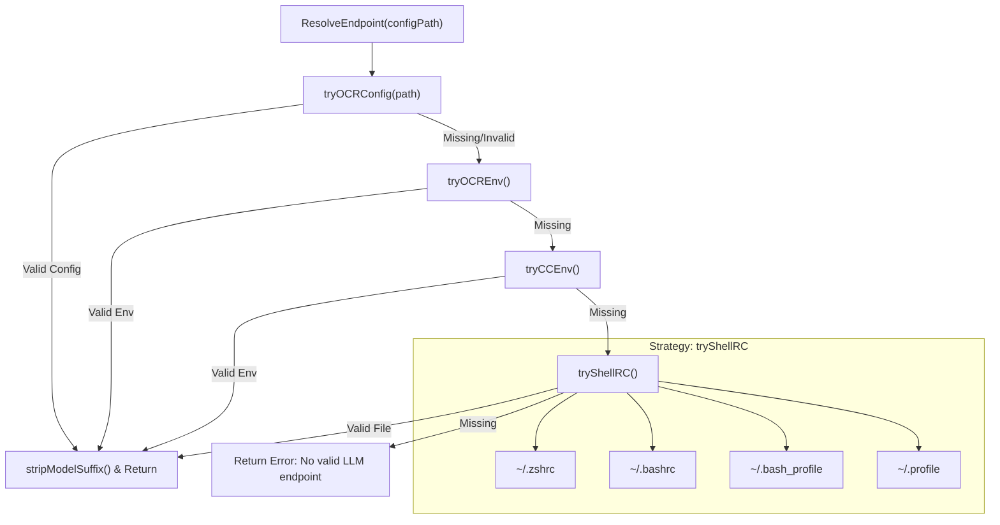
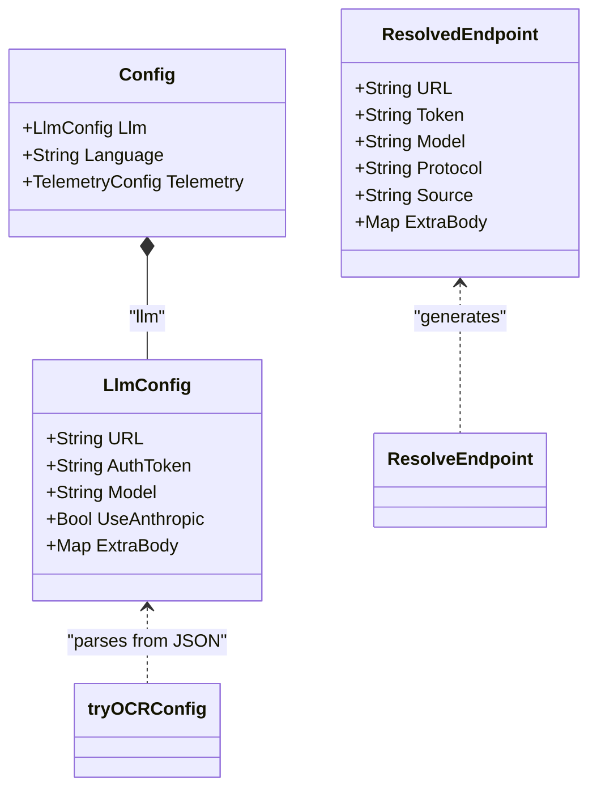

# Endpoint Resolution 및 Protocol Selection

관련 소스 파일

다음 파일들은 이 위키 페이지를 생성하기 위한 컨텍스트로 사용되었습니다.

- [cmd/opencodereview/config_cmd.go](cmd/opencodereview/config_cmd.go)
- [cmd/opencodereview/llm_cmd.go](cmd/opencodereview/llm_cmd.go)
- [internal/config/testconnection/task.json](internal/config/testconnection/task.json)
- [internal/config/testconnection/testconnection.go](internal/config/testconnection/testconnection.go)
- [internal/llm/resolver.go](internal/llm/resolver.go)
- [internal/llm/resolver_test.go](internal/llm/resolver_test.go)
- [internal/telemetry/config.go](internal/telemetry/config.go)

OpenCodeReview (OCR)는 로컬 개발 머신부터 CI/CD pipelines까지 서로 다른 환경에서 동작할 수 있도록 유연한 LLM endpoint resolution system을 구현합니다. 두 가지 기본 communication protocol인 **Anthropic Messages API**와 **OpenAI Chat Completions API**를 지원합니다.

## Endpoint Resolution Strategy

resolution process는 `ResolveEndpoint` 함수가 처리하며, 엄격한 priority order에 따라 네 가지 distinct strategy를 평가합니다. strategy가 성공한 것으로 간주되려면 세 가지 필수 필드인 `URL`, `AuthToken`(또는 `Token`), `Model` name을 제공해야 합니다 [internal/llm/resolver.go:37-40]().

### Resolution Hierarchy

다음 표는 `strategies` slice에 정의된 configuration sources의 priority를 설명합니다 [internal/llm/resolver.go:41-49]().

| Priority | Source | 설명 |
| :--- | :--- | :--- |
| 1 | **OCR Config File** | `~/.opencodereview/config.json`에 위치한 JSON configuration입니다 [internal/llm/resolver.go:45](), [cmd/opencodereview/config_cmd.go:12-18](). |
| 2 | **OCR Environment** | 명시적인 OCR-specific environment variables(`OCR_LLM_URL`, `OCR_LLM_TOKEN`, `OCR_LLM_MODEL`)입니다 [internal/llm/resolver.go:22-28](). |
| 3 | **Claude Code Env** | `ANTHROPIC_BASE_URL`, `ANTHROPIC_AUTH_TOKEN`, `ANTHROPIC_MODEL`을 위한 compatibility layer입니다 [internal/llm/resolver.go:30-35](). |
| 4 | **Shell RC Files** | exported Anthropic credentials를 찾기 위해 `.zshrc`, `.bashrc`, `.bash_profile`, `.profile`을 자동으로 parsing합니다 [internal/llm/resolver.go:148-158](). |

### ResolveEndpoint의 로직 흐름

resolution logic은 strategies를 순회하며, 세 필수 필드가 모두 비어 있지 않은 첫 결과를 반환합니다. 또한 terminal-exported variables에서 자주 발견되는 ANSI escape sequences(예: `[1m]`)를 제거해 model name cleanup을 수행합니다 [internal/llm/resolver.go:51-61]().

**데이터 흐름: Endpoint Resolution Logic**

**출처:** [internal/llm/resolver.go:40-64](), [internal/llm/resolver.go:149-178](), [internal/llm/resolver.go:184-186]()

---

## Protocol Selection

OCR은 `ResolvedEndpoint` struct의 `Protocol` field를 통해 **Anthropic** protocol과 **OpenAI** protocol을 구분합니다 [internal/llm/resolver.go:13-20]().

### Protocol Switching Logic

1.  **OCR Config File**: `llmFileConfig` struct에는 `UseAnthropic *bool` field가 포함됩니다. `nil` 또는 `true`이면 protocol은 `anthropic`입니다. 명시적으로 `false`이면 `openai`로 전환됩니다 [internal/llm/resolver.go:94](), [internal/llm/resolver.go:121-131]().
2.  **OCR Environment**: `OCR_USE_ANTHROPIC` 변수가 switch를 제어합니다. `true`, `1`, `yes` 같은 truthy values를 허용합니다. falsy value로 설정되면 `openai` protocol이 선택됩니다 [internal/llm/resolver.go:75-86]().
3.  **Claude Code/Shell RC Compatibility**: configuration이 `ANTHROPIC_*` variables에서 제공되는 경우 Claude-compatible proxies와의 호환성을 보장하기 위해 protocol은 엄격히 `anthropic`으로 고정됩니다 [internal/llm/resolver.go:145](), [internal/llm/resolver.go:227]().

### URL Normalization 및 Model Cleaning

*   **URL Suffixing**: Anthropic 기반 sources(CC Env 및 Shell RC)의 경우 OCR은 URL에 적절한 suffix가 붙어 있는지 확인합니다. base URL에 versioned path(`/v1/` 포함)가 없으면 시스템은 `ensureMessagesSuffix`를 통해 `/v1/messages`를 자동으로 추가합니다 [internal/llm/resolver.go:231-238]().
*   **Model Suffix Stripping**: environments에서 추출된 model names는 `stripModelSuffix`를 거치며, 이 함수는 regular expression `\[\d+m\]$`를 사용해 trailing formatting codes를 제거합니다 [internal/llm/resolver.go:182-186]().

**코드 엔티티 매핑: Configuration and Resolution Entities**

**출처:** [internal/llm/resolver.go:13-20](), [cmd/opencodereview/config_cmd.go:73-85](), [internal/llm/resolver.go:89-100]()

---

## Configuration Management CLI

resolver가 사용하는 configuration은 주로 local filesystem과 상호작용하는 `ocr config` 명령을 통해 관리됩니다.

### 주요 구현 세부 사항
- **Persistence**: user-level configuration은 `~/.opencodereview/config.json`에 저장됩니다 [cmd/opencodereview/config_cmd.go:12-18]().
- **Setting Values**: `setConfigValue` 함수는 `llm.use_anthropic` 같은 CLI keys를 내부 struct fields로 매핑하는 작업을 처리하며, boolean parsing과 vendor-specific `extra_body` fields를 위한 JSON unmarshaling을 포함합니다 [cmd/opencodereview/config_cmd.go:126-172]().
- **Connectivity Verification**: `ocr llm test` 명령은 `ResolveEndpoint`를 사용해 현재 settings를 가져오고, resolved URL과 Token을 검증하기 위해 `TEST_TASK` conversation template을 사용한 실제 completion request를 시도합니다 [cmd/opencodereview/llm_cmd.go:27-41](), [internal/config/testconnection/testconnection.go:30-37]().

### Extra Body Support
`ResolvedEndpoint`와 configuration file은 `ExtraBody` field를 지원합니다 [internal/llm/resolver.go:19-20](). 이를 통해 사용자는 vendor-specific parameters(custom headers 또는 model-specific flags 등)를 underlying LLM provider에 직접 전달할 수 있습니다 [cmd/opencodereview/config_cmd.go:84](), [cmd/opencodereview/config_cmd.go:162-167]().

**출처:** [cmd/opencodereview/config_cmd.go:39-70](), [cmd/opencodereview/llm_cmd.go:61-89](), [internal/llm/resolver.go:121-132]()
