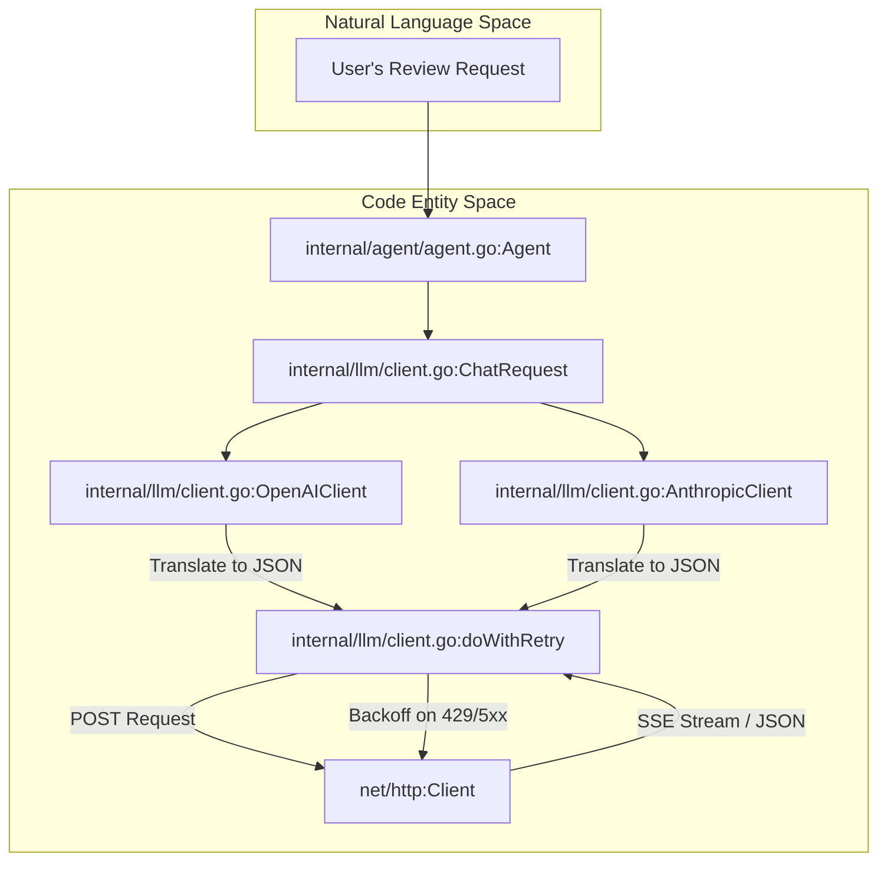
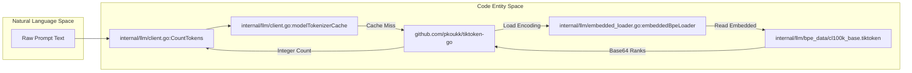

# HTTP Client, Streaming, Token Counting

관련 소스 파일

다음 파일들은 이 위키 페이지를 생성하기 위한 컨텍스트로 사용되었습니다.

- [internal/llm/bpe_data/cl100k_base.tiktoken](internal/llm/bpe_data/cl100k_base.tiktoken)
- [internal/llm/client.go](internal/llm/client.go)
- [internal/llm/client_test.go](internal/llm/client_test.go)
- [internal/llm/embedded_loader.go](internal/llm/embedded_loader.go)
- [internal/llm/usage_resolver.go](internal/llm/usage_resolver.go)

이 페이지는 OpenCodeReview의 LLM communication layer 구현을 자세히 설명합니다. dual-protocol client architecture, Server-Sent Events (SSE) streaming mechanism, exponential backoff retry logic, offline-capable token counting system을 다룹니다.

## LLM Client Architecture

OpenCodeReview는 **OpenAI Chat Completions API**와 **Anthropic Messages API** 사이의 차이를 추상화하는 통합 `LLMClient` interface를 제공합니다 [internal/llm/client.go:36-40]().

client selection은 `NewLLMClient` factory function이 처리하며, `ResolvedEndpoint` protocol에 따라 특정 구현으로 디스패치합니다 [internal/llm/client.go:197-211]().

### Data Flow 및 Protocol Translation

시스템은 request와 response에 공유 data structures를 사용합니다. `ChatRequest`와 `Message` type [internal/llm/client.go:48-53]()은 Claude가 사용하는 multi-part content blocks 지원을 포함해 두 protocol 모두에 충분히 표현력 있게 설계되었습니다 [internal/llm/client.go:57-62]().

### Request Translation Diagram

이 다이어그램은 generic `ChatRequest`가 provider-specific payload로 변환되고 `http.Client`를 통해 실행되는 방식을 보여줍니다.

| Name | Code Entity |
| :--- | :--- |
| **Request Factory** | `internal/llm/client.go:NewLLMClient` |
| **OpenAI Implementation** | `internal/llm/client.go:OpenAIClient` |
| **Anthropic Implementation** | `internal/llm/client.go:AnthropicClient` |
| **Retry Logic** | `internal/llm/client.go:doWithRetry` |

**출처:** [internal/llm/client.go:36-211]()

---

## Streaming 및 SSE Handling

Streaming은 LLM provider의 Server-Sent Events (SSE)를 처리하는 `StreamCompletion`을 통해 구현됩니다.

1.  **Connection**: client는 `"stream": true`가 포함된 request를 보냅니다.
2.  **Buffering**: `bufio.Scanner`가 response body를 line-by-line으로 읽습니다 [internal/llm/client.go:465-470]().
3.  **Parsing**: `data: `로 시작하는 lines에서 prefix를 제거하고 JSON payload를 추출합니다 [internal/llm/client.go:478-485]().
4.  **Callback**: raw content chunk는 제공된 callback function `cb func(chunk []byte) error`로 전달됩니다 [internal/llm/client.go:39]().

### Exponential Backoff를 사용한 Retry Logic

내부 함수 `doWithRetry` [internal/llm/client.go:23]()는 HTTP request의 lifecycle을 관리합니다. 다음 상황이 발생하면 최대 `maxRetries`(10) [internal/llm/client.go:23]()까지 시도합니다.
*   Network timeouts 또는 connection resets.
*   HTTP 429 (Rate Limit).
*   HTTP 5xx (Server Errors).

대기 시간은 exponentially 증가합니다. 즉, "thundering herd" 문제를 방지하기 위해 $2^{attempt} \times 100ms$에 작은 jitter를 더합니다.

**출처:** [internal/llm/client.go:23-40](), [internal/llm/client.go:465-485]()

---

## Token Counting 및 BPE Data

OpenCodeReview는 정밀한 token counting을 위해 `tiktoken-go`를 사용합니다. air-gapped 또는 restricted network environments에서도 CLI가 계속 동작하도록 Byte Pair Encoding (BPE) data files는 binary에 직접 embed됩니다.

### Embedded Loader Implementation

`internal/llm/embedded_loader.go` 파일은 Go의 `//go:embed` directive를 사용해 `internal/llm/bpe_data/` 디렉터리의 `.tiktoken` 파일을 포함합니다 [internal/llm/embedded_loader.go:13-14]().

| Encoding Name | File Source |
| :--- | :--- |
| `cl100k_base` | `internal/llm/bpe_data/cl100k_base.tiktoken` |
| `o200k_base` | `internal/llm/bpe_data/o200k_base.tiktoken` |
| `p50k_base` | `internal/llm/bpe_data/p50k_base.tiktoken` |
| `r50k_base` | `internal/llm/bpe_data/r50k_base.tiktoken` |

`InitEmbeddedLoader` 함수 [internal/llm/embedded_loader.go:20-23]()는 default `tiktoken` loader를 override하여 이러한 파일에 대한 network requests를 가로채고 `embed.FS`에서 제공하도록 합니다 [internal/llm/embedded_loader.go:36-41]().

### Token Counting Data Flow

| Name | Code Entity |
| :--- | :--- |
| **Token Counter** | `internal/llm/client.go:CountTokens` |
| **BPE Loader** | `internal/llm/embedded_loader.go:embeddedBpeLoader` |
| **BPE Data** | `internal/llm/bpe_data/cl100k_base.tiktoken` |

### Token Calculation Details
`CountTokens` 함수는 model name을 기준으로 올바른 encoding을 결정합니다 [internal/llm/client.go:233-248](). 예를 들면 다음과 같습니다.
*   `gpt-4`, `gpt-3.5-turbo`, `claude-3` models는 일반적으로 `cl100k_base`를 사용합니다 [internal/llm/client.go:238]().
*   `o1` models는 `o200k_base`를 사용합니다 [internal/llm/client.go:236]().

계산에는 LLM provider의 내부 accounting과 맞추기 위해 message metadata(role, name)에 대한 overhead가 포함됩니다 [internal/llm/client.go:250-280]().

**출처:** [internal/llm/client.go:214-280](), [internal/llm/embedded_loader.go:1-76](), [internal/llm/bpe_data/cl100k_base.tiktoken:1-380]()

---

## Usage Extraction

서로 다른 LLM providers와 proxies는 token usage를 다양한 JSON structures로 반환하므로, `UsageResolver`는 견고한 path-probing mechanism을 제공합니다 [internal/llm/usage_resolver.go:52-82]().

### 탐색되는 JSON Paths
시스템은 candidate paths의 ordered list를 사용해 `PromptTokens`, `CompletionTokens`, cache-related tokens를 추출하려고 시도합니다.

*   **Prompt Tokens**: `usage.prompt_tokens`, `prompt_tokens`, `data.usage.prompt_tokens` [internal/llm/usage_resolver.go:17-21]().
*   **Cache Hits (Anthropic)**: `usage.cache_read_input_tokens`, `usage.prompt_tokens_details.cache_tokens_hit` [internal/llm/usage_resolver.go:29-34]().
*   **Cache Writes**: `usage.cache_creation_input_tokens` [internal/llm/usage_resolver.go:36-39]().

response에 `TotalTokens`가 명시적으로 제공되지 않으면 prompt, completion, cache tokens의 합으로 계산됩니다 [internal/llm/usage_resolver.go:77-79]().

**출처:** [internal/llm/usage_resolver.go:8-114]()
