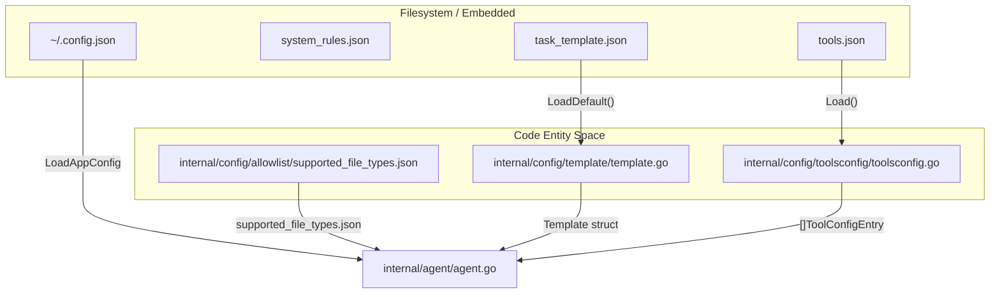
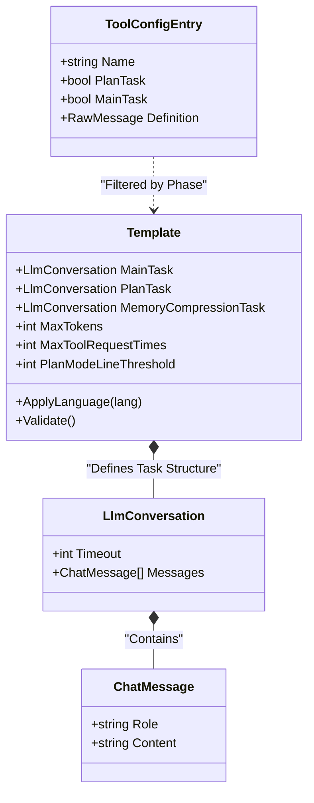

# Configuration System

관련 소스 파일

다음 파일들은 이 위키 페이지를 생성하기 위한 컨텍스트로 사용되었습니다.

- [internal/config/allowlist/supported_file_types.json](internal/config/allowlist/supported_file_types.json)
- [internal/config/rules/system_rules.json](internal/config/rules/system_rules.json)
- [internal/config/template/task_template.json](internal/config/template/task_template.json)
- [internal/config/template/template.go](internal/config/template/template.go)
- [internal/config/toolsconfig/toolsconfig.go](internal/config/toolsconfig/toolsconfig.go)

OpenCodeReview (OCR) configuration system은 user preferences, agent behaviors, linguistic rules, tool capabilities를 관리하도록 설계된 multi-layered architecture입니다. persistent user settings와 embedded defaults를 결합해 시스템이 out-of-the-box로 동작하면서도 높은 customizability를 유지하도록 합니다.

### Configuration Overview

시스템은 리뷰 프로세스의 서로 다른 측면을 관장하는 네 가지 primary subsystem으로 나뉩니다.

| Subsystem | Primary File | 목적 |
|:---|:---|:---|
| **User Config** | `~/.open-code-review/config.json` | LLM credentials, model selection, telemetry toggles입니다. |
| **System Rules** | `system_rules.json` | LLM review를 안내하는 데 사용되는 per-language 및 per-file checklists입니다. |
| **Prompt Templates** | `task_template.json` | Plan, Main, Memory compression tasks에 대한 definitions입니다. |
| **Tool Definitions** | `tools.json` | agent toolset을 위한 JSON schemas 및 configurations입니다. |

### Configuration Loading Flow

다음 다이어그램은 `Template` struct와 여러 loaders가 `Agent`를 위한 환경을 준비하기 위해 어떻게 상호작용하는지 보여줍니다.

**Configuration Initialization Sequence**

출처: [internal/config/template/template.go:27-34](), [internal/config/toolsconfig/toolsconfig.go:24-40](), [internal/config/allowlist/supported_file_types.json:1-69]()

---

### User Configuration
`Config` struct는 사용자 머신에 저장되는 top-level settings를 나타내며, 일반적으로 `~/.open-code-review/config.json`에 있습니다. 이 파일은 다음을 관리합니다.
* **LLM Settings**: URL, Auth Token, Model, protocol selection(Anthropic vs OpenAI)입니다.
* **Localization**: `Language` field는 response language를 결정합니다(기본값은 Chinese).
* **Telemetry**: OTLP 또는 Console exporters와 content logging을 위한 master switches입니다.

### System Review Rules
시스템은 리뷰 중인 파일을 기준으로 LLM context에 특정 checklists를 주입하기 위해 rule-based engine을 사용합니다. 이 rules는 `system_rules.json`에 정의되며 brace expansion을 포함한 glob patterns를 사용해 매칭됩니다. 이를 통해 Java file은 `pom.xml` 또는 SQL migration script와 다른 scrutiny를 받게 됩니다.

* **Pattern Matching**: `path_rule_map`을 사용해 file patterns(예: `**/*.java`)를 특정 rule files(예: `java.md`)와 연결합니다 [internal/config/rules/system_rules.json:3-17]().
* **Fallback**: 특정 patterns와 매칭되지 않는 파일을 위한 `default_rule`을 제공합니다 [internal/config/rules/system_rules.json:2]().

자세한 내용은 [System Review Rules](#5.1)를 참조하세요.

### Prompt Templates and Task Configuration
Task execution은 agent의 세 phase인 `PLAN_TASK`, `MAIN_TASK`, `MEMORY_COMPRESSION_TASK`에 대한 `LlmConversation` structure를 정의하는 `Template` struct가 관장합니다 [internal/config/template/template.go:12-21](). 
* **Localization**: `ApplyLanguage` method는 모든 system messages에 language directives를 동적으로 주입합니다 [internal/config/template/template.go:54-61]().
* **Constraints**: `MaxTokens`, `MaxToolRequestTimes`, `PlanModeLineThreshold` 같은 parameters는 agent의 resource consumption과 strategy를 제어합니다 [internal/config/template/template.go:16-20]().
* **Validation**: `Validate()` 함수는 중요한 limits가 양수인지, execution 전에 `MainTask`에 messages가 포함되어 있는지 확인합니다 [internal/config/template/template.go:63-74]().

자세한 내용은 [Prompt Templates and Task Configuration](#5.2)을 참조하세요.

### Tool Definitions and File Allowlist
agent의 capabilities는 tool configuration과 file allowlist에 의해 제한됩니다. 
* **Tool Schemas**: `tools.json`은 각 tool의 JSON schema를 정의하며, 이는 function calling을 활성화하기 위해 LLM에 제공됩니다 [internal/config/toolsconfig/toolsconfig.go:12-17]().
* **Phase Filtering**: `ToolDefsByPhase` method를 사용하면 `PlanTask` 또는 `MainTask` phases에 대해 tools를 선택적으로 활성화할 수 있습니다 [internal/config/toolsconfig/toolsconfig.go:45-54]().
* **File Filtering**: 시스템은 `supported_file_types.json`을 사용해 repository의 어떤 파일이 AI-assisted review 대상인지 결정합니다(예: `.go`, `.java`, `.ts`, `.sql`). 이를 통해 agent가 binary files 또는 unsupported formats에 token을 낭비하지 않도록 합니다 [internal/config/allowlist/supported_file_types.json:1-69]().

자세한 내용은 [Tool Definitions Config and File Allowlist](#5.3)를 참조하세요.

---

### Configuration Structure Mapping

**Data Mapping: Template to LLM Conversation**

출처: [internal/config/template/template.go:12-22](), [internal/config/template/template.go:77-86](), [internal/config/toolsconfig/toolsconfig.go:12-17]()
