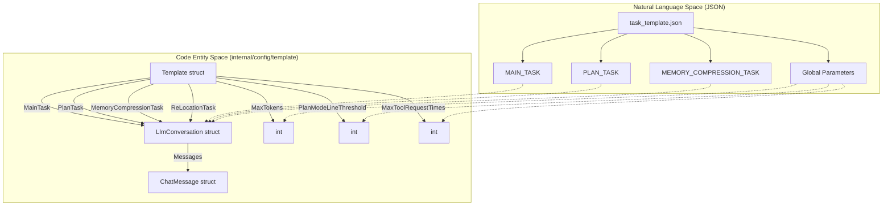
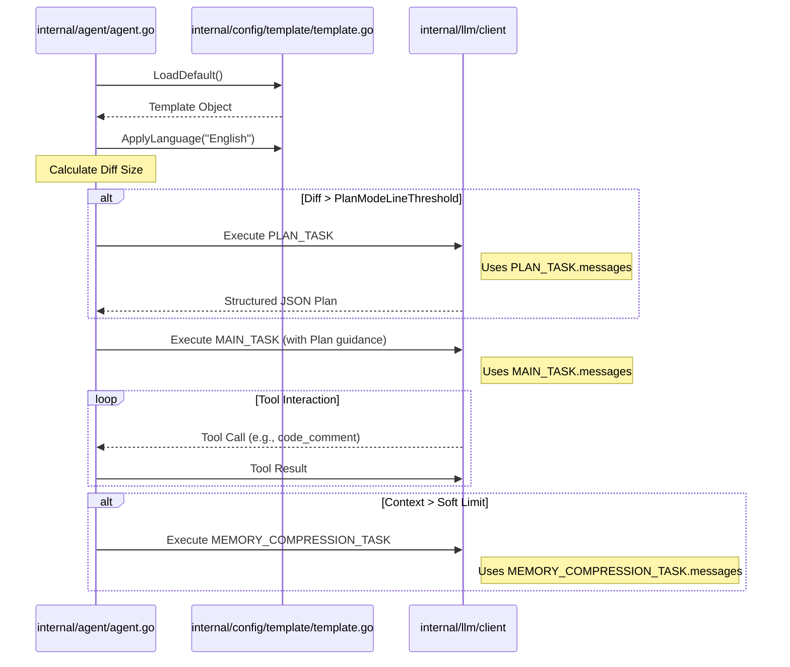

# Prompt Templates 및 Task Configuration

<details>
<summary>관련 소스 파일</summary>

다음 파일들은 이 위키 페이지를 생성하기 위한 컨텍스트로 사용되었습니다.

- [internal/config/template/task_template.json](internal/config/template/task_template.json)
- [internal/config/template/template.go](internal/config/template/template.go)

</details>


이 페이지는 OpenCodeReview (OCR) agent가 사용하는 prompt templates의 configuration과 structure를 자세히 설명합니다. 시스템은 구조화된 JSON 기반 template system을 활용해 review process의 여러 phase에 걸친 LLM의 behavior, constraints, instructions를 정의합니다.

## Task Configuration 개요

agent behavior의 핵심은 `internal/config/template/task_template.json`에 정의되어 있습니다 [internal/config/template/task_template.json:1-40](). 이 configuration은 네 가지 distinct task type을 관장하는 `Template` struct로 unmarshaled됩니다.

1.  **MAIN_TASK**: agent가 code를 review하고, tools를 사용하며, comments를 생성하는 primary loop입니다 [internal/config/template/task_template.json:2-14]().
2.  **PLAN_TASK**: 큰 변경 사항에 대해 risk points와 tool strategies를 식별하기 위한 optional pre-analysis phase입니다 [internal/config/template/task_template.json:15-27]().
3.  **MEMORY_COMPRESSION_TASK**: 긴 conversation histories를 context window limit 안에 맞도록 요약하는 데 사용됩니다 [internal/config/template/task_template.json:28-40]().
4.  **RE_LOCATION_TASK**: comments의 line positions를 다시 계산하거나 검증하는 데 사용되는 optional task입니다 [internal/config/template/template.go:21]().

### 데이터 구조 매핑

다음 다이어그램은 JSON configuration이 `template` package에 정의된 Go internal structures에 어떻게 매핑되는지 보여줍니다.

**Template Configuration Mapping**


출처: [internal/config/template/template.go:12-22](), [internal/config/template/template.go:76-86]()

## Template Struct 및 초기화

`Template` struct는 task-specific prompts와 execution limits를 위한 central repository입니다. `LoadDefault()`를 통해 초기화되며, 이 함수는 Go의 `embed` directive를 사용해 JSON content를 binary에 직접 포함합니다 [internal/config/template/template.go:24-34]().

### 주요 Parameters
| Parameter | Type | 설명 |
| :--- | :--- | :--- |
| `MaxTokens` | `int` | 단일 LLM response에 허용되는 최대 token limit입니다 [internal/config/template/template.go:16](). |
| `MaxToolRequestTimes` | `int` | agent가 하나의 task에서 연속으로 수행할 수 있는 tool call 수의 upper limit입니다 [internal/config/template/template.go:18](). |
| `PlanModeLineThreshold` | `int` | `MAIN_TASK` 전에 `PLAN_TASK`를 트리거하는 changed lines threshold입니다 [internal/config/template/template.go:20](). |
| `ToolRequestWaitTimeMs` | `int` | tool requests 사이에 기다릴 milliseconds입니다(rate limiting용) [internal/config/template/template.go:17](). |
| `MaxSubtaskExecMinutes` | `int` | 단일 subtask execution의 total timeout입니다 [internal/config/template/template.go:19](). |

출처: [internal/config/template/template.go:12-22]()

## LlmConversation 및 ChatMessage Schema

모든 task(Main, Plan, Memory)는 `LlmConversation`으로 정의됩니다 [internal/config/template/template.go:77-80]().

-   **Timeout**: LLM request의 HTTP timeout을 정의하는 integer seconds입니다 [internal/config/template/template.go:78]().
-   **Messages**: `Role`(system, user, assistant)과 `Content`를 포함하는 `ChatMessage` objects의 slice입니다 [internal/config/template/template.go:83-86]().

### Content Placeholders
`task_template.json`의 `Content` strings는 double-curly-brace placeholders를 사용하며, 이는 runtime에 agent가 채웁니다. 주요 placeholders는 다음과 같습니다.
- `{{diff}}`: review 중인 파일의 unified diff입니다 [internal/config/template/task_template.json:10]().
- `{{system_rule}}`: `system_rules.json`에서 파생된 checklist입니다 [internal/config/template/task_template.json:10]().
- `{{plan_tools}}`: planning phase에서 사용 가능한 tools의 descriptions입니다 [internal/config/template/task_template.json:19]().
- `{{current_file_path}}`: review 중인 파일의 path입니다 [internal/config/template/task_template.json:10]().

출처: [internal/config/template/template.go:77-86](), [internal/config/template/task_template.json:1-40]()

## Localization 및 Validation

### ApplyLanguage
`ApplyLanguage` 함수는 모든 task의 `system` message에 language directive를 주입해 localization을 제공합니다 [internal/config/template/template.go:55-62](). language가 지정되지 않으면 `resolveLang`을 통해 기본값인 "Chinese"가 사용됩니다 [internal/config/template/template.go:46-51]().

```go
func (t *Template) ApplyLanguage(lang string) {
	instruction := "\n\nAlways respond in " + resolveLang(lang) + "."
	applyLanguage(&t.MainTask, instruction)
    if t.PlanTask != nil {
		applyLanguage(t.PlanTask, instruction)
	}
	applyLanguage(&t.MemoryCompressionTask, instruction)
}
```
출처: [internal/config/template/template.go:37-62]()

### Validation Logic
`Validate()` method는 agent가 시작되기 전에 loaded configuration이 타당한지 확인합니다. token limits가 양수인지 확인하고 `MainTask`에 최소 하나의 message가 포함되어 있는지 보장합니다 [internal/config/template/template.go:63-74]().

## Task Execution Flow

다음 다이어그램은 `Template` configuration이 `Review Agent` logic을 어떻게 구동하고 서로 다른 task states 사이를 어떻게 전환하는지 보여줍니다.

**Prompt Application Flow**


출처: [internal/config/template/template.go:55-74](), [internal/config/template/task_template.json:15-40](), [internal/config/template/template.go:12-22]()
