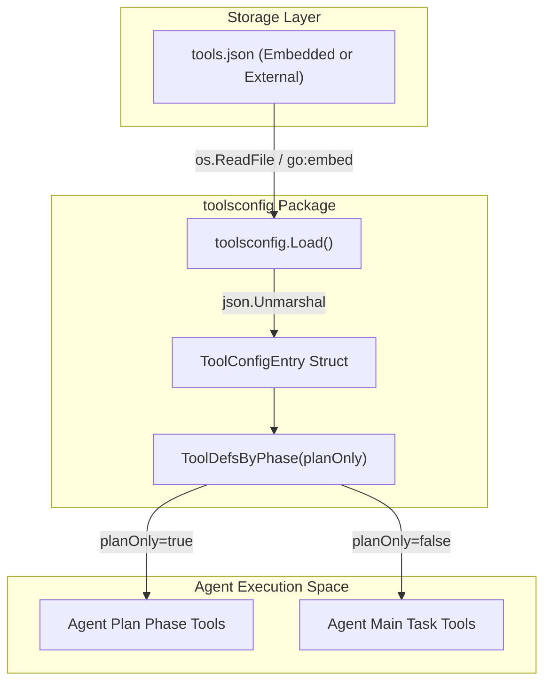
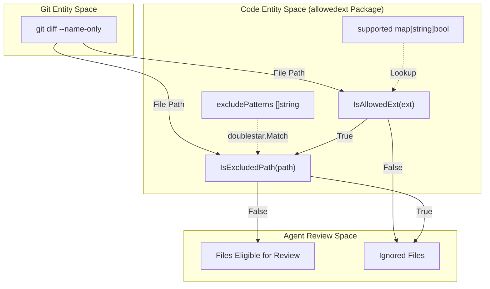

# Tool Definitions Config 및 File Allowlist

관련 소스 파일

다음 파일들은 이 위키 페이지를 생성하기 위한 컨텍스트로 사용되었습니다.

- [internal/config/allowlist/allowed_ext.go](internal/config/allowlist/allowed_ext.go)
- [internal/config/allowlist/allowed_ext_test.go](internal/config/allowlist/allowed_ext_test.go)
- [internal/config/allowlist/default_exclude_patterns.json](internal/config/allowlist/default_exclude_patterns.json)
- [internal/config/allowlist/supported_file_types.json](internal/config/allowlist/supported_file_types.json)
- [internal/config/rules/rule_docs/arkts.md](internal/config/rules/rule_docs/arkts.md)
- [internal/config/rules/system_rules.json](internal/config/rules/system_rules.json)
- [internal/config/toolsconfig/tools.json](internal/config/toolsconfig/tools.json)
- [internal/config/toolsconfig/toolsconfig.go](internal/config/toolsconfig/toolsconfig.go)

이 섹션은 OpenCodeReview (OCR)가 JSON 기반 tool schemas를 통해 LLM agents의 capabilities를 정의하는 방식과, file extension allowlist 및 path-based exclusion patterns를 사용해 리뷰 scope를 제한하는 방식을 설명합니다. 이러한 configurations는 상위 수준 agent instructions와 filesystem operations 또는 code analysis의 구체적 실행 사이의 간극을 연결합니다.

## Tool Definitions Configuration

agent의 capabilities는 `tools.json`에 정의됩니다. 이 파일에는 각 tool의 JSON Schema가 포함되며, LLM은 이를 사용해 tool calls의 형식을 이해합니다. 시스템은 **Plan Phase** 중 사용 가능한 tools와 **Main Task Loop** 중 사용 가능한 tools를 구분합니다.

### Tool Schema 및 Loading

`toolsconfig` package는 이러한 definitions의 lifecycle을 관리합니다. configuration의 각 entry는 tool name, phase별 availability, LLM provider(Anthropic 또는 OpenAI)에 필요한 raw JSON definition을 지정합니다.

| Field | Type | 설명 |
| :--- | :--- | :--- |
| `name` | `string` | tool의 unique identifier입니다(예: `code_comment`). [internal/config/toolsconfig/toolsconfig.go:13]() |
| `plan_task` | `bool` | `true`이면 initial planning phase 중 tool을 사용할 수 있습니다. [internal/config/toolsconfig/toolsconfig.go:14]() |
| `main_task` | `bool` | `true`이면 main review execution 중 tool을 사용할 수 있습니다. [internal/config/toolsconfig/toolsconfig.go:15]() |
| `definition` | `json.RawMessage` | LLM에 전달되는 실제 JSON schema입니다. [internal/config/toolsconfig/toolsconfig.go:16]() |

**출처:**
- [internal/config/toolsconfig/toolsconfig.go:12-17]()
- [internal/config/toolsconfig/tools.json:1-133]()

### 데이터 흐름: Tool Definition에서 Agent까지

다음 다이어그램은 `toolsconfig.Load` 함수가 agent environment를 채우는 방식을 보여줍니다.

**Diagram: Tool Definition Loading and Phase Filtering**

**출처:**
- [internal/config/toolsconfig/toolsconfig.go:24-40]()
- [internal/config/toolsconfig/toolsconfig.go:45-54]()

### Core Tools Overview

`tools.json` 파일은 review process를 위한 여러 critical tools를 정의합니다.
*   `code_comment`: review feedback을 제출하기 위한 primary tool입니다. dynamic sliding window algorithm을 통해 target line을 찾기 위해 `existing_code`를 요구합니다. [internal/config/toolsconfig/tools.json:28-68]()
*   `file_read`: LLM이 context를 얻기 위해 파일의 특정 line ranges를 읽을 수 있게 합니다. [internal/config/toolsconfig/tools.json:70-97]()
*   `code_search`: Git pathspec syntax 지원과 함께 regex 또는 literal strings를 사용한 codebase-wide searches를 가능하게 합니다. [internal/config/toolsconfig/tools.json:99-133]()
*   `file_read_diff`: modification list 전반에서 의심되는 issue를 확인하기 위해 다른 파일의 changes를 보는 데 사용됩니다. [internal/config/toolsconfig/tools.json:135-141]()
*   `task_done`: `DONE` 또는 `FAILED`의 `state`로 현재 task의 completion을 알립니다. [internal/config/toolsconfig/tools.json:2-26]()

**출처:**
- [internal/config/toolsconfig/tools.json:1-141]()

## File Allowlist 및 Exclusion Logic

agent가 관련 source code에 집중하고 binary files, large assets 또는 test data를 피하도록 OCR은 `allowedext` package에 two-tier filtering system을 구현합니다.

### File Extension Allowlist (`IsAllowedExt`)

시스템은 `supported_file_types.json`에 약 68개의 supported extensions 목록(예: `.go`, `.java`, `.ts`, `.ets`, `.json5`)을 유지합니다.

*   **Initialization**: package는 `initMap()`에서 `sync.Once`를 사용해 JSON data를 thread-safe `supported` map으로 lazy load하여 O(1) lookup을 수행합니다. [internal/config/allowlist/allowed_ext.go:52-61]()
*   **Case Insensitivity**: map keys와 input extensions 모두 `strings.ToLower`를 사용해 lowercase로 변환됩니다. [internal/config/allowlist/allowed_ext.go:59,76]()

### Path Exclusion Patterns (`IsExcludedPath`)

extension이 허용되더라도 generated code나 test suites 같은 특정 파일은 review에서 제외되어야 합니다. 이는 `default_exclude_patterns.json`으로 제어됩니다.

*   **Pattern Support**: `doublestar` library를 사용해 recursive directory matching(`**`), single-segment wildcards(`*`), brace expansion(`{a,b}`)을 지원합니다. [internal/config/allowlist/allowed_ext.go:8-24]()
*   **Default Exclusions**: `**/*_test.go`, `**/__tests__/**`, `**/*_spec.rb` 같은 patterns가 포함됩니다. [internal/config/allowlist/default_exclude_patterns.json:1-18]()

**출처:**
- [internal/config/allowlist/allowed_ext.go:25-97]()
- [internal/config/allowlist/supported_file_types.json:1-69]()
- [internal/config/allowlist/default_exclude_patterns.json:1-18]()

### File Filtering Pipeline

다음 다이어그램은 파일이 LLM에 도달하기 전에 시스템이 어떻게 필터링하는지 보여주며, Git paths를 내부 allowlist logic과 연결합니다.

**Diagram: File Filtering and Exclusion Pipeline**

**출처:**
- [internal/config/allowlist/allowed_ext.go:74-77]()
- [internal/config/allowlist/allowed_ext.go:88-97]()
- [internal/config/allowlist/allowed_ext_test.go:7-108]()

## System Review Rules Integration

filtering logic은 file patterns를 특정 Markdown 기반 review guidelines에 매핑하는 `system_rules.json`과 함께 작동합니다. 이를 통해 파일(예: `.ets` 파일)이 allowlist를 통과하면 올바른 domain-specific rules(예: `arkts.md`)에 따라 리뷰됩니다.

| Pattern | Rule File | Target Language/Framework |
| :--- | :--- | :--- |
| `**/*.java` | `java.md` | Java Standard Rules |
| `**/*.ets` | `arkts.md` | HarmonyOS ArkTS / ArkUI |
| `**/pom.xml` | `pom_xml.md` | Maven Configuration |
| `**/*.{ts,js,tsx,jsx}` | `ts_js_tsx_jsx.md` | Web / TypeScript |

**출처:**
- [internal/config/rules/system_rules.json:1-18]()
- [internal/config/rules/rule_docs/arkts.md:1-56]()
