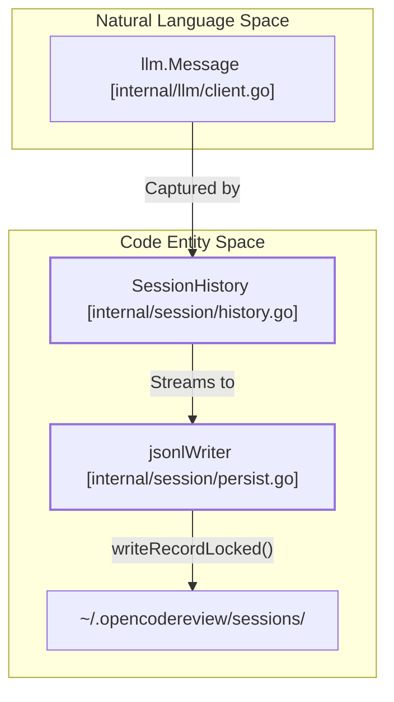
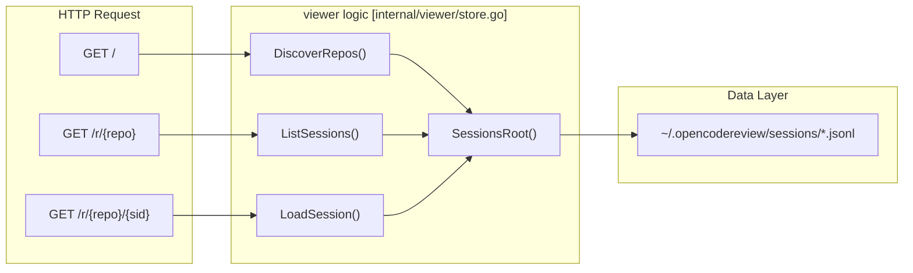

# Session Persistence 및 WebUI Viewer

관련 소스 파일

다음 파일들은 이 위키 페이지를 생성하기 위한 컨텍스트로 사용되었습니다.

- [internal/session/history.go](internal/session/history.go)
- [internal/session/persist.go](internal/session/persist.go)
- [internal/session/persist_test.go](internal/session/persist_test.go)
- [internal/viewer/store.go](internal/viewer/store.go)

OpenCodeReview는 code review session의 전체 lifecycle을 기록, 저장, 시각화하기 위한 포괄적인 시스템을 제공합니다. planning, tool execution, memory management를 포함해 agent와 LLM 사이의 모든 interaction이 캡처되어 나중에 검사할 수 있도록 저장됩니다.

### Persistence 및 Visualization 개요

시스템은 두 가지 primary component로 나뉩니다.
1.  **Persistence Layer**: session events를 `~/.opencodereview/sessions/`의 local JSONL 기반 storage format으로 stream하는 thread-safe mechanism입니다 [internal/session/persist.go:16-18]().
2.  **WebUI Viewer**: 사용자가 historical sessions를 탐색하고, LLM prompts/responses를 검사하며, graphical interface를 통해 tool usage를 분석할 수 있게 하는 내장 web server입니다 [internal/viewer/store.go:1-4]().

### Session Data Architecture

`SessionHistory` struct는 review run의 top-level container 역할을 합니다 [internal/session/history.go:33-48](). 이는 파일별 `FileSession` objects로 데이터를 구성하며 [internal/session/history.go:51-56](), 각 `FileSession`은 `TaskType`(Plan, Main, Memory Compression 또는 Re-Location)별로 분류된 `TaskRecord` entries를 포함합니다 [internal/session/history.go:16-23]().

#### Persistence Flow Diagram

이 다이어그램은 `jsonlWriter`가 "Natural Language Space"(LLM messages)를 "Code Entity Space"(persistence structs와 file system)로 연결하는 방식을 보여줍니다.

**출처:** [internal/session/history.go:33-68](), [internal/session/persist.go:19-32](), [internal/session/persist.go:114-122]()

---

### Session Persistence (JSONL Format)

persistence layer는 review process가 중단되더라도 데이터가 저장되도록 streaming approach를 사용합니다. `jsonlWriter`는 encoded repository path의 이름을 딴 subdirectory에 위치한 `.jsonl` file로 events를 serialize하는 작업을 처리합니다 [internal/session/persist.go:92-101]().

**주요 기능:**
*   **UUID Chaining**: 모든 record는 `generateUUID()`를 통해 unique ID를 부여받으며, 대부분의 records는 causal chain of events를 유지하기 위해 `parentUuid`를 포함합니다 [internal/session/persist.go:52-63](), [internal/session/persist.go:158-165]().
*   **Thread Safety**: `sync.Mutex`가 `jsonlWriter`를 보호하여 여러 concurrent agent subtasks가 JSON fragments를 interleave하지 않고 동시에 events를 log할 수 있게 합니다 [internal/session/persist.go:20](), [internal/session/persist.go:150-152]().
*   **Event Types**: 시스템은 `session_start`, `llm_request`, `llm_response`, `llm_error`, `tool_call`, `session_end`를 기록합니다 [internal/session/persist.go:125-253]().

JSONL schema와 writer implementation에 대한 자세한 내용은 **[Session Persistence (JSONL Format)](#6.1)**을 참조하세요.

**출처:** [internal/session/persist.go:16-32](), [internal/session/persist.go:92-112](), [internal/session/persist.go:158-177]()

---

### WebUI Session Viewer

`ocr viewer` 명령은 저장된 sessions를 탐색하기 위한 dashboard를 제공하는 local HTTP server를 실행합니다. `viewer` package는 JSONL files를 view-optimized structures로 parsing하기 위한 `DiscoverRepos` 및 `LoadSession` 같은 함수를 제공합니다 [internal/viewer/store.go:34-74](), [internal/viewer/store.go:257-258]().

#### Viewer Routing 및 Components

viewer는 Go의 `html/template` engine을 사용해 `SessionsRoot`에서 가져온 데이터를 렌더링합니다 [internal/viewer/store.go:18-24]().

| Route | Function | 설명 |
| :--- | :--- | :--- |
| `/` | `DiscoverRepos` | sessions directory에서 발견된 모든 repositories를 나열합니다 [internal/viewer/store.go:34](). |
| `/r/{repo}` | `ListSessions` | 특정 repository의 모든 sessions를 나열하고 Model 및 Duration 같은 metadata를 보여줍니다 [internal/viewer/store.go:94-119](). |
| `/r/{repo}/{sid}` | `LoadSession` | session의 detailed view로, records를 `FileGroup` 및 `TaskCard` objects로 그룹화합니다 [internal/viewer/store.go:218-245](). |

#### WebUI Navigation Diagram

다음 다이어그램은 viewer logic이 HTTP requests를 disk에 저장된 session data로 매핑하는 방식을 보여줍니다.

**출처:** [internal/viewer/store.go:18-24](), [internal/viewer/store.go:34-41](), [internal/viewer/store.go:94-101](), [internal/viewer/store.go:257-260]()

**Task Visualization:**
viewer는 LLM interactions를 `TaskType`: `PlanTask`, `MainTask`, `MemoryCompressionTask`, `ReLocationTask`에 기반한 ordered sequence로 구성합니다 [internal/viewer/store.go:227-232](). 이를 통해 개발자는 agent가 review를 어떻게 계획했는지, 어떤 tools를 호출했는지, findings를 어떻게 요약했는지 정확히 확인할 수 있습니다.

server implementation과 template rendering에 대한 자세한 내용은 **[WebUI Session Viewer](#6.2)**를 참조하세요.

**출처:** [internal/viewer/store.go:197-201](), [internal/viewer/store.go:218-222](), [internal/viewer/store.go:235-245]()
