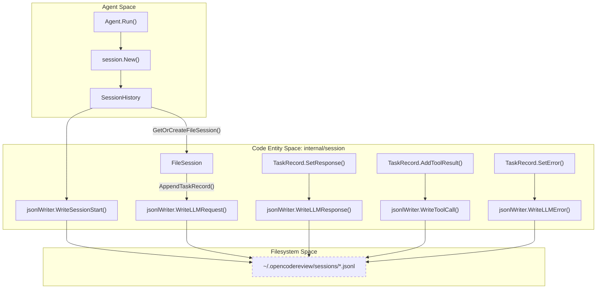
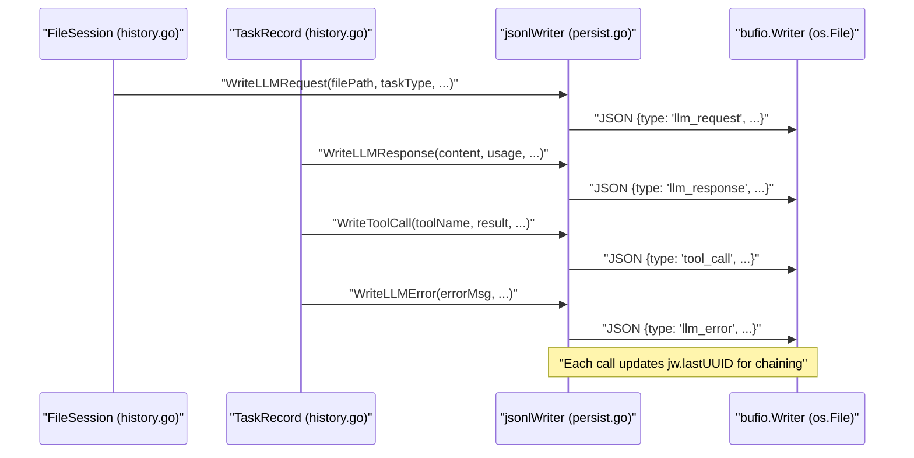

# Session Persistence (JSONL Format)

관련 소스 파일

다음 파일들은 이 위키 페이지를 생성하기 위한 컨텍스트로 사용되었습니다.

- [internal/session/history.go](internal/session/history.go)
- [internal/session/persist.go](internal/session/persist.go)
- [internal/session/persist_test.go](internal/session/persist_test.go)
- [internal/viewer/store.go](internal/viewer/store.go)

OpenCodeReview는 agent와 LLM 사이의 모든 interaction을 캡처하는 견고한 session persistence layer를 구현합니다. 이 데이터는 JSON Lines (JSONL) format으로 local filesystem에 실시간으로 streaming되어, WebUI viewer를 통한 자세한 auditing, debugging, visualization을 가능하게 합니다.

## 개요

persistence system은 `session` package가 관리합니다. initial planning phase부터 개별 file subtasks와 tool executions까지 code review run의 lifecycle을 추적합니다. 모든 event는 새 줄의 개별 JSON object로 기록되므로, process가 예기치 않게 종료되더라도 데이터가 보존됩니다 [internal/session/persist.go:16-18]().

### 주요 Storage 세부 사항
- **Location**: Sessions는 `~/.opencodereview/sessions/<encoded-repo-path>/`에 저장됩니다 [internal/session/persist.go:98-98]().
- **Filename**: 각 session은 `.jsonl` extension을 가진 unique UUID를 filename으로 사용합니다 [internal/session/persist.go:103-103]().
- **Format**: JSON Lines (JSONL)이며, 각 line은 특정 event `type`을 나타내는 유효한 JSON object입니다.
- **Repo Encoding**: Repository paths는 filesystem compatibility를 보장하기 위해 separators와 colons를 hyphens 또는 underscores로 바꾸어 sanitization됩니다 [internal/session/persist.go:65-90]().

## 데이터 모델과 Event Types

`SessionHistory` struct는 review run의 primary orchestrator 역할을 합니다 [internal/session/history.go:33-48](). 여러 `FileSession` objects를 포함하며, 각 `FileSession`은 agent 작업의 서로 다른 phase에 대한 `TaskRecord` entries를 보유합니다 [internal/session/history.go:51-68]().

### JSONL의 Event Types
`jsonlWriter`는 여러 distinct record type을 emits합니다 [internal/session/persist.go:19-32]().

| Event Type | 목적 | 주요 필드 |
| :--- | :--- | :--- |
| `session_start` | CR run의 시작을 표시합니다. | `sessionId`, `cwd`, `gitBranch`, `model`, `reviewMode` |
| `llm_request` | agent가 LLM에 messages를 보낼 때 캡처됩니다. | `filePath`, `taskType`, `request_no`, `messages` |
| `llm_response` | LLM이 content 또는 tool calls를 반환할 때 캡처됩니다. | `content`, `tool_calls`, `usage`, `duration_ms` |
| `llm_error` | LLM request가 실패했을 때 기록됩니다. | `error`, `request_no`, `duration_ms` |
| `tool_call` | tool(예: `file_read`)이 실행된 후 기록됩니다. | `tool_name`, `arguments`, `result`, `ok` |
| `session_end` | run의 final summary입니다. | `files_reviewed`, `duration_seconds`, `llm_failures` |

### Task Classification
Records는 review pipeline의 서로 다른 stage를 구분하기 위해 `TaskType` constants로 분류됩니다 [internal/session/history.go:16-23]().
- `plan_task`: 초기 strategy 및 file selection입니다.
- `main_task`: 실제 code analysis 및 comment generation입니다.
- `memory_compression_task`: token limits에 가까워질 때 context를 요약합니다.
- `re_location_task`: comments의 line numbers를 다시 계산합니다.

**출처:** [internal/session/history.go:15-68](), [internal/session/persist.go:125-253]()

## 구현 세부 사항

### UUID Chaining 및 Thread Safety
여러 파일이 병렬로 review되기 때문에 concurrent goroutines 전반에서 events의 causal order를 유지하기 위해 `jsonlWriter`는 **UUID Chaining**을 사용합니다. 모든 record는 `uuid`와 `parentUuid`를 포함합니다 [internal/session/persist.go:127-129](). `parentUuid`는 파일에 바로 이전에 기록된 record의 `uuid`를 가리킵니다 [internal/session/persist.go:165-165]().

Thread safety는 `SessionHistory`와 `jsonlWriter` structs 모두에서 `sync.Mutex`를 통해 보장되어, 여러 file subtasks가 동시에 events를 log하려 할 때 interleaved writes 또는 race conditions를 방지합니다 [internal/session/persist.go:20-20](), [internal/session/history.go:34-34]().

### Persistence Logic Flow
다음 다이어그램은 `Agent`(논리 흐름 참조)가 data를 persist하기 위해 `SessionHistory` 및 `jsonlWriter`와 상호작용하는 방식을 보여줍니다.

**Session Persistence Data Flow**

**출처:** [internal/session/history.go:103-127](), [internal/session/history.go:131-145](), [internal/session/history.go:169-186](), [internal/session/persist.go:19-32]()

## 상세 Event Sequencing

시스템은 request, response, subsequent tool calls 사이의 관계가 보존되도록 보장합니다.

1.  **Session Start**: `New()`는 `jsonlWriter`를 초기화하고 즉시 `WriteSessionStart`를 호출합니다 [internal/session/history.go:103-126]().
2.  **Request Logging**: `AppendTaskRecord`가 호출되면 messages를 deep-copy하고 `WriteLLMRequest`를 트리거합니다 [internal/session/history.go:169-186]().
3.  **Response Logging**: LLM response를 받으면 `SetResponse`는 token usage(`llm.CountTokens` logic 사용)를 계산하고 `WriteLLMResponse`를 트리거합니다 [internal/session/history.go:224-245]().
4.  **Error Logging**: LLM call이 실패하면 `SetError`는 failure counter를 증가시키고 `WriteLLMError`를 트리거합니다 [internal/session/history.go:257-270]().
5.  **Tool Logging**: LLM이 tool execution을 요청하면 `AddToolResult`는 output을 캡처하고 `WriteToolCall`을 트리거합니다 [internal/session/history.go:273-290]().
6.  **Finalization**: `Finalize()`는 end time, reviewed files 목록, 전체 `llm_failures`를 기록합니다 [internal/session/history.go:149-164]().

### 코드-시스템 매핑
다음 다이어그램은 logical persistence events를 특정 internal functions와 resulting JSON structure에 매핑합니다.

**Event Mapping: Code to JSONL**

**출처:** [internal/session/history.go:181-183](), [internal/session/history.go:242-244](), [internal/session/history.go:267-269](), [internal/session/history.go:287-289](), [internal/session/persist.go:114-122]()

## Token Usage Estimation
OCR은 여러 LLM providers를 지원하므로 `llm_response` records에 estimated token usage를 포함합니다. `TokenUsage` struct는 `prompt_tokens`와 `completion_tokens`를 캡처합니다 [internal/session/history.go:72-77](). 이러한 값은 일반적으로 서로 다른 backends 전반에서 일관된 reporting을 보장하기 위해 `llm` package를 통해 통합된 `tiktoken`으로 계산됩니다 [internal/session/history.go:237-240]().

**출처:** [internal/session/history.go:72-77](), [internal/session/history.go:237-240]()
