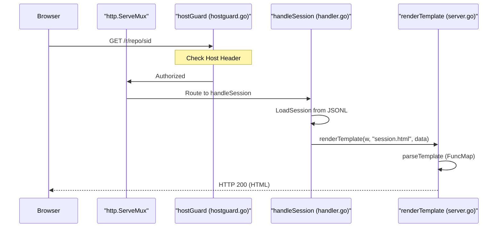
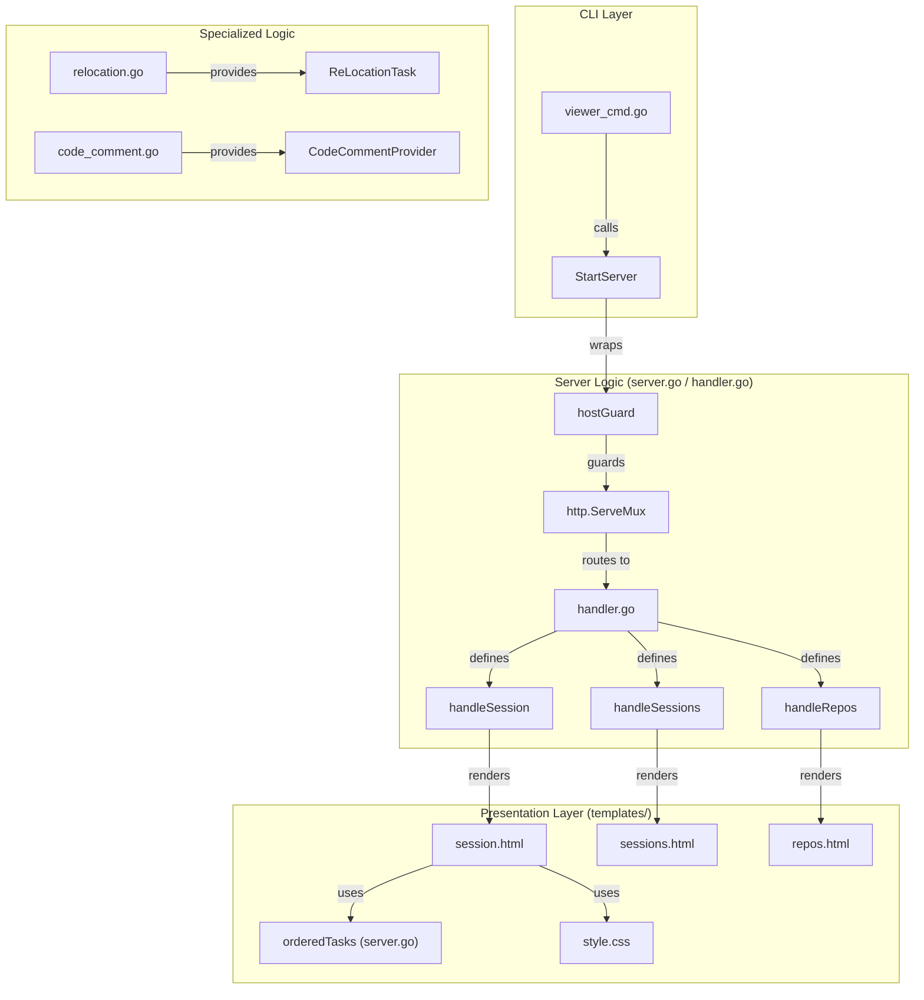

# WebUI Session Viewer

관련 소스 파일

다음 파일들은 이 위키 페이지를 생성하기 위한 컨텍스트로 사용되었습니다.

- [cmd/opencodereview/viewer_cmd.go](cmd/opencodereview/viewer_cmd.go)
- [internal/diff/relocation.go](internal/diff/relocation.go)
- [internal/diff/relocation_test.go](internal/diff/relocation_test.go)
- [internal/tool/code_comment.go](internal/tool/code_comment.go)
- [internal/viewer/handler.go](internal/viewer/handler.go)
- [internal/viewer/hostguard.go](internal/viewer/hostguard.go)
- [internal/viewer/hostguard_test.go](internal/viewer/hostguard_test.go)
- [internal/viewer/server.go](internal/viewer/server.go)
- [internal/viewer/static/style.css](internal/viewer/static/style.css)
- [internal/viewer/templates/repos.html](internal/viewer/templates/repos.html)
- [internal/viewer/templates/session.html](internal/viewer/templates/session.html)
- [internal/viewer/templates/sessions.html](internal/viewer/templates/sessions.html)

WebUI Session Viewer는 historical code review sessions를 탐색하기 위한 read-only graphical interface를 제공합니다. 리뷰 중 생성된 JSONL records를 파싱하고 token usage statistics, tool execution details, organized task timelines를 포함한 structured conversations로 표시합니다.

## Command Entry Point

viewer는 `ocr viewer`(또는 alias `ocr v`) 명령으로 실행됩니다 [cmd/opencodereview/viewer_cmd.go:46-47](). 이 명령은 기본값이 `localhost:5483`인 local HTTP server를 초기화합니다 [cmd/opencodereview/viewer_cmd.go:18]().

### Execution Flow
1. **Flag Parsing**: `parseViewerFlags`는 `--addr` argument를 처리합니다 [cmd/opencodereview/viewer_cmd.go:14-26]().
2. **Server Start**: `runViewer`는 `viewer.StartServer(addr)`를 호출합니다 [cmd/opencodereview/viewer_cmd.go:39]().
3. **Root Resolution**: server는 `SessionsRoot()`를 사용해 session storage location을 식별합니다 [internal/viewer/server.go:16-17]().

**출처:**
- [cmd/opencodereview/viewer_cmd.go:14-55]()
- [internal/viewer/server.go:16-20]()

## HTTP Infrastructure 및 Security

viewer는 routing에 표준 `http.ServeMux`를 사용합니다 [internal/viewer/server.go:22](). JSONL logs에 저장된 민감한 source code가 노출될 수 있는 DNS-rebinding attacks를 방지하기 위해 server는 multiplexer를 `hostGuard` middleware로 감쌉니다 [internal/viewer/server.go:49-54]().

### Host Guard 및 Security
- **`hostGuard`**: `Host` header가 allowlist에 없는 requests를 거부합니다 [internal/viewer/hostguard.go:85-102]().
- **Default Allowlist**: `localhost`, `127.0.0.1`, `::1`을 포함합니다. `--addr`로 특정 IP가 bind되면 자동으로 추가됩니다 [internal/viewer/hostguard.go:58-71]().
- **Environment Override**: 사용자는 `OCR_VIEWER_ALLOWED_HOSTS` environment variable을 통해 allowlist를 확장할 수 있습니다 [internal/viewer/hostguard.go:12, 72-78]().

### Routing Table
| Path | Handler Function | 목적 |
| :--- | :--- | :--- |
| `/` | `handleRepos` | session root의 directories에서 발견된 모든 repositories를 나열합니다 [internal/viewer/server.go:28-30](). |
| `/static/` | `http.FileServer` | embedded CSS와 assets를 제공합니다 [internal/viewer/server.go:25](). |
| `/r/{repo}` | `handleSessions` | 특정 repository의 모든 `.jsonl` session files를 나열합니다 [internal/viewer/server.go:31-38](). |
| `/r/{repo}/{sessionID}` | `handleSession` | 전체 conversation, metadata, tool calls를 표시합니다 [internal/viewer/server.go:39-47](). |

**Title: Session Loading and Rendering Flow**

**출처:**
- [internal/viewer/server.go:22-62]()
- [internal/viewer/hostguard.go:51-102]()
- [internal/viewer/handler.go:9-79]()

## HTML Template Engine

viewer는 `embed.FS`를 통해 embed된 assets와 함께 Go의 `html/template` package를 사용합니다 [internal/viewer/server.go:13-14]().

### Template Functions (`FuncMap`)
Custom functions는 display용 data를 처리합니다 [internal/viewer/server.go:78-131]().
- `formatTime`: `Asia/Shanghai` zone에서 timestamps를 `2006-01-02 15:04` 형식으로 포맷합니다 [internal/viewer/server.go:73-75]().
- `formatDuration`: seconds를 `m s` format으로 변환합니다 [internal/viewer/server.go:167-175]().
- `taskTypeClass`: `TaskType`에 따라 CSS classes(예: `task-plan`, `task-main`, `task-memory`, `task-relocation`)를 할당합니다 [internal/viewer/server.go:90-103]().
- `orderedTasks`: conversations를 Plan → Main → Re-location → Memory Compression의 logical sequence로 정렬합니다 [internal/viewer/server.go:104-130]().
- `cardCount`: 파일의 전체 LLM requests 수를 합산합니다 [internal/viewer/server.go:83-89]().

### UI Components
- **Session Header**: CWD, Branch, Review Mode, Model을 표시합니다 [internal/viewer/templates/session.html:12-29]().
- **Token Summary**: prompt/completion tokens와 per-file breakdown을 보여줍니다 [internal/viewer/templates/session.html:31-72]().
- **File Accordion**: `
` elements를 사용해 file path별로 LLM requests를 그룹화합니다 [internal/viewer/templates/session.html:86-151]().
- **Tool Detail**: tool arguments와 results를 보여주는 중첩 `
`입니다 [internal/viewer/templates/session.html:124-142]().

**출처:**
- [internal/viewer/server.go:77-176]()
- [internal/viewer/templates/session.html:1-154]()
- [internal/viewer/static/style.css:206-250]()

## System Entity Map

다음 다이어그램은 logical WebUI components를 implementation files 및 key data structures에 매핑합니다.

**Title: WebUI Component and Data Mapping**

**출처:**
- [cmd/opencodereview/viewer_cmd.go:28-40]()
- [internal/viewer/server.go:16-54]()
- [internal/viewer/handler.go:9-79]()
- [internal/viewer/hostguard.go:85-102]()
- [internal/viewer/server.go:104-130]()
- [internal/diff/relocation.go:19-27]()
