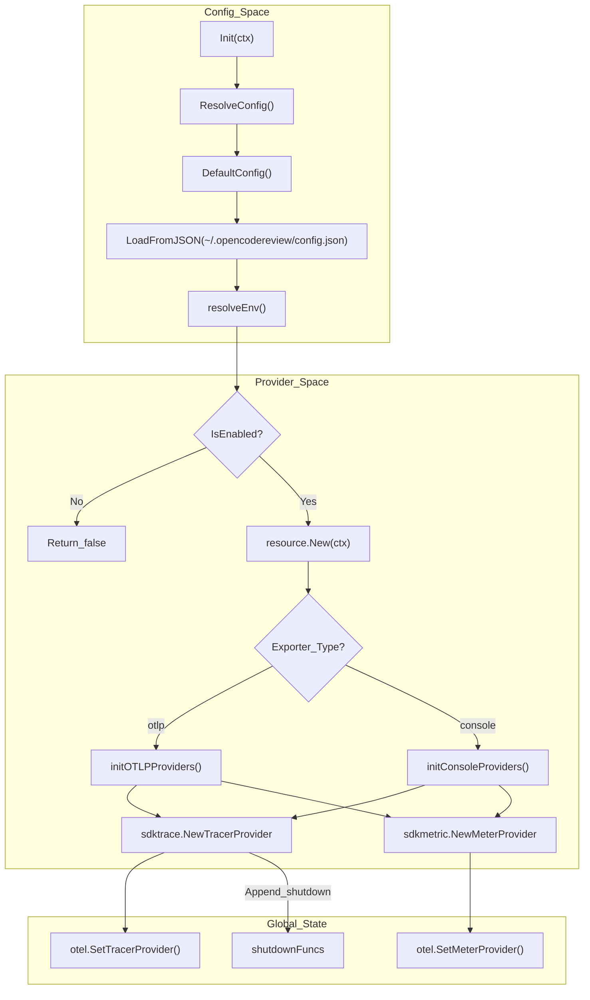
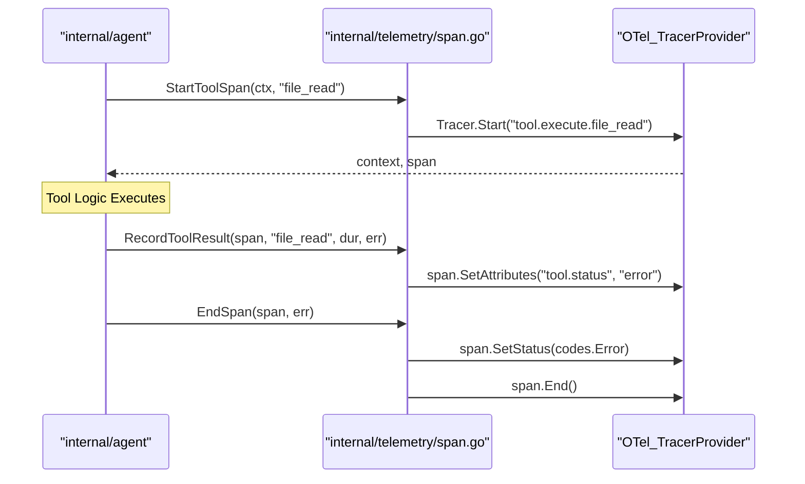

# Telemetry 및 Observability

관련 소스 파일

다음 파일들은 이 위키 페이지를 생성하기 위한 컨텍스트로 사용되었습니다.

- [cmd/opencodereview/config_cmd.go](cmd/opencodereview/config_cmd.go)
- [cmd/opencodereview/llm_cmd.go](cmd/opencodereview/llm_cmd.go)
- [internal/llm/resolver.go](internal/llm/resolver.go)
- [internal/llm/resolver_test.go](internal/llm/resolver_test.go)
- [internal/telemetry/config.go](internal/telemetry/config.go)
- [internal/telemetry/events.go](internal/telemetry/events.go)
- [internal/telemetry/exporter.go](internal/telemetry/exporter.go)
- [internal/telemetry/metrics.go](internal/telemetry/metrics.go)
- [internal/telemetry/provider.go](internal/telemetry/provider.go)
- [internal/telemetry/shutdown.go](internal/telemetry/shutdown.go)
- [internal/telemetry/span.go](internal/telemetry/span.go)

`internal/telemetry` package는 OpenTelemetry (OTel) standard를 기반으로 OpenCodeReview를 위한 통합 observability layer를 제공합니다 [internal/telemetry/config.go:1-3](). LLM-driven review pipeline의 performance와 behavior를 모니터링하기 위해 tracing, metrics collection, structured event logging을 지원합니다.

시스템은 두 가지 primary operation mode를 지원하도록 설계되었습니다.
1.  **Console Mode**: local debugging을 위해 traces와 metrics를 stdout에 pretty-print합니다 [internal/telemetry/config.go:14]().
2.  **OTLP Mode**: system integration을 위해 gRPC를 통해 remote collector(예: Jaeger, Prometheus, Honeycomb)로 데이터를 export합니다 [internal/telemetry/config.go:23-24]().

exporter selection과 provider lifecycle에 대한 자세한 내용은 [OpenTelemetry Setup and Exporters](#7.1)를 참조하세요.

## Initialization Lifecycle

telemetry lifecycle은 global `TracerProvider`와 `MeterProvider`를 설정하기 전에 여러 layer에서 configuration을 resolve하는 global initialization sequence를 통해 관리됩니다.

### Configuration Precedence
Configuration은 priority가 증가하는 다음 순서로 resolve됩니다.
1.  **Defaults**: `DefaultConfig()`에 정의됩니다(예: "console" exporter, "open-code-review" service name) [internal/telemetry/config.go:29-38]().
2.  **JSON Config**: `telemetry` section을 통해 `~/.opencodereview/config.json`에서 로드됩니다 [internal/telemetry/config.go:61-106]().
3.  **Environment Variables**: 가장 높은 priority입니다. `OCR_ENABLE_TELEMETRY=1` 또는 `OTEL_EXPORTER_OTLP_ENDPOINT` 같은 variables가 이전 모든 settings를 override합니다 [internal/telemetry/config.go:42-59]().

### Init Flow Diagram
다음 다이어그램은 `telemetry.Init`이 provider ecosystem을 설정하는 방식을 보여줍니다.

**Telemetry Provider Setup**

**출처:** [internal/telemetry/provider.go:28-62](), [internal/telemetry/config.go:108-122](), [internal/telemetry/exporter.go:28-88]()

## Tracing 및 Spans

시스템은 spans를 사용해 review pipeline의 execution을 추적합니다. telemetry가 비활성화되어 있으면 `StartSpan`은 호출 코드에서 nil pointer exceptions를 피하기 위해 no-op span을 반환합니다 [internal/telemetry/span.go:19-22]().

### 주요 Tracing Functions
*   **`StartSpan(ctx, name)`**: generic span을 생성합니다 [internal/telemetry/span.go:19-24]().
*   **`StartToolSpan(ctx, toolName)`**: `tool.name` attributes를 가진 agent tools용 specialized span입니다 [internal/telemetry/span.go:57-60]().
*   **`EndSpan(span, err)`**: span을 닫고 `err`가 non-nil이면 error status를 자동으로 기록합니다 [internal/telemetry/span.go:27-33]().

### Tool Execution Trace Flow
agent의 tool execution과 telemetry spans 사이의 관계는 아래와 같습니다.

**Tool Execution Telemetry Mapping**

**출처:** [internal/telemetry/span.go:57-75](), [internal/telemetry/span.go:27-33]()

## Metrics Collection

metrics는 데이터가 기록되지 않을 때 overhead를 피하기 위해 `ensureMetrics()`를 통해 first use 시 lazy initialization됩니다 [internal/telemetry/metrics.go:29-33]().

### Core Metrics
| Metric Name | Type | 설명 |
| :--- | :--- | :--- |
| `ocr.review.duration_seconds` | Histogram | review session의 전체 wall-clock time입니다 [internal/telemetry/metrics.go:37-38](). |
| `ocr.files_reviewed_total` | Counter | 처리된 files의 전체 count입니다 [internal/telemetry/metrics.go:41-42](). |
| `ocr.llm.tokens_used` | Counter | `model`과 `type`으로 tag된 consumed tokens입니다 [internal/telemetry/metrics.go:53-54](). |
| `ocr.tool.calls_total` | Counter | `tool.name`으로 tag된 tool executions 수입니다 [internal/telemetry/metrics.go:61-62](). |

특정 metrics와 span attributes 기록에 대한 자세한 내용은 [Spans, Metrics, and Content Logging](#7.2)을 참조하세요.

## Content Logging Toggle

민감한 데이터를 보호하기 위해 OpenCodeReview는 `ContentLog` toggle을 포함합니다 [internal/telemetry/config.go:25]().
*   `OCR_CONTENT_LOGGING=1`이 설정되면 telemetry events에 raw LLM prompts 또는 responses가 포함될 수 있습니다 [internal/telemetry/config.go:56-58]().
*   기본값은 `false`이며 metadata(tokens, duration, file paths)만 export됩니다 [internal/telemetry/config.go:15]().
*   `telemetry.ContentLogging()`을 사용해 이 상태를 확인합니다 [internal/telemetry/provider.go:70-76]().

## Console Output 및 Events

`events.go` 파일은 terminal에 human-readable summaries를 출력하는 동시에 OTel events를 emit하기 위한 helpers를 제공합니다.

*   **`Event(ctx, name, attrs)`**: point-in-time occurrence를 나타내기 위해 즉시 종료되는 structured span을 emit합니다 [internal/telemetry/events.go:20-28]().
*   **`PrintTraceSummary(...)`**: files reviewed, comments generated, token usage를 포함하는 final one-line summary를 `stdout`에 출력합니다 [internal/telemetry/events.go:69-78]().
*   **Tool Lifecycle Printing**: `PrintToolCallStarted`, `PrintToolCallFinished`, `PrintToolCallError`는 CLI에 visual feedback을 제공합니다(예: `▶ file_read`, `✔ file_read (12ms)`) [internal/telemetry/events.go:83-102]().

## Graceful Shutdown

exporters(특히 OTLP)는 batching을 사용하므로 CLI process가 종료되기 전에 buffers를 flush하는 것이 중요합니다.

*   **`Shutdown(ctx)`**: 등록된 모든 `shutdownFuncs`(Tracer 및 Meter providers 모두)를 순회하며 실행합니다 [internal/telemetry/shutdown.go:12-30]().
*   **`ShutdownWithTimeout(ctx, timeout)`**: shutdown 중 process가 무기한 멈추지 않도록 보장하는 helper이며, 일반적으로 main entry point에서 `defer`로 호출됩니다 [internal/telemetry/shutdown.go:33-39]().

**출처:** [internal/telemetry/shutdown.go:1-40](), [internal/telemetry/provider.go:15-18]()
