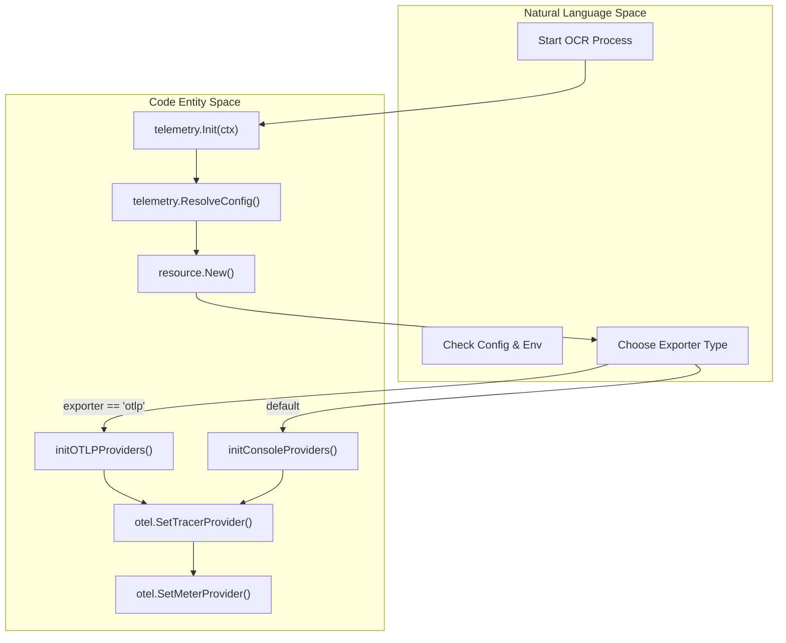
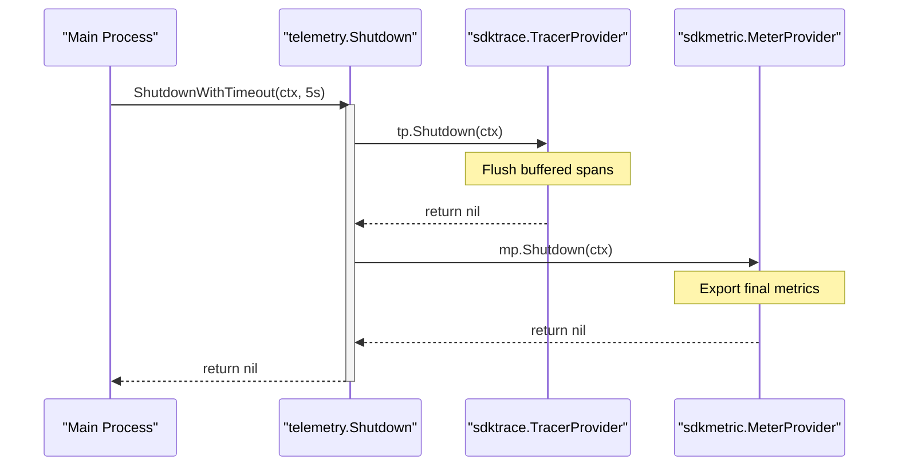

# OpenTelemetry Setup 및 Exporters

관련 소스 파일

다음 파일들은 이 위키 페이지를 생성하기 위한 컨텍스트로 사용되었습니다.

- [internal/telemetry/exporter.go](internal/telemetry/exporter.go)
- [internal/telemetry/provider.go](internal/telemetry/provider.go)
- [internal/telemetry/shutdown.go](internal/telemetry/shutdown.go)

OpenCodeReview (OCR)는 agent execution, LLM interactions, tool performance에 대한 observability를 제공하기 위해 OpenTelemetry (OTel)와 통합됩니다. 이 페이지는 initialization lifecycle, OTLP와 Console exporters 사이의 선택, global telemetry providers 관리를 다룹니다.

## Telemetry Initialization Lifecycle

telemetry system은 `telemetry.Init` 함수를 통해 초기화됩니다 [internal/telemetry/provider.go:28-62](). 첫 호출이 setup을 수행하고 이후 호출은 기존 상태를 반환하는 singleton pattern을 따릅니다 [internal/telemetry/provider.go:29-32]().

초기화 과정은 다음 단계를 따릅니다.
1. **Configuration Resolution**: `ResolveConfig`를 통해 environment variables와 local config file에서 settings를 로드합니다 [internal/telemetry/provider.go:34-38]().
2. **Resource Creation**: host, process, OS에 대한 metadata를 포함하는 OTel `resource.Resource`를 구성합니다 [internal/telemetry/provider.go:40-49]().
3. **Provider Selection**: `cfg.Exporter` 값에 따라 OTLP(gRPC) 또는 Console(Stdout) setup으로 분기합니다 [internal/telemetry/provider.go:51-56]().
4. **Global Registration**: 초기화된 `TracerProvider`와 `MeterProvider`를 `go.opentelemetry.io/otel` package의 global defaults로 설정합니다 [internal/telemetry/provider.go:58-59]().

### Telemetry Initialization Flow

다음 다이어그램은 `Init` call에서 concrete provider implementations로 전환되는 과정을 보여줍니다.

**Initialization Logic Flow**

출처: [internal/telemetry/provider.go:28-62](), [internal/telemetry/exporter.go:28-88]()

## Exporter Implementations

OCR은 production monitoring을 위한 OTLP와 local debugging을 위한 Console이라는 두 가지 primary export mode를 지원합니다.

### OTLP Exporter (gRPC)
`initOTLPProviders` 함수는 traces와 metrics 모두에 대해 gRPC 기반 exporters를 구성합니다 [internal/telemetry/exporter.go:28-59](). 
- **Traces**: batch span processor(`sdktrace.WithBatcher`)와 함께 `otlptracegrpc`를 사용합니다 [internal/telemetry/exporter.go:30-41]().
- **Metrics**: periodic reader(`sdkmetric.NewPeriodicReader`)와 함께 `otlpmetricgrpc`를 사용합니다 [internal/telemetry/exporter.go:45-56]().
- **Endpoint**: `cfg.OTLPEndpoint`를 통해 target이 지정됩니다 [internal/telemetry/exporter.go:31]().

### Console Exporter (Stdout)
`initConsoleProviders` 함수는 local development 또는 OTLP collector를 사용할 수 없을 때 사용됩니다 [internal/telemetry/exporter.go:61-88]().
- **Traces**: human-readable logs를 위해 `WithPrettyPrint()`와 함께 `stdouttrace`를 사용합니다 [internal/telemetry/exporter.go:19-21]().
- **Metrics**: `WithPrettyPrint()`와 함께 `stdoutmetric`을 사용합니다 [internal/telemetry/exporter.go:23-26]().

| Feature | OTLP Exporter | Console Exporter |
| :--- | :--- | :--- |
| **Use Case** | Distributed Tracing (Jaeger/Honeycomb) | Local Debugging |
| **Protocol** | gRPC | Standard Output |
| **Span Processor** | `sdktrace.WithBatcher` | `sdktrace.WithBatcher` |
| **Metric Reader** | `sdkmetric.NewPeriodicReader` | `sdkmetric.NewPeriodicReader` |

출처: [internal/telemetry/exporter.go:18-88]()

## Provider Lifecycle 및 Shutdown

Telemetry providers는 `telemetry` package 내부의 global variables에 저장됩니다 [internal/telemetry/provider.go:15-20](). 데이터 손실을 방지하기 위해 OCR은 provider initialization 중 채워지는 `shutdownFuncs` 목록을 유지합니다 [internal/telemetry/exporter.go:43, 58, 74, 87]().

### Graceful Shutdown Sequence
shutdown sequence는 process가 종료되기 전에 모든 buffered spans와 metrics가 backend로 flush되도록 보장합니다.

1. **`Shutdown(ctx)`**: 등록된 모든 shutdown functions를 순회하며 실행합니다 [internal/telemetry/shutdown.go:12-30]().
2. **`ShutdownWithTimeout(ctx, timeout)`**: telemetry backend가 응답하지 않을 때 process가 멈추지 않도록 deadline(일반적으로 `context.WithTimeout` 사용)을 적용하는 wrapper입니다 [internal/telemetry/shutdown.go:33-39]().

**Telemetry Shutdown Architecture**

출처: [internal/telemetry/shutdown.go:10-39](), [internal/telemetry/provider.go:15-20]()

## Content Logging Toggle
시스템은 security/privacy toggle인 `ContentLogging()`을 포함합니다 [internal/telemetry/provider.go:69-77](). `OCR_CONTENT_LOGGING`을 통해 활성화하면 OCR은 raw LLM prompts와 tool outputs를 telemetry spans에 포함합니다. 이는 민감한 데이터를 attributes에 첨부하기 전에 agent가 확인합니다 [internal/telemetry/provider.go:71-76]().

출처: [internal/telemetry/provider.go:69-77]()
