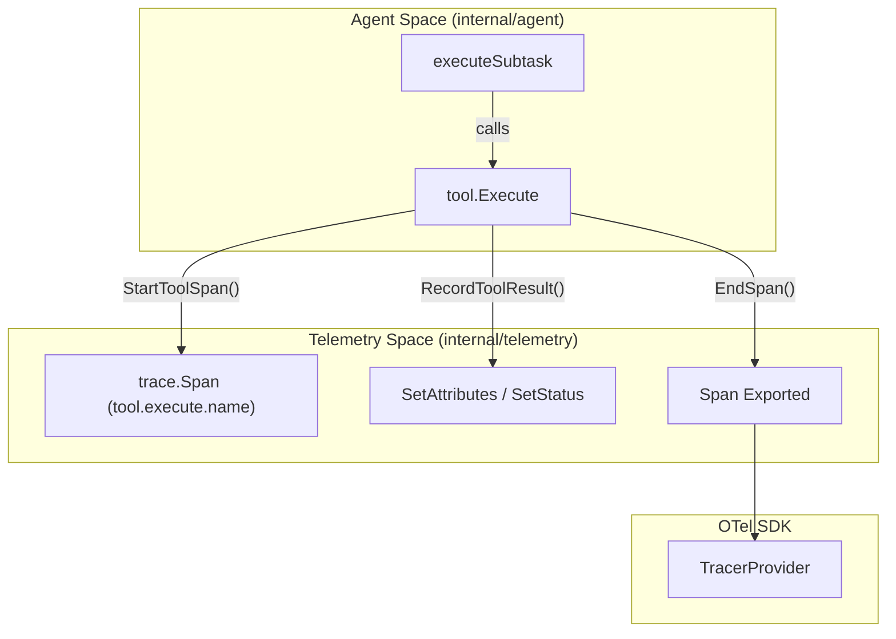

# Spans, Metrics, Content Logging

<details>
<summary>관련 소스 파일</summary>

다음 파일들은 이 위키 페이지를 생성하기 위한 컨텍스트로 사용되었습니다.

- [internal/telemetry/events.go](internal/telemetry/events.go)
- [internal/telemetry/metrics.go](internal/telemetry/metrics.go)
- [internal/telemetry/span.go](internal/telemetry/span.go)

</details>


이 페이지는 OpenCodeReview (OCR) 내부 observability 구현을 자세히 설명합니다. 시스템이 OpenTelemetry (OTel)를 사용해 spans로 execution flow를 추적하고, metrics로 performance 및 usage data를 수집하며, 민감한 LLM interactions의 logging을 관리하는 방식을 다룹니다.

## Tracing 및 Spans

OCR은 OpenTelemetry spans를 사용해 review process의 detailed trace를 제공합니다. Spans는 주요 logical units, 특히 LLM API calls와 Agent tool executions에 초점을 맞춰 생성됩니다.

### Span Lifecycle 및 Management
telemetry package는 span creation과 termination을 처리하는 wrapper functions를 제공하며, telemetry가 비활성화된 경우 시스템이 no-op operations로 graceful fallback하도록 보장합니다.

*   **`StartSpan`**: 새 span을 생성하는 primary entry point입니다. tracer를 호출하기 전에 `IsEnabled()`를 확인합니다 [internal/telemetry/span.go:19-24]().
*   **`EndSpan`**: span을 finalizes하고, error가 제공되면 error status와 details를 자동으로 기록합니다 [internal/telemetry/span.go:27-33]().
*   **`SetAttr`**: active span에 attributes(string, int, bool, float64)를 첨부하는 type-safe helper입니다 [internal/telemetry/span.go:36-54]().

### Tool Execution Spans
Agent가 수행하는 모든 tool call은 특정 "tool" span으로 감싸집니다. 이를 통해 `file_read` 또는 `code_search` 같은 개별 도구의 granular performance analysis가 가능합니다.

*   **`StartToolSpan`**: span name 앞에 `tool.execute.`를 자동으로 붙이고 `tool.name` attribute를 첨부합니다 [internal/telemetry/span.go:57-60]().
*   **`RecordToolResult`**: tool의 duration, status("ok" 또는 "error"), error messages를 캡처합니다 [internal/telemetry/span.go:63-75]().

### Trace Events
duration을 나타내지 않는 point-in-time occurrences에는 OCR이 Trace Events를 사용합니다.
*   **`Event` / `Eventf`**: 즉시 종료되는 span으로 structured event를 emit합니다 [internal/telemetry/events.go:20-33]().
*   **`PhaseEvent`**: review phases(예: Plan, Main Task Loop)의 완료를 file path 및 duration과 함께 기록하는 데 특화되어 있습니다 [internal/telemetry/events.go:50-61]().

### 데이터 흐름: Agent에서 Telemetry까지
다음 다이어그램은 `Agent`와 그 tool system이 spans를 생성하기 위해 `telemetry` package와 어떻게 상호작용하는지 보여줍니다.

**Diagram: Agent Tool Execution Trace Flow**

출처: [internal/telemetry/span.go:57-75](), [internal/telemetry/events.go:50-61]()

---

## Metrics Collection

OCR은 OpenTelemetry Metrics API를 사용해 quantitative data를 수집합니다. Metrics는 첫 recording attempt 시 `ensureMetrics()`를 통해 lazy initialization됩니다 [internal/telemetry/metrics.go:29-68]().

### 주요 Metrics
다음 표는 review session 중 추적되는 primary metrics를 요약합니다.

| Metric Name | Type | Unit | 설명 |
| :--- | :--- | :--- | :--- |
| `ocr.review.duration_seconds` | Histogram | `s` | complete review run의 전체 시간입니다 [internal/telemetry/metrics.go:37-38](). |
| `ocr.files_reviewed_total` | Counter | `1` | 처리된 files의 전체 수입니다 [internal/telemetry/metrics.go:41-42](). |
| `ocr.comments_generated_total` | Counter | `1` | 생성된 전체 review comments 수입니다 [internal/telemetry/metrics.go:45-46](). |
| `ocr.llm.requests_total` | Counter | `1` | LLM API calls 수입니다(`model`, `status`로 labeled) [internal/telemetry/metrics.go:49-50](). |
| `ocr.llm.tokens_used` | Counter | `1` | Token consumption입니다(`type`, `model`로 labeled) [internal/telemetry/metrics.go:53-54](). |
| `ocr.llm.request_duration_seconds`| Histogram | `s` | LLM requests의 latency입니다 [internal/telemetry/metrics.go:57-58](). |
| `ocr.tool.calls_total` | Counter | `1` | tool executions 수입니다(`tool.name`, `status`로 labeled) [internal/telemetry/metrics.go:61-62](). |

### Recording Logic
*   **`RecordLLMRequest`**: model name, duration, total tokens, status를 캡처합니다. request counter와 duration histogram 모두를 위한 attributes를 생성합니다 [internal/telemetry/metrics.go:102-120]().
*   **`RecordToolCall`**: tool usage와 performance를 추적하며, "ok"와 "error" status를 구분합니다 [internal/telemetry/metrics.go:122-140]().

출처: [internal/telemetry/metrics.go:12-68](), [internal/telemetry/metrics.go:102-140]()

---

## Content Logging 및 Privacy

LLM telemetry의 중요한 측면은 raw prompt 및 response content의 처리입니다. OCR은 이 민감한 데이터가 telemetry spans와 events에 캡처되는지 제어하기 위해 `content_logging` toggle을 구현합니다.

### content_logging Toggle
`content_logging`이 비활성화되어 있으면(기본값), OCR은 전체 LLM prompt 또는 generated response 같은 raw strings를 OpenTelemetry attributes에 첨부하지 않습니다. 이를 통해 민감한 code 또는 proprietary prompts가 외부 OTLP collectors로 export되는 것을 방지합니다.

### Console Observability
OpenTelemetry가 structured data를 처리하는 동안, OCR은 실행 중 `stdout`과 `stderr`에 human-readable feedback도 제공합니다.

*   **`PrintToolCallStarted`**: console용 tool arguments를 요약합니다. `summarizeArgs`를 사용해 file paths 또는 search patterns 같은 concise info를 추출하면서 large data chunks는 생략합니다 [internal/telemetry/events.go:83-90]().
*   **`summarizeArgs`**: 표시할 `path`, `search`, `query` 같은 keys를 구체적으로 찾고, 다른 값은 50 characters로 truncate합니다 [internal/telemetry/events.go:106-125]().
*   **`PrintTraceSummary`**: files reviewed, comments generated, token usage를 포함한 final summary를 `stdout`에 출력합니다 [internal/telemetry/events.go:69-78]().

### Telemetry Implementation Map
다음 다이어그램은 logical telemetry concepts를 이를 구현하는 특정 code entities에 매핑합니다.

**Diagram: Telemetry Code Entity Mapping**
```mermaid
classDiagram
    class "Tracer" {
        <<internal/telemetry/span.go>>
        +StartSpan(ctx, name)
        +StartToolSpan(ctx, toolName)
        +EndSpan(span, err)
    }
    class "Meter" {
        <<internal/telemetry/metrics.go>>
        +RecordLLMRequest(ctx, model, dur, tokens, status)
        +RecordToolCall(ctx, name, dur, ok)
        +RecordReviewDuration(ctx, dur)
    }
    class "Events" {
        <<internal/telemetry/events.go>>
        +PhaseEvent(ctx, phase, path, dur, err)
        +PrintToolCallStarted(name, args)
        +PrintTraceSummary(files, comments, tokens, dur)
    }

    Tracer --|> "otel.Tracer" : wraps
    Meter --|> "otel.Meter" : wraps
    Events ..> Tracer : uses for PhaseEvent
```
출처: [internal/telemetry/span.go:1-60](), [internal/telemetry/metrics.go:1-140](), [internal/telemetry/events.go:1-125]()
