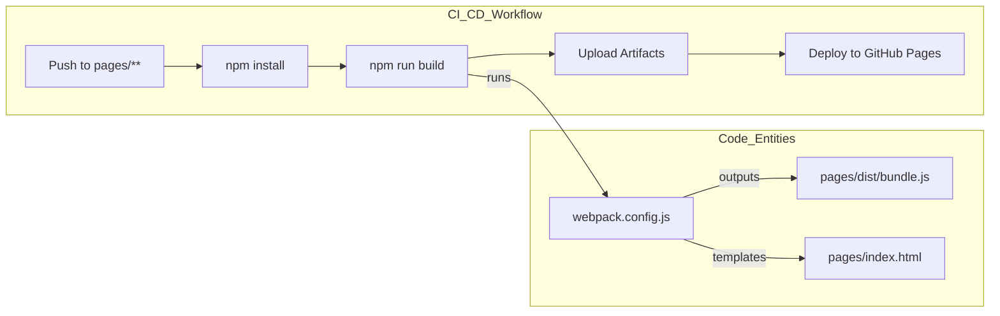

# Project Website (pages/)

<details>
<summary>관련 소스 파일</summary>

다음 파일들은 이 위키 페이지를 생성하기 위한 컨텍스트로 사용되었습니다.

- [.github/workflows/deploy-pages.yml](.github/workflows/deploy-pages.yml)
- [pages/index.html](pages/index.html)
- [pages/src/App.tsx](pages/src/App.tsx)
- [pages/src/components/BenchmarkSection.tsx](pages/src/components/BenchmarkSection.tsx)
- [pages/src/components/HighlightsSection.tsx](pages/src/components/HighlightsSection.tsx)
- [pages/src/components/LandingPage.tsx](pages/src/components/LandingPage.tsx)
- [pages/src/components/Navbar.tsx](pages/src/components/Navbar.tsx)
- [pages/src/index.tsx](pages/src/index.tsx)
- [pages/src/styles/index.css](pages/src/styles/index.css)
- [pages/webpack.config.js](pages/webpack.config.js)

</details>


`pages/` 디렉터리는 OpenCodeReview marketing 및 documentation website의 source code를 포함합니다. 이는 **React**와 **TypeScript**로 구축되고, **Tailwind CSS**로 스타일링되며, **Webpack**으로 번들링되는 single-page application (SPA)입니다. 이 사이트는 프로젝트의 public face 역할을 하며 landing page, benchmark results, quick-start guide를 제공합니다.

## System Architecture

website는 Go 기반 CLI 및 review engine과 분리되어 있습니다. GitHub Pages 같은 platform에서 hosting하기 적합한 static build를 생성하기 위해 modern frontend toolchain을 사용합니다.

### Frontend Stack 및 Build Toolchain

프로젝트는 development 및 production builds를 위해 표준 React ecosystem을 활용합니다.

*   **Framework**: Functional Component model을 사용하는 React 18입니다 [pages/src/index.tsx:9-19]().
*   **Routing**: server-side routing을 사용할 수 없는 static hosting environments를 지원하기 위해 `HashRouter`와 함께 `react-router-dom`을 사용합니다 [pages/src/index.tsx:3,14]().
*   **Styling**: utility-first styling을 위한 Tailwind CSS이며, `postcss-loader`를 통해 통합됩니다 [pages/src/styles/index.css:1-3](), [pages/webpack.config.js:30]().
*   **Bundling**: TypeScript 및 JSX transpilation을 위해 `babel-loader`와 함께 Webpack 5를 사용합니다 [pages/webpack.config.js:6-37]().
*   **Development**: 전용 dev server는 SPA routing을 위한 history API fallback과 함께 port `3030`에서 실행됩니다 [pages/webpack.config.js:41-48]().

### Website Component Hierarchy

application entry point는 `index.tsx`이며, internationalization을 위한 `LanguageProvider`와 navigation을 위한 `HashRouter`로 `App` component를 감쌉니다.

**Website Component Structure**

```mermaid
graph TD
    subgraph "Entry_Point"
        "index.tsx" --> "LanguageProvider"
        "LanguageProvider" --> "HashRouter"
        "HashRouter" --> "App.tsx"
    end

    subgraph "Routing_Layer"
        "App.tsx" --> "Routes"
        "Routes" -- "/" --> "LandingPage"
        "Routes" -- "/docs" --> "DocsPage"
    end

    subgraph "LandingPage_Structure"
        "LandingPage" --> "Navbar"
        "LandingPage" --> "HeroSection"
        "LandingPage" --> "HighlightsSection"
        "LandingPage" --> "WhySection"
        "LandingPage" --> "FeaturesSection"
        "LandingPage" --> "BenchmarkSection"
        "LandingPage" --> "QuickStartSection"
    end
```

**출처:** [pages/src/index.tsx:1-20](), [pages/src/App.tsx:1-16](), [pages/src/components/LandingPage.tsx:25-35]().

## Configuration 및 Styling

프로젝트의 visual identity는 Tailwind utilities와 custom CSS의 조합으로 정의됩니다. noise overlays, glassmorphism, glowing borders를 사용하는 "terminal" 또는 "agentic" aesthetic이 포함됩니다 [pages/src/styles/index.css:21-113]().

Webpack configuration은 GitHub Pages subpaths와의 compatibility를 보장하기 위해 production builds에서 `publicPath`를 `/open-code-review/`로 설정하는 등 environment-specific logic을 처리합니다 [pages/webpack.config.js:10]().

**Deployment Pipeline**
사이트는 `pages/` 디렉터리 내 변경 사항이 `main` branch에 push될 때마다 GitHub Actions를 통해 자동으로 build 및 deploy됩니다 [`.github/workflows/deploy-pages.yml:3-7`]().



**출처:** [`.github/workflows/deploy-pages.yml:19-57`](), [pages/webpack.config.js:7-11]().

## Subsystems

### Landing Page Components
primary interface는 여러 specialized sections를 집계하는 `LandingPage`입니다. 특히 `BenchmarkSection`은 OpenCodeReview의 performance(Claude-4.6-Opus 및 Qwen-3.6-Plus 같은 models 사용)를 다른 tools와 비교하는 leaderboard를 표시합니다 [pages/src/components/BenchmarkSection.tsx:20-141]().

자세한 내용은 [Landing Page Components](#8.1)를 참조하세요.

### Internationalization (i18n)
website는 custom i18n system을 통해 여러 languages(English 및 Chinese)를 지원합니다. 이 system은 React Context(`LanguageProvider`)를 사용해 `Navbar`와 `HighlightsSection` 같은 components에 `t` translation function과 current language state를 제공합니다 [pages/src/components/Navbar.tsx:12](), [pages/src/components/HighlightsSection.tsx:5]().

자세한 내용은 [Internationalization (i18n)](#8.2)을 참조하세요.

## Key Code Entities

| Entity | Path | 역할 |
| :--- | :--- | :--- |
| `LanguageProvider` | `pages/src/i18n/index.tsx` | multi-language support를 위한 Context provider입니다 [pages/src/index.tsx:13](). |
| `HashRouter` | `pages/src/index.tsx` | static hosting을 위한 client-side routing을 처리합니다 [pages/src/index.tsx:14](). |
| `webpack.config.js` | `pages/webpack.config.js` | build pipeline과 dev server settings를 정의합니다 [pages/webpack.config.js:4-55](). |
| `LandingPage` | `pages/src/components/LandingPage.tsx` | main marketing site의 root component입니다 [pages/src/components/LandingPage.tsx:11-36](). |
| `BenchmarkSection` | `pages/src/components/BenchmarkSection.tsx` | model performance leaderboard를 렌더링합니다 [pages/src/components/BenchmarkSection.tsx:149-220](). |
| `App` | `pages/src/App.tsx` | available pages를 정의하는 main routing component입니다 [pages/src/App.tsx:6-13](). |

**출처:** [pages/src/index.tsx:13-17](), [pages/webpack.config.js:4-11](), [pages/src/App.tsx:6-13](), [pages/src/components/LandingPage.tsx:25-35]().
