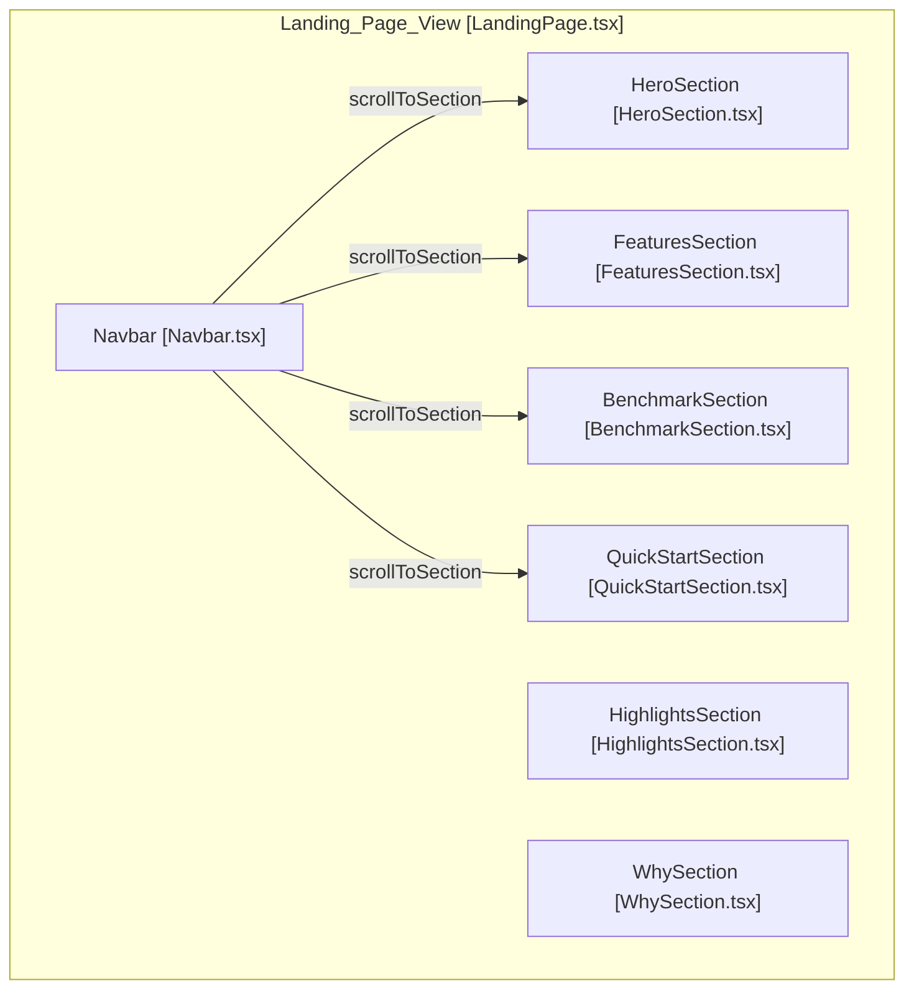
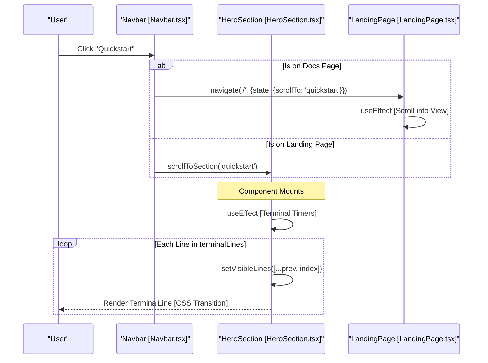

# Landing Page Components

관련 소스 파일

다음 파일들은 이 위키 페이지를 생성하기 위한 컨텍스트로 사용되었습니다.

- [.github/workflows/deploy-pages.yml](.github/workflows/deploy-pages.yml)
- [pages/index.html](pages/index.html)
- [pages/src/components/BenchmarkSection.tsx](pages/src/components/BenchmarkSection.tsx)
- [pages/src/components/FeaturesSection.tsx](pages/src/components/FeaturesSection.tsx)
- [pages/src/components/HeroSection.tsx](pages/src/components/HeroSection.tsx)
- [pages/src/components/HighlightsSection.tsx](pages/src/components/HighlightsSection.tsx)
- [pages/src/components/LandingPage.tsx](pages/src/components/LandingPage.tsx)
- [pages/src/components/Navbar.tsx](pages/src/components/Navbar.tsx)
- [pages/src/components/QuickStartSection.tsx](pages/src/components/QuickStartSection.tsx)
- [pages/src/components/WhySection.tsx](pages/src/components/WhySection.tsx)
- [pages/src/pages/DocsPage.tsx](pages/src/pages/DocsPage.tsx)
- [pages/src/styles/index.css](pages/src/styles/index.css)
- [pages/webpack.config.js](pages/webpack.config.js)

OpenCodeReview의 landing page는 고품질 marketing 및 onboarding experience를 제공하도록 설계된 React 기반 single-page application (SPA)입니다. modular component architecture, styling을 위한 Tailwind CSS, multi-language support를 위한 i18n system을 활용합니다.

## Component Architecture

landing page는 여러 specialized functional sections의 layout container 역할을 하는 `LandingPage` component가 조율합니다.

### Data Flow 및 Navigation
`LandingPage` component는 top-level navigation state를 관리합니다. `react-router-dom`의 `useLocation`을 활용해 smooth scrolling을 통해 특정 sections(예: `#features`, `#benchmark`)로 deep-linking을 처리합니다 [pages/src/components/LandingPage.tsx:11-22]().

**Component Hierarchy Diagram**
이 다이어그램은 landing page의 logical sections를 각각의 React component implementations에 매핑합니다.

출처: [pages/src/components/LandingPage.tsx:1-34](), [pages/src/components/Navbar.tsx:14-18](), [pages/src/components/Navbar.tsx:31-37]()

---

## Component Details

### Navbar
`Navbar`는 language switching과 GitHub external links 같은 primary navigation 및 global controls를 제공합니다.

*   **Scroll Logic**: window scroll position을 추적해 background transparency와 blur effects를 toggle합니다 [pages/src/components/Navbar.tsx:25-29]().
*   **I18n Integration**: `useTranslation` hook을 통해 English(`en`)와 Chinese(`zh`) 사이를 toggle하도록 `setLanguage`를 트리거합니다 [pages/src/components/Navbar.tsx:12](), [pages/src/components/Navbar.tsx:39-41]().
*   **Routing**: landing page에서는 internal section scrolling을 사용하고, `/docs` page에 있을 때는 도착 후 scrolling을 트리거하기 위해 state와 함께 `navigate`를 사용하는 방식으로 구분합니다 [pages/src/components/Navbar.tsx:20-23]().

출처: [pages/src/components/Navbar.tsx:6-148]()

### HeroSection
`HeroSection`은 initial entry point 역할을 하며, CLI 동작을 보여주기 위한 simulated terminal animation을 제공합니다.

*   **Terminal Animation**: `terminalLines` array를 사용해 `file_read`, `code_search` 같은 tool calls를 포함한 `ocr review` command의 real-time output을 시뮬레이션합니다 [pages/src/components/HeroSection.tsx:4-17]().
*   **Sequential Rendering**: `useEffect` hook은 line indices를 `visibleLines` state에 push하도록 timeouts를 관리하며, 각 `TerminalLine`에 staggered CSS transitions를 트리거합니다 [pages/src/components/HeroSection.tsx:46-55]().
*   **Visual Style**: developer environment를 모방하기 위해 scan-line animations와 terminal cursor effect가 포함된 "glass-strong" effect를 구현합니다 [pages/src/components/HeroSection.tsx:134-143](), [pages/src/styles/index.css:116-120]().

출처: [pages/src/components/HeroSection.tsx:4-154](), [pages/src/styles/index.css:116-125]()

### HighlightsSection
이 component는 주요 performance metrics와 project status를 한눈에 제공합니다.

*   **Intersection Observer**: section이 viewport에 표시될 때만 entry animations를 트리거하기 위해 `IntersectionObserver`를 사용합니다 [pages/src/components/HighlightsSection.tsx:9-21]().
*   **Metrics**: benchmark F1 score(26.1%)와 다른 tools 대비 performance ratio 같은 stats를 표시합니다 [pages/src/components/HighlightsSection.tsx:23-48]().

출처: [pages/src/components/HighlightsSection.tsx:4-88]()

### BenchmarkSection
이 component는 다양한 LLM backends를 사용해 OpenCodeReview의 performance를 다른 tools와 비교하는 competitive leaderboard를 표시합니다.

*   **Data Structure**: `LeaderboardEntry` interface를 사용해 `f1`, `precision`, `recall` 같은 metrics를 정의합니다 [pages/src/components/BenchmarkSection.tsx:4-18]().
*   **Static Data**: `leaderboardData` constant는 `Claude-4.6-Opus`, `Qwen-3.6-Plus`, `GLM-4.7`을 포함한 models의 results를 포함합니다 [pages/src/components/BenchmarkSection.tsx:20-141]().
*   **Interaction**: readability를 높이기 위해 `setHoveredRow`를 사용해 hover 시 rows를 highlight합니다 [pages/src/components/BenchmarkSection.tsx:150](), [pages/src/components/BenchmarkSection.tsx:196-203]().

출처: [pages/src/components/BenchmarkSection.tsx:4-220]()

### QuickStartSection
`QuickStartSection`은 사용자가 tool을 install하고 configure하도록 돕는 3단계 onboarding guide를 제공합니다.

*   **Step Logic**: steps는 installation(`npm i -g`), configuration(`ocr config set`), execution(`ocr review`)을 포함하는 array에 정의됩니다 [pages/src/components/QuickStartSection.tsx:34-70]().
*   **Clipboard Utility**: modern `navigator.clipboard`와 fallback `textarea` selection method를 모두 지원하는 `handleCopy` function을 포함합니다 [pages/src/components/QuickStartSection.tsx:72-90]().
*   **Zero-Config Callout**: persistent config file 대신 environment variables(예: `ANTHROPIC_AUTH_TOKEN`)를 사용할 수 있음을 강조합니다 [pages/src/components/QuickStartSection.tsx:150-166]().

출처: [pages/src/components/QuickStartSection.tsx:30-173]()

---

## Visual & Interaction Model

landing page components는 brand-specific accents가 포함된 "Dark Mode" aesthetic 기반의 통합 design language를 공유합니다.

**Component Interaction & Rendering Flow**
이 다이어그램은 `HeroSection`이 simulated terminal state를 관리하는 방식과 `Navbar`가 global viewport와 상호작용하는 방식을 보여줍니다.

출처: [pages/src/components/HeroSection.tsx:46-55](), [pages/src/components/LandingPage.tsx:13-22](), [pages/src/components/Navbar.tsx:19-22](), [pages/src/components/Navbar.tsx:31-37]()

### Shared UI Elements
*   **Noise Overlay**: SVG 기반 fractal noise texture를 사용해 section backgrounds에 global `noise-overlay` CSS class가 적용됩니다 [pages/src/styles/index.css:21-31]().
*   **Ambient Glow**: 대부분의 sections는 "glow orbs"를 만들기 위해 높은 blur 값(예: `blur-[120px]`)이 있는 absolute-positioned divs를 사용합니다 [pages/src/components/HeroSection.tsx:66-68](), [pages/src/components/FeaturesSection.tsx:55-56](), [pages/src/components/BenchmarkSection.tsx:156]().
*   **Glassmorphism**: `feature-card`, `stat-card`, `code-block` 같은 components는 backdrop-filter effects를 위해 `glass` 또는 `glass-strong` classes를 사용합니다 [pages/src/styles/index.css:101-113](), [pages/src/components/QuickStartSection.tsx:112]().

출처: [pages/src/styles/index.css:21-113](), [pages/src/components/LandingPage.tsx:25-32](), [pages/src/components/FeaturesSection.tsx:53-58](), [pages/src/components/QuickStartSection.tsx:112-116]()
