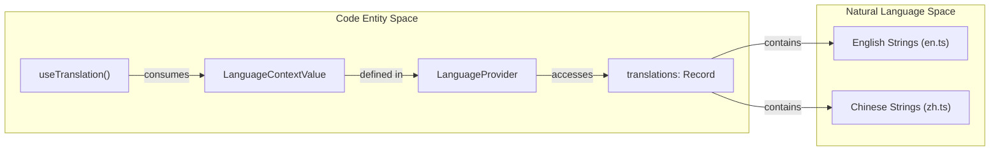

# Internationalization (i18n)

<details>
<summary>관련 소스 파일</summary>

다음 파일들은 이 위키 페이지를 생성하기 위한 컨텍스트로 사용되었습니다.

- [pages/src/i18n/context.tsx](pages/src/i18n/context.tsx)
- [pages/src/i18n/en.ts](pages/src/i18n/en.ts)
- [pages/src/i18n/index.ts](pages/src/i18n/index.ts)
- [pages/src/i18n/types.ts](pages/src/i18n/types.ts)
- [pages/src/i18n/zh.ts](pages/src/i18n/zh.ts)

</details>


OpenCodeReview project website(`pages/`에 위치)의 internationalization (i18n) system은 multi-language support를 위한 견고한 framework를 제공하며, 특히 English(`en`)와 Chinese(`zh`)를 대상으로 합니다. state management에는 React Context를, type safety에는 TypeScript를, preference persistence에는 local storage를 활용합니다.

## Architecture Overview

i18n system은 `pages/src/i18n/` 디렉터리에 centralized되어 있습니다. application을 `LanguageProvider`로 감싸고, translation functions와 state를 모든 child components에 노출하는 provider pattern을 따릅니다.

### Core Components 및 Data Flow

시스템은 세 가지 primary layer로 구성됩니다.
1.  **Type Definitions**: supported languages와 translation maps의 structure를 정의합니다.
2.  **Resource Files**: 각 language에 대한 실제 string mappings를 포함하는 static TypeScript objects입니다.
3.  **Context Provider**: current language state를 관리하고 `t()` translation function을 제공하는 React Context implementation입니다.

### System Data Flow Diagram

다음 다이어그램은 translations가 raw resource files에서 UI components로 흐르는 방식을 보여줍니다.

**I18n Translation Flow**
```mermaid
graph TD
    subgraph "Resource Space"
        EN["en.ts (TranslationKeys)"]
        ZH["zh.ts (TranslationKeys)"]
    end

    subgraph "Logic Space (context.tsx)"
        LC["LanguageContext"]
        LP["LanguageProvider"]
        GLI["getInitialLanguage()"]
        T_FUNC["t(key: string)"]
    end

    subgraph "Storage Space"
        LS[("localStorage ('ocr-lang')")]
    end

    subgraph "UI Space"
        COMP["React Components"]
        NAV["Navbar (Language Switcher)"]
    end

    LS -.->|Read| GLI
    GLI -->|Initial State| LP
    EN -->|Import| LP
    ZH -->|Import| LP
    LP -->|Provides| LC
    LC -->|Exposes t()| COMP
    NAV -->|setLanguage()| LP
    LP -->|Write| LS
```
출처: [pages/src/i18n/context.tsx:1-43](), [pages/src/i18n/types.ts:1-4](), [pages/src/i18n/en.ts:1-3]()

## 구현 세부 사항

### Type System
시스템은 서로 다른 language files 간 consistency를 보장하기 위해 엄격한 TypeScript types를 사용합니다.
*   `Language`: `'en' | 'zh'`로 제한되는 union type입니다 [pages/src/i18n/types.ts:1-1]().
*   `TranslationKeys`: key-value pairs의 map 역할을 하는 `Record<string, string>`입니다 [pages/src/i18n/types.ts:3-3]().

### Language Persistence
`getInitialLanguage` 함수는 `ocr-lang` key를 사용해 `localStorage`에서 사용자의 preferred language를 가져오려고 시도합니다. 값이 없거나 유효하지 않으면 기본값은 `'en'`입니다 [pages/src/i18n/context.tsx:16-24]().

### `t` Function
translation function `t(key: string)`은 components의 primary interface입니다. active `language`를 기준으로 `translations` record에서 lookup을 수행합니다. 현재 language map에 key가 없으면 key string 자체를 반환하는 방식으로 graceful fallback합니다 [pages/src/i18n/context.tsx:34-36]().

## Resource Structure

Translations는 component 또는 section별로 구성됩니다(예: `navbar`, `hero`, `features`). dot notation을 사용하는 이 flat-key structure는 naming collisions를 방지합니다.

| Key Prefix | 설명 | Example Key |
| :--- | :--- | :--- |
| `navbar.*` | Navigation links와 buttons | `navbar.features` |
| `hero.*` | Landing page hero section | `hero.title` |
| `features.*` | Core product feature descriptions | `features.feat1Title` |
| `quickstart.*` | Installation 및 setup instructions | `quickstart.step1Title` |
| `docs.*` | Documentation page content | `docs.overviewTitle` |

출처: [pages/src/i18n/en.ts:4-167](), [pages/src/i18n/zh.ts:4-167]()

## Component Consumption

Components는 `useTranslation` hook을 통해 translations를 사용합니다. 이 hook은 `t` function, current `language`, `setLanguage` updater에 대한 access를 제공합니다 [pages/src/i18n/context.tsx:45-49]().

### 코드-로직 매핑

다음 다이어그램은 code entities와 logical translation process 사이의 관계를 보여줍니다.

**Entity Mapping: Component to Translation**

출처: [pages/src/i18n/context.tsx:6-14](), [pages/src/i18n/context.tsx:45-49](), [pages/src/i18n/index.ts:1-2]()

### Usage Example
component가 localized string을 render해야 할 때는 다음 pattern을 따릅니다.
1. `useTranslation()`을 호출해 `t` function을 가져옵니다 [pages/src/i18n/context.tsx:45-49]().
2. 특정 key(예: `'hero.title'`)를 `t()`에 전달합니다 [pages/src/i18n/context.tsx:34-36]().
3. `LanguageProvider`는 다른 곳(예: Navbar toggle)에서 `setLanguage`가 호출되면 component가 새 string으로 re-render되도록 보장합니다 [pages/src/i18n/context.tsx:26-43]().

출처: [pages/src/i18n/context.tsx:26-43](), [pages/src/i18n/context.tsx:45-49]()
