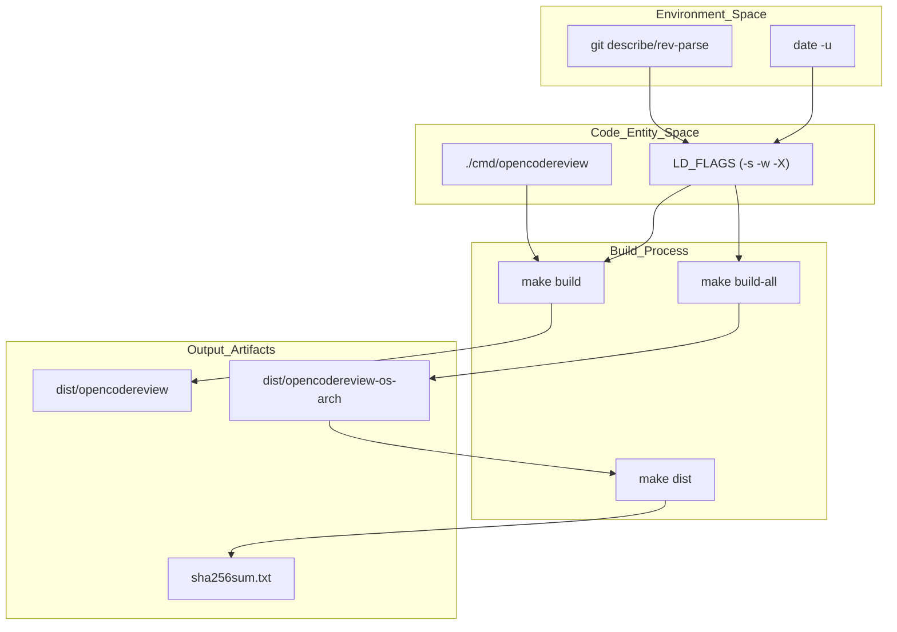
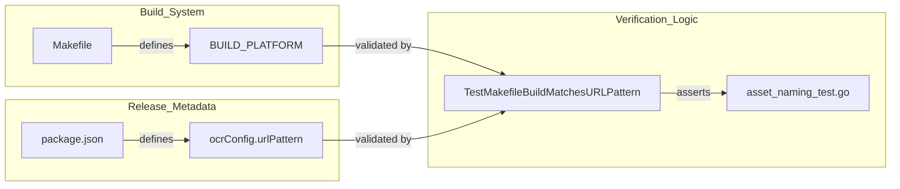

# Makefile 및 Local Build

관련 소스 파일

다음 파일들은 이 위키 페이지를 생성하기 위한 컨텍스트로 사용되었습니다.

- [Makefile](Makefile)
- [go.mod](go.mod)
- [internal/release/asset_naming_test.go](internal/release/asset_naming_test.go)

이 페이지는 multi-functional `Makefile`을 중심으로 하는 OpenCodeReview의 build system을 자세히 설명합니다. build process는 portability를 위한 static linking, 여러 architectures를 위한 cross-compilation, linker flags를 통한 build-time metadata injection을 강조합니다.

## Build System Overview

build system은 `opencodereview`라는 이름의 단일 self-contained binary를 생성하도록 설계되었습니다 [Makefile:6](). 다양한 Linux distributions 같은 서로 다른 environments 전반에서 최대 compatibility를 보장하기 위해, 프로젝트는 build macros 안에서 `CGO_ENABLED=0`을 설정해 static linking을 강제합니다 [Makefile:23]().

### Build Metadata Injection
`Makefile`은 local environment에서 versioning information을 동적으로 추출하고 Go의 `-X` linker flags를 사용해 binary에 주입합니다 [Makefile:17-20](). 이를 통해 `main` package의 variables를 채워 `ocr version` 명령이 정확한 build details를 보고할 수 있습니다.

| Variable | Source | LD_FLAGS Mapping |
| :--- | :--- | :--- |
| `VERSION` | Git Tag (`v0.0.0-short-hash`로 fallback) | `main.Version` |
| `GIT_COMMIT` | `git rev-parse --short HEAD` | `main.GitCommit` |
| `BUILD_DATE` | `date -u +"%Y-%m-%dT%H:%M:%SZ"` | `main.BuildDate` |

출처: [Makefile:10-20]()

## Makefile Targets

`Makefile`은 daily development부터 full release distribution까지 여러 category의 targets를 정의합니다.

### Development Targets
*   **`build`**: 현재 host architecture용 binary를 compile하고 `./dist/opencodereview`에 배치합니다 [Makefile:29-30]().
*   **`test`**: race detector를 활성화하고 caching을 비활성화(`-count=1`)한 상태로 Go test suite를 실행합니다 [Makefile:32-33]().
*   **`run`**: `build`를 트리거한 뒤 현재 repository의 staged changes(`--staged`)를 review하도록 binary를 즉시 실행합니다 [Makefile:38-39]().
*   **`fmt` / `vet` / `check`**: code formatting을 표준화하고 static analysis를 실행해 code quality를 보장합니다 [Makefile:44-51]().
*   **`clean`**: fresh build state를 보장하기 위해 `./dist` directory를 제거합니다 [Makefile:35-36]().

### Release and Distribution Targets
*   **`build-all`**: AMD64 및 ARM64 architectures 모두에 대해 Linux, Darwin, Windows를 포함한 전체 support matrix의 cross-compilation을 조율합니다 [Makefile:72]().
*   **`sha256sum`**: `dist` folder의 모든 binaries에 대한 SHA-256 checksums의 정렬된 목록을 생성하고 `sha256sum.txt`로 출력합니다 [Makefile:75-76]().
*   **`dist`**: primary release target입니다. 이전 builds를 정리하고, 모든 platforms를 compile하며, checksums를 생성하고, `VERSION` file을 만듭니다 [Makefile:79-80]().

출처: [Makefile:29-81]()

## Cross-Compilation Matrix

OpenCodeReview는 일반적인 developer environments를 지원하기 위해 Go build matrix를 활용합니다. 각 target은 `BUILD_PLATFORM` macro를 사용해 flags를 표준화하고, CGO를 비활성화하며, output naming conventions를 처리합니다 [Makefile:22-26]().

### Supported Platforms
| OS (`GOOS`) | Architecture (`GOARCH`) | Extension | Target Name |
| :--- | :--- | :--- | :--- |
| Linux | amd64 | (none) | `build-linux-amd64` |
| Linux | arm64 | (none) | `build-linux-arm64` |
| Darwin | amd64 | (none) | `build-darwin-amd64` |
| Darwin | arm64 | (none) | `build-darwin-arm64` |
| Windows | amd64 | `.exe` | `build-windows-amd64` |
| Windows | arm64 | `.exe` | `build-windows-arm64` |

출처: [Makefile:54-72]()

## Build Process Data Flow

다음 다이어그램은 `Makefile`이 source code와 environment metadata를 distributed release artifacts로 변환하는 방식을 보여줍니다.

### Build Artifact Generation Flow

출처: [Makefile:10-26](), [Makefile:75-80]()

## Asset Naming 및 Consistency

프로젝트는 `Makefile` build outputs와 `package.json`에 정의된 distribution metadata 사이의 엄격한 consistency를 유지합니다.

### Asset Naming Verification
internal test `internal/release/asset_naming_test.go`는 `Makefile`이 생성하는 filenames가 installation scripts와 npm distribution이 기대하는 `urlPattern`과 일치하는지 보장합니다 [internal/release/asset_naming_test.go:133-142]().

*   **URL Pattern**: Assets는 `opencodereview-{os}-{arch}` 형식을 따라야 합니다 [internal/release/asset_naming_test.go:81]().
*   **Checksums**: checksum file은 정확히 `sha256sum.txt`라는 이름이어야 합니다 [internal/release/asset_naming_test.go:177-178]().

### Build-to-Release Association

출처: [internal/release/asset_naming_test.go:13-20](), [internal/release/asset_naming_test.go:133-172]()

## Dependency Management

프로젝트는 dependency management에 Go Modules를 사용하며, modern Go features를 대상으로 합니다.

*   **`go.mod`**: module path를 `github.com/open-code-review/open-code-review`로 정의하고 Go version `1.25.0` 이상을 요구합니다 [go.mod:1-3]().
*   **Key Dependencies**:
    *   `tiktoken-go`: LLM token counting 및 encoding에 사용됩니다 [go.mod:7]().
    *   `opentelemetry`: tracing 및 metrics를 위해 OTel SDK를 광범위하게 사용합니다 [go.mod:8-16]().
    *   `doublestar`: file filtering 및 rule selection에서 advanced glob pattern matching에 사용됩니다 [go.mod:6]().

출처: [go.mod:1-17]()
