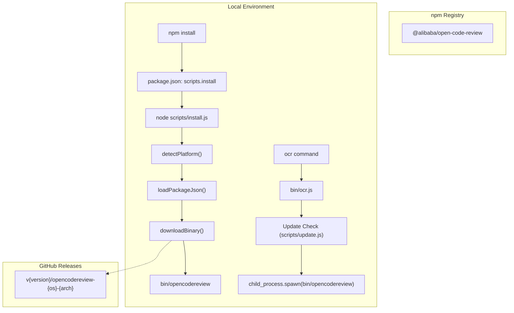
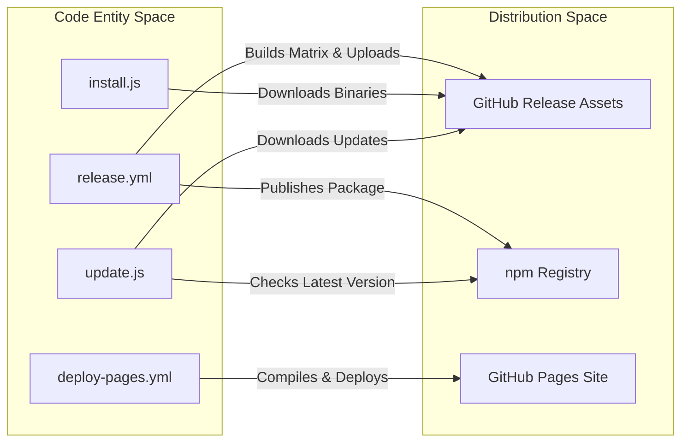

# CI/CD Workflows 및 npm Publishing

관련 소스 파일

다음 파일들은 이 위키 페이지를 생성하기 위한 컨텍스트로 사용되었습니다.

- [.github/workflows/deploy-pages.yml](.github/workflows/deploy-pages.yml)
- [.github/workflows/release.yml](.github/workflows/release.yml)
- [.npmignore](.npmignore)
- [LICENSE](LICENSE)
- [bin/ocr.js](bin/ocr.js)
- [pages/index.html](pages/index.html)
- [pages/src/components/BenchmarkSection.tsx](pages/src/components/BenchmarkSection.tsx)
- [pages/src/components/Navbar.tsx](pages/src/components/Navbar.tsx)
- [pages/webpack.config.js](pages/webpack.config.js)
- [scripts/install.js](scripts/install.js)
- [scripts/publish/_common.sh](scripts/publish/_common.sh)
- [scripts/update.js](scripts/update.js)

이 페이지는 OpenCodeReview의 automated release 및 deployment pipelines를 설명합니다. 프로젝트는 GitHub Actions를 활용해 multi-platform binary compilation, GitHub Release generation, npm package publishing, documentation website의 GitHub Pages deployment를 처리합니다.

## Release Workflow (`release.yml`)

`release.yml` workflow는 primary distribution pipeline입니다. repository에 `v*` pattern과 일치하는 새 tag가 push될 때마다 trigger됩니다 [.github/workflows/release.yml:3-5](). workflow는 `build`, `release`, `npm-publish`라는 세 sequential jobs로 나뉩니다.

### Multi-Arch Build Matrix
`build` job은 strategy matrix를 사용해 여러 operating systems와 architectures용 Go binary를 cross-compile합니다 [.github/workflows/release.yml:13-27]().

| OS | Architecture | Binary Name Format |
| :--- | :--- | :--- |
| `linux` | `amd64` | `opencodereview-linux-amd64` |
| `linux` | `arm64` | `opencodereview-linux-arm64` |
| `darwin` | `amd64` | `opencodereview-darwin-amd64` |
| `darwin` | `arm64` | `opencodereview-darwin-arm64` |
| `windows` | `amd64` | `opencodereview-windows-amd64.exe` |
| `windows` | `arm64` | `opencodereview-windows-arm64.exe` |

compile 중 `LD_FLAGS`는 version(git tag에서 가져옴), short commit hash, build timestamp를 포함한 metadata를 `main` package에 주입하는 데 사용됩니다 [.github/workflows/release.yml:41-44](). `CGO_ENABLED=0`은 생성된 binaries가 statically linked되도록 보장합니다 [.github/workflows/release.yml:39]().

### Release 및 Checksum Generation
`release` job은 `build` job이 완료될 때까지 기다립니다 [.github/workflows/release.yml:58](). artifacts를 다운로드하고, `sha256sum`을 사용해 모든 binaries의 정렬된 hashes를 포함하는 `sha256sum.txt` file을 생성한 뒤, `softprops/action-gh-release` action을 사용해 새 GitHub Release를 만듭니다 [.github/workflows/release.yml:61-75]().

### npm Publishing Logic
마지막 `npm-publish` job은 npm registry로의 distribution을 처리합니다. `NPM_TOKEN` secret에 의존하며 provenance를 위해 `id-token: write` permissions가 필요합니다 [.github/workflows/release.yml:77-82]().
- **Version Injection**: workflow는 `jq`를 사용해 GitHub tag에서 `v` prefix를 제거하고 publishing 전에 `package.json`의 `version` field를 업데이트합니다 [.github/workflows/release.yml:91-92]().
- **Publishing**: `npm publish --access public --provenance`를 실행합니다 [.github/workflows/release.yml:95]().
- **Exclusions**: `.npmignore` file은 Go source code(`internal/`, `cmd/`), local build artifacts, internal scripts가 npm package에서 제외되도록 보장합니다 [.npmignore:1-19]().

**출처:**
- [.github/workflows/release.yml:1-98]()
- [.npmignore:1-19]()

## npm Installation 및 Update Mechanism

OpenCodeReview는 npm에서 wrapper로 배포됩니다. package에는 underlying Go binary를 관리하는 installation 및 update scripts가 포함됩니다.

### Data Flow: npm Install and Execution

Title: npm Installation and Binary Resolution

**출처:**
- [bin/ocr.js:10-40]()
- [scripts/install.js:153-189]()
- [scripts/update.js:143-224]()

### `install.js` Script
`scripts/install.js` script는 initial setup을 처리합니다.
1.  **Platform Detection**: `detectPlatform()`은 OS와 architecture를 식별합니다 [.scripts/install.js:28-59]().
2.  **Configuration Loading**: `urlPattern`을 위해 `package.json`에서 `ocrConfig`를 읽습니다 [.scripts/install.js:61-70]().
3.  **Binary Download**: `downloadBinary()`는 GitHub에서 platform-specific binary를 가져옵니다 [.scripts/install.js:125-141]().
4.  **Checksum Verification**: `checksumPattern`이 있으면 remote SHA-256 manifest를 기준으로 download를 검증합니다 [.scripts/install.js:191-224]().

### `update.js` Script
cooldown(기본 30분)이 만료되면 `bin/ocr.js` shim은 `scripts/update.js`를 통해 asynchronous update check를 트리거합니다 [.bin/ocr.js:12-32](). 
- **Locking**: concurrent update processes를 방지하기 위해 `~/.opencodereview/update.lock`의 lock file을 사용합니다 [.scripts/update.js:40-67]().
- **Version Comparison**: npm registry에서 latest version을 가져와 `semverGt`를 사용해 local version과 비교합니다 [.scripts/update.js:82-130]().
- **Atomic Swap**: Windows에서는 file locks를 처리하기 위해 새 version으로 교체하기 전에 active binary를 `.old`로 rename합니다 [.scripts/update.js:199-218]().

**출처:**
- [scripts/install.js:1-254]()
- [scripts/update.js:1-227]()
- [bin/ocr.js:1-41]()

## Documentation Deployment (`deploy-pages.yml`)

`pages/` directory의 project website는 GitHub Pages에 자동으로 deploy됩니다.

### Deployment Pipeline
이 workflow는 `pages/` path를 수정하는 변경이 `main` branch에 push될 때 trigger됩니다 [.github/workflows/deploy-pages.yml:3-7]().

1.  **Build Job**:
    - `pages` directory 안에서 `npm install`과 `npm run build`를 실행합니다 [.github/workflows/deploy-pages.yml:29-35]().
    - React/TypeScript source를 bundle하기 위해 `babel-loader` 및 `HtmlWebpackPlugin`과 함께 Webpack을 사용합니다 [.pages/webpack.config.js:12-54]().
    - bundled assets와 `logo.svg`를 포함하는 `_site` directory를 준비합니다 [.github/workflows/deploy-pages.yml:37-41]().
2.  **Deploy Job**:
    - `actions/deploy-pages`를 사용해 artifact를 `github-pages` environment에 publish합니다 [.github/workflows/deploy-pages.yml:54-57]().

**출처:**
- [.github/workflows/deploy-pages.yml:1-57]()
- [pages/webpack.config.js:1-56]()

## Release Entities 요약

Title: Release Entity Mapping

**출처:**
- [.github/workflows/release.yml:69-75]()
- [.github/workflows/release.yml:94-95]()
- [.github/workflows/deploy-pages.yml:54-57]()
- [scripts/install.js:179-186]()
- [scripts/update.js:82-120]()
