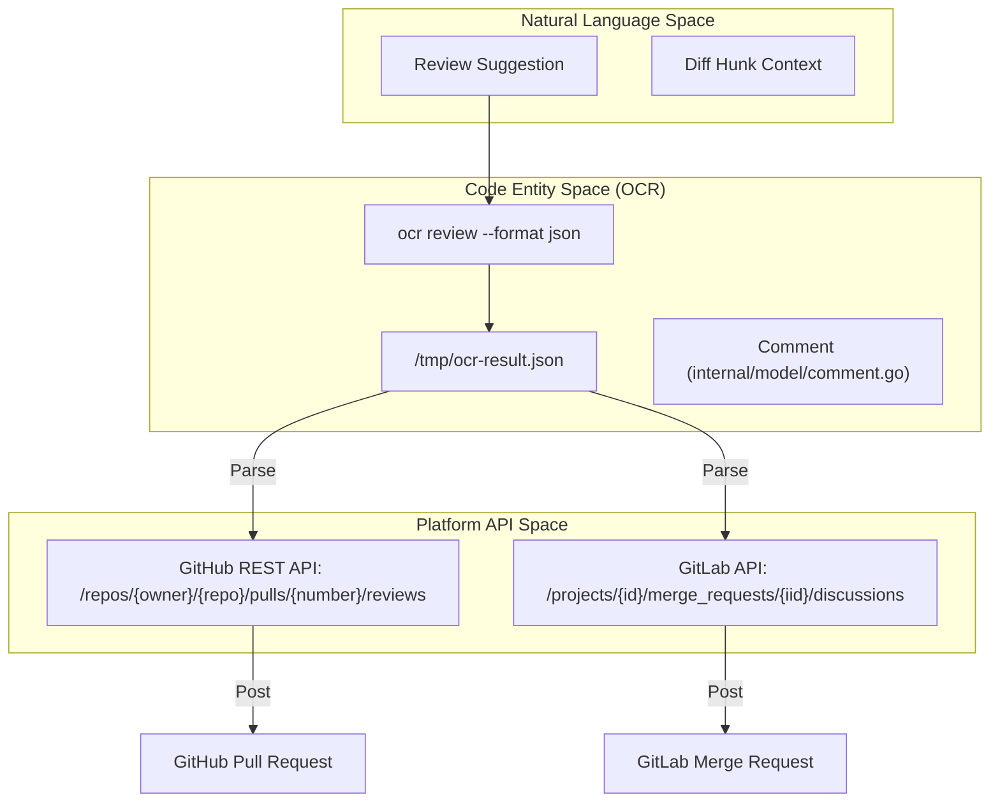
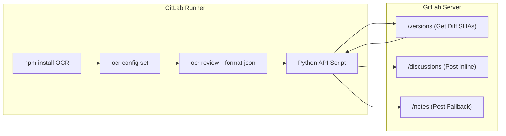

# CI/CD Integration Examples

관련 소스 파일

다음 파일들은 이 위키 페이지를 생성하기 위한 컨텍스트로 사용되었습니다.

- [examples/README.md](examples/README.md)
- [examples/github_actions/README.md](examples/github_actions/README.md)
- [examples/github_actions/ocr-review.yml](examples/github_actions/ocr-review.yml)
- [examples/gitlab_ci/.gitlab-ci.yml](examples/gitlab_ci/.gitlab-ci.yml)
- [examples/gitlab_ci/README.md](examples/gitlab_ci/README.md)

이 페이지는 OpenCodeReview (OCR)를 automated CI/CD pipelines에 통합하기 위한 reference implementations를 제공합니다. GitHub Actions와 GitLab CI를 다루며, Pull Requests(PRs) 또는 Merge Requests(MRs)에서 reviews를 trigger하고, 결과 JSON output을 parse하며, platform-specific APIs를 사용해 inline comments를 게시하는 방법을 자세히 설명합니다.

## Integration Architecture

integration은 표준 pattern을 따릅니다. CI runner가 `--format json` flag와 함께 `ocr review` command를 실행하고 output을 capture한 뒤, script(GitHub의 경우 Node.js, GitLab의 경우 Python)를 사용해 JSON entities를 platform-native review comments로 변환합니다.

Title: CI/CD Data Flow and Entity Mapping

**출처:**
- [examples/github_actions/ocr-review.yml:94-98]()
- [examples/gitlab_ci/.gitlab-ci.yml:41-45]()

---

## GitHub Actions Integration

GitHub Actions implementation은 GitHub REST API와 상호작용하기 위해 `actions/github-script`를 활용합니다. PR creation trigger와 PR comments를 통한 manual triggers를 지원합니다.

### Workflow Configuration
workflow에는 repository secrets로 `OCR_LLM_URL`과 `OCR_LLM_AUTH_TOKEN`이 필요합니다 [examples/github_actions/ocr-review.yml:10-12](). `GITHUB_TOKEN`이 review comments를 게시할 수 있도록 `pull-requests: write` permissions를 부여합니다 [examples/github_actions/ocr-review.yml:27-29]().

### Trigger Mechanisms
- **Automatic**: PR이 opened될 때 trigger됩니다 [examples/github_actions/ocr-review.yml:22-23]().
- **On-Demand**: 사용자가 `/open-code-review` 또는 `@open-code-review`로 comment하면 trigger됩니다 [examples/github_actions/ocr-review.yml:24-25]().

### Review Execution 및 Parsing
workflow는 npm을 통해 OCR을 설치하고 `origin/${{ github.base_ref }}`를 `origin/${{ github.head_ref }}`와 비교하는 review command를 실행합니다 [examples/github_actions/ocr-review.yml:69-96]().

결과는 `github-script` block에서 parse됩니다.
1. **JSON Loading**: `/tmp/ocr-result.json`을 읽습니다 [examples/github_actions/ocr-review.yml:110-117]().
2. **Comment Formatting**: GitHub의 `suggestion` markdown syntax를 사용해 suggestions를 format합니다 [examples/github_actions/ocr-review.yml:180-210]().
3. **API Call**: `github.rest.pulls.createReview`를 사용해 모든 inline comments를 단일 batch로 제출합니다 [examples/github_actions/ocr-review.yml:218-226]().

**출처:**
- [examples/github_actions/ocr-review.yml:1-230]()
- [examples/github_actions/README.md:1-187]()

---

## GitLab CI Integration

GitLab CI implementation은 `.gitlab-ci.yml` file 내부의 Python script를 사용해 GitLab Discussions API와 상호작용합니다.

### Pipeline Stage: `code-review`
job은 `node:20` image에서 실행되며 `merge_requests`로 제한됩니다 [examples/gitlab_ci/.gitlab-ci.yml:18-21](). 기본 `CI_JOB_TOKEN`에는 MR discussions 권한이 없으므로 `api` scope가 있는 `GITLAB_API_TOKEN`이 필요합니다 [examples/gitlab_ci/README.md:56-58]().

### GitLab의 Logic Flow

Title: GitLab CI Review Logic

### Position Calculation
GitLab은 inline comments를 게시하기 위해 `base_sha`, `start_sha`, `head_sha`를 포함한 특정 `position` metadata를 요구합니다 [examples/gitlab_ci/.gitlab-ci.yml:90-98](). Python script는 comments가 올바른 diff version에 align되도록 `/merge_requests/{iid}/versions` endpoint에서 이를 가져옵니다 [examples/gitlab_ci/.gitlab-ci.yml:168-183]().

### Fallback Mechanism
comment를 inline으로 게시할 수 없는 경우(예: line이 diff의 일부가 아닌 경우), script는 error를 catch하고 file 및 line references가 포함된 general MR note를 대신 게시합니다 [examples/gitlab_ci/.gitlab-ci.yml:117-137]().

**출처:**
- [examples/gitlab_ci/.gitlab-ci.yml:1-200]()
- [examples/gitlab_ci/README.md:1-120]()

---

## Advanced Customization

### Background Context
두 integrations 모두 `--background` flag를 지원합니다. PR/MR title 또는 description을 전달하면 LLM에 high-level intent가 제공되어 review relevance가 향상됩니다 [examples/github_actions/README.md:105-112](), [examples/gitlab_ci/README.md:112-119]().

### Concurrency Control
큰 changesets의 경우 `--concurrency` flag를 조정해 simultaneous LLM requests를 제한하고 rate limits를 피할 수 있습니다 [examples/github_actions/README.md:96-102]().

### Redundant Reviews 방지
GitLab CI에서는 wrapper script를 사용해 새 review를 실행하기 전에 기존 OCR comments를 확인할 수 있으며, 이를 통해 같은 MR에 대한 subsequent pushes에서 tokens를 절약할 수 있습니다 [examples/gitlab_ci/README.md:125-168]().

**출처:**
- [examples/github_actions/README.md:94-112]()
- [examples/gitlab_ci/README.md:101-168]()
