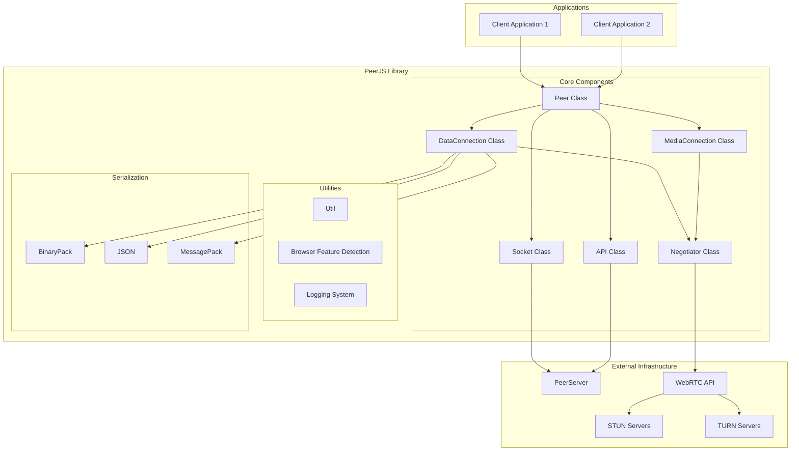
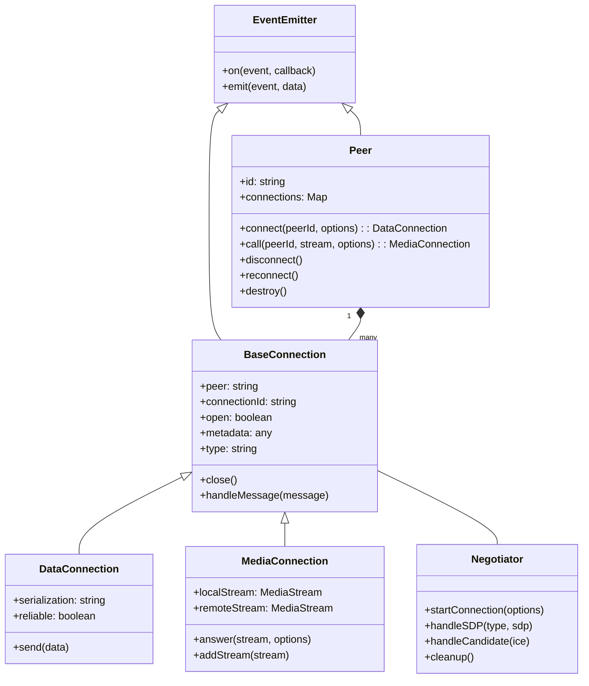
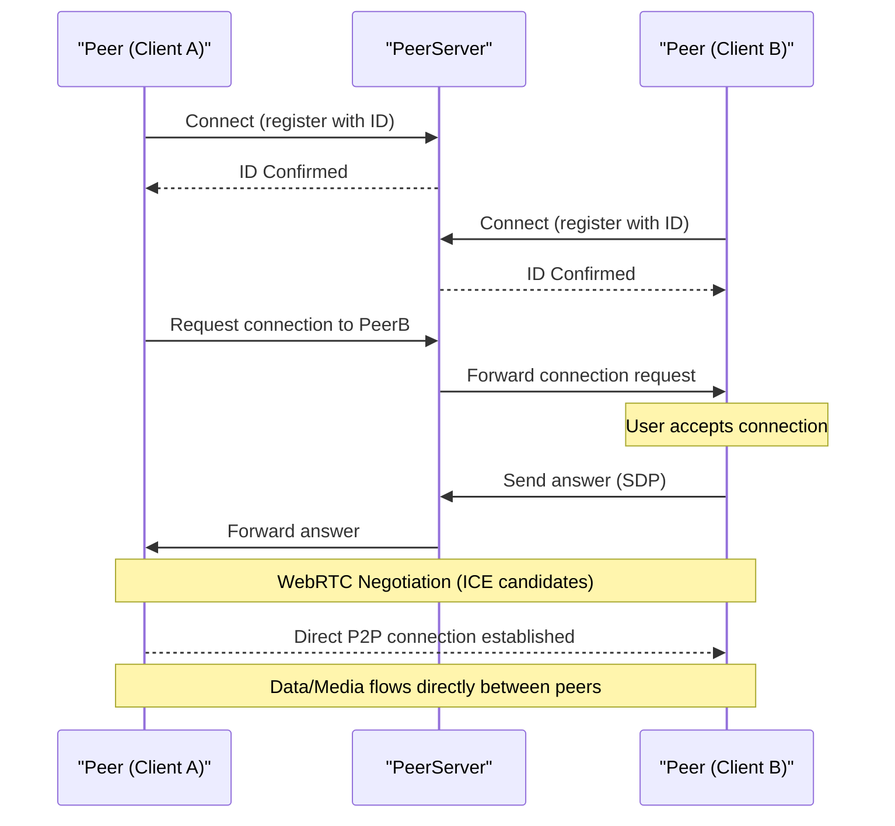
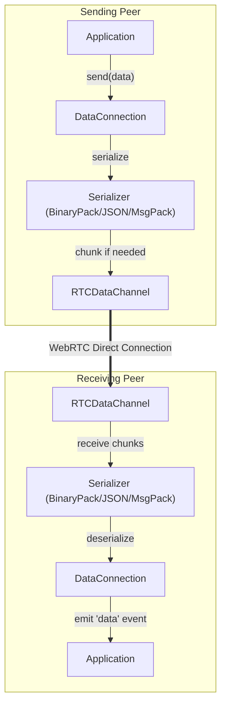
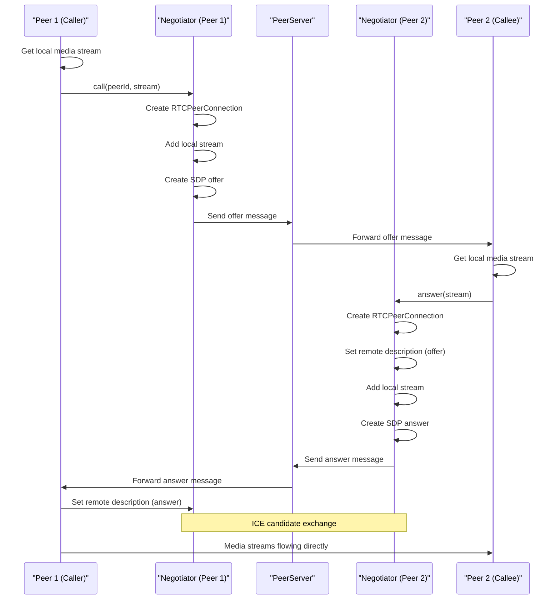

# 개요

관련 소스 파일

이 위키 페이지를 생성하는 컨텍스트로 다음 파일들이 사용되었습니다:

- [.gitignore](.gitignore)
- [CHANGELOG.md](CHANGELOG.md)
- [README.md](README.md)
- [package-lock.json](package-lock.json)
- [package.json](package.json)

PeerJS는 WebRTC 위에 구축된 완전하고, 설정 가능하며, 사용하기 쉬운 peer-to-peer API를 제공하는 JavaScript 라이브러리입니다. 이 라이브러리는 WebRTC 구현 세부 사항의 복잡성을 추상화하여, 개발자가 실시간 통신을 위해 데이터 채널과 미디어 스트림을 모두 지원하는 애플리케이션을 빠르게 구축할 수 있게 해줍니다.

이 문서는 PeerJS 라이브러리의 상위 수준 개요, 아키텍처, 핵심 구성 요소, 기능을 제공합니다. 설치 지침과 사용 예시는 [Installation and Usage](#1.1)를 참고하세요. 전체 API 레퍼런스는 [API Reference](#1.2)를 참고하세요.

## 주요 기능

PeerJS는 WebRTC peer-to-peer 통신을 단순화하는 몇 가지 주목할 만한 기능을 제공합니다:

- **단순화된 API**: peer 연결을 설정하기 위한 사용하기 쉬운 인터페이스
- **데이터 채널**: peer 간에 임의의 데이터를 송수신
- **미디어 스트림**: peer 간에 오디오와 비디오를 스트리밍
- **다중 직렬화 옵션**: 다양한 데이터 직렬화 형식 지원
- **연결 관리**: 연결 설정과 유지 관리를 자동 처리
- **시그널링**: peer 탐색을 돕기 위한 PeerServer 기반 내장 시그널링

Sources: [README.md:7-7](), [package.json:10-10]()

## 시스템 아키텍처

다음 다이어그램은 PeerJS의 상위 수준 아키텍처를 보여줍니다:

아키텍처는 다음과 같은 계층형 접근 방식을 따릅니다:

1. **Applications**는 PeerJS 라이브러리를 사용해 peer-to-peer 연결을 설정합니다
2. **Core Components**는 연결 관리, 데이터 전송, 미디어 스트리밍을 처리합니다
3. **External Infrastructure**는 필요한 시그널링과 네트워크 트래버설 기능을 제공합니다

Sources: [README.md:7-13](), [package.json:206-211]()

## 핵심 구성 요소

### Peer Class

`Peer` 클래스는 라이브러리의 주요 진입점입니다. 이 클래스는 peer 식별자를 관리하고, 다른 peer와의 연결을 생성하고 유지하며, 들어오는 연결에 대한 이벤트를 처리합니다.

### Connection Classes

PeerJS는 두 가지 유형의 연결을 제공합니다:

1. **DataConnection**: WebRTC 데이터 채널을 사용한 peer-to-peer 데이터 전송 처리
2. **MediaConnection**: peer 간 오디오/비디오 스트리밍 관리

두 연결 유형 모두 공통 기반 클래스를 상속하며, WebRTC 연결 설정에는 Negotiator를 사용합니다.

### Negotiator

`Negotiator` 클래스는 SDP offer/answer 교환과 ICE candidate 처리를 포함한 WebRTC 연결 설정을 담당합니다.

### Socket and API

`Socket` 클래스는 시그널링을 위해 PeerServer와의 WebSocket 연결을 유지하고, `API` 클래스는 peer 등록 및 탐색을 위한 HTTP API 기능을 제공합니다.

Sources: [README.md:40-73](), [README.md:80-112]()

## 연결 흐름

다음 시퀀스 다이어그램은 peer들이 연결을 설정하는 방식을 보여줍니다:

1. 두 peer 모두 PeerServer에 연결하고 고유 ID로 등록합니다
2. Peer A가 PeerServer를 통해 Peer B에 연결 요청을 시작합니다
3. PeerServer가 해당 요청을 Peer B로 전달합니다
4. Peer B가 연결을 수락하고 응답을 다시 전송합니다
5. WebRTC 협상이 완료되면 직접적인 P2P 연결이 설정됩니다
6. 데이터와 미디어는 서버를 거치지 않고 peer 사이를 직접 흐릅니다

Sources: [README.md:52-73](), [README.md:80-112]()

## 데이터 통신

### 데이터 직렬화

PeerJS는 효율적인 데이터 전송을 위해 여러 직렬화 형식을 지원합니다:

| Serialization | Description | Best For |
|---------------|-------------|----------|
| BinaryPack (default) | 복잡한 JavaScript 객체를 지원하는 바이너리 형식 | 범용 데이터 전송 |
| JSON | 단순한 데이터 구조를 위한 텍스트 기반 형식 | 디버깅 및 사람이 읽기 쉬운 데이터 |
| MessagePack | 압축된 바이너리 형식 | 성능이 중요한 애플리케이션 |

데이터 직렬화 프로세스는 다음과 같이 동작합니다:

데이터를 전송할 때:
1. 애플리케이션이 DataConnection에서 `send()`를 호출합니다
2. 데이터는 설정된 형식을 사용해 직렬화됩니다
3. 큰 데이터는 필요할 경우 청크로 분할됩니다
4. 데이터는 RTCDataChannel을 통해 전송됩니다
5. 수신 peer는 청크를 재조립하고 데이터를 역직렬화합니다
6. 수신된 데이터와 함께 `'data'` 이벤트가 발생합니다

Sources: [package.json:206-211](), [README.md:51-69]()

## 미디어 스트리밍

PeerJS는 직관적인 API로 WebRTC 미디어 스트리밍을 단순화합니다:

### 호출 흐름

이 과정은 peer 간 직접적인 미디어 연결을 설정하여 실시간 오디오 및 비디오 통신을 가능하게 합니다.

Sources: [README.md:80-112]()

## 브라우저 지원

PeerJS는 WebRTC 기능을 갖춘 최신 브라우저를 지원합니다:

| Browser | Minimum Version |
|---------|----------------|
| Chrome  | 83+            |
| Edge    | 83+            |
| Firefox | 80+            |
| Safari  | 15+            |

참고: MessagePack 직렬화 지원에는 Firefox 102+가 필요합니다.

Sources: [README.md:120-132](), [package.json:138-160]()

## PeerServer와의 통합

PeerJS는 peer 탐색과 연결 설정을 돕기 위해 PeerServer라는 시그널링 서버에 의존합니다. PeerServer는 다음 중 하나일 수 있습니다:

1. `0.peerjs.com`에 있는 기본 공개 서버
2. 자체 호스팅한 [PeerServer](https://github.com/peers/peerjs-server) 인스턴스
3. PeerJS 프로토콜을 따르는 커스텀 서버 구현

시그널링 서버를 통해 연결이 설정되면, peer들은 서버의 중개 없이 직접 통신합니다.

Sources: [README.md:143-143]()

## 요약

PeerJS는 WebRTC 위에 강력한 추상화를 제공하여 실시간 peer-to-peer 애플리케이션 개발을 단순화합니다. WebRTC 협상, 연결 관리, 데이터 직렬화의 복잡성을 처리함으로써, PeerJS는 개발자가 기반 기술의 세부 사항보다는 애플리케이션 구축에 집중할 수 있게 해줍니다.

라이브러리의 특정 측면에 대한 더 자세한 정보는 이 문서의 다른 섹션을 참고하세요:

- 자세한 설치 및 사용 예시는 [Installation and Usage](#1.1)를 참고하세요
- 전체 API 레퍼런스는 [API Reference](#1.2)를 참고하세요
- 심층적인 아키텍처 설명은 [Architecture](#2)를 참고하세요
- 핵심 구성 요소에 대한 자세한 정보는 [Core Components](#2.1)를 참고하세요
