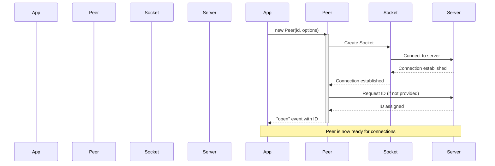
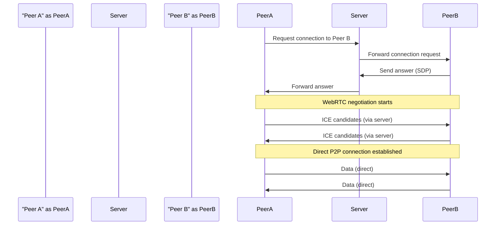
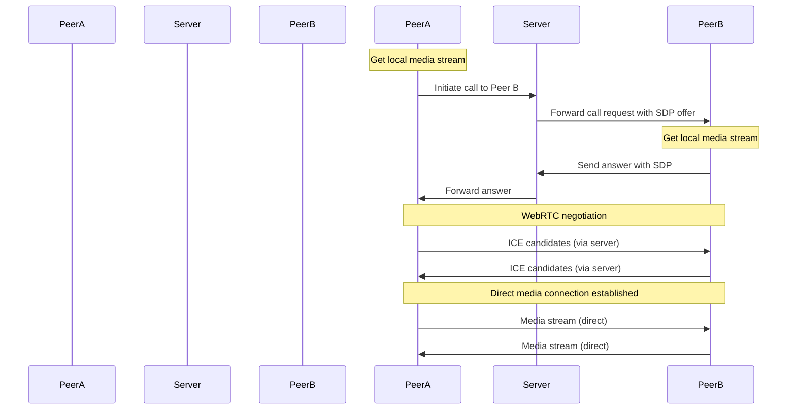
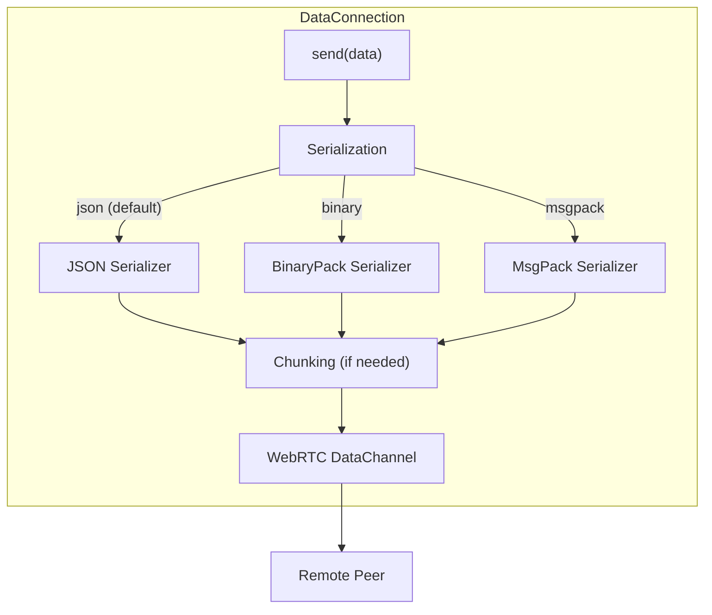
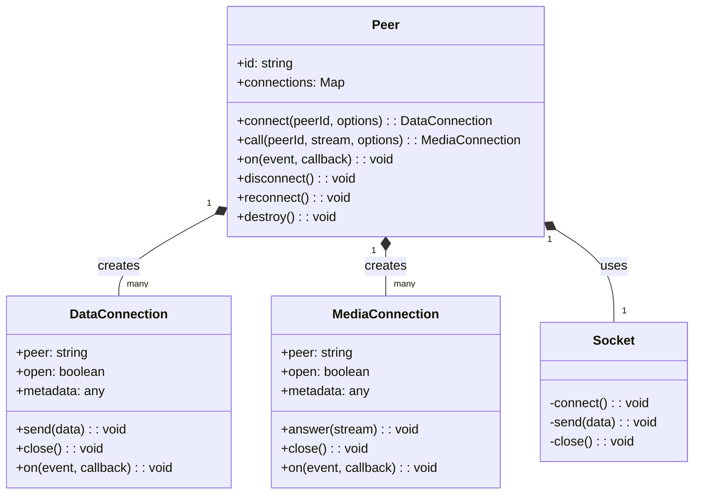

# Installation and Usage

<details>
<summary>관련 소스 파일</summary>

이 위키 페이지를 생성하는 컨텍스트로 다음 파일들이 사용되었습니다:

- [.gitignore](.gitignore)
- [CHANGELOG.md](CHANGELOG.md)
- [README.md](README.md)
- [package-lock.json](package-lock.json)
- [package.json](package.json)

</details>


이 페이지는 PeerJS 라이브러리를 설치하는 방법을 설명하고, 데이터와 미디어 공유를 모두 위한 peer-to-peer 연결 설정의 기본 사용 예시를 제공합니다. API 레퍼런스에 대한 더 자세한 정보는 [API Reference](#1.2)를 참고하세요.

## 목적과 범위

PeerJS는 사용하기 쉬운 API를 제공하여 WebRTC peer-to-peer 연결을 단순화하는 라이브러리입니다. 이 문서에서는 다음을 다룹니다:

- 다양한 설치 방법
- 기본 설정 및 구성
- 데이터 연결 생성
- 미디어 호출 설정
- 지원 브라우저 및 요구 사항

## 설치 방법

프로젝트에 PeerJS를 설치하고 포함하는 방법은 여러 가지가 있습니다.

### 패키지 매니저 설치

npm 사용:

```bash
npm install peerjs
```

yarn 사용:

```bash
yarn add peerjs
```

설치 후에는 JavaScript/TypeScript 파일에서 라이브러리를 import할 수 있습니다:

```javascript
import { Peer } from "peerjs";
```

Sources: [package.json:206-210](), [README.md:33-42]()

### 브라우저에서 직접 포함

CDN에서 PeerJS를 직접 HTML에 포함할 수도 있습니다:

```html
<script src="https://unpkg.com/peerjs@1.5.4/dist/peerjs.min.js"></script>
```

이렇게 하면 스크립트에서 바로 사용할 수 있는 전역 `Peer` 객체가 노출됩니다.

## 초기화와 구성

### Peer 인스턴스 생성

PeerJS 사용을 시작하려면 새로운 `Peer` 인스턴스를 생성해야 합니다:

```javascript
// Create a Peer with a specific ID
const peer = new Peer("your-chosen-id");

// Or let the server assign a random ID
const peer = new Peer();
```

### 구성 옵션

옵션 객체를 전달하여 Peer 인스턴스를 구성할 수 있습니다:

```javascript
const peer = new Peer("your-chosen-id", {
  host: "your-peerjs-server.com",  // Default is 0.peerjs.com
  port: 443,                       // Default is 443
  path: "/peerjs",                 // Default is "/"
  secure: true,                    // Use SSL/TLS
  debug: 3,                        // Log level (0-3)
  config: {                        // ICE server configuration
    iceServers: [
      { urls: "stun:stun.l.google.com:19302" },
      { urls: "turn:your-turn-server.com", username: "username", credential: "password" }
    ]
  }
});
```

### 초기화 흐름

다음 다이어그램은 PeerJS의 초기화 과정을 보여줍니다:



Sources: [README.md:44-49]()

## 다른 Peer에 연결하기

### 데이터 연결

데이터 연결을 사용하면 peer 간에 데이터를 직접 송수신할 수 있습니다.

#### 데이터 연결 생성

다른 peer에 연결하려면:

```javascript
// Connect to another peer
const conn = peer.connect("remote-peer-id");

// When the connection is open
conn.on("open", () => {
  // Send data to the remote peer
  conn.send("Hello!");
  conn.send({ key: "value" });
  conn.send(new Blob(["binary data"]));
});
```

#### 데이터 연결 수신

다른 peer로부터의 연결을 수신하려면:

```javascript
// Listen for incoming connections
peer.on("connection", (conn) => {
  // Connection established
  conn.on("data", (data) => {
    // Handle received data
    console.log("Received:", data);
  });
  
  // You can also send data
  conn.on("open", () => {
    conn.send("Connection established!");
  });
});
```

#### 데이터 연결 흐름



Sources: [README.md:51-73]()

### 미디어 연결

미디어 연결을 사용하면 peer 간에 오디오 및 비디오 스트림을 공유할 수 있습니다.

#### 호출하기

비디오/오디오 호출을 하려면:

```javascript
// Get user media
navigator.mediaDevices.getUserMedia({ video: true, audio: true })
  .then((stream) => {
    // Display my video
    const myVideo = document.getElementById("my-video");
    myVideo.srcObject = stream;
    
    // Call another peer
    const call = peer.call("remote-peer-id", stream);
    
    // When they answer
    call.on("stream", (remoteStream) => {
      // Display remote video
      const remoteVideo = document.getElementById("remote-video");
      remoteVideo.srcObject = remoteStream;
    });
  })
  .catch((err) => {
    console.error("Failed to get media", err);
  });
```

#### 호출 받기

들어오는 호출에 응답하려면:

```javascript
// Listen for incoming calls
peer.on("call", (call) => {
  // Get user media
  navigator.mediaDevices.getUserMedia({ video: true, audio: true })
    .then((stream) => {
      // Display my video
      const myVideo = document.getElementById("my-video");
      myVideo.srcObject = stream;
      
      // Answer the call
      call.answer(stream);
      
      // When stream received
      call.on("stream", (remoteStream) => {
        // Display remote video
        const remoteVideo = document.getElementById("remote-video");
        remoteVideo.srcObject = remoteStream;
      });
    })
    .catch((err) => {
      console.error("Failed to get media", err);
    });
});
```

#### 미디어 연결 흐름



Sources: [README.md:76-112]()

## 데이터 직렬화 옵션

PeerJS는 데이터를 전송할 때 다양한 직렬화 옵션을 지원합니다:



연결을 생성할 때 직렬화 유형을 지정할 수 있습니다:

```javascript
// Connect with specific serialization
const conn = peer.connect("remote-peer-id", {
  serialization: "binary" // 'json', 'binary', or 'msgpack'
});
```

Sources: [package.json:206-210]()

## 이벤트와 오류 처리

PeerJS는 다양한 상태와 오류를 처리하기 위해 이벤트 기반 시스템을 사용합니다.

### Peer 이벤트

```javascript
// Connection established with the signaling server
peer.on("open", (id) => {
  console.log("My peer ID is:", id);
});

// Error event
peer.on("error", (err) => {
  console.error("Peer error:", err);
});

// Disconnected from the signaling server
peer.on("disconnected", () => {
  console.log("Disconnected from signaling server");
  // You can reconnect if needed
  peer.reconnect();
});

// Completely closed and can't be reused
peer.on("close", () => {
  console.log("Peer connection closed");
});
```

### 연결 이벤트

```javascript
// Data connection events
conn.on("open", () => {
  console.log("Connection opened");
});

conn.on("data", (data) => {
  console.log("Received data:", data);
});

conn.on("close", () => {
  console.log("Connection closed");
});

conn.on("error", (err) => {
  console.error("Connection error:", err);
});

// Media connection events
call.on("stream", (stream) => {
  console.log("Received remote stream");
});

call.on("close", () => {
  console.log("Call ended");
});

call.on("error", (err) => {
  console.error("Call error:", err);
});
```

## 구성 요소 관계

이 다이어그램은 PeerJS 라이브러리의 핵심 구성 요소와 그 관계를 보여줍니다:



Sources: [package.json:207-210](), [README.md:30-114]()

## 브라우저 호환성

PeerJS는 WebRTC 기능을 갖춘 최신 브라우저를 지원합니다:

| Browser | Version |
|---------|---------|
| Chrome  | 83+     |
| Firefox | 80+     |
| Edge    | 83+     |
| Safari  | 15+     |

MessagePack 직렬화 지원에는 Firefox 102+가 필요합니다.

Sources: [README.md:121-132](), [package.json:138-160]()

## 추가 참고 사항

- PeerJS는 연결 설정을 위해 시그널링 서버가 필요합니다. 기본적으로 PeerJS 공개 서버를 사용하지만, 자체 호스팅한 [PeerServer](https://github.com/peers/peerjs-server)를 사용할 수도 있습니다.

- 프로덕션 애플리케이션에서는 신뢰성과 시그널링 프로세스에 대한 제어를 위해 자체 PeerServer 인스턴스를 사용하는 것이 권장됩니다.

- peer 간 모든 연결은 일단 설정되면 직접(peer-to-peer) 이루어지며, 서버는 초기 시그널링에만 사용됩니다.

Sources: [README.md:142-143]()
