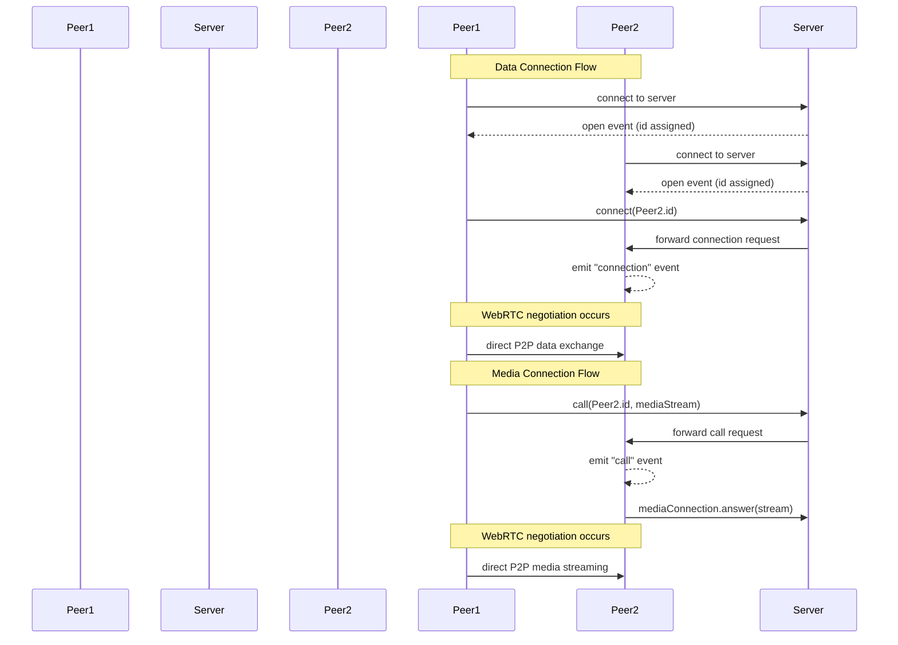
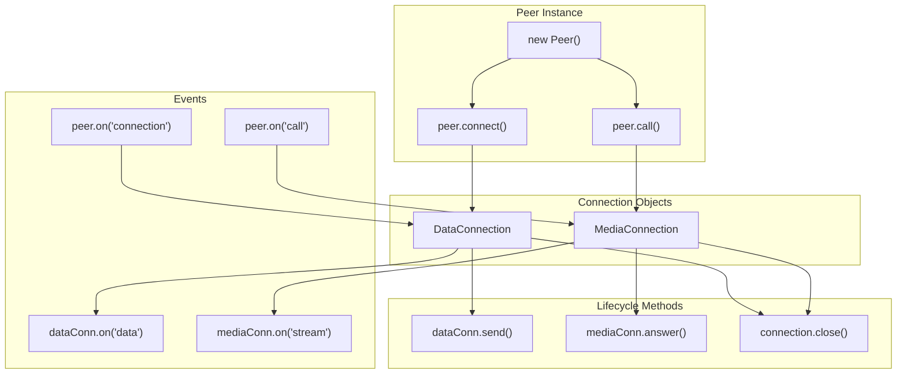

# API Reference

<details>
<summary>관련 소스 파일</summary>

이 위키 페이지를 생성하는 컨텍스트로 다음 파일들이 사용되었습니다:

- [README.md](README.md)
- [lib/exports.ts](lib/exports.ts)
- [lib/mediaconnection.ts](lib/mediaconnection.ts)
- [lib/negotiator.ts](lib/negotiator.ts)
- [lib/peer.ts](lib/peer.ts)

</details>


이 페이지는 개발자가 사용할 수 있는 주요 클래스, 메서드, 이벤트, 옵션을 문서화한 PeerJS 공개 API의 종합 레퍼런스를 제공합니다. 이 레퍼런스는 PeerJS로 애플리케이션을 구축할 때 직접 상호작용하게 되는 구성 요소에 초점을 맞춥니다. 기반 아키텍처에 대한 정보는 [Architecture](#2)를 참고하세요.

## 핵심 API 구성 요소

PeerJS는 WebRTC peer-to-peer 연결을 위한 단순한 인터페이스를 제공하며, 개발자가 상호작용하는 세 가지 주요 구성 요소가 있습니다:

```mermaid
classDiagram
    class "Peer" {
        +id: string
        +connect(peerId, options): DataConnection
        +call(peerId, stream, options): MediaConnection
        +on(event, callback): void
    }
    
    class "DataConnection" {
        +peer: string
        +connectionId: string
        +send(data): void
        +on(event, callback): void
    }
    
    class "MediaConnection" {
        +peer: string
        +connectionId: string
        +answer(stream, options): void
        +on(event, callback): void
    }
    
    "Peer" --> "DataConnection" : creates
    "Peer" --> "MediaConnection" : creates
```

Sources: [lib/peer.ts:113-744](), [lib/mediaconnection.ts:31-187]()

## Peer Class

`Peer` 클래스는 PeerJS API의 주요 진입점입니다. 연결을 시작하고 수신할 수 있는 peer를 나타냅니다.

### Constructor

```typescript
// Create with randomly assigned ID
const peer = new Peer();

// Create with specific ID
const peer = new Peer('my-peer-id');

// Create with options
const peer = new Peer('my-peer-id', options);
// or
const peer = new Peer(options);
```

### Constructor Options

| Option | Type | Default | Description |
|--------|------|---------|-------------|
| `debug` | LogLevel (number) | 0 | 로그 레벨 (0: 없음, 1: 오류, 2: 경고, 3: 전체 로그) |
| `host` | string | '0.peerjs.com' | PeerServer 호스트 |
| `port` | number | 443 | PeerServer 포트 |
| `path` | string | '/' | PeerServer가 실행 중인 경로 |
| `key` | string | 'peerjs' | API 키 (deprecated) |
| `token` | string | random token | 연결 토큰 |
| `config` | RTCConfiguration | ICE/TURN default config | RTCPeerConnection용 구성 |
| `secure` | boolean | true for cloud server | TLS 사용 여부 |
| `serializers` | object | - | DataConnection용 커스텀 직렬화기 |

Sources: [lib/peer.ts:25-68]()

### Properties

| Property | Type | Description |
|----------|------|-------------|
| `id` | string | 이 peer의 ID |
| `connections` | Object | 모든 연결의 해시 |
| `disconnected` | boolean | 서버와 연결이 끊겼는지 여부 |
| `destroyed` | boolean | 이 peer를 더 이상 사용할 수 없는지 여부 |

Sources: [lib/peer.ts:146-191]()

### Methods

| Method | Description |
|--------|-------------|
| `connect(peerId, options)` | 원격 peer에 연결하고 DataConnection 반환 |
| `call(peerId, stream, options)` | 스트림으로 원격 peer를 호출하고 MediaConnection 반환 |
| `disconnect()` | 서버와의 연결 해제(기존 연결은 유지) |
| `reconnect()` | 동일한 ID로 서버에 다시 연결 |
| `destroy()` | 모든 연결을 닫고 연결 해제 |
| `listAllPeers(callback)` | 서버에서 사용 가능한 peer ID 목록 조회 |

Sources: [lib/peer.ts:490-743]()

### Events

PeerJS는 이벤트 기반 API를 사용합니다. `Peer` 인스턴스는 다음 이벤트를 발생시킵니다:

| Event | Data | Description |
|-------|------|-------------|
| `open` | id (string) | 서버와의 연결이 설정되었을 때 발생 |
| `connection` | DataConnection | 새로운 데이터 연결이 설정되었을 때 발생 |
| `call` | MediaConnection | 원격 peer가 호출했을 때 발생 |
| `close` | - | peer가 파괴되었을 때 발생 |
| `disconnected` | currentId (string) | 서버와 연결이 끊겼을 때 발생 |
| `error` | error (PeerError) | 오류가 발생했을 때 발생 |

Sources: [lib/peer.ts:80-109]()

## 연결 흐름

다음 다이어그램은 peer 간 연결을 설정하는 전형적인 흐름을 보여줍니다:



Sources: [lib/peer.ts:490-555](), [lib/negotiator.ts:22-49]()

## DataConnection

`DataConnection`은 peer 간 데이터 연결을 나타냅니다. `peer.connect()`를 호출해 생성되거나 `connection` 이벤트에서 전달받습니다.

### Methods

| Method | Description |
|--------|-------------|
| `send(data)` | peer에 데이터 전송 |
| `close()` | 연결 종료 |

### Events

| Event | Data | Description |
|-------|------|-------------|
| `open` | - | 연결이 사용 가능한 상태가 됨 |
| `data` | data (any) | peer로부터 데이터 수신 |
| `close` | - | 연결 종료 |
| `error` | error (Error) | 연결 오류 |

### Serialization Options

DataConnection은 여러 직렬화 방식을 지원합니다:

| Value | Description |
|-------|-------------|
| `binary` (default) | BinaryPack을 사용하는 바이너리 직렬화 |
| `json` | JSON 직렬화 |
| `raw` | 원시 데이터(직렬화 없음) |
| `binary-utf8` | UTF-8 문자열을 포함한 바이너리 |
| `msgpack` | MessagePack 직렬화(MsgPackPeer 필요) |

Sources: [lib/peer.ts:116-123](), [lib/exports.ts:19-26]()

## MediaConnection

`MediaConnection`은 peer 간 미디어(오디오/비디오) 연결을 나타냅니다. `peer.call()`을 호출해 생성되거나 `call` 이벤트에서 전달받습니다.

### Methods

| Method | Description |
|--------|-------------|
| `answer(stream, options)` | 선택적 미디어 스트림과 함께 들어오는 호출에 응답 |
| `close()` | 연결 종료 |

### Properties

| Property | Type | Description |
|----------|------|-------------|
| `localStream` | MediaStream | 로컬 미디어 스트림 |
| `remoteStream` | MediaStream | 원격 미디어 스트림 |

### Events

| Event | Data | Description |
|-------|------|-------------|
| `stream` | stream (MediaStream) | 원격 스트림 수신 |
| `close` | - | 연결 종료 |
| `error` | error (Error) | 연결 오류 |
| `willCloseOnRemote` | - | 보조 데이터 채널이 설정됨 |

Sources: [lib/mediaconnection.ts:10-187]()

## 연결 유형과 수명주기

이 다이어그램은 연결 유형 간 관계와 그 수명주기를 보여줍니다:



Sources: [lib/peer.ts:490-555](), [lib/mediaconnection.ts:125-186]()

## 오류 처리

PeerJS의 오류는 `Peer` 및 연결 객체의 `error` 이벤트를 통해 전달됩니다. 오류에는 타입과 메시지가 포함됩니다.

### Error Types

PeerJS는 `PeerErrorType` enum에 여러 오류 유형을 정의합니다:

| Error Type | Description |
|------------|-------------|
| `BrowserIncompatible` | 브라우저가 WebRTC를 지원하지 않음 |
| `Disconnected` | 연결 해제 후 다시 연결할 수 없음 |
| `InvalidID` | 잘못된 peer ID 형식 |
| `InvalidKey` | 잘못된 API 키 |
| `Network` | 시그널링 서버와의 연결 손실 |
| `PeerUnavailable` | peer에 연결할 수 없음 |
| `ServerError` | PeerServer 오류 |
| `SocketClosed` | 기반 소켓이 닫힘 |
| `SocketError` | 소켓 오류 |
| `UnavailableID` | ID가 이미 사용 중 |
| `WebRTC` | WebRTC 오류 |

예시 오류 처리:

```javascript
peer.on('error', (error) => {
  console.error(`Error type: ${error.type}, message: ${error.message}`);
  // Handle specific error types
  switch(error.type) {
    case 'network':
      // Handle network error
      break;
    case 'peer-unavailable':
      // Handle peer unavailable
      break;
    // ...
  }
});
```

Sources: [lib/peer.ts:107-108](), [lib/exports.ts:17]()

## 유틸리티 메서드와 지원 여부

PeerJS에는 유틸리티 메서드와 브라우저 지원 감지 기능이 포함되어 있습니다:

```javascript
// Check if browser supports WebRTC
if (util.supports.audioVideo) {
  // Browser supports audio/video
}

if (util.supports.data) {
  // Browser supports data channels
}

// Generate random ID
const randomId = util.randomToken();
```

Sources: [lib/exports.ts:1-13](), [lib/peer.ts:276-283]()

## API 구조 개요

이 다이어그램은 전체 API 구조와 주요 구성 요소 간 관계를 보여줍니다:

```mermaid
classDiagram
    class "EventEmitter" {
        +on(event, callback)
        +emit(event, data)
    }
    
    class "Peer" {
        +id: string
        +connect(peerId, options): DataConnection
        +call(peerId, stream, options): MediaConnection
        +disconnect()
        +reconnect()
        +destroy()
        +listAllPeers(callback)
    }
    
    class "BaseConnection" {
        +peer: string
        +connectionId: string
        +open: boolean
        +metadata: any
        +close()
    }
    
    class "DataConnection" {
        +send(data)
        +serialization: string
    }
    
    class "MediaConnection" {
        +localStream: MediaStream
        +remoteStream: MediaStream
        +answer(stream, options)
    }
    
    class "Negotiator" {
        +startConnection(options)
        +handleSDP(type, sdp)
        +handleCandidate(ice)
        +cleanup()
    }
    
    class "Socket" {
        +start(id, token)
        +send(data)
        +close()
    }
    
    EventEmitter <|-- Peer
    EventEmitter <|-- BaseConnection
    BaseConnection <|-- DataConnection
    BaseConnection <|-- MediaConnection
    Peer "1" *-- "*" BaseConnection
    BaseConnection -- Negotiator
    Peer "1" *-- "1" Socket
```

Sources: [lib/peer.ts:113-744](), [lib/mediaconnection.ts:31-187](), [lib/negotiator.ts:16-367]()
