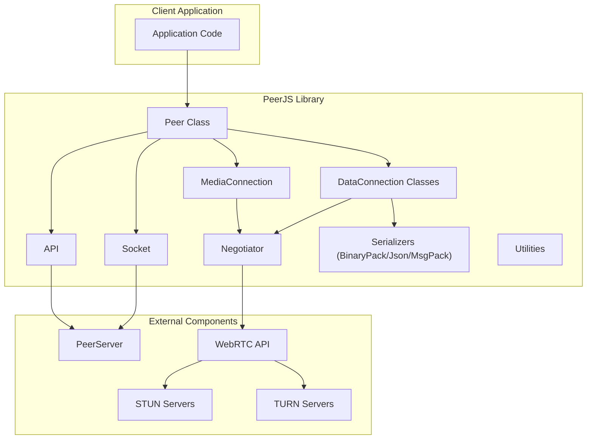
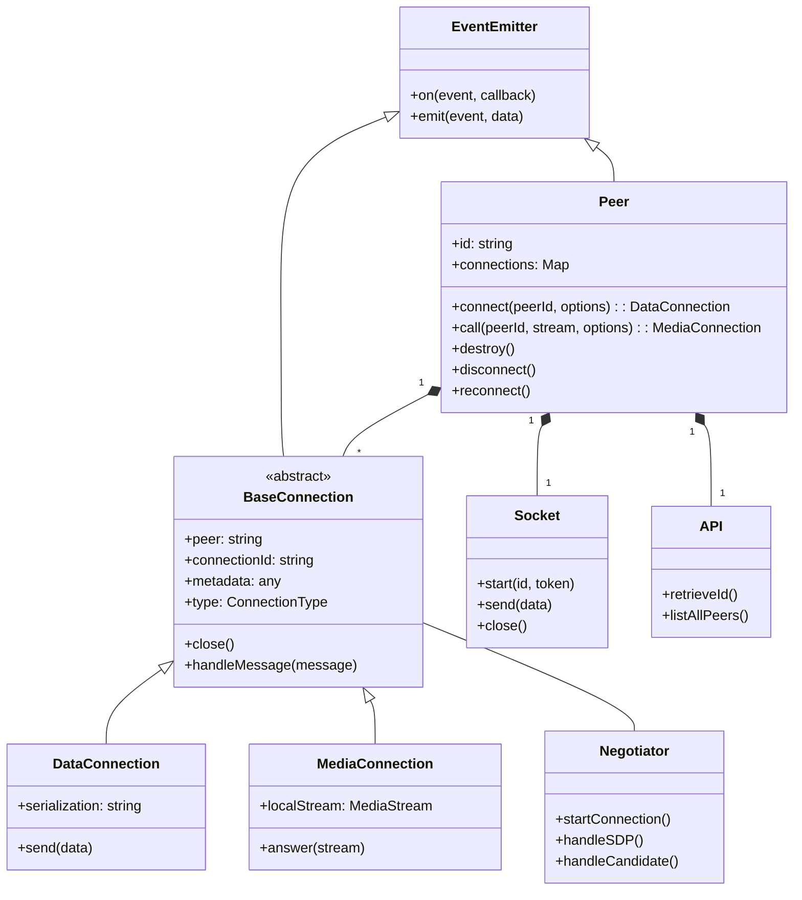
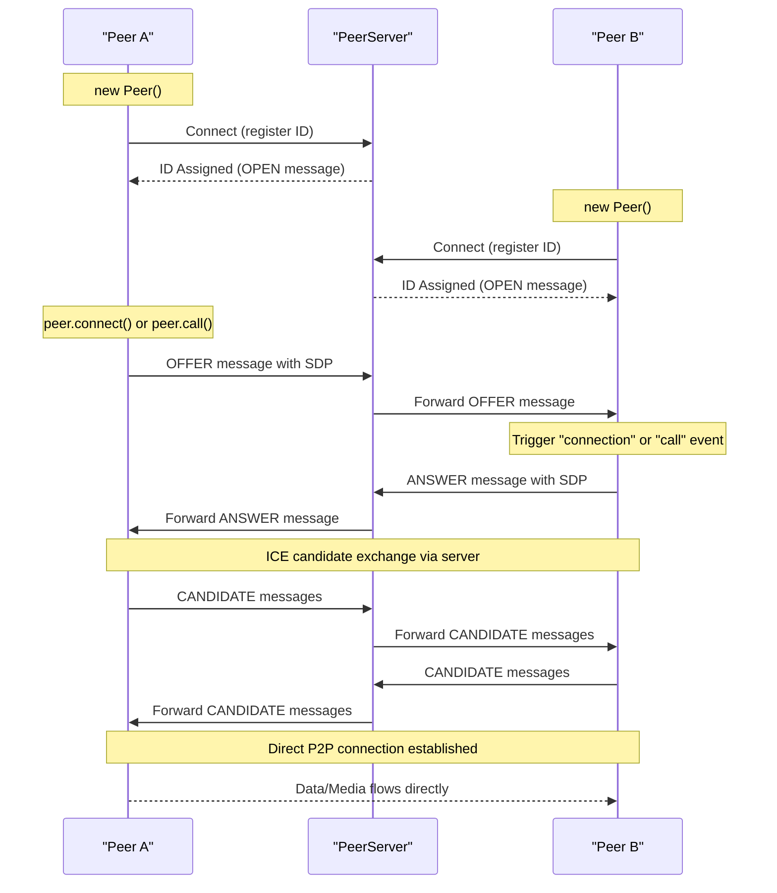
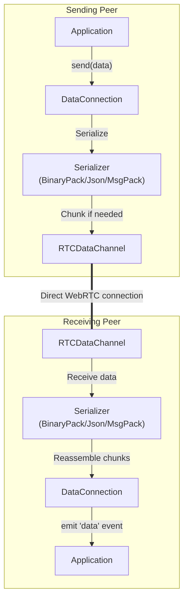
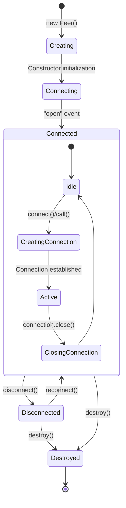
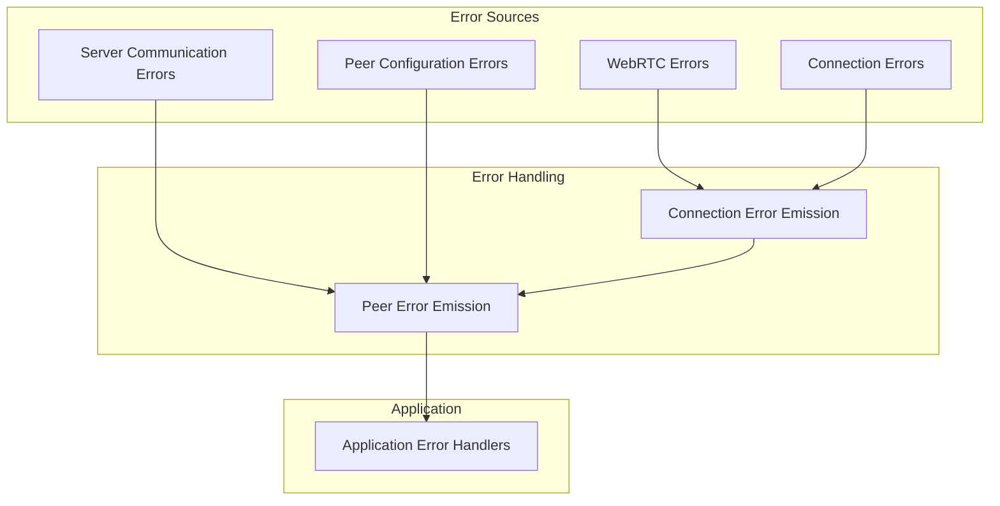
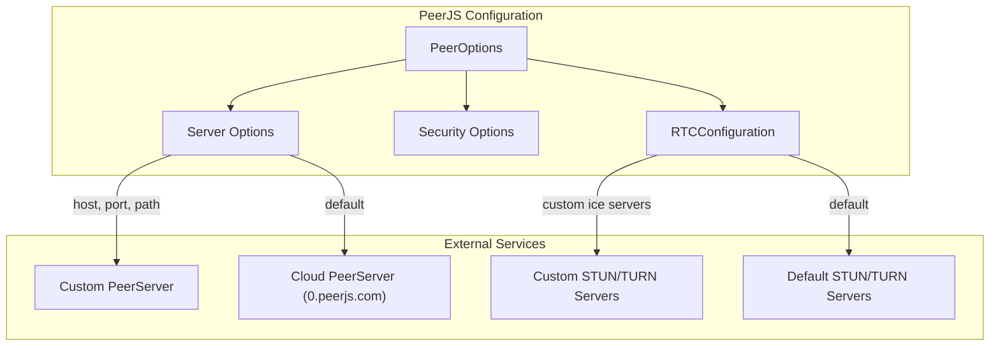

# Architecture

관련 소스 파일

이 위키 페이지를 생성하는 컨텍스트로 다음 파일들이 사용되었습니다:

- [README.md](README.md)
- [lib/api.ts](lib/api.ts)
- [lib/baseconnection.ts](lib/baseconnection.ts)
- [lib/enums.ts](lib/enums.ts)
- [lib/exports.ts](lib/exports.ts)
- [lib/logger.ts](lib/logger.ts)
- [lib/optionInterfaces.ts](lib/optionInterfaces.ts)
- [lib/peer.ts](lib/peer.ts)
- [lib/servermessage.ts](lib/servermessage.ts)
- [lib/socket.ts](lib/socket.ts)
- [tsconfig.json](tsconfig.json)

이 문서는 PeerJS 아키텍처의 개요를 제공하며, 라이브러리가 어떻게 구조화되어 있고 WebRTC 기반 peer-to-peer 통신을 가능하게 하기 위해 각 구성 요소가 어떻게 상호작용하는지 설명합니다. 개별 구성 요소에 대한 정보는 [Core Components](#2.1)를, 연결이 설정되고 관리되는 방식에 대한 자세한 내용은 [Connection Flow](#2.2)를 참고하세요.

## 시스템 개요

PeerJS는 peer 탐색과 초기 연결 설정에는 중앙집중식 시그널링 서버(PeerServer)를 사용하고, 그 이후에는 WebRTC를 통한 직접 peer-to-peer 통신을 사용하는 하이브리드 아키텍처로 설계되었습니다. 이 접근 방식은 복잡한 WebRTC API를 단순화하면서도 직접 연결의 성능 이점을 유지합니다.

Sources: [lib/peer.ts:113-744](), [lib/socket.ts:10-172](), [lib/api.ts:6-85]()

## 핵심 구성 요소 구조

PeerJS 라이브러리는 WebRTC 기능을 위한 단순한 인터페이스를 제공하기 위해 함께 동작하는 여러 상호 연관된 구성 요소로 이루어져 있습니다:

Sources: [lib/peer.ts:113-144](), [lib/baseconnection.ts:32-91](), [lib/socket.ts:10-20](), [lib/api.ts:6-7]()

## 주요 구성 요소의 책임

PeerJS 아키텍처는 관심사를 분리하여 각 구성 요소가 명확한 책임을 갖도록 구성합니다:

| Component | Responsibility | Key Files |
|-----------|---------------|-----------|
| **Peer** | 주요 진입점이자 컨트롤러로서 peer 식별자와 연결을 관리 | [lib/peer.ts]() |
| **BaseConnection** | 연결을 위한 추상 기반 클래스로 공통 기능 정의 | [lib/baseconnection.ts]() |
| **DataConnection** | peer 간 데이터 전송 관리 | [lib/dataconnection/*.ts]() |
| **MediaConnection** | peer 간 미디어 스트림 처리 | [lib/mediaconnection.ts]() |
| **Socket** | PeerServer와의 WebSocket 통신 관리 | [lib/socket.ts]() |
| **API** | PeerServer에 대한 HTTP 요청 처리(예: ID 조회) | [lib/api.ts]() |
| **Negotiator** | WebRTC 연결 협상과 ICE candidate 교환 관리 | [lib/negotiator.ts]() |
| **Serializers** | 데이터 직렬화 처리(BinaryPack, JSON, MsgPack) | [lib/dataconnection/BufferedConnection/*.ts]() |

Sources: [lib/exports.ts:1-27](), [lib/peer.ts:113-196](), [lib/socket.ts:6-11](), [lib/api.ts:6-7]()

## 연결 설정 흐름

두 peer 간 연결을 설정하는 과정은 시그널링 서버와 직접 WebRTC 연결 양쪽에서 여러 단계를 거칩니다:

Sources: [lib/peer.ts:348-458](), [lib/socket.ts:33-85](), [lib/peer.ts:484-555]()

## 데이터 흐름과 직렬화

PeerJS는 데이터 전송을 위해 여러 직렬화 방식을 지원하며, 각 방식은 송신자에서 수신자까지 특정 경로를 따릅니다:

Sources: [lib/peer.ts:116-123](), [lib/exports.ts:19-22]()

## Peer 수명주기 관리

`Peer` 클래스는 생성부터 종료까지 peer 연결의 수명주기를 관리합니다:

Sources: [lib/peer.ts:195-212](), [lib/peer.ts:640-730]()

## 오류 처리 아키텍처

PeerJS는 구성 요소 계층 구조를 통해 오류를 전파하는 포괄적인 오류 처리 시스템을 구현합니다:

Sources: [lib/enums.ts:6-61](), [lib/enums.ts:63-71](), [lib/peer.ts:107-108]()

## 외부 구성 요소와의 통합

PeerJS는 기능 구현을 위해 여러 외부 구성 요소에 의존합니다:

1. **PeerServer**: peer 탐색과 연결 설정을 지원하는 시그널링 서버
2. **WebRTC API**: peer-to-peer 연결 설정을 위한 브라우저의 네이티브 WebRTC 구현
3. **STUN/TURN Servers**: NAT 트래버설 및 직접 연결이 불가능할 때의 대체 릴레이용 서버

라이브러리는 `Peer` 생성자 옵션을 통해 이러한 외부 구성 요소와의 연결을 커스터마이즈할 수 있는 구성 옵션을 제공합니다:

Sources: [lib/peer.ts:25-68](), [lib/optionInterfaces.ts:8-18]()

## 요약

PeerJS 아키텍처는 WebRTC의 복잡성을 추상화하면서도 peer-to-peer 통신을 위한 견고하고 유연한 API를 제공하는 계층형 설계를 채택합니다. 이 라이브러리는 연결 설정을 위해 중앙 시그널링 서버를 사용하고, 데이터 및 미디어 전송에는 직접 peer-to-peer 연결을 사용하는 하이브리드 접근 방식을 사용합니다. 이 설계는 효율적인 통신을 가능하게 하면서도 개발자 경험을 단순화합니다.

핵심 구성 요소(Peer, DataConnection, MediaConnection, Socket, API, Negotiator)는 다양한 직렬화 방식과 연결 유형을 지원하면서 WebRTC 기반 peer-to-peer 애플리케이션을 위한 완전한 솔루션을 함께 제공합니다.

핵심 구성 요소와 그 기능에 대한 더 자세한 정보는 [Core Components](#2.1)를, 연결 흐름에 대한 심층 설명은 [Connection Flow](#2.2)를 참고하세요.
