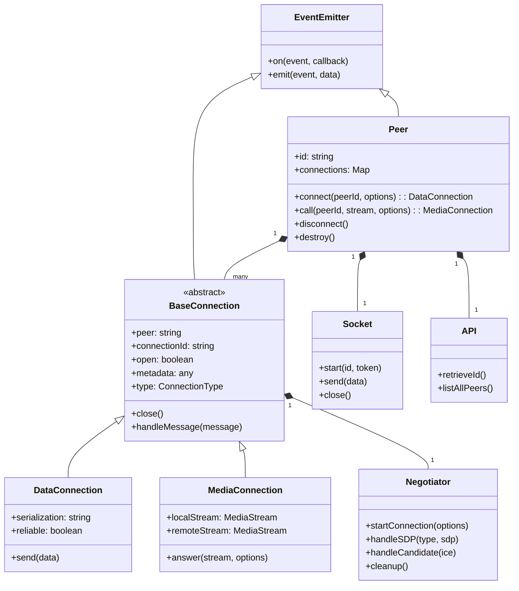
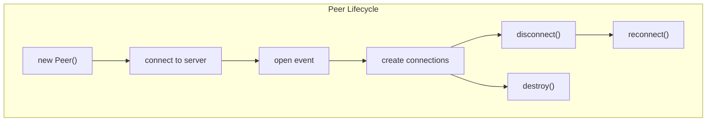
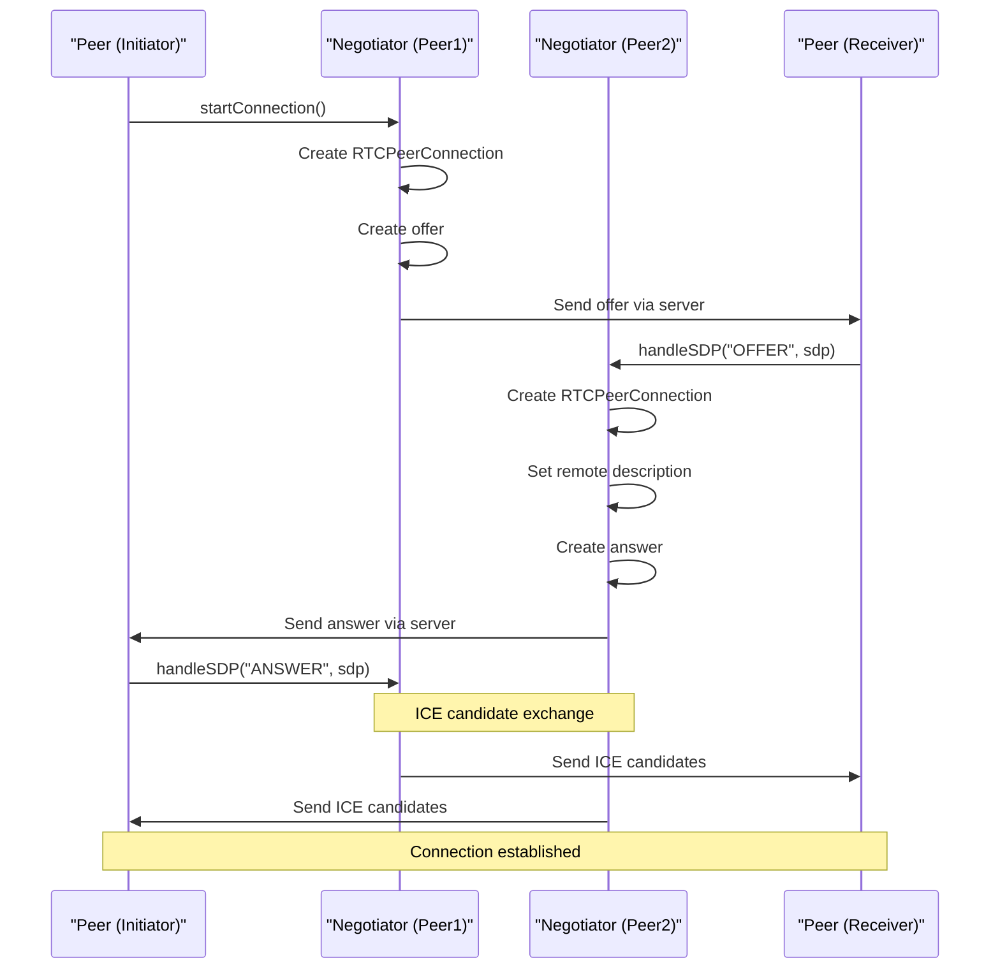
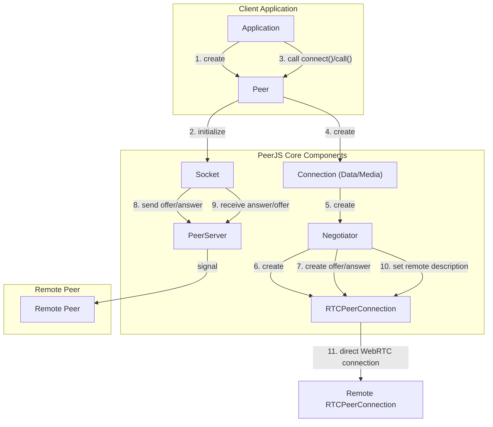
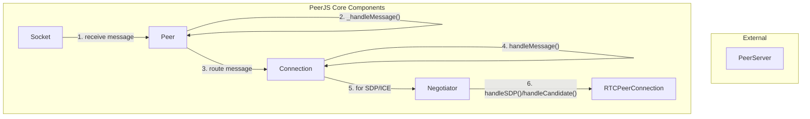

# Core Components

관련 소스 파일

이 위키 페이지를 생성하는 컨텍스트로 다음 파일들이 사용되었습니다:

- [lib/baseconnection.ts](lib/baseconnection.ts)
- [lib/enums.ts](lib/enums.ts)
- [lib/exports.ts](lib/exports.ts)
- [lib/mediaconnection.ts](lib/mediaconnection.ts)
- [lib/negotiator.ts](lib/negotiator.ts)
- [lib/peer.ts](lib/peer.ts)
- [lib/servermessage.ts](lib/servermessage.ts)

이 페이지는 PeerJS 라이브러리의 핵심을 이루는 주요 구성 요소를 설명하며, 각 구성 요소의 책임과 상호작용에 초점을 맞춥니다. 연결이 설정되고 관리되는 방식에 대한 자세한 내용은 [Connection Flow](#2.2)를 참고하세요.

## 개요

PeerJS는 WebRTC 위에 구축된 단순한 peer-to-peer 통신 API를 제공하기 위해 함께 동작하는 여러 핵심 구성 요소를 중심으로 구성되어 있습니다. 핵심 구성 요소는 다음과 같습니다:

1. **Peer** - peer를 나타내고 연결을 관리하는 주요 진입점 클래스
2. **BaseConnection** - 모든 연결 유형을 위한 추상 기반 클래스
3. **DataConnection** - peer-to-peer 데이터 연결 처리
4. **MediaConnection** - peer-to-peer 미디어(오디오/비디오) 연결 처리
5. **Negotiator** - WebRTC 협상 프로세스 관리
6. **Socket** - 시그널링을 위해 PeerServer와의 통신 처리
7. **API** - PeerServer API와 상호작용하는 메서드 제공

이 구성 요소들은 PeerJS 라이브러리의 기반을 이루며, 개발자가 WebRTC의 복잡성을 직접 다루지 않고도 쉽게 peer-to-peer 연결을 설정할 수 있게 해줍니다.

## 구성 요소 아키텍처

Sources: [lib/peer.ts:113-744](), [lib/baseconnection.ts:32-91](), [lib/mediaconnection.ts:31-187](), [lib/negotiator.ts:16-367]()

## Peer

`Peer` 클래스는 PeerJS 라이브러리의 주요 진입점입니다. 네트워크 상의 peer를 나타내며 다른 peer와의 모든 연결을 관리합니다.

### Responsibilities

- 다른 peer와의 데이터 및 미디어 연결 생성 및 관리
- 시그널링을 위한 PeerServer와의 통신
- 서버와 다른 peer로부터의 메시지 처리
- peer의 수명주기 관리(connect, disconnect, destroy)

### Key Methods

| Method | Description |
|--------|-------------|
| `connect(peerId, options)` | 다른 peer에 대한 데이터 연결 생성 |
| `call(peerId, stream, options)` | 다른 peer에 대한 미디어 연결 생성 |
| `disconnect()` | 연결은 닫지 않고 PeerServer와의 연결만 해제 |
| `destroy()` | 모든 연결을 닫고 서버와 연결 해제 |
| `reconnect()` | 동일한 ID로 서버에 다시 연결 시도 |
| `listAllPeers(cb)` | 서버에서 사용 가능한 모든 peer ID 목록 조회 |

`Peer` 클래스는 `EventEmitterWithError`를 확장하며 연결 설정, peer 연결, 호출, 오류 등과 관련된 이벤트를 발생시킵니다.

Sources: [lib/peer.ts:113-744]()

## 연결

PeerJS에는 두 가지 주요 연결 유형이 있습니다: 임의의 데이터를 전송하는 `DataConnection`과 오디오/비디오 스트림을 위한 `MediaConnection`입니다. 두 유형 모두 추상 `BaseConnection` 클래스를 상속합니다.

### BaseConnection

`BaseConnection` 클래스는 모든 연결 유형에 공통된 기능을 제공합니다:

- 연결 상태(open, closed) 추적
- 연결과 연관된 메타데이터 관리
- 기본 이벤트(close, error) 처리
- 내부 WebRTC `RTCPeerConnection`에 대한 접근 제공

Sources: [lib/baseconnection.ts:32-91]()

### MediaConnection

`MediaConnection` 클래스는 peer-to-peer 미디어(오디오/비디오) 연결을 처리합니다. `Peer` 인스턴스에서 `call()` 메서드를 사용할 때 생성되거나 다른 peer로부터 호출을 수신할 때 생성됩니다.

#### Responsibilities

- 미디어 스트림(로컬 및 원격) 관리
- 호출에 응답하는 메서드 제공
- `Negotiator`를 통한 WebRTC 미디어 협상 처리

#### Key Methods

| Method | Description |
|--------|-------------|
| `answer(stream, options)` | 들어오는 호출을 수락하고 선택적으로 미디어 스트림 전송 |
| `close()` | 미디어 연결 종료 |
| `addStream(stream)` | 연결에 원격 스트림 추가 |

Sources: [lib/mediaconnection.ts:31-187]()

### DataConnection

`DataConnection`은 직렬화기별 연결 클래스가 구현하는 인터페이스입니다. peer-to-peer 데이터 연결을 처리합니다.

#### Responsibilities

- peer 간 데이터 전송 관리
- 데이터 직렬화 및 역직렬화
- 대용량 데이터 전송을 위한 청크 처리

#### Serialization Options

PeerJS는 여러 직렬화 방식을 지원합니다:

1. **BinaryPack** - 기본 직렬화기이며 모든 데이터 유형을 처리
2. **Json** - JSON 직렬화를 사용하며 JSON 호환 데이터 유형으로 제한됨
3. **Raw** - 최대 성능을 위해 직렬화 없이 데이터 전송

Sources: [lib/peer.ts:116-123]()

## Negotiator

`Negotiator` 클래스는 peer 간 WebRTC 협상 프로세스를 관리합니다. 각 연결(데이터 또는 미디어)은 자체 `Negotiator` 인스턴스를 가집니다.

### Responsibilities

- `RTCPeerConnection` 생성 및 관리
- SDP offer/answer 교환 처리
- ICE candidate 처리
- 데이터 채널 또는 미디어 트랙 설정

### Key Methods

| Method | Description |
|--------|-------------|
| `startConnection(options)` | WebRTC 연결 프로세스 시작 |
| `handleSDP(type, sdp)` | 수신한 SDP 메시지(offer/answer) 처리 |
| `handleCandidate(ice)` | 수신한 ICE candidate 처리 |
| `cleanup()` | 더 이상 필요하지 않을 때 peer 연결 정리 |

Sources: [lib/negotiator.ts:16-367]()

## Socket and API

`Socket`과 `API` 클래스는 peer 간 초기 연결과 시그널링에 필수적인 PeerServer와의 통신을 처리합니다.

### Socket

`Socket` 클래스는 PeerServer에 대한 WebSocket 연결을 관리합니다.

#### Responsibilities

- PeerServer와의 연결 설정 및 유지
- 서버로 메시지 전송
- 서버 메시지를 수신하여 `Peer` 인스턴스로 전달
- 연결 오류와 연결 해제 이벤트 처리

Sources: [lib/peer.ts:301-340]()

### API

`API` 클래스는 PeerServer의 REST API와 상호작용하는 메서드를 제공합니다.

#### Responsibilities

- 서버로부터 고유 ID 조회
- 서버에서 사용 가능한 모든 peer 목록 조회

#### Key Methods

| Method | Description |
|--------|-------------|
| `retrieveId()` | 서버로부터 고유 ID 조회 |
| `listAllPeers()` | 사용 가능한 모든 peer ID 목록 조회 |

Sources: [lib/peer.ts:272-272](), [lib/peer.ts:738-743]()

## 통신 흐름

### 연결 설정 흐름

Sources: [lib/peer.ts:294-340](), [lib/negotiator.ts:194-259](), [lib/negotiator.ts:261-303]()

### 메시지 처리 흐름

Sources: [lib/peer.ts:349-458](), [lib/mediaconnection.ts:96-113](), [lib/negotiator.ts:306-338]()

## 수명주기 관리

PeerJS 구성 요소는 메모리 누수를 방지하고 올바른 정리를 보장하기 위해 정확히 관리해야 하는 명확한 수명주기를 가집니다.

### Peer 수명주기

- **Creation**: 선택적 ID와 함께 새로운 `Peer` 인스턴스 생성
- **Connection**: peer가 PeerServer에 연결
- **Open**: 서버와의 연결이 설정되고 peer ID가 확인됨
- **Active**: peer가 연결을 생성하고 수신할 수 있음
- **Disconnection**: peer가 서버와 연결을 끊지만 기존 연결은 유지
- **Destruction**: 모든 연결이 닫히고 peer ID가 해제됨

### 연결 수명주기

- **Creation**: `connect()` 또는 `call()`을 통해 새로운 연결 생성
- **Negotiation**: `Negotiator`를 통해 WebRTC 협상 수행
- **Open**: 연결이 설정되고 사용 준비 완료
- **Active**: 데이터/미디어 교환
- **Close**: 연결이 닫히고 리소스 해제

Sources: [lib/peer.ts:626-674](), [lib/mediaconnection.ts:160-186]()
