# Connection Flow

<details>
<summary>관련 소스 파일</summary>

이 위키 페이지를 생성하는 컨텍스트로 다음 파일들이 사용되었습니다:

- [lib/api.ts](lib/api.ts)
- [lib/exports.ts](lib/exports.ts)
- [lib/logger.ts](lib/logger.ts)
- [lib/mediaconnection.ts](lib/mediaconnection.ts)
- [lib/negotiator.ts](lib/negotiator.ts)
- [lib/optionInterfaces.ts](lib/optionInterfaces.ts)
- [lib/peer.ts](lib/peer.ts)
- [lib/socket.ts](lib/socket.ts)
- [tsconfig.json](tsconfig.json)

</details>


이 페이지는 PeerJS에서 peer-to-peer 연결을 설정하고 관리하는 과정을 설명합니다. 시그널링 메커니즘, WebRTC 협상, 데이터 및 미디어 연결의 수명주기를 다룹니다. 데이터 직렬화 메커니즘에 대한 정보는 [Data Serialization](#2.3)을 참고하세요.

## 개요

PeerJS 연결 흐름은 두 개의 주요 단계로 이루어집니다:
1. **Signaling Phase**: peer들이 중앙집중식 PeerServer에 연결하여 연결 정보를 교환
2. **P2P Connection Phase**: 시그널링이 완료된 후 peer들이 직접 WebRTC 연결을 설정

다음 다이어그램은 상위 수준의 연결 흐름을 보여줍니다:

```mermaid
sequenceDiagram
    participant PeerA as "Peer (Initiator)"
    participant Server as "PeerServer"
    participant PeerB as "Peer (Receiver)"
    
    Note over PeerA,PeerB: 1. Signaling Phase
    PeerA->>Server: Connect & register ID
    PeerB->>Server: Connect & register ID
    
    PeerA->>Server: Send connection offer
    Server->>PeerB: Forward offer
    PeerB->>Server: Send answer
    Server->>PeerA: Forward answer
    
    Note over PeerA,PeerB: ICE candidate exchange via server
    
    Note over PeerA,PeerB: 2. P2P Connection Phase
    PeerA<-->PeerB: Direct WebRTC connection established
    
    Note over PeerA,PeerB: Data/Media flows directly between peers
```

Sources: [lib/peer.ts:143-144](), [lib/peer.ts:490-516](), [lib/peer.ts:524-555](), [lib/negotiator.ts:22-48]()

## 연결 초기화

새로운 `Peer` 인스턴스가 생성되면, `Socket` 객체를 통해 PeerServer에 연결하고 자신의 ID를 등록합니다. 이 ID는 사용자가 제공하거나 서버가 생성합니다.

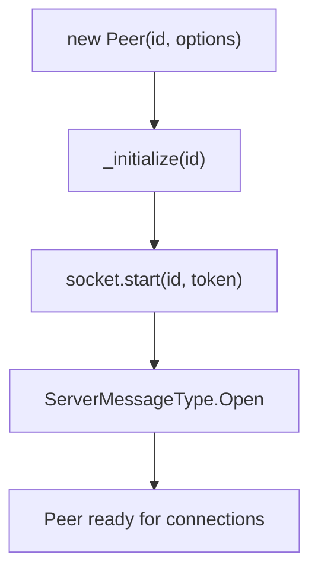

Sources: [lib/peer.ts:213-298](), [lib/peer.ts:343-346](), [lib/socket.ts:33-85]()

### Socket 연결 설정

`Socket` 클래스는 정의된 프로토콜에 따라 PeerServer에 대한 WebSocket 연결을 관리합니다:

1. 소켓은 peer의 ID와 토큰으로 서버에 연결합니다
2. 연결되면 대기 중인 메시지를 처리하고 heartbeat를 시작합니다
3. 소켓은 서버 메시지를 처리하고 적절한 핸들러로 분배합니다

`Peer` 객체는 연결 설정을 처리하기 위해 특정 메시지 유형을 수신합니다:

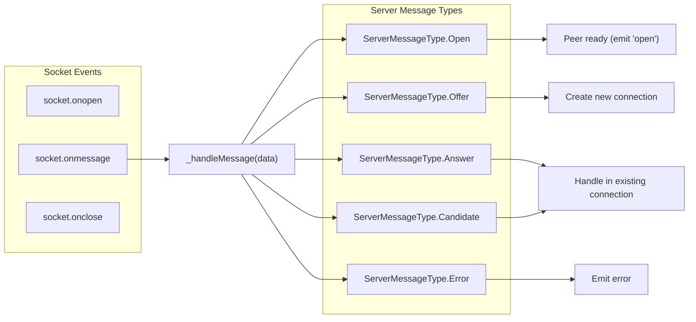

Sources: [lib/socket.ts:10-172](), [lib/peer.ts:349-458]()

## 연결 생성

PeerJS는 두 가지 연결 유형을 지원합니다:

1. **Data Connections**: 임의의 데이터를 송수신하기 위한 연결
2. **Media Connections**: 오디오/비디오 스트리밍을 위한 연결

### 연결 시작

peer가 연결을 시작할 때는 다음 과정을 따릅니다:

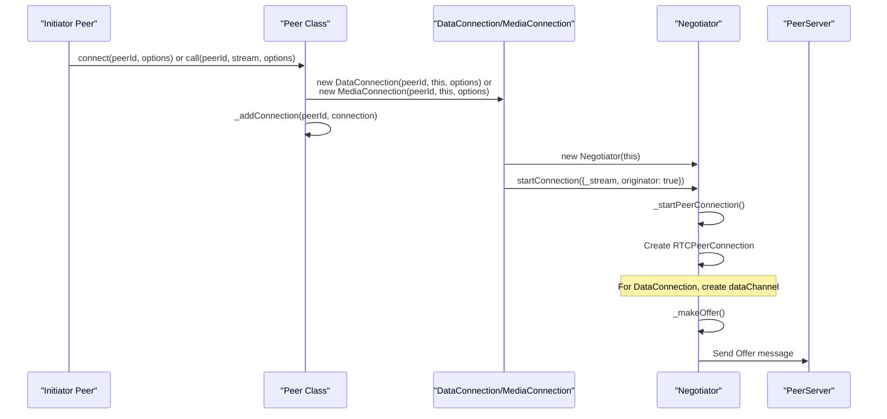

Sources: [lib/peer.ts:490-516](), [lib/peer.ts:524-555](), [lib/negotiator.ts:22-48](), [lib/negotiator.ts:194-259]()

### 연결 수신

peer가 연결 요청을 수신할 때의 과정은 다음과 같습니다:

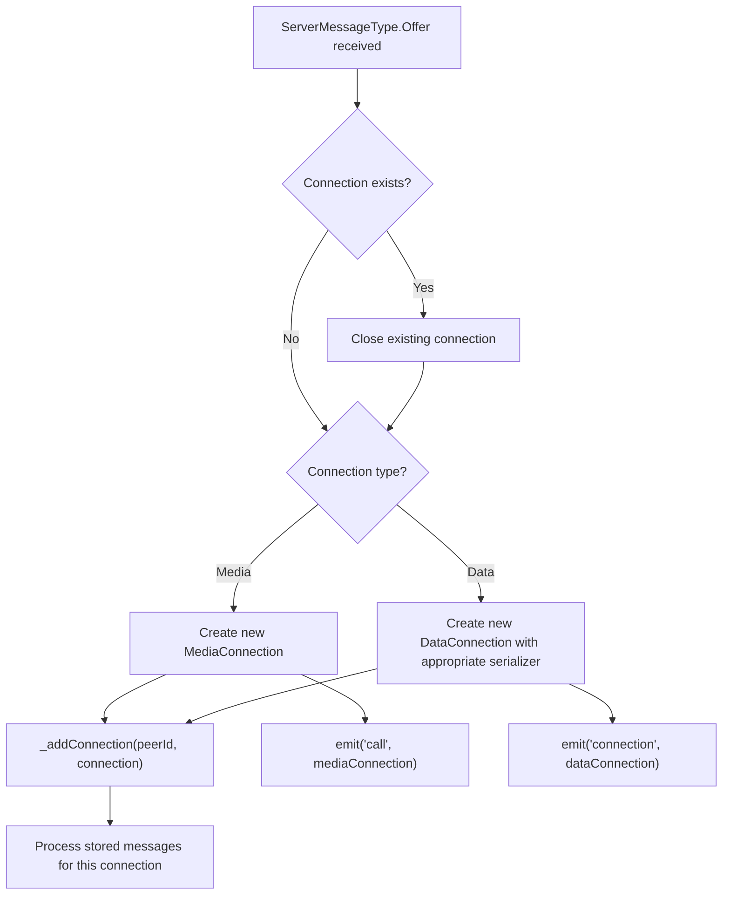

Sources: [lib/peer.ts:383-434](), [lib/mediaconnection.ts:54-70]()

## WebRTC 협상 과정

`Negotiator` 클래스는 peer 간의 모든 WebRTC 협상을 처리합니다. 여기에는 offer와 answer 생성, Session Description Protocol(SDP) 메시지 처리, ICE candidate 관리가 포함됩니다.

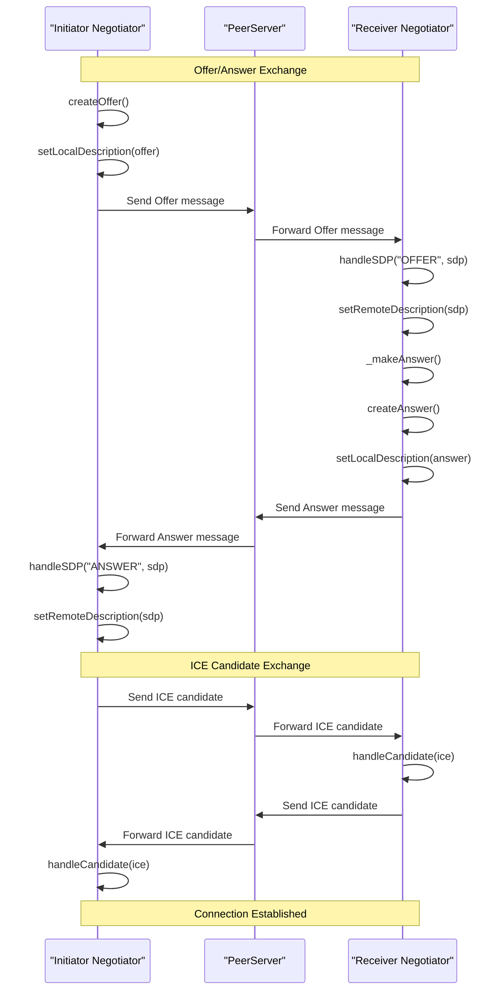

Sources: [lib/negotiator.ts:194-338]()

### ICE candidate 처리

ICE(Interactive Connectivity Establishment) candidate는 peer 간 최적의 네트워크 경로를 결정하기 위해 교환됩니다:

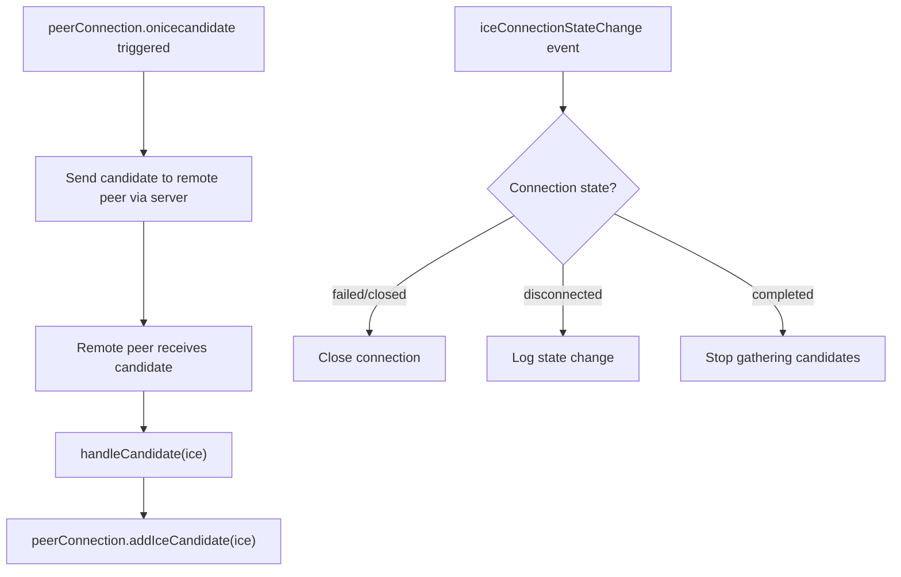

Sources: [lib/negotiator.ts:64-127](), [lib/negotiator.ts:327-338]()

## 데이터 연결과 미디어 연결 처리의 차이

PeerJS는 요구 사항에 따라 데이터 연결과 미디어 연결을 다르게 처리합니다:

### 데이터 연결 흐름

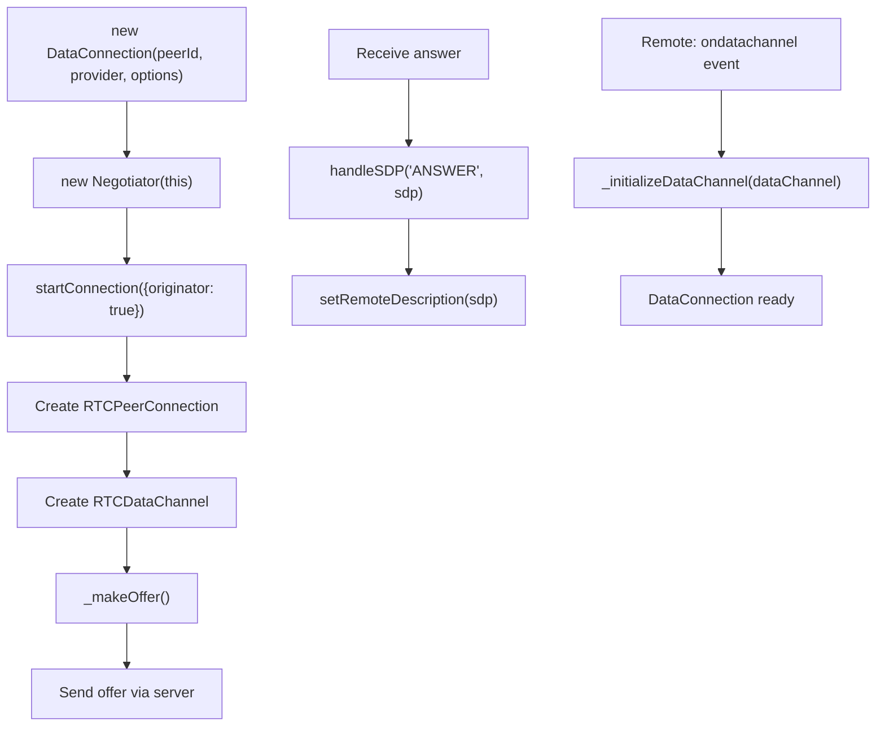

Sources: [lib/negotiator.ts:22-48](), [lib/negotiator.ts:131-142]()

### 미디어 연결 흐름

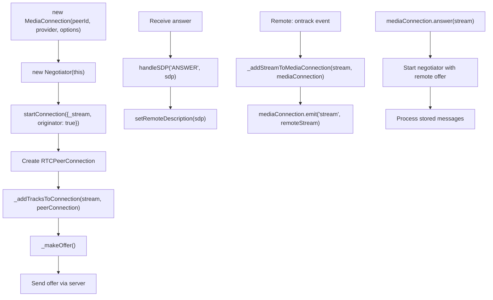

Sources: [lib/mediaconnection.ts:54-151](), [lib/negotiator.ts:147-158](), [lib/negotiator.ts:357-366]()

## 연결 수명주기 관리

`Peer` 클래스는 생성, 추적, 정리를 포함한 모든 연결의 수명주기를 관리합니다.

### 연결 추적

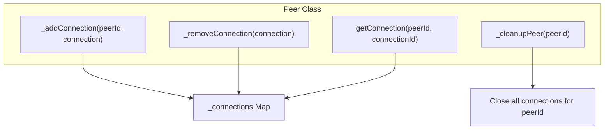

Sources: [lib/peer.ts:558-605](), [lib/peer.ts:656-674]()

### 연결 종료

연결은 여러 방식으로 종료될 수 있습니다:

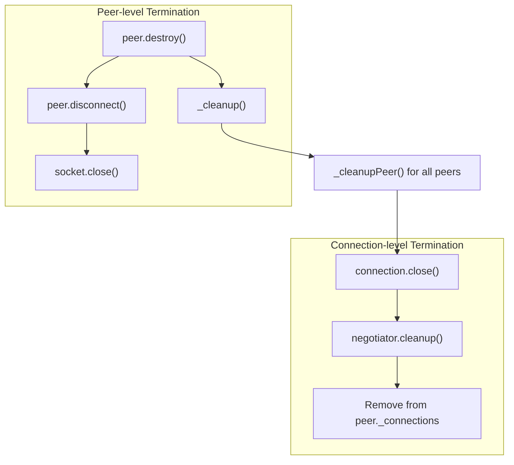

Sources: [lib/peer.ts:640-674](), [lib/peer.ts:682-700](), [lib/mediaconnection.ts:160-186](), [lib/negotiator.ts:161-192]()

## 메시지 처리와 저장

PeerJS는 연결이 완전히 설정되기 전에 도착한 메시지를 처리하기 위해 메시지 큐 시스템을 사용합니다:

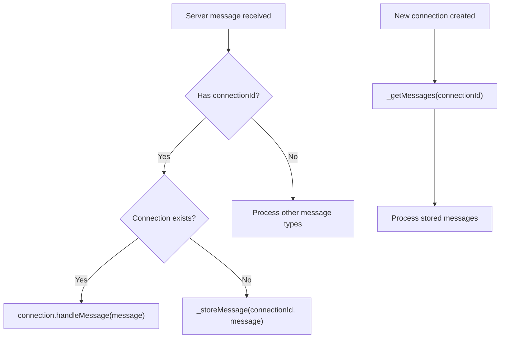

Sources: [lib/peer.ts:349-483]()

## 연결 흐름에서의 오류 처리

PeerJS는 다양한 연결 시나리오에 대해 포괄적인 오류 처리 전략을 구현합니다:

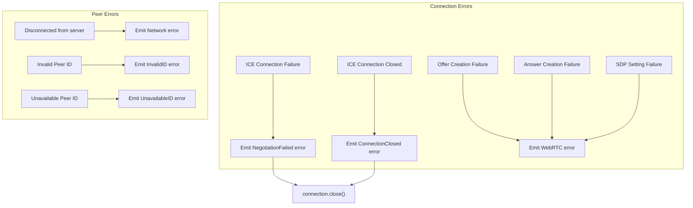

Sources: [lib/negotiator.ts:90-127](), [lib/negotiator.ts:195-259](), [lib/negotiator.ts:261-325](), [lib/peer.ts:354-365]()

## 연결 흐름 요약

PeerJS 연결 흐름은 다음과 같이 요약할 수 있습니다:

1. peer들이 시그널링 서버(PeerServer)에 연결합니다
2. 시작 peer가 연결 offer를 생성합니다
3. offer가 서버를 통해 대상 peer로 전송됩니다
4. 대상 peer가 answer를 생성해 다시 전송합니다
5. 두 peer는 서버를 통해 ICE candidate를 교환합니다
6. 협상이 완료되면 직접적인 P2P WebRTC 연결이 설정됩니다
7. 데이터 또는 미디어는 서버 중개 없이 peer 간에 직접 흐를 수 있습니다
8. 연결은 명시적으로 닫히거나 오류가 발생할 때까지 유지됩니다

이 아키텍처는 PeerJS가 WebRTC 시그널링과 협상의 복잡성을 내부에서 처리하면서도 견고한 peer-to-peer 연결을 만들기 위한 단순한 API를 제공할 수 있게 해줍니다.

Sources: [lib/peer.ts](), [lib/negotiator.ts](), [lib/socket.ts](), [lib/mediaconnection.ts]()
