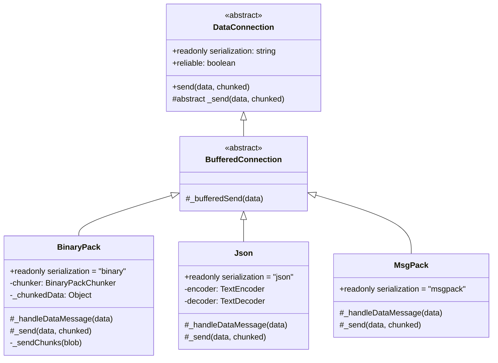
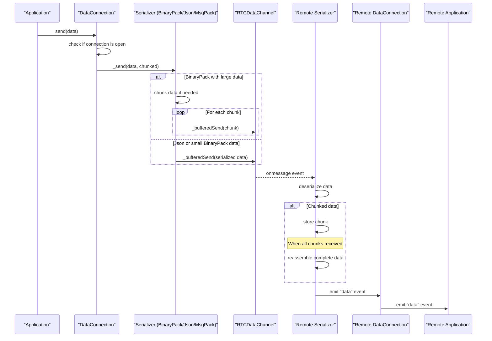
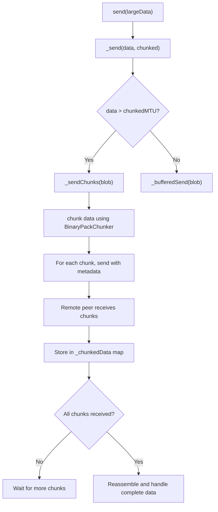

# Data Serialization

<details>
<summary>관련 소스 파일</summary>

이 위키 페이지를 생성하는 컨텍스트로 다음 파일들이 사용되었습니다:

- [e2e/datachannel/blobs.js](e2e/datachannel/blobs.js)
- [e2e/datachannel/files.js](e2e/datachannel/files.js)
- [e2e/datachannel/serialization.js](e2e/datachannel/serialization.js)
- [lib/dataconnection/BufferedConnection/BinaryPack.ts](lib/dataconnection/BufferedConnection/BinaryPack.ts)
- [lib/dataconnection/BufferedConnection/Json.ts](lib/dataconnection/BufferedConnection/Json.ts)
- [lib/dataconnection/DataConnection.ts](lib/dataconnection/DataConnection.ts)
- [lib/msgPackPeer.ts](lib/msgPackPeer.ts)
- [lib/peerError.ts](lib/peerError.ts)

</details>


## 목적과 개요

이 문서는 PeerJS 라이브러리에서 peer 간 데이터가 어떻게 직렬화되고, 청크로 분할되며, 전송되는지 자세히 설명합니다. 직렬화 아키텍처, 지원되는 직렬화 형식, 대용량 데이터 전송에 사용되는 청킹 메커니즘을 다룹니다.

PeerJS는 애플리케이션 요구에 맞게 데이터 전송을 최적화할 수 있도록 여러 직렬화 옵션을 제공합니다. 이 시스템은 JavaScript 객체 및 기타 데이터 유형을 WebRTC 데이터 채널을 통해 효율적으로 전송할 수 있는 형식으로 변환하고, 수신 측에서 이를 다시 재구성하는 작업을 처리합니다.

peer 간 연결 설정에 대한 정보는 [Connection Flow](#2.2)를 참고하세요.

Sources: [lib/dataconnection/DataConnection.ts:126-139](), [lib/dataconnection/BufferedConnection/BinaryPack.ts:1-7](), [lib/dataconnection/BufferedConnection/Json.ts:1-5]()

## 직렬화 아키텍처

PeerJS는 서로 교체 가능한 다양한 직렬화 전략을 사용할 수 있는 유연한 아키텍처를 통해 직렬화를 구현합니다.



추상 클래스 `DataConnection`은 모든 직렬화 구현을 위한 인터페이스를 정의합니다. 각 구체 구현은 `_send` 및 `_handleDataMessage` 메서드를 통해 자체 직렬화 및 역직렬화 로직을 제공합니다.

Sources: [lib/dataconnection/DataConnection.ts:31-161](), [lib/dataconnection/BufferedConnection/BinaryPack.ts:8-109](), [lib/dataconnection/BufferedConnection/Json.ts:5-38]()

## 데이터 흐름

다음 다이어그램은 데이터가 직렬화 시스템을 통해 흐르는 방식을 보여줍니다:



Sources: [lib/dataconnection/DataConnection.ts:126-139](), [lib/dataconnection/BufferedConnection/BinaryPack.ts:27-75](), [lib/dataconnection/BufferedConnection/Json.ts:13-25]()

## 지원되는 직렬화 형식

PeerJS는 세 가지 직렬화 형식을 지원합니다:

### 1. BinaryPack

기본값이자 가장 범용적인 직렬화 형식입니다. Blobs, Files, ArrayBuffers, 일반 객체를 포함한 모든 JavaScript 데이터 유형을 처리할 수 있습니다.

주요 기능:
- 대용량 데이터 전송을 위한 청킹 지원
- 바이너리 데이터를 효율적으로 처리
- 직렬화에 `peerjs-js-binarypack` 라이브러리 사용

구현:
- [lib/dataconnection/BufferedConnection/BinaryPack.ts]()에 위치
- 최대 전송 단위(MTU)를 초과하는 데이터를 청크로 분할
- 수신 측에서 청크 데이터를 재조립

### 2. JSON

표준 JSON 인코딩을 사용하는 더 단순한 직렬화 형식입니다.

주요 기능:
- 사람이 읽을 수 있는 텍스트로 저장되므로 디버깅이 쉬움
- JSON이 표현할 수 있는 데이터 유형으로 제한됨(바이너리 데이터 불가)
- 메시지 크기 제한이 있어 매우 큰 메시지는 처리할 수 없음

구현:
- [lib/dataconnection/BufferedConnection/Json.ts]()에 위치
- 문자열과 바이너리 데이터 간 변환에 `TextEncoder`와 `TextDecoder` 사용
- 메시지 크기가 chunked MTU를 초과하면 오류를 발생시킴

### 3. MsgPack (Experimental)

BinaryPack과 유사하지만 payload 크기가 더 작은 효율적인 바이너리 직렬화 형식입니다.

주요 기능:
- JSON보다 더 압축된 표현
- 더 빠른 직렬화/역직렬화
- 코드베이스에서 experimental로 표시됨

구현:
- [lib/msgPackPeer.ts]()에서 참조
- 기본적으로 MsgPack 직렬화를 사용하도록 설정된 특수 `MsgPackPeer` 클래스

Sources: [lib/dataconnection/BufferedConnection/BinaryPack.ts:8-109](), [lib/dataconnection/BufferedConnection/Json.ts:5-38](), [lib/msgPackPeer.ts:1-12]()

## 대용량 데이터 청킹

BinaryPack 직렬화를 사용해 큰 데이터(MTU 초과)를 전송할 때 PeerJS는 데이터를 자동으로 더 작은 조각으로 분할합니다.



청킹 과정은 다음과 같습니다:

1. 최대 전송 단위(MTU)를 초과하는 데이터를 전송할 때 `BinaryPack` 직렬화기가 이를 청크로 분할합니다
2. 각 청크에는 메타데이터(id, chunk 번호, 전체 청크 수)가 태그됩니다
3. 청크는 데이터 채널을 통해 개별적으로 전송됩니다
4. 수신 peer는 id를 기준으로 인덱싱된 맵에 청크를 저장합니다
5. 특정 id에 대한 모든 청크가 수신되면 이를 재조립합니다
6. 완성된 데이터는 이후 역직렬화되어 `'data'` 이벤트로 발생합니다

Sources: [lib/dataconnection/BufferedConnection/BinaryPack.ts:50-108]()

## 다양한 직렬화 형식 사용

### 직렬화 형식 선택

peer 간 연결을 설정할 때 사용할 직렬화 형식을 지정할 수 있습니다:

```javascript
// Connect with default serialization (BinaryPack)
const conn = peer.connect('remote-peer-id');

// Connect with JSON serialization
const jsonConn = peer.connect('remote-peer-id', { serialization: 'json' });

// Connect with MsgPack serialization (requires importing the MsgPack serializer)
const msgPackConn = peer.connect('remote-peer-id', { serialization: 'msgpack' });
```

MsgPack 직렬화의 경우 특수 `MsgPackPeer` 클래스를 사용할 수도 있습니다:

```javascript
import { MsgPackPeer } from 'peerjs';

const peer = new MsgPackPeer('my-peer-id');
// All connections will now use MsgPack serialization by default
```

### 직렬화 선택 시 고려 사항

직렬화 형식을 선택할 때는 다음을 고려하세요:

1. **데이터 유형**: 
   - BinaryPack은 바이너리 데이터를 포함한 모든 데이터 유형을 처리할 수 있음
   - JSON은 JSON 직렬화 가능한 유형으로 제한됨
   - MsgPack은 대부분의 데이터 유형을 효율적으로 인코딩하여 지원함

2. **데이터 크기**:
   - BinaryPack은 대용량 데이터 전송을 위한 청킹을 지원함
   - JSON은 크기 제한이 있어 큰 메시지를 처리할 수 없음
   - MsgPack은 동일한 데이터에 대해 JSON보다 더 압축됨

3. **성능**:
   - BinaryPack은 일반적으로 빠르지만 청킹에 따른 오버헤드가 있음
   - JSON은 큰 객체에서는 느리지만 작은 데이터에는 단순함
   - MsgPack은 성능 최적화되어 있지만 experimental 상태임

4. **호환성**:
   - BinaryPack은 가장 많이 테스트되었고 안정적인 옵션임
   - JSON은 널리 지원됨
   - MsgPack은 experimental로 표시됨

Sources: [e2e/datachannel/serialization.js:61-72](), [lib/msgPackPeer.ts:1-12]()

## 구현 세부 사항

### 오류 처리

직렬화 시스템에는 견고한 오류 처리 기능이 포함되어 있습니다:

- JSON 직렬화기는 메시지가 너무 크면 오류를 발생시킴
- 연결 오류는 `DataConnectionErrorType` enum을 사용해 유형화됨
- 오류는 애플리케이션이 처리할 수 있도록 EventEmitter 시스템을 통해 발생됨

### 특수 메시지

직렬화 시스템은 특수 제어 메시지도 처리합니다:

- Close 메시지: peer가 연결을 정상적으로 종료하려 할 때 `__peerData`에 close 지시를 담은 특수 메시지를 전송함
- BinaryPack 및 JSON 직렬화기 모두 이러한 제어 메시지를 인식함

Sources: [lib/peerError.ts:1-44](), [lib/dataconnection/BufferedConnection/Json.ts:13-25](), [lib/dataconnection/BufferedConnection/BinaryPack.ts:30-48]()
