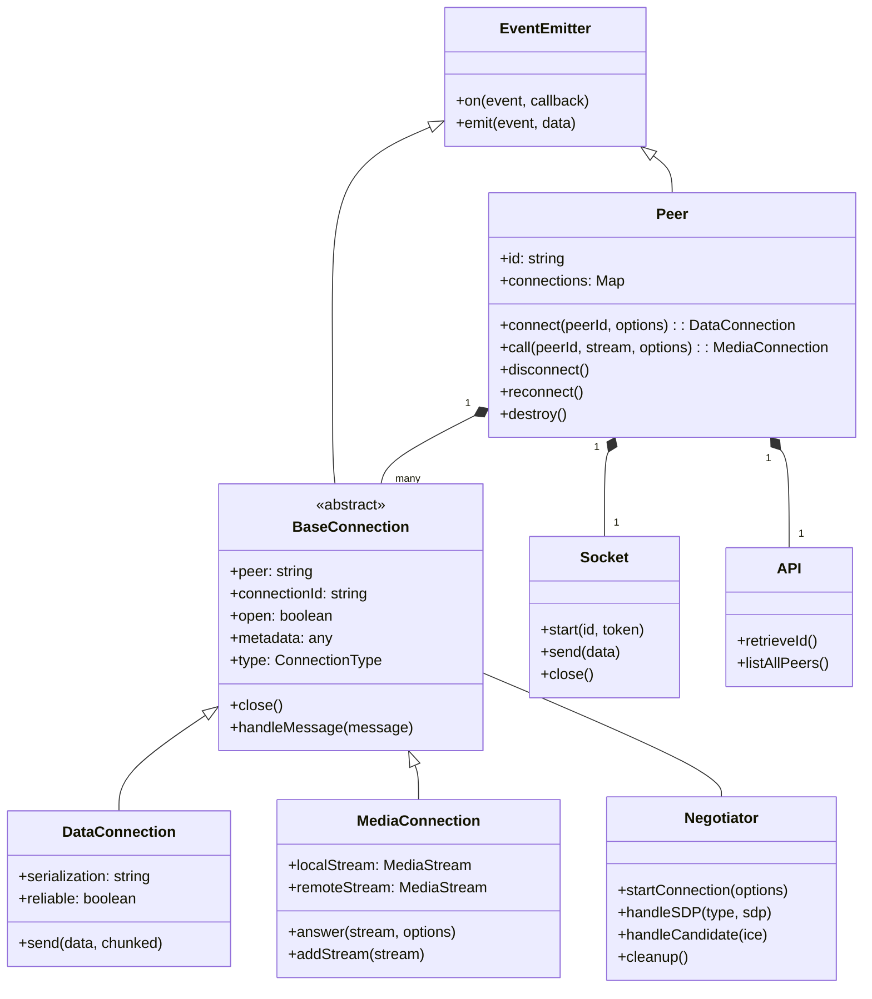
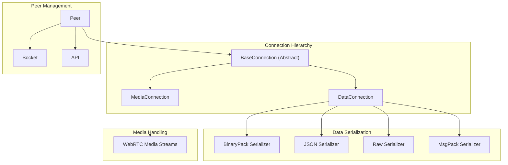
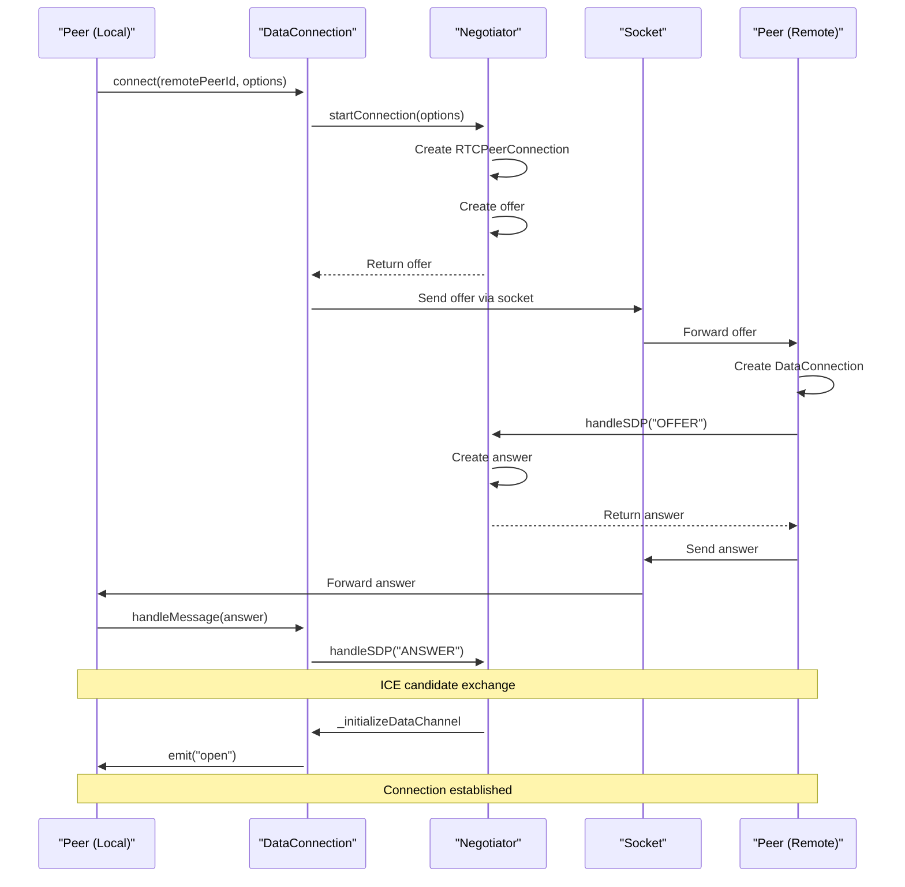

# Core Classes

관련 소스 파일

이 위키 페이지를 생성하는 컨텍스트로 다음 파일들이 사용되었습니다:

- [lib/baseconnection.ts](lib/baseconnection.ts)
- [lib/enums.ts](lib/enums.ts)
- [lib/exports.ts](lib/exports.ts)
- [lib/peer.ts](lib/peer.ts)
- [lib/servermessage.ts](lib/servermessage.ts)

이 페이지는 PeerJS 라이브러리의 기반을 이루는 주요 클래스에 대한 기술적 개요를 제공합니다. 핵심 클래스 구조, 클래스 간 관계, 주요 책임에 초점을 맞춥니다. 이러한 클래스가 연결 설정 과정에서 어떻게 상호작용하는지에 대한 정보는 [Connection Flow](#2.2)를 참고하세요.

## 클래스 계층 구조

PeerJS 라이브러리는 `Peer` 클래스를 중심으로 하는 명확한 클래스 계층 구조 위에 구축되어 있습니다. 다음 다이어그램은 핵심 클래스 간 상속 관계와 주요 의존성을 보여줍니다:

Sources: [lib/peer.ts:113-744]()/[lib/baseconnection.ts:32-91]()

## Peer Class

`Peer` 클래스는 PeerJS 라이브러리를 사용하는 주요 진입점입니다. peer 식별자, 다른 peer와의 연결, PeerServer와의 통신을 관리합니다.

### 주요 책임

- PeerServer와의 식별자 설정 및 유지
- 다른 peer에 대한 연결 생성
- 들어오는 연결 요청 처리
- 모든 연결의 수명주기 관리

### 중요한 속성

| Property | Type | Description |
|----------|------|-------------|
| `id` | string | 이 peer의 고유 식별자 |
| `connections` | Map | peer ID를 키로 하는 현재 모든 연결의 맵 |
| `open` | boolean | 서버와의 연결이 활성 상태인지 여부 |
| `disconnected` | boolean | PeerServer와 연결이 끊겼는지 여부 |
| `destroyed` | boolean | peer가 파괴되었는지 여부 |

### 핵심 메서드

| Method | Description |
|--------|-------------|
| `connect(peerId, options)` | 다른 peer에 대한 데이터 연결 생성 |
| `call(peerId, stream, options)` | 다른 peer에 대한 미디어 연결 생성 |
| `disconnect()` | PeerServer와는 연결 해제하지만 기존 연결은 유지 |
| `reconnect()` | 동일한 ID로 PeerServer에 다시 연결 시도 |
| `destroy()` | 모든 연결을 닫고 서버와 연결 해제 |
| `listAllPeers(callback)` | 사용 가능한 모든 peer ID 목록 조회 |

### 이벤트

`Peer` 클래스는 `EventEmitterWithError`를 확장하며, 애플리케이션이 수신할 수 있는 여러 이벤트를 발생시킵니다:

| Event | Description |
|-------|-------------|
| `open` | PeerServer와의 연결이 설정되었을 때 발생 |
| `connection` | 새로운 데이터 연결이 설정되었을 때 발생 |
| `call` | 원격 peer가 호출을 시도할 때 발생 |
| `disconnected` | PeerServer와의 연결이 끊겼을 때 발생 |
| `close` | peer가 파괴되었을 때 발생 |
| `error` | 오류가 발생했을 때 발생 |

Sources: [lib/peer.ts:113-744]()

## 연결 아키텍처

PeerJS는 계층형 클래스 구조를 통해 WebRTC 연결을 추상화합니다:

Sources: [lib/peer.ts:113-744]()/[lib/baseconnection.ts:32-91]()/[lib/exports.ts:1-28]()

## BaseConnection Class

`BaseConnection`은 모든 유형의 연결(데이터 및 미디어)에 공통된 기능을 제공하는 추상 클래스입니다. `EventEmitterWithError`를 확장하여 연결이 이벤트와 오류를 발생시킬 수 있게 합니다.

### 주요 속성

| Property | Type | Description |
|----------|------|-------------|
| `peer` | string | 반대편 peer의 ID |
| `connectionId` | string | 이 연결의 고유 식별자 |
| `open` | boolean | 연결이 활성 상태인지 여부 |
| `metadata` | any | 연결과 연관된 선택적 메타데이터 |
| `peerConnection` | RTCPeerConnection | 내부 WebRTC 연결 |

### 추상 메서드

| Method | Description |
|--------|-------------|
| `close()` | 연결 종료 |
| `handleMessage(message)` | 이 연결과 관련된 메시지 처리 |
| `_initializeDataChannel(dc)` | WebRTC 데이터 채널 설정 |
| `get type()` | 연결 유형(데이터 또는 미디어) 반환 |

### 이벤트

| Event | Description |
|-------|-------------|
| `close` | 연결이 닫혔을 때 발생 |
| `error` | 오류가 발생했을 때 발생 |
| `iceStateChanged` | ICE 연결 상태가 변경되었을 때 발생 |

Sources: [lib/baseconnection.ts:32-91]()

## 연결 유형

PeerJS는 두 가지 주요 연결 유형을 지원하며, 각각은 특정 클래스로 표현됩니다:

### DataConnection

`DataConnection` 클래스는 `BaseConnection`을 확장하며 peer 간 데이터 송수신에 사용됩니다. 다양한 형식을 사용해 데이터를 직렬화합니다.

주요 기능:
- 여러 직렬화 형식 지원(Binary, JSON, Raw, MsgPack)
- 대용량 데이터 청킹 처리
- 신뢰성 있는 데이터 전송 제공

### MediaConnection

`MediaConnection` 클래스는 `BaseConnection`을 확장하며 peer 간 오디오/비디오 스트리밍에 사용됩니다.

주요 기능:
- WebRTC를 사용한 미디어 스트림 처리
- 들어오는 호출에 응답 지원
- 로컬 및 원격 미디어 스트림 관리

Sources: [lib/peer.ts:402-405]()/[lib/peer.ts:549-554]()/[lib/exports.ts:14-15]()

## 지원 인프라

여러 지원 클래스가 PeerJS의 핵심 기능을 가능하게 합니다:

### Negotiator

`Negotiator` 클래스는 다음을 포함한 peer 간 WebRTC 연결 협상을 처리합니다:
- SDP offer/answer 생성 및 처리
- ICE candidate 관리
- RTCPeerConnection 설정

### Socket

`Socket` 클래스는 PeerServer에 대한 WebSocket 연결을 관리하며, 다음 용도로 사용됩니다:
- WebRTC 연결 설정을 위한 시그널링
- 서버에 peer ID 등록
- 연결 유지를 위한 heartbeat 메커니즘

### API

`API` 클래스는 PeerServer REST API와 상호작용하는 메서드를 제공합니다:
- 서버에서 peer ID 조회
- 사용 가능한 모든 peer 목록 조회

Sources: [lib/peer.ts:272-309]()/[lib/peer.ts:738-743]()

## 연결 관리 흐름

다음 다이어그램은 연결 수명주기 동안 핵심 클래스가 어떻게 상호작용하는지 보여줍니다:

Sources: [lib/peer.ts:490-516]()/[lib/peer.ts:349-457]()

## 열거형

PeerJS는 라이브러리 전반에서 상수와 타입을 정의하기 위해 여러 열거형을 사용합니다:

### ConnectionType

설정 가능한 연결 유형을 정의합니다:
- `Data`: 데이터 송수신용
- `Media`: 오디오/비디오 스트리밍용

### PeerErrorType

발생할 수 있는 다양한 오류 유형을 정의합니다. 예:
- `BrowserIncompatible`
- `Disconnected`
- `InvalidID`
- `Network`
- `PeerUnavailable`
- `ServerError`

### ServerMessageType

PeerServer와 교환되는 메시지 유형을 정의합니다:
- `Heartbeat`
- `Candidate` 
- `Offer`
- `Answer`
- `Open`
- `Error`

Sources: [lib/enums.ts:1-98]()

## 오류 처리

PeerJS는 각 클래스가 `EventEmitterWithError`를 확장하는 구조화된 오류 처리 방식을 사용합니다. 오류는 특정 오류 유형을 가진 이벤트로 발생하므로, 애플리케이션은 이를 적절히 포착하고 처리할 수 있습니다.

오류 처리에 대한 더 자세한 내용은 [Error Handling](#4.3)을 참고하세요.

Sources: [lib/peer.ts:113-744]()/[lib/baseconnection.ts:9-31]()
