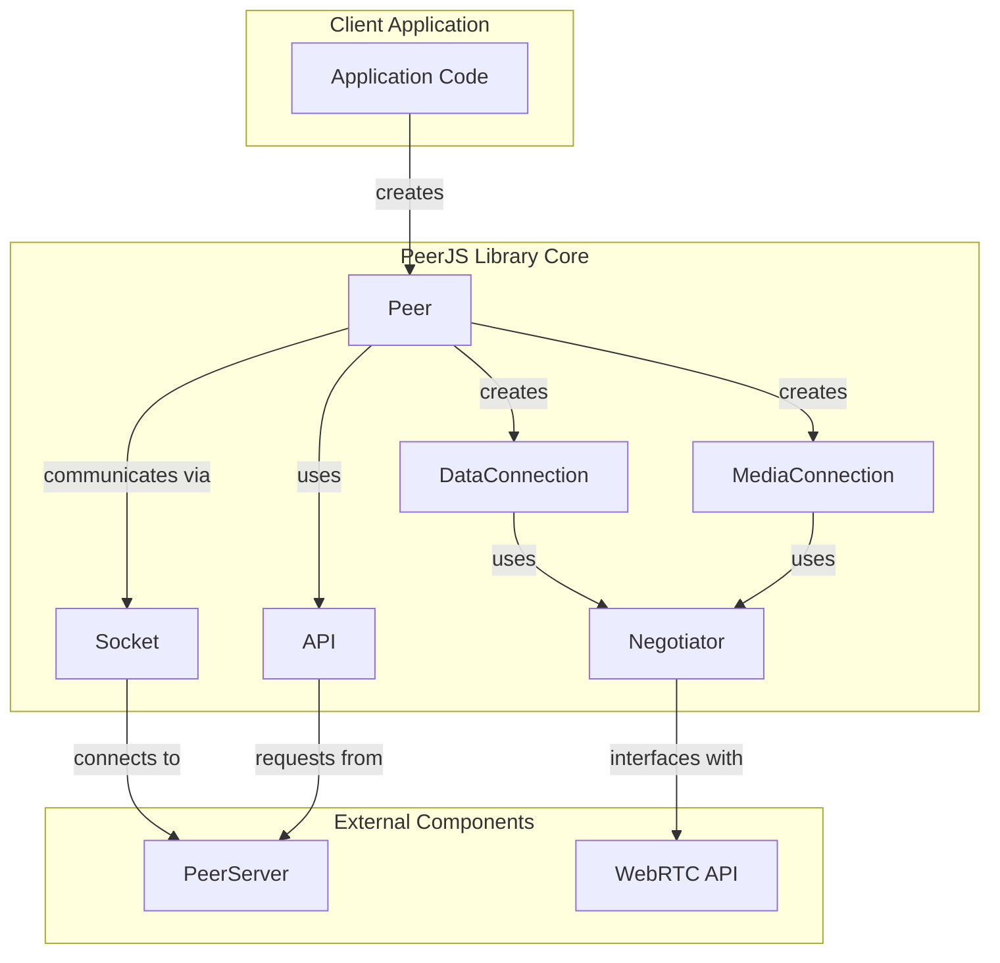
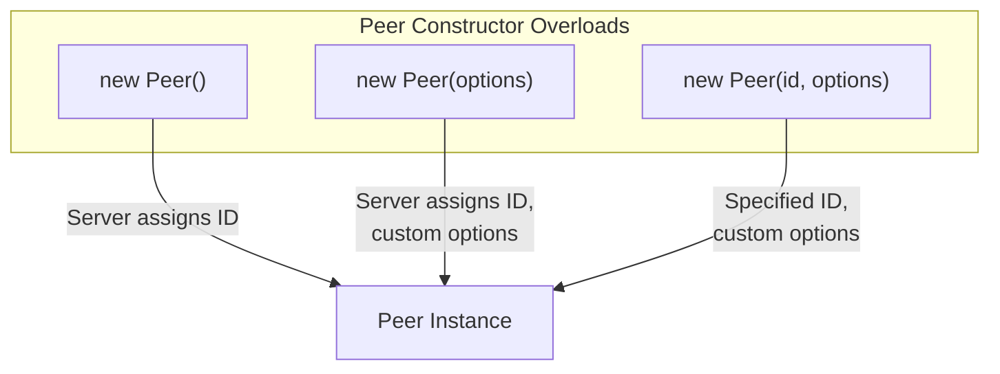
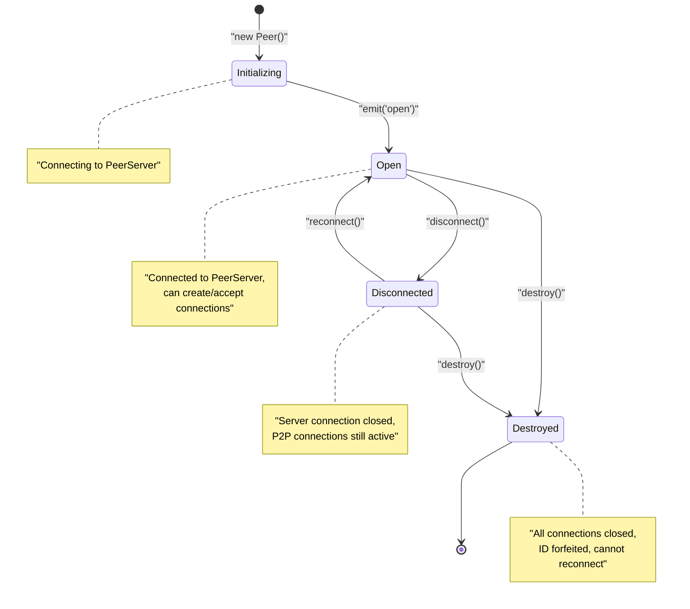
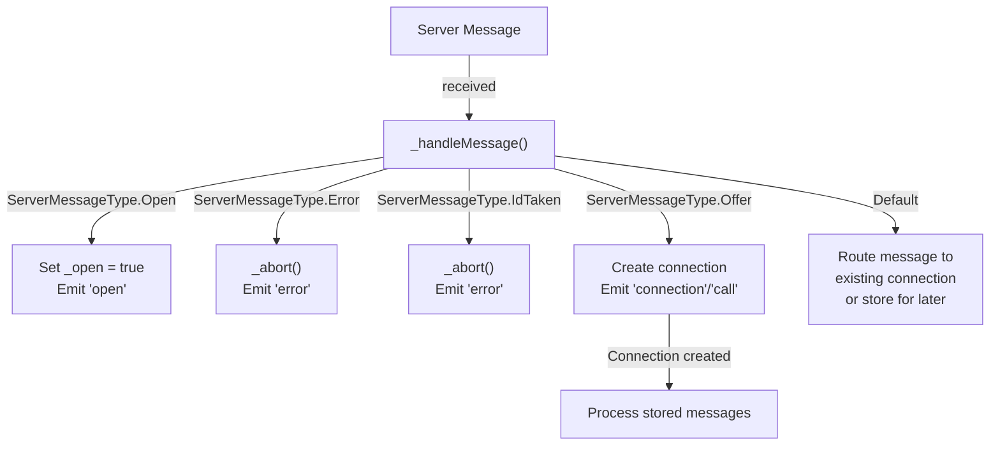
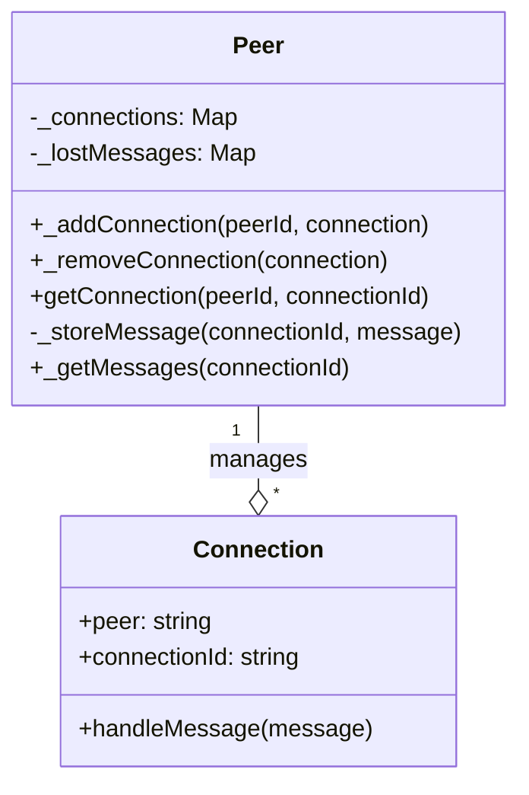

# Peer

<details>
<summary>관련 소스 파일</summary>

이 위키 페이지를 생성하는 컨텍스트로 다음 파일들이 사용되었습니다:

- [lib/exports.ts](lib/exports.ts)
- [lib/peer.ts](lib/peer.ts)

</details>


`Peer` 클래스는 PeerJS 라이브러리의 주요 진입점이며, 다른 peer와 peer-to-peer 연결을 시작하고 수락할 수 있는 노드를 나타냅니다. 이 클래스는 데이터 및 미디어 연결 설정, 연결 수명주기 관리, 시그널링 서버와의 통신 처리에 대한 주요 인터페이스 역할을 합니다.

특정 연결 유형에 대한 정보는 [DataConnection](#3.2) 및 [MediaConnection](#3.3)을 참고하세요.

## 개요

`Peer` 클래스의 책임은 다음과 같습니다:

- 다른 peer와의 연결 생성 및 관리
- PeerServer를 통한 시그널링 처리
- 자신의 수명주기 관리(초기화, 연결 해제, 종료)
- 연결과 서버 사이의 메시지 라우팅
- 연결 상태 변경에 대한 이벤트 발생

### PeerJS 아키텍처에서의 Peer



Sources: [lib/peer.ts:113-744]()

## 인스턴스 생성

`Peer` 클래스는 세 가지 방식으로 인스턴스화할 수 있습니다:



Sources: [lib/peer.ts:196-212]()

### 생성자 옵션

`Peer` 클래스는 `PeerOptions` 인터페이스를 통해 구성 옵션을 받습니다:

| Option | Type | Default | Description |
|--------|------|---------|-------------|
| `debug` | `LogLevel` | `0` | 로그 상세도 제어 (0: Errors, 1: Warnings, 3: All logs) |
| `host` | `string` | `'0.peerjs.com'` | 서버 호스트 |
| `port` | `number` | `443` | 서버 포트 |
| `path` | `string` | `'/'` | PeerServer가 실행 중인 경로 |
| `key` | `string` | `'peerjs'` | API 키 (deprecated) |
| `token` | `string` | Random token | 인증 토큰 |
| `config` | `object` | `util.defaultConfig` | RTCPeerConnection 구성 |
| `secure` | `boolean` | Based on host | TLS 사용 여부 |
| `serializers` | `SerializerMapping` | Built-in serializers | 데이터 연결용 커스텀 직렬화기 |

Sources: [lib/peer.ts:25-78](), [lib/peer.ts:226-236]()

## Peer 수명주기

`Peer` 클래스는 수명주기 동안 여러 상태를 가집니다:



Sources: [lib/peer.ts:131-134](), [lib/peer.ts:640-653](), [lib/peer.ts:682-700](), [lib/peer.ts:709-730]()

### 상태를 반영하는 속성

| Property | Type | Description |
|----------|------|-------------|
| `id` | `string \| null` | peer의 식별자 (연결되지 않은 경우 null) |
| `open` | `boolean` | 서버와의 연결이 열려 있는지 여부 |
| `disconnected` | `boolean` | 서버와 연결이 끊겼는지 여부 |
| `destroyed` | `boolean` | peer가 종료되었는지 여부 |

Sources: [lib/peer.ts:146-191]()

## 연결 관리

`Peer` 클래스는 두 가지 유형의 연결을 관리합니다:

1. **DataConnection**: peer 간 임의의 데이터를 전송하기 위한 연결
2. **MediaConnection**: 오디오/비디오 스트리밍을 위한 연결

### 연결 생성

```mermaid
sequenceDiagram
    participant ClientA as "Peer (Client A)"
    participant ServerA as "PeerServer"
    participant ClientB as "Peer (Client B)"
    
    Note over ClientA: peer.connect("peerB-id")
    ClientA->>ServerA: Send connection request
    ServerA->>ClientB: Forward connection request
    
    alt DataConnection
        Note over ClientB: emit("connection", dataConn)
        ClientB-->>ServerA: Send answer
        ServerA-->>ClientA: Forward answer
    else MediaConnection
        Note over ClientA: peer.call("peerB-id", stream)
        Note over ClientB: emit("call", mediaConn)
        ClientB-->>ServerA: Send answer
        ServerA-->>ClientA: Forward answer
    end
    
    Note over ClientA,ClientB: WebRTC negotiation
    
    ClientA<-->ClientB: Direct P2P connection established
```

Sources: [lib/peer.ts:490-555]()

### 연결 메서드

- **`connect(peer: string, options?: PeerConnectOption): DataConnection`**  
  원격 peer와 데이터 연결을 설정합니다.

- **`call(peer: string, stream: MediaStream, options?: CallOption): MediaConnection`**  
  원격 peer와 미디어 연결을 설정합니다.

- **`getConnection(peerId: string, connectionId: string): null | DataConnection | MediaConnection`**  
  기존 연결을 조회합니다.

Sources: [lib/peer.ts:490-605]()

## 이벤트

`Peer` 클래스는 `EventEmitterWithError`를 확장하며 다양한 이벤트를 발생시킵니다:

| Event | Parameters | Description |
|-------|------------|-------------|
| `open` | `id: string` | PeerServer와의 연결이 설정되었을 때 발생 |
| `connection` | `dataConnection: DataConnection` | 원격 peer로부터 새 데이터 연결이 설정되었을 때 발생 |
| `call` | `mediaConnection: MediaConnection` | 원격 peer가 호출을 시도할 때 발생 |
| `disconnected` | `currentId: string` | 시그널링 서버와 연결이 끊겼을 때 발생 |
| `close` | None | peer가 종료되었을 때 발생 |
| `error` | `error: PeerError<PeerErrorType>` | 오류가 발생했을 때 발생 |

Sources: [lib/peer.ts:80-109](), [lib/peer.ts:113]()

## 내부 메시지 처리



Sources: [lib/peer.ts:349-458](), [lib/peer.ts:461-483]()

## 연결 저장소

`Peer` 클래스는 두 가지 중요한 데이터 구조를 유지합니다:

1. **`_connections`**: 활성 연결을 peer ID를 키로 저장하는 Map
2. **`_lostMessages`**: 연결이 설정되기 전에 수신된 메시지를 저장하는 Map



Sources: [lib/peer.ts:135-139](), [lib/peer.ts:558-605](), [lib/peer.ts:461-483]()

## 연결 수명주기 관리

`Peer` 클래스는 자신의 수명주기를 관리하기 위해 여러 메서드를 제공합니다:

- **`disconnect()`**: PeerServer와의 연결은 끊지만 peer 연결은 유지
- **`reconnect()`**: 동일한 ID로 서버에 다시 연결 시도
- **`destroy()`**: 모든 연결을 닫고 peer를 완전히 종료
- **`_cleanupPeer(peerId)`**: 특정 peer에 대한 모든 연결 종료
- **`_cleanup()`**: 모든 연결을 끊고 모든 리스너 제거

Sources: [lib/peer.ts:640-674](), [lib/peer.ts:682-730]()

## 사용 예시

다음은 `Peer` 클래스를 일반적으로 사용하는 방법입니다:

1. peer 인스턴스 생성:
   ```javascript
   const peer = new Peer('my-id', {
     host: 'myserver.com',
     port: 9000,
     path: '/peerjs',
     debug: 2
   });
   ```

2. 연결 이벤트 수신:
   ```javascript
   peer.on('open', (id) => {
     console.log('My peer ID is: ' + id);
   });
   
   peer.on('connection', (conn) => {
     conn.on('data', (data) => {
       console.log('Received', data);
     });
   });
   
   peer.on('call', (call) => {
     // Answer the call
     call.answer(myStream);
   });
   ```

3. 다른 peer에 연결:
   ```javascript
   const conn = peer.connect('another-peer-id');
   conn.on('open', () => {
     conn.send('Hello!');
   });
   ```

4. 영상 통화 시작:
   ```javascript
   navigator.mediaDevices.getUserMedia({video: true, audio: true})
     .then((stream) => {
       const call = peer.call('another-peer-id', stream);
       call.on('stream', (remoteStream) => {
         // Show remote stream
       });
     });
   ```

Sources: [lib/peer.ts:113-744]()

## 오류 처리

`Peer` 클래스는 `error` 이벤트를 통해 오류를 발생시킵니다. 일반적인 오류 유형은 다음과 같습니다:

| Error Type | Description |
|------------|-------------|
| `BrowserIncompatible` | 브라우저가 WebRTC를 지원하지 않음 |
| `InvalidID` | 제공된 ID가 유효하지 않음 |
| `UnavailableID` | 요청한 ID가 이미 사용 중 |
| `ServerError` | 서버에서 오류 발생 |
| `SocketError` | 소켓 연결 오류 |
| `NetworkError` | 네트워크 연결 문제 |
| `PeerUnavailable` | 연결하려는 peer를 사용할 수 없음 |
| `Disconnected` | 연결이 끊긴 상태에서는 작업 수행 불가 |

Sources: [lib/peer.ts:108](), [lib/peer.ts:618-628]()

## 추가 기능

### 서버 탐색

`listAllPeers` 메서드를 사용하면 동일한 PeerServer에 연결된 다른 peer를 탐색할 수 있습니다:

```javascript
peer.listAllPeers((peers) => {
  console.log('Available peers:', peers);
});
```

이 기능을 사용하려면 PeerServer에서 discovery가 활성화되어 있어야 합니다.

Sources: [lib/peer.ts:738-743]()
