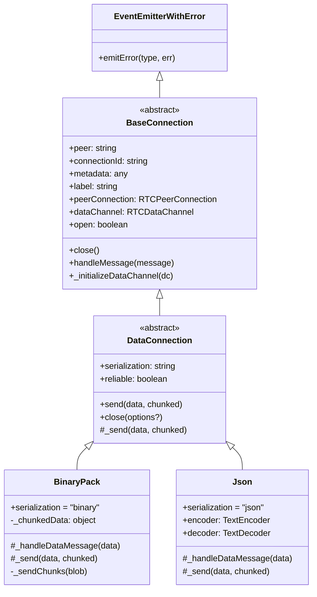
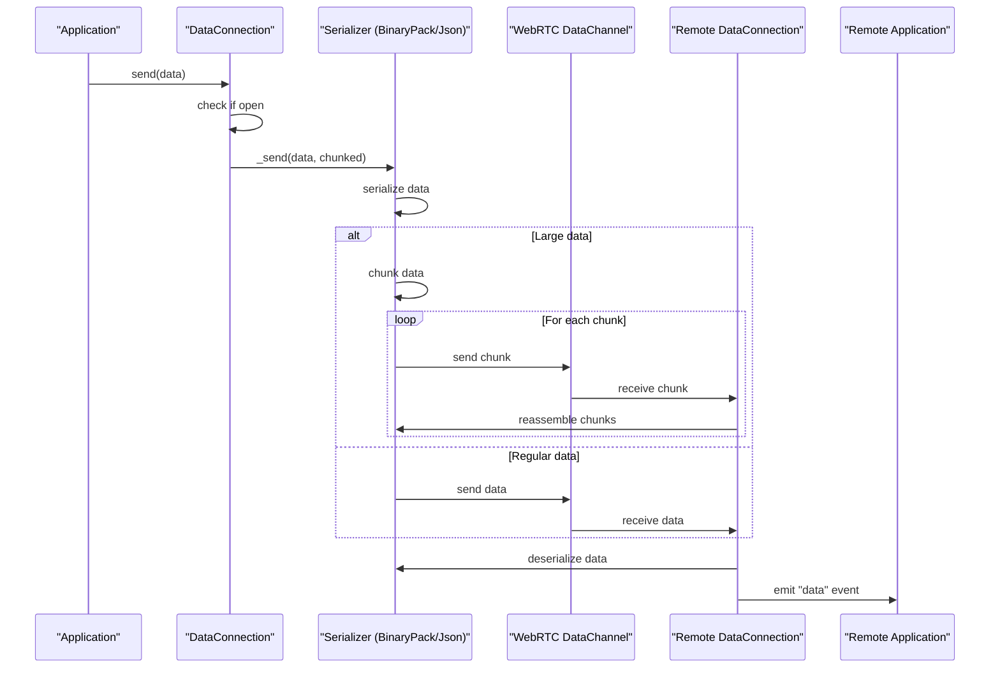
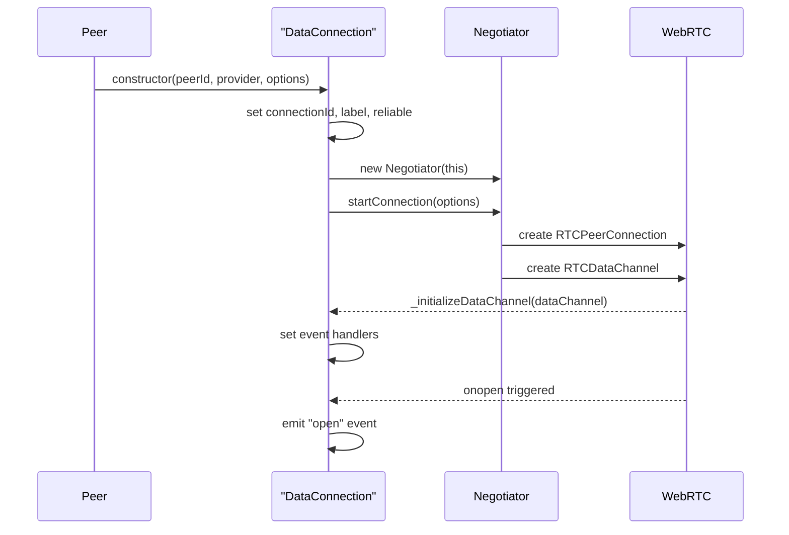
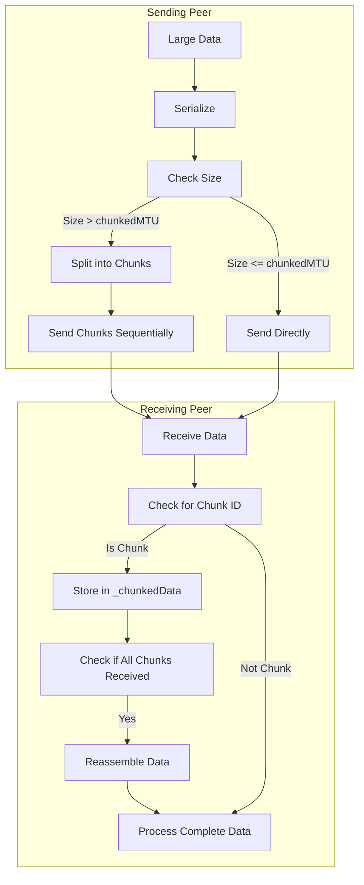

# DataConnection

<details>
<summary>관련 소스 파일</summary>

이 위키 페이지를 생성하는 컨텍스트로 다음 파일들이 사용되었습니다:

- [e2e/datachannel/blobs.js](e2e/datachannel/blobs.js)
- [e2e/datachannel/files.js](e2e/datachannel/files.js)
- [lib/baseconnection.ts](lib/baseconnection.ts)
- [lib/dataconnection/BufferedConnection/BinaryPack.ts](lib/dataconnection/BufferedConnection/BinaryPack.ts)
- [lib/dataconnection/BufferedConnection/Json.ts](lib/dataconnection/BufferedConnection/Json.ts)
- [lib/dataconnection/DataConnection.ts](lib/dataconnection/DataConnection.ts)
- [lib/enums.ts](lib/enums.ts)
- [lib/peerError.ts](lib/peerError.ts)
- [lib/servermessage.ts](lib/servermessage.ts)

</details>


`DataConnection` 클래스는 WebRTC 데이터 채널을 통한 peer-to-peer 데이터 전송을 처리하는 PeerJS의 핵심 구성 요소입니다. 이 클래스는 두 peer 간 데이터 교환을 위한 연결을 나타내며, 미디어 스트림은 [MediaConnection](#3.3)에서 처리합니다.

## 목적과 범위

이 문서에서는 다음을 다룹니다:
- `DataConnection` 클래스의 아키텍처와 상속 계층 구조
- 데이터 연결이 설정되고 관리되는 방식
- 데이터 송수신 메서드
- 데이터 직렬화 방식
- 데이터 연결의 오류 처리

Sources: [lib/dataconnection/DataConnection.ts:31-161](), [lib/baseconnection.ts:32-91]()

## 아키텍처 개요

`DataConnection`은 `BaseConnection`을 확장하는 추상 클래스입니다. 서로 다른 직렬화 전략을 위한 구체 구현은 서브클래스로 제공됩니다. 이 클래스는 WebRTC `DataChannel`을 감싸는 래퍼 역할을 하며, peer 간 연결 설정과 데이터 전송을 위한 더 단순한 API를 제공합니다.

### 클래스 계층 구조와 관계



Sources: [lib/dataconnection/DataConnection.ts:31-161](), [lib/baseconnection.ts:32-91](), [lib/dataconnection/BufferedConnection/BinaryPack.ts:8-109](), [lib/dataconnection/BufferedConnection/Json.ts:5-38]()

### DataConnection의 데이터 흐름



Sources: [lib/dataconnection/DataConnection.ts:127-139](), [lib/dataconnection/BufferedConnection/BinaryPack.ts:28-108](), [lib/dataconnection/BufferedConnection/Json.ts:13-37]()

## 연결 설정

`DataConnection`은 일반적으로 `Peer.connect()` 메서드를 통해 생성되며, 지정된 직렬화 옵션에 따라 적절한 `DataConnection` 서브클래스를 인스턴스화합니다. 연결 과정은 다음을 포함합니다:

1. 새 `DataConnection` 인스턴스 생성
2. WebRTC 연결 설정을 처리하는 `Negotiator` 초기화
3. WebRTC 데이터 채널 설정
4. 연결 준비가 완료되면 `open` 이벤트 발생

`DataConnection` 생성자는 이 과정의 대부분을 자동으로 처리합니다:



Sources: [lib/dataconnection/DataConnection.ts:46-63](), [lib/dataconnection/DataConnection.ts:65-84]()

## 데이터 송수신

### 데이터 전송

`send()` 메서드는 원격 peer로 데이터를 전송하는 주요 API입니다. 이 메서드는 다음을 수행합니다:

1. 연결이 열려 있는지 확인
2. 서브클래스에서 구현된 내부 `_send()` 메서드 호출
3. 직렬화기별 구현이 다음을 처리:
   - 데이터 직렬화
   - 필요 시 대용량 데이터 청킹
   - WebRTC 데이터 채널을 통한 전송

```javascript
// Simplified representation of the send method
send(data, chunked = false) {
    if (!this.open) {
        this.emitError(DataConnectionErrorType.NotOpenYet, "Connection is not open...");
        return;
    }
    return this._send(data, chunked);
}
```

Sources: [lib/dataconnection/DataConnection.ts:130-139]()

### 데이터 수신

데이터 채널이 초기화될 때 설정된 이벤트 핸들러를 통해 데이터가 수신됩니다:

1. 데이터가 도착하면 데이터 채널의 `onmessage` 이벤트가 트리거됨
2. 직렬화기 서브클래스가 구현한 `_handleDataMessage()` 메서드가 데이터를 처리:
   - 데이터 역직렬화
   - 필요 시 청킹/재조립 처리
   - 처리된 데이터와 함께 `data` 이벤트 발생

애플리케이션 코드는 `data` 이벤트를 수신하여 들어오는 데이터를 받을 수 있습니다:

```javascript
// Example usage in application code
dataConnection.on('data', (receivedData) => {
    console.log('Received data:', receivedData);
});
```

Sources: [lib/dataconnection/BufferedConnection/BinaryPack.ts:30-48](), [lib/dataconnection/BufferedConnection/Json.ts:14-25]()

## 직렬화 유형

`DataConnection`은 `SerializationType` enum에 정의된 여러 직렬화 전략을 지원합니다:

| Serialization Type | Description | Advantages | Limitations |
|-------------------|-------------|------------|-------------|
| `Binary` | BinaryPack을 사용하는 바이너리 직렬화 | 복잡한 데이터 구조에 효율적 | 더 많은 처리 오버헤드 |
| `BinaryUTF8` | UTF8 인코딩을 사용하는 바이너리 | 문자열 중심 데이터에 더 적합 | 바이너리 데이터에는 비효율적 |
| `JSON` | JSON 직렬화 | 사람이 읽기 쉽고 호환성이 넓음 | JSON 직렬화 가능 데이터로 제한, 크기 제한 |
| `None` (raw) | 직렬화 없음 | 오버헤드 최소화 | 단순 데이터 유형으로 제한 |

각 직렬화 유형은 `DataConnection`의 구체 서브클래스로 구현되며, `_send()` 및 `_handleDataMessage()` 메서드의 구체 구현을 제공합니다.

Sources: [lib/enums.ts:73-78](), [lib/dataconnection/BufferedConnection/BinaryPack.ts:8-109](), [lib/dataconnection/BufferedConnection/Json.ts:5-38]()

### 청킹과 대용량 데이터 처리

대용량 데이터 전송을 위해 PeerJS는 다음과 같은 청킹 메커니즘을 구현합니다:

1. 큰 데이터를 더 작은 청크로 분할
2. 각 청크를 위치 식별용 메타데이터와 함께 전송
3. 수신 측에서 청크를 재조립

이 메커니즘은 특히 `BinaryPack` 직렬화기에서 중요한데, 청킹을 통해 임의로 큰 데이터도 처리할 수 있습니다:



Sources: [lib/dataconnection/BufferedConnection/BinaryPack.ts:50-76](), [lib/dataconnection/BufferedConnection/BinaryPack.ts:101-108]()

## 오류 처리

`DataConnection`에는 데이터 전송 중 발생할 수 있는 일반적인 문제를 위한 견고한 오류 처리 기능이 포함되어 있습니다. 이러한 오류는 `DataConnectionErrorType` enum에 정의되어 있습니다:

| Error Type | Description | Common Cause |
|------------|-------------|--------------|
| `NotOpenYet` | 연결이 열리기 전에 데이터 전송을 시도함 | `open` 이벤트 전에 `send()` 호출 |
| `MessageToBig` | 데이터가 직렬화기의 최대 크기를 초과함 | JSON 직렬화로 매우 큰 객체 전송 |

오류는 `error` 이벤트를 통해 발생하며, 애플리케이션은 이를 수신할 수 있습니다:

```javascript
// Example error handling in application code
dataConnection.on('error', (error) => {
    console.error('Connection error:', error.type, error.message);
});
```

Sources: [lib/enums.ts:68-71](), [lib/dataconnection/DataConnection.ts:131-137](), [lib/peerError.ts:28-44]()

## 연결 수명주기

`DataConnection` 수명주기에는 몇 가지 주요 단계가 있습니다:

1. **Initialization**: 연결이 생성되었지만 아직 열리지 않음
2. **Open**: 연결이 설정되어 데이터 전송 준비 완료
3. **Active**: 데이터를 송수신 중
4. **Closing**: 연결 종료 진행 중
5. **Closed**: 연결이 완전히 종료됨

이 수명주기에서 가장 중요한 이벤트는 다음과 같습니다:

| Event | Description | When It Occurs |
|-------|-------------|----------------|
| `open` | 연결 준비 완료 | WebRTC 데이터 채널이 설정된 후 |
| `data` | 데이터 수신 | 원격 peer로부터 데이터가 도착했을 때 |
| `close` | 연결 종료 | 어느 한쪽 peer가 연결을 닫았을 때 |
| `error` | 오류 발생 | 문제가 생겼을 때 |

`close()` 메서드는 연결 종료 시 정리 작업을 처리합니다:

```javascript
// Simplified representation of close behavior
close(options?: { flush?: boolean }) {
    if (options?.flush) {
        // Send a close message to peer first
        this.send({ __peerData: { type: "close" } });
        return;
    }
    
    // Clean up resources
    this._negotiator.cleanup();
    this.provider._removeConnection(this);
    
    // Close data channel
    this.dataChannel = null;
    
    // Update state and emit event
    this._open = false;
    this.emit("close");
}
```

Sources: [lib/dataconnection/DataConnection.ts:91-125](), [lib/dataconnection/DataConnection.ts:65-84]()

## 결론

`DataConnection` 클래스는 WebRTC 데이터 채널 위에 고수준 추상화를 제공하여 peer-to-peer 데이터 연결을 쉽게 설정하고 다양한 유형의 데이터를 교환할 수 있게 합니다. 유연한 직렬화 시스템과 대용량 데이터 전송에 대한 내장 지원 덕분에, 단순한 텍스트 메시징부터 복잡한 파일 전송까지 다양한 애플리케이션에 적합합니다.

미디어 스트리밍 기능은 peer 간 오디오 및 비디오 스트리밍을 처리하는 [MediaConnection](#3.3) 문서를 참고하세요.

Sources: [lib/dataconnection/DataConnection.ts:31-161]()
