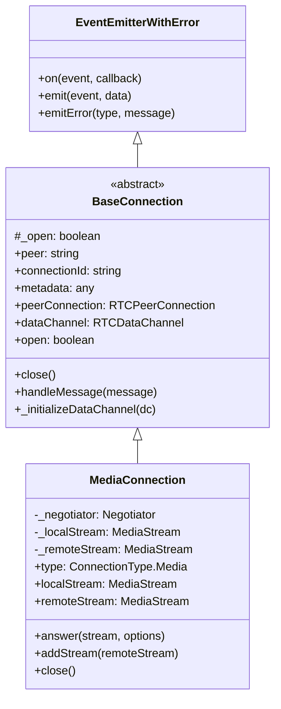
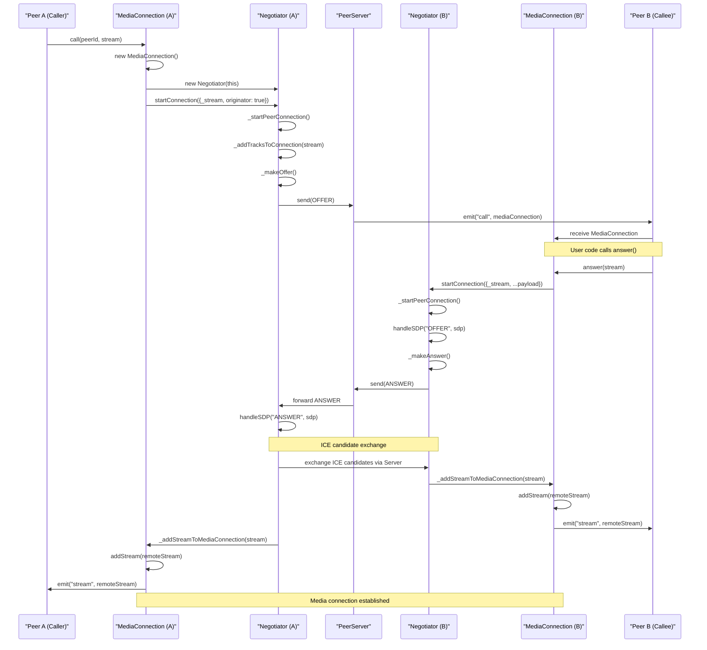
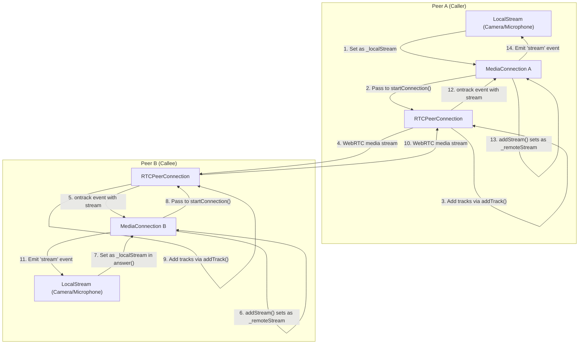

# MediaConnection

<details>
<summary>관련 소스 파일</summary>

이 위키 페이지를 생성하는 컨텍스트로 다음 파일들이 사용되었습니다:

- [lib/baseconnection.ts](lib/baseconnection.ts)
- [lib/enums.ts](lib/enums.ts)
- [lib/mediaconnection.ts](lib/mediaconnection.ts)
- [lib/negotiator.ts](lib/negotiator.ts)
- [lib/servermessage.ts](lib/servermessage.ts)

</details>


PeerJS의 `MediaConnection` 클래스는 WebRTC의 미디어 스트림을 감싸고 peer 간 오디오/비디오 통화를 위한 추상화를 제공합니다. 이 문서는 PeerJS 애플리케이션에서 실시간 미디어 통신을 가능하게 하는 핵심 구성 요소인 `MediaConnection` 클래스의 구조, 기능, 사용법을 다룹니다.

미디어가 아닌 정보를 송수신하는 데이터 연결에 대한 정보는 [DataConnection](#3.2)을 참고하세요.

## 클래스 개요

`MediaConnection`은 `BaseConnection` 클래스를 확장하며, WebRTC를 사용해 미디어 스트림을 처리하는 특화 기능을 제공합니다. 이 클래스의 인스턴스는 일반적으로 다음 경우에 생성됩니다:

1. peer가 `Peer.call()`을 사용해 호출을 시작할 때
2. peer가 호출을 수신할 때 (`Peer` 인스턴스의 `call` 이벤트를 통해)



Sources: [lib/mediaconnection.ts:31-187](), [lib/baseconnection.ts:32-91]()

## 속성과 메서드

`MediaConnection` 클래스는 다음과 같은 주요 속성과 메서드를 제공합니다:

| Property/Method | Type | Description |
|----------------|------|-------------|
| `type` | `ConnectionType.Media` | 이 연결이 미디어 연결임을 나타냄 |
| `localStream` | `MediaStream` | 원격 peer에게 전송되는 로컬 미디어 스트림 |
| `remoteStream` | `MediaStream` | 원격 peer로부터 수신한 미디어 스트림 |
| `answer(stream?, options?)` | `void` | 들어오는 호출을 수락하고 선택적으로 미디어 스트림을 전송 |
| `close()` | `void` | 미디어 연결 종료 |

Sources: [lib/mediaconnection.ts:42-53](), [lib/mediaconnection.ts:125-151](), [lib/mediaconnection.ts:160-186]()

## 이벤트

`MediaConnection`은 다음 이벤트를 발생시킵니다:

| Event | Arguments | Description |
|-------|-----------|-------------|
| `stream` | `(stream: MediaStream)` | 원격 스트림을 수신했을 때 발생 |
| `willCloseOnRemote` | None | 보조 데이터 채널이 설정되었을 때 발생 |
| `close` | None | 연결이 종료되었을 때 발생 |
| `error` | `(error: PeerError)` | 오류가 발생했을 때 발생 |
| `iceStateChanged` | `(state: RTCIceConnectionState)` | ICE 연결 상태가 변경되었을 때 발생 |

Sources: [lib/mediaconnection.ts:10-25](), [lib/baseconnection.ts:12-30]()

## 미디어 연결 설정

PeerJS에서 미디어 연결을 설정하는 과정은 여러 단계와 구성 요소를 포함합니다:



Sources: [lib/mediaconnection.ts:54-69](), [lib/mediaconnection.ts:125-151](), [lib/negotiator.ts:22-48](), [lib/negotiator.ts:147-158](), [lib/negotiator.ts:305-325]()

## 미디어 스트림 흐름

다음 다이어그램은 미디어 스트림이 peer 간에 어떻게 흐르는지 보여줍니다:



Sources: [lib/mediaconnection.ts:86-91](), [lib/negotiator.ts:340-355](), [lib/negotiator.ts:357-366]()

## 구현 세부 사항

### 생성자와 초기화

`MediaConnection`이 생성될 때 수행하는 작업은 다음과 같습니다:

1. 제공된 peer ID, provider, options로 초기화
2. 옵션에서 로컬 스트림 설정(호출 시) 또는 나중에 설정(수신 시)
3. `"mc_"` 접두사를 가진 고유 connection ID 생성
4. WebRTC 설정을 처리할 `Negotiator` 인스턴스 생성
5. 로컬 스트림이 제공된 경우 발신자(originator)로서 연결 시작

```mermaid
graph TD
    constructor["Constructor(peerId, provider, options)"]
    setLocalStream["Set _localStream from options._stream"]
    createConnectionId["Create connectionId with mc_ prefix"]
    createNegotiator["Create new Negotiator instance"]
    checkLocalStream["Check if _localStream exists"]
    startConnection["Start connection as originator"]
    
    constructor-->setLocalStream
    constructor-->createConnectionId
    constructor-->createNegotiator
    constructor-->checkLocalStream
    checkLocalStream-->|"Yes"|startConnection
    checkLocalStream-->|"No"|finish["Wait for answer() call"]
```

Sources: [lib/mediaconnection.ts:54-69]()

### 호출 응답

호출을 수신한 쪽은 자신의 미디어 스트림으로 응답할 수 있습니다:

1. `answer` 메서드가 로컬 스트림 설정
2. 제공된 경우 SDP transform 옵션 업데이트
3. 수신한 payload 데이터로 연결 시작
4. 연결을 기다리며 캐시되어 있던 메시지 처리
5. 연결을 open 상태로 표시

Sources: [lib/mediaconnection.ts:125-151]()

### 메시지 처리

`MediaConnection` 클래스는 원격 peer로부터 두 가지 유형의 메시지를 처리합니다:

1. SDP 설명을 포함하는 **Answer** 메시지로, `Negotiator`에 전달됨
2. ICE candidate를 포함하는 **Candidate** 메시지로, 역시 `Negotiator`에 전달됨

Sources: [lib/mediaconnection.ts:96-113]()

### 연결 종료

미디어 연결을 종료할 때는 다음을 수행합니다:

1. `Negotiator`를 정리하고 null 처리
2. 로컬 및 원격 스트림 정리
3. options 안의 provider 및 스트림 참조 제거
4. 연결이 열려 있었다면 닫힌 상태로 표시하고 `"close"` 이벤트 발생

Sources: [lib/mediaconnection.ts:160-186]()

## Negotiator와의 통합

`MediaConnection` 클래스는 WebRTC 세부 처리를 위해 `Negotiator` 클래스와 긴밀히 동작합니다:

1. `Negotiator`는 RTCPeerConnection 생성을 관리
2. SDP offer 및 answer 교환 처리
3. ICE candidate 수집 및 교환 관리
4. 미디어 스트림의 트랙을 연결에 추가
5. 원격 스트림을 수신하면 `_addStreamToMediaConnection`을 통해 `MediaConnection`에 알림

이러한 책임 분리는 `MediaConnection`이 고수준 API에 집중하고, `Negotiator`가 WebRTC 복잡성을 처리할 수 있게 합니다.

Sources: [lib/negotiator.ts:22-48](), [lib/negotiator.ts:340-355](), [lib/negotiator.ts:357-366]()

## 사용 예시

다음은 일반적인 애플리케이션에서 `MediaConnection`을 사용하는 방법입니다:

호출자 측:
```javascript
// Get user media
navigator.mediaDevices.getUserMedia({video: true, audio: true})
  .then(stream => {
    // Call a peer with the stream
    const call = peer.call('remote-peer-id', stream);
    
    // Listen for the stream event to get the remote stream
    call.on('stream', remoteStream => {
      // Display the remote stream
      const video = document.querySelector('video');
      video.srcObject = remoteStream;
    });
  });
```

수신자 측:
```javascript
// Listen for incoming calls
peer.on('call', call => {
  // Get user media
  navigator.mediaDevices.getUserMedia({video: true, audio: true})
    .then(stream => {
      // Answer the call with our stream
      call.answer(stream);
      
      // Listen for the stream event to get the remote stream
      call.on('stream', remoteStream => {
        // Display the remote stream
        const video = document.querySelector('video');
        video.srcObject = remoteStream;
      });
    });
});
```

## 관련 구성 요소

`MediaConnection` 클래스는 PeerJS 시스템의 여러 다른 구성 요소와 상호작용합니다:

1. **Peer**: `MediaConnection` 인스턴스를 생성하고 관리
2. **Negotiator**: 연결 설정을 위한 WebRTC 협상 처리
3. **BaseConnection**: 모든 연결 유형에 공통 기능 제공
4. **Socket**: 시그널링을 위해 PeerServer와의 통신을 지원

이 구성 요소들에 대한 더 자세한 정보는 각 위키 페이지 [Peer](#3.1), [Negotiator](#3.4), [Socket and API](#3.5)를 참고하세요.
