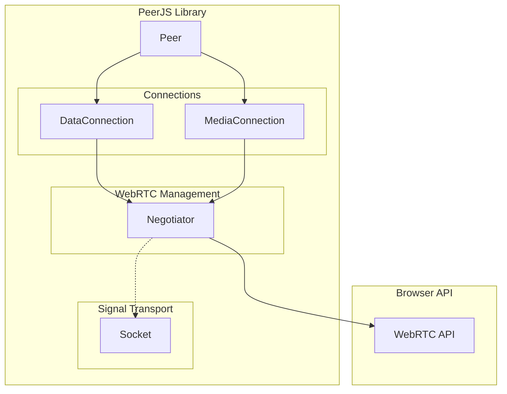
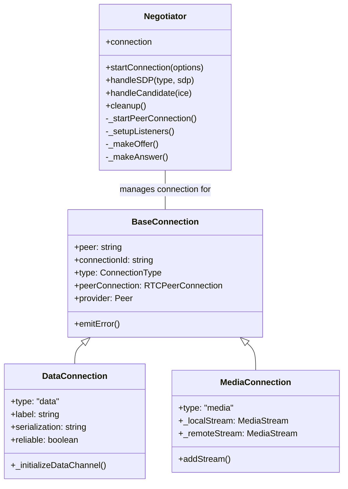
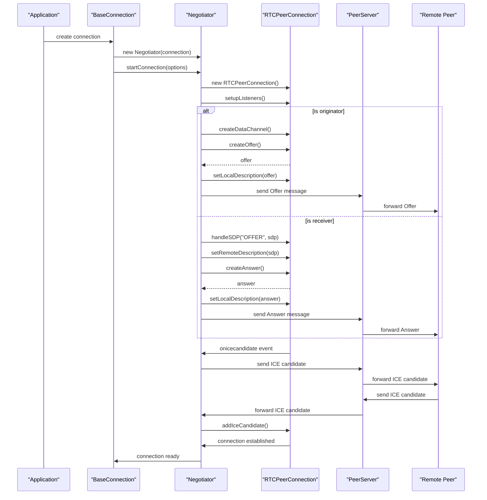

# Negotiator

<details>
<summary>관련 소스 파일</summary>

이 위키 페이지를 생성하는 컨텍스트로 다음 파일들이 사용되었습니다:

- [lib/mediaconnection.ts](lib/mediaconnection.ts)
- [lib/negotiator.ts](lib/negotiator.ts)

</details>


Negotiator 클래스는 peer 간의 모든 WebRTC 연결 협상을 관리하는 PeerJS 라이브러리의 핵심 구성 요소입니다. 이 클래스는 SDP(Session Description Protocol) offer/answer와 ICE candidate의 생성 및 교환을 포함한 복잡한 WebRTC 시그널링 과정을 처리하며, 이는 peer-to-peer 연결을 설정하는 데 필수적입니다.

이 문서는 Negotiator의 아키텍처, 책임, 그리고 다른 PeerJS 구성 요소와 상호작용하는 방식을 자세히 설명합니다. Negotiator를 사용하는 연결에 대한 정보는 [DataConnection](#3.2) 및 [MediaConnection](#3.3)을 참고하세요.

## 목적과 책임

Negotiator 클래스는 PeerJS에서 데이터 및 미디어 연결 모두를 위한 WebRTC 협상 관리자 역할을 합니다. 주요 책임은 다음과 같습니다:

1. RTCPeerConnection 객체 생성 및 관리
2. SDP offer 및 answer 생성
3. ICE candidate 처리
4. WebRTC 이벤트 리스너 설정
5. MediaConnection용 미디어 트랙 처리
6. DataConnection용 데이터 채널 생성
7. 연결 상태 변경 관리

Sources: [lib/negotiator.ts:13-19](). [lib/negotiator.ts:16-20]()

## 클래스 정의

Negotiator는 다양한 유형의 연결과 함께 동작할 수 있는 제네릭 클래스로 구현되어 있습니다. MediaConnection과 DataConnection이 내부 WebRTC 연결을 관리하기 위해 사용하는 헬퍼 클래스 역할을 합니다.

```typescript
export class Negotiator<
    Events extends ValidEventTypes,
    ConnectionType extends BaseConnection<Events | BaseConnectionEvents>,
> {
    constructor(readonly connection: ConnectionType) {}
    
    // Methods for connection management
}
```

Sources: [lib/negotiator.ts:16-20]()

## 아키텍처와 관계

Negotiator는 PeerJS 아키텍처에서 중요한 위치를 차지하며, 고수준 연결 추상화(DataConnection, MediaConnection)와 저수준 WebRTC API 사이의 다리 역할을 합니다.

### PeerJS 아키텍처에서 Negotiator의 위치



Sources: [lib/negotiator.ts](). [lib/mediaconnection.ts:35-36]()

### Negotiator와 연결 클래스의 관계



Sources: [lib/negotiator.ts:16-20](). [lib/mediaconnection.ts:35-36]()

## 핵심 기능

### 연결 초기화

`startConnection` 메서드는 WebRTC 연결 프로세스를 시작합니다:

1. 새 `RTCPeerConnection` 생성
2. 연결 이벤트 리스너 설정
3. 미디어 연결의 경우 로컬 스트림에서 트랙 추가
4. 로컬 peer가 시작한 연결의 경우 데이터 채널을 생성하고 offer 생성
5. 원격 peer가 시작한 연결의 경우 들어오는 offer 처리

Sources: [lib/negotiator.ts:22-49]()

### WebRTC 이벤트 리스너

Negotiator는 연결 수명주기를 관리하기 위해 RTCPeerConnection에 여러 중요한 이벤트 리스너를 설정합니다:

| Event | Purpose |
|-------|---------|
| `onicecandidate` | 새로운 ICE candidate를 처리하고 원격 peer로 전송 |
| `oniceconnectionstatechange` | 연결 상태 변화를 감시하고 실패를 처리 |
| `ondatachannel` | DataConnection용 들어오는 데이터 채널 처리 |
| `ontrack` | MediaConnection용 들어오는 미디어 트랙 처리 |

Sources: [lib/negotiator.ts:64-158]()

### WebRTC 협상 과정



Sources: [lib/negotiator.ts:194-259](). [lib/negotiator.ts:261-325](). [lib/negotiator.ts:327-338]()

## 주요 메서드

### Offer와 Answer 생성

Negotiator는 SDP offer와 answer를 생성하고 처리하는 메서드를 포함합니다:

1. `_makeOffer()`: SDP offer를 생성하고 원격 peer로 전송
   - `peerConnection.createOffer()`를 사용해 offer 생성
   - 선택적 SDP 변환 적용
   - 로컬 description 설정
   - Socket을 통해 원격 peer로 offer 전송

2. `_makeAnswer()`: offer에 대한 응답으로 SDP answer 생성
   - `peerConnection.createAnswer()`를 사용해 answer 생성
   - 선택적 SDP 변환 적용
   - 로컬 description 설정
   - Socket을 통해 원격 peer로 answer 전송

Sources: [lib/negotiator.ts:194-259](). [lib/negotiator.ts:261-303]()

### 시그널링 메시지 처리

Negotiator는 들어오는 시그널링 메시지를 처리합니다:

1. `handleSDP()`: SDP offer와 answer 처리
   - peer connection에 원격 description 설정
   - offer를 수신한 경우 answer를 생성하여 전송

2. `handleCandidate()`: ICE candidate 처리
   - 수신한 ICE candidate를 peer connection에 추가

Sources: [lib/negotiator.ts:305-338]()

### 미디어 스트림 관리

MediaConnection을 위해 Negotiator는 미디어 스트림 처리 메서드를 제공합니다:

1. `_addTracksToConnection()`: 로컬 스트림의 트랙을 peer connection에 추가
2. `_addStreamToMediaConnection()`: 원격 스트림을 MediaConnection에 추가

Sources: [lib/negotiator.ts:340-366]()

## 오류 처리

Negotiator는 연결 과정 전반에 걸쳐 포괄적인 오류 처리를 구현합니다:

1. `iceconnectionstatechange` 이벤트를 통한 연결 상태 모니터링
2. 협상 실패에 대한 오류 발생
3. WebRTC API 호출에 대한 오류 처리
4. 브라우저 기능 지원 여부 검증

Sources: [lib/negotiator.ts:90-127](). [lib/negotiator.ts:245-257]()

## 정리 작업

`cleanup()` 메서드는 peer connection을 올바르게 닫고 정리합니다:

1. peer connection에서 모든 이벤트 리스너 제거
2. 아직 열려 있으면 peer connection 종료
3. peer connection에 대한 참조를 null 처리

이로써 연결이 종료될 때 리소스가 적절히 해제됩니다.

Sources: [lib/negotiator.ts:161-192]()

## 연결 클래스와의 통합

Negotiator는 DataConnection과 MediaConnection 클래스 모두에서 인스턴스화됩니다. MediaConnection은 생성자에서 Negotiator를 생성합니다:

```typescript
// In MediaConnection constructor
this._negotiator = new Negotiator(this);

if (this._localStream) {
  this._negotiator.startConnection({
    _stream: this._localStream,
    originator: true,
  });
}
```

원격 peer로부터 메시지를 처리할 때 연결 클래스는 WebRTC 관련 메시지를 Negotiator에 위임합니다:

```typescript
// In MediaConnection.handleMessage()
switch (message.type) {
  case ServerMessageType.Answer:
    void this._negotiator.handleSDP(type, payload.sdp);
    this._open = true;
    break;
  case ServerMessageType.Candidate:
    void this._negotiator.handleCandidate(payload.candidate);
    break;
  // ...
}
```

Sources: [lib/mediaconnection.ts:54-69](). [lib/mediaconnection.ts:96-113]()

## 요약

Negotiator는 복잡한 WebRTC 협상 과정을 추상화하고 관리하는 PeerJS 라이브러리의 핵심 구성 요소입니다. 이 클래스는 연결 클래스가 WebRTC API와 직접 상호작용하지 않고도 peer-to-peer 연결을 설정하고 유지할 수 있도록 깔끔한 인터페이스를 제공합니다. SDP 교환, ICE candidate 처리, 연결 상태 관리를 담당함으로써 DataConnection과 MediaConnection 클래스의 구현을 크게 단순화합니다.
