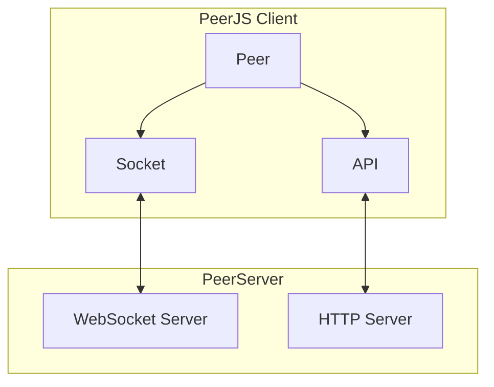
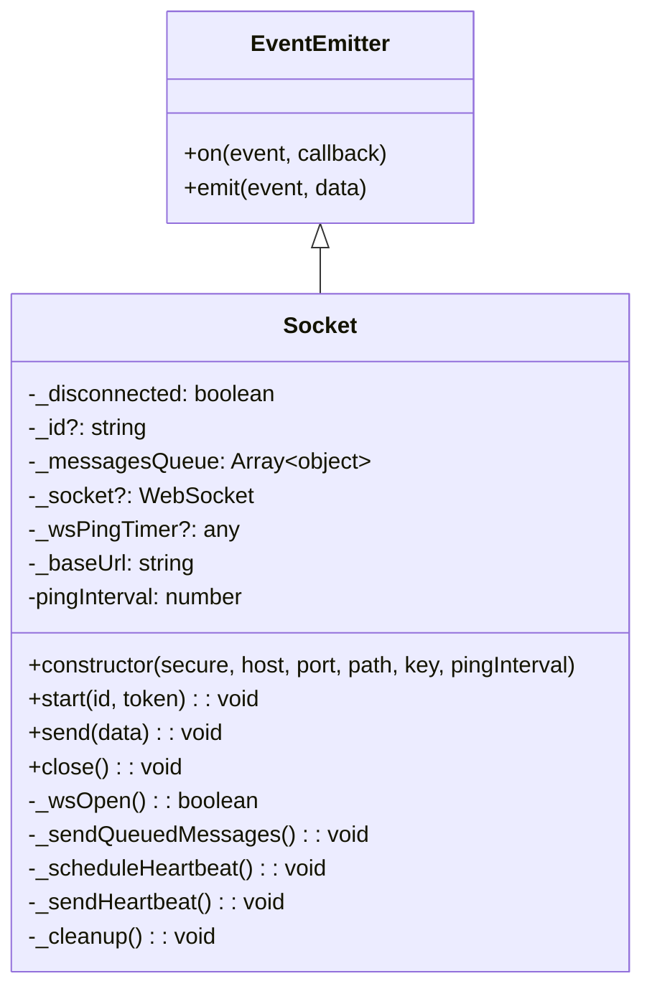
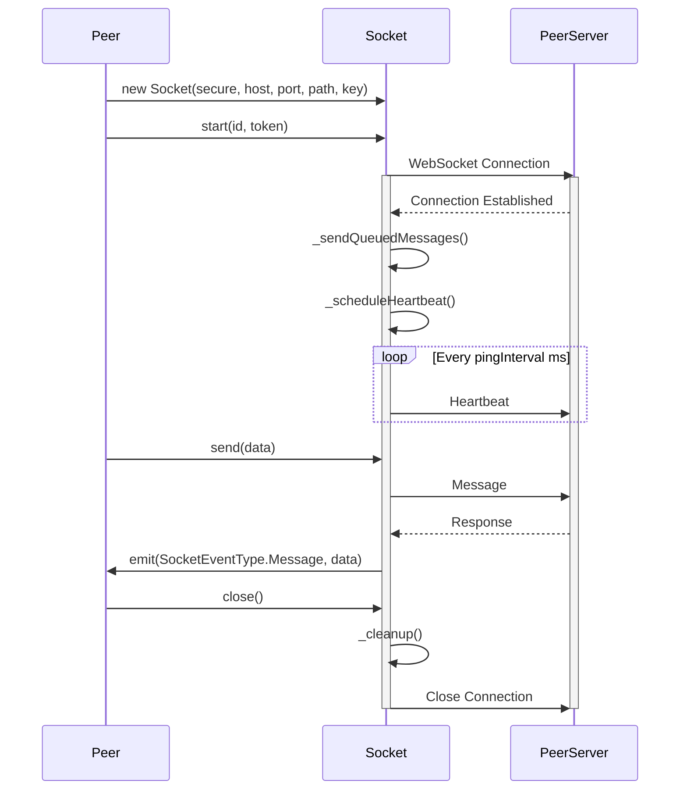
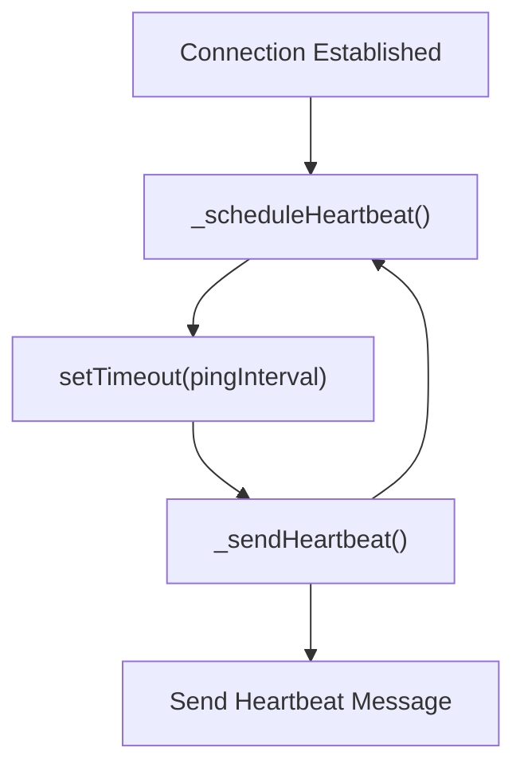
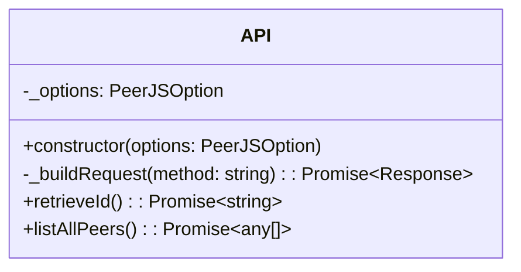
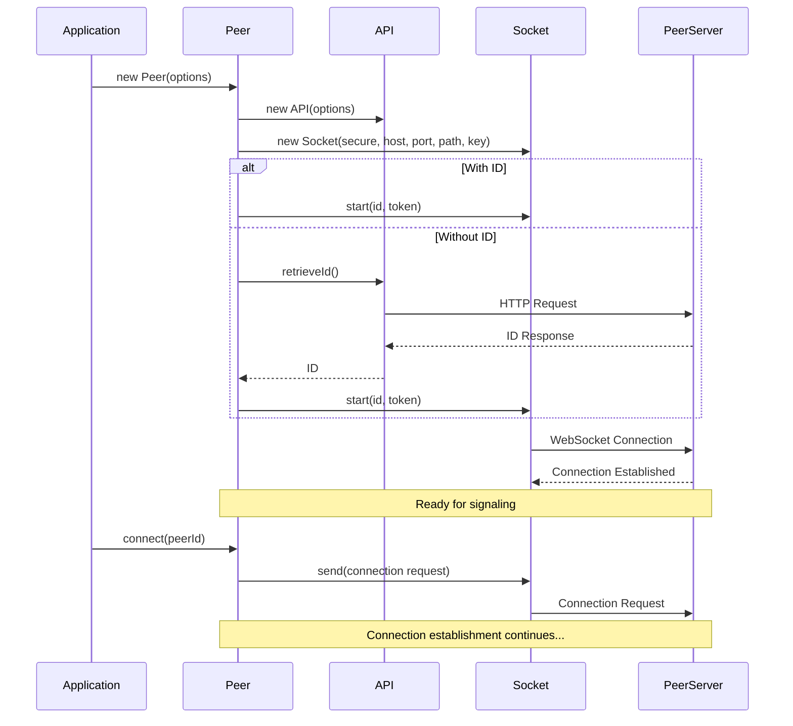

# Socket and API

<details>
<summary>관련 소스 파일</summary>

이 위키 페이지를 생성하는 컨텍스트로 다음 파일들이 사용되었습니다:

- [lib/api.ts](lib/api.ts)
- [lib/logger.ts](lib/logger.ts)
- [lib/optionInterfaces.ts](lib/optionInterfaces.ts)
- [lib/socket.ts](lib/socket.ts)
- [tsconfig.json](tsconfig.json)

</details>


이 문서는 PeerJS에서 `Socket`과 `API` 클래스가 어떤 역할을 하는지 설명합니다. 이 두 클래스는 클라이언트와 PeerServer 사이의 통신을 담당합니다. peer 간 핵심 WebRTC 연결 자체는 직접(peer-to-peer) 이루어지지만, 이 클래스들은 중앙 서버를 통한 초기 시그널링과 연결 탐색 과정을 지원합니다.

이 구성 요소들이 peer 연결에서 어떻게 사용되는지에 대한 정보는 [Connection Flow](#2.2)를 참고하세요. 이 구성 요소들을 사용하는 `Peer` 클래스에 대한 자세한 내용은 [Peer](#3.1)를 참고하세요.

## 개요

`Socket`과 `API` 클래스는 서로 다른 역할을 수행하지만 상호 보완적입니다:

- `Socket`: PeerServer와의 WebSocket 연결을 관리하여 실시간 양방향 통신을 제공하며, 주로 시그널링과 연결 협상에 사용됩니다.
- `API`: 고유 peer ID 조회 및 사용 가능한 peer 목록 조회와 같은 작업을 위해 PeerServer로 HTTP 요청을 보냅니다.



Sources: [lib/socket.ts:6-172](), [lib/api.ts:6-85]()

## Socket Class

`Socket` 클래스는 WebSocket 위에 구축된 추상화 계층으로, peer들이 시그널링 정보를 빠르고 안정적으로 교환할 수 있는 연결을 제공하도록 설계되었습니다.

### 아키텍처와 책임

`Socket` 클래스는 `EventEmitter` 클래스를 확장하며 다음을 관리합니다:
- WebSocket 연결 수명주기
- 메시지 직렬화 및 큐잉
- 연결 유지를 위한 heartbeat 메커니즘
- 이벤트 기반 통신



Sources: [lib/socket.ts:10-172]()

### 연결 수명주기

`Socket` 클래스는 WebSocket 연결의 전체 수명주기를 관리합니다:

1. **Initialization**: 새 `Socket`이 생성되면 제공된 파라미터를 바탕으로 WebSocket URL을 구성하지만 즉시 연결하지는 않음
2. **Connection**: `start()` 메서드가 peer ID와 token을 사용해 서버 연결 시작
3. **Message Handling**: 연결 후 들어오는 메시지를 처리하고 대기 중이던 메시지를 전송
4. **Heartbeat**: 연결을 유지하기 위해 heartbeat 메시지를 주기적으로 전송
5. **Disconnection**: `close()` 메서드가 연결을 종료하고 리소스를 정리



Sources: [lib/socket.ts:33-171]()

### 주요 메서드

#### `start(id: string, token: string): void`

서버와의 WebSocket 연결을 초기화하며, 메시지 수신, 연결 종료, 연결 수립에 대한 이벤트 핸들러를 설정합니다. 연결이 이미 수립된 경우 이 메서드는 아무 작업도 하지 않습니다.

```typescript
this._socket = new WebSocket(wsUrl + "&version=" + version);
this._disconnected = false;

this._socket.onmessage = (event) => {
    // Process message and emit events
};

this._socket.onclose = (event) => {
    // Handle connection closure
};

this._socket.onopen = () => {
    // Handle connection establishment
};
```

Sources: [lib/socket.ts:33-85]()

#### `send(data: any): void`

서버로 메시지를 전송합니다. 소켓이 아직 연결되지 않았거나 peer ID가 아직 할당되지 않은 경우, 메시지는 나중에 전송하기 위해 큐에 저장됩니다.

```typescript
if (this._disconnected) {
    return;
}

// Queue messages if no ID is assigned yet
if (!this._id) {
    this._messagesQueue.push(data);
    return;
}

// Validate and send the message
if (!data.type) {
    this.emit(SocketEventType.Error, "Invalid message");
    return;
}

if (!this._wsOpen()) {
    return;
}

const message = JSON.stringify(data);
this._socket!.send(message);
```

Sources: [lib/socket.ts:124-148]()

#### `close(): void`

WebSocket 연결을 종료하고 리소스를 정리합니다.

Sources: [lib/socket.ts:150-158]()

### Heartbeat 메커니즘

Socket 클래스는 WebSocket 연결을 유지하기 위해 heartbeat 메커니즘을 구현합니다:

1. 연결이 수립된 후 `_scheduleHeartbeat()`가 호출됨
2. 이 메서드는 `pingInterval` 이후 `_sendHeartbeat()`를 호출하는 타이머를 설정
3. `_sendHeartbeat()`는 서버로 heartbeat 메시지를 보내고 다음 heartbeat를 예약



Sources: [lib/socket.ts:87-104]()

## API Class

`API` 클래스는 실시간 통신이 필요하지 않은 작업을 위해 PeerServer로 HTTP 요청을 보냅니다.

### 아키텍처와 책임

`API` 클래스는 다음을 담당합니다:
- PeerServer로의 HTTP 요청 구성
- 서버로부터 고유 ID 조회
- 연결된 모든 peer 목록 조회(deprecated)
- 서버 응답의 오류 처리



Sources: [lib/api.ts:6-85]()

### 주요 메서드

#### `_buildRequest(method: string): Promise<Response>`

적절한 URL과 파라미터를 사용해 PeerServer로 HTTP 요청을 구성합니다.

```typescript
private _buildRequest(method: string): Promise<Response> {
    const protocol = this._options.secure ? "https" : "http";
    const { host, port, path, key } = this._options;
    const url = new URL(`${protocol}://${host}:${port}${path}${key}/${method}`);
    url.searchParams.set("ts", `${Date.now()}${Math.random()}`);
    url.searchParams.set("version", version);
    return fetch(url.href, {
        referrerPolicy: this._options.referrerPolicy,
    });
}
```

Sources: [lib/api.ts:9-19]()

#### `retrieveId(): Promise<string>`

peer를 식별하는 데 사용되는 고유 ID를 서버에서 조회합니다.

```typescript
async retrieveId(): Promise<string> {
    try {
        const response = await this._buildRequest("id");

        if (response.status !== 200) {
            throw new Error(`Error. Status:${response.status}`);
        }

        return response.text();
    } catch (error) {
        // Error handling logic
        // ...
    }
}
```

Sources: [lib/api.ts:22-48]()

#### `listAllPeers(): Promise<any[]>` (Deprecated)

서버에 연결된 모든 peer 목록을 조회합니다. 이 메서드는 deprecated로 표시되어 있습니다.

Sources: [lib/api.ts:51-84]()

## PeerJS와의 통합

`Socket`과 `API` 클래스는 모두 초기화 과정에서 `Peer` 클래스에 의해 인스턴스화되며, 연결 수명주기 전반에 걸쳐 사용됩니다.



Sources: [lib/socket.ts:10-172](), [lib/api.ts:6-85]()

## 구성 옵션

`Socket`과 `API` 클래스는 모두 `PeerJSOption` 인터페이스를 통해 구성됩니다:

| Option | Type | Description |
|--------|------|-------------|
| `key` | string | PeerServer용 API 키 |
| `host` | string | PeerServer 호스트 |
| `port` | number | PeerServer 포트 |
| `path` | string | PeerServer 상의 경로 |
| `secure` | boolean | 보안 연결(WSS/HTTPS) 사용 여부 |
| `token` | string | 인증 토큰 (`Socket`에서 사용) |
| `debug` | number | 로깅용 디버그 레벨 |
| `referrerPolicy` | ReferrerPolicy | HTTP 요청용 referrer 정책 |

Sources: [lib/optionInterfaces.ts:8-18]()

## 오류 처리

두 클래스 모두 다양한 실패 시나리오에 대한 오류 처리를 구현합니다:

- `Socket` 클래스는 메시지를 전송할 수 없거나 연결이 끊겼을 때 error 이벤트를 발생시킴
- `API` 클래스는 HTTP 요청 실패 시, 일반적인 문제에 대한 유용한 안내를 포함한 상세 오류 메시지를 던짐

PeerJS의 오류 처리에 대한 더 포괄적인 정보는 [Error Handling](#4.3)을 참고하세요.

Sources: [lib/socket.ts:136-139](), [lib/api.ts:26-46](), [lib/api.ts:54-82]()
