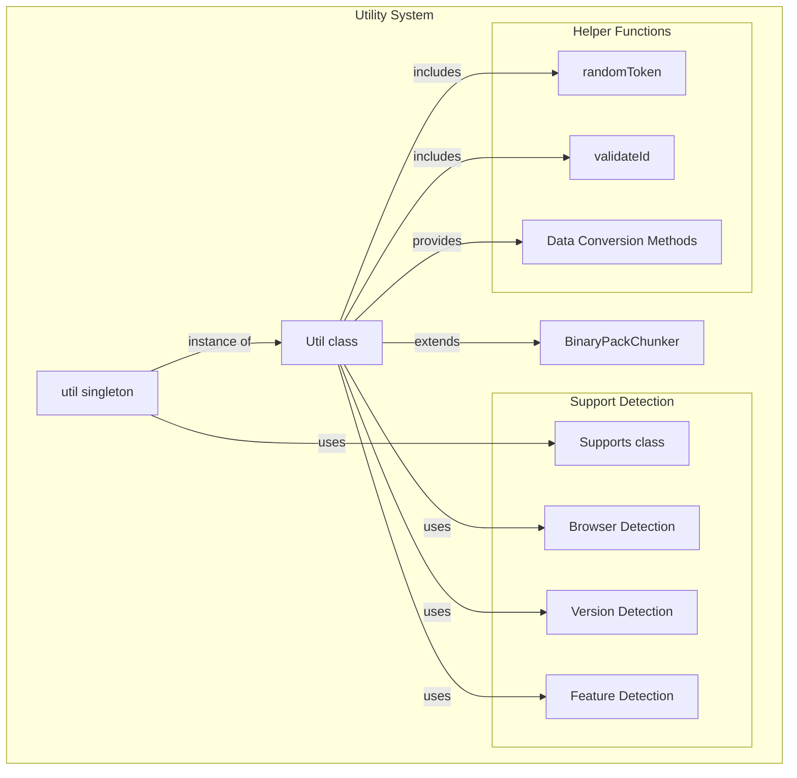
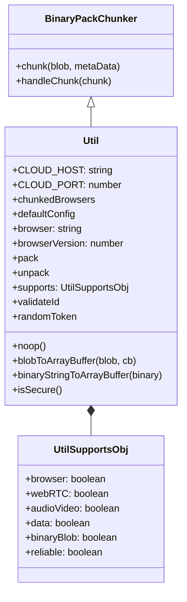
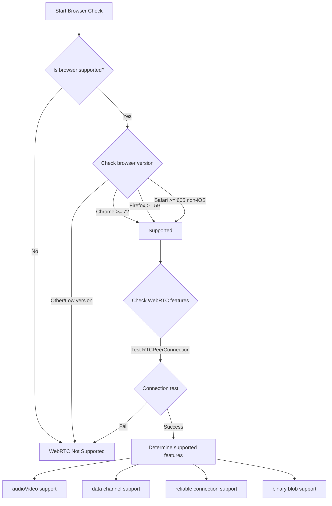
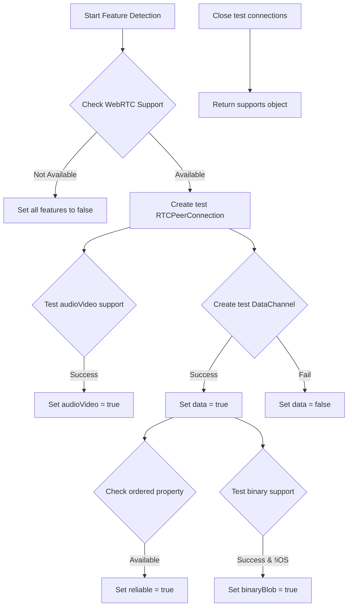
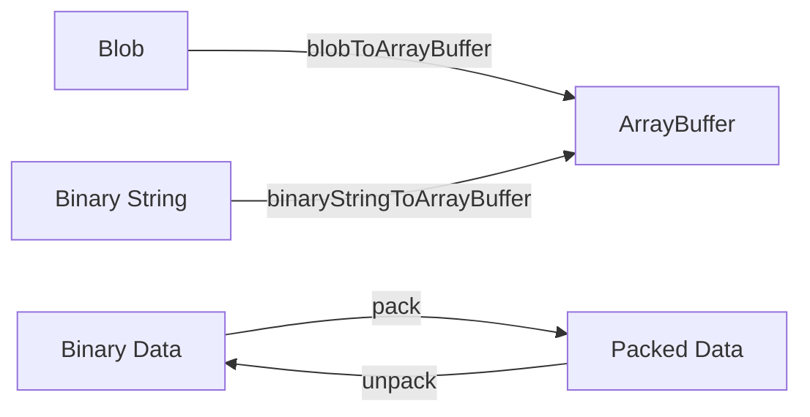
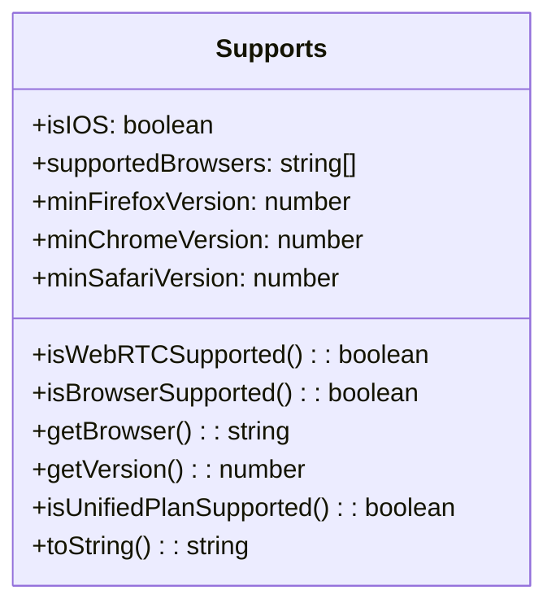
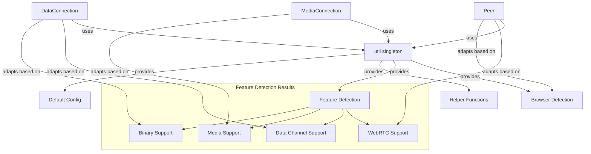

# Utilities and Support

<details>
<summary>관련 소스 파일</summary>

이 위키 페이지를 생성하는 컨텍스트로 다음 파일들이 사용되었습니다:

- [lib/supports.ts](lib/supports.ts)
- [lib/util.ts](lib/util.ts)

</details>


이 문서는 PeerJS 라이브러리의 유틸리티 함수와 브라우저 지원 기능을 설명합니다. 이 구성 요소들은 브라우저 호환성 감지, 데이터 변환, 그리고 라이브러리 전반에서 사용되는 다양한 헬퍼 함수를 위한 필수 인프라를 제공합니다. 유틸리티 함수의 구체 구현은 [Utility Functions](#4.1)을, 브라우저 지원에 대한 자세한 내용은 [Browser Support](#4.2)를 참고하세요.

## 개요

PeerJS는 다양한 브라우저와 환경에서 매끄러운 peer-to-peer 경험을 보장하기 위해 유틸리티 함수 집합과 브라우저 지원 감지 메커니즘을 제공합니다. 이 인프라는 호환성 감지, 헬퍼 메서드 제공, 라이브러리 전반에서 사용되는 구성 상수 정의를 담당합니다.



Sources: [lib/util.ts:53-158](). [lib/supports.ts:7-84]()

## 유틸리티 시스템 아키텍처

PeerJS의 유틸리티 시스템은 `Util` 클래스와 코드베이스 전반에서 사용되도록 export되는 `util` singleton 인스턴스를 중심으로 구성됩니다.



Sources: [lib/util.ts:7-36](), [lib/util.ts:53-158]()

`Util` 클래스는 `BinaryPackChunker`를 확장하며 다음을 제공합니다:
- `util`로 export되는 singleton 인스턴스
- 클라우드 서버 구성을 위한 상수
- 브라우저 감지 속성
- `supports` 객체를 통한 기능 감지
- 데이터 변환과 검증을 위한 헬퍼 메서드

## 브라우저 지원 감지

PeerJS는 `Supports` 클래스를 통해 포괄적인 브라우저 지원 감지 기능을 포함하고 있으며, 이를 통해 विभिन्न 브라우저에서 WebRTC 기능과의 호환성을 판별합니다.



Sources: [lib/supports.ts:7-84]()

브라우저 지원 감지 시스템은 다음을 수행합니다:
- 현재 브라우저 유형과 버전 식별
- 최소 버전 요구 사항과 비교(Chrome 72+, Firefox 59+, Safari 605+)
- 데이터 채널과 미디어 스트림 같은 특정 WebRTC 기능 테스트
- WebRTC 지원이 제한적인 iOS 기기 감지
- Unified Plan 지원 여부 판별

### 브라우저 버전 요구 사항

PeerJS는 지원 브라우저별 최소 버전 요구 사항을 정의합니다:

| Browser | Minimum Version | Notes |
|---------|----------------|-------|
| Chrome  | 72             | |
| Firefox | 59             | |
| Safari  | 605            | iOS는 완전 지원되지 않음 |

Sources: [lib/supports.ts:14-16]()

## 기능 감지 시스템

PeerJS는 사용 가능한 기능을 판별하기 위해 브라우저 능력을 동적으로 테스트합니다:



Sources: [lib/util.ts:78-123]()

기능 감지 과정은 다음과 같습니다:
1. 기본 WebRTC 지원 여부 확인
2. 테스트용 RTCPeerConnection 생성
3. 오디오/비디오 기능 테스트
4. 데이터 채널 기능 테스트
5. 신뢰성 있는 연결 지원 테스트
6. 바이너리 blob 지원 테스트
7. 종합적인 지원 객체 반환

## 유틸리티 함수

`util` singleton은 PeerJS 라이브러리 전반에서 사용되는 여러 헬퍼 함수를 제공합니다:

### 데이터 변환 유틸리티



Sources: [lib/util.ts:129-154]()

주요 데이터 변환 유틸리티는 다음과 같습니다:
- `blobToArrayBuffer`: FileReader를 사용해 Blob을 ArrayBuffer로 변환
- `binaryStringToArrayBuffer`: 바이너리 문자열을 ArrayBuffer로 변환
- `pack`, `unpack`: BinaryPack의 데이터 직렬화/역직렬화 메서드

### 헬퍼 함수와 상수

유틸리티 시스템은 또한 다음을 제공합니다:
- `validateId`: ID가 영숫자인지 확인
- `randomToken`: 랜덤 토큰 생성
- `noop`: 플레이스홀더로 사용할 빈 함수
- `isSecure`: 현재 연결이 보안 연결(HTTPS)인지 판별
- `defaultConfig`: STUN/TURN 서버를 포함한 RTCPeerConnection 기본 구성
- `browser`, `browserVersion` 등 브라우저 감지 속성

Sources: [lib/util.ts:54-67](), [lib/util.ts:125-157]()

## 기본 구성

PeerJS는 WebRTC 연결을 위한 기본 ICE 서버 구성을 제공합니다:

```javascript
const DEFAULT_CONFIG = {
  iceServers: [
    { urls: "stun:stun.l.google.com:19302" },
    {
      urls: [
        "turn:eu-0.turn.peerjs.com:3478",
        "turn:us-0.turn.peerjs.com:3478",
      ],
      username: "peerjs",
      credential: "peerjsp",
    },
  ],
  sdpSemantics: "unified-plan",
};
```

Sources: [lib/util.ts:38-51]()

이 구성은 다음을 제공합니다:
- 공개 Google STUN 서버
- EU 및 US 지역의 PeerJS 호스팅 TURN 서버
- 더 나은 상호운용성을 위한 Unified Plan SDP semantics

## Supports Class

`Supports` 클래스는 브라우저 호환성 감지 기능을 제공하며 Util 클래스에서 사용됩니다:



Sources: [lib/supports.ts:7-84]()

`Supports` 클래스는 다음을 수행합니다:
- WebRTC 지원이 제한적인 iOS 기기 감지
- 지원 브라우저 목록 제공(Chrome, Firefox, Safari)
- 현재 브라우저 지원 여부를 확인하는 메서드 제공
- 현재 환경에서 WebRTC 사용 가능 여부 확인
- Unified Plan 지원 테스트
- 디버깅을 위한 상세한 `toString()` 메서드 포함

## 핵심 구성 요소와의 통합

유틸리티 및 지원 시스템은 PeerJS 핵심 구성 요소와 통합됩니다:



Sources: [lib/util.ts:53-158](), [lib/supports.ts:7-84]()

유틸리티 및 지원 시스템은 PeerJS가 다음을 수행할 수 있도록 하는 필수 정보를 제공합니다:
1. 현재 환경이 peer-to-peer 연결을 지원할 수 있는지 판별
2. 브라우저별 구현 차이와 제약에 맞게 동작 조정
3. 적절한 설정으로 연결 구성
4. 데이터 변환을 효율적으로 처리

## 요약

PeerJS의 유틸리티 및 지원 인프라는 다음을 제공합니다:
- 브라우저 감지와 기능 호환성 테스트
- 효율적인 peer-to-peer 통신을 위한 데이터 변환 유틸리티
- WebRTC 연결을 위한 기본 구성값
- 라이브러리 전반에서 사용되는 헬퍼 함수

이 구성 요소들은 각 환경의 구체적인 기능과 제약에 적응하면서도 PeerJS가 여러 브라우저에서 일관된 API를 제공할 수 있게 하는 핵심 기반을 형성합니다.
