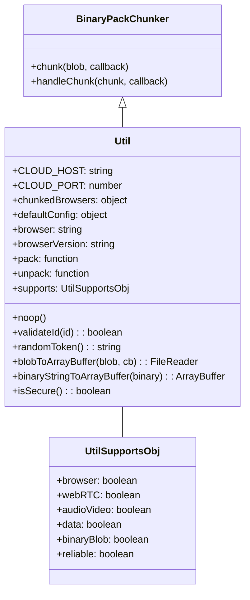
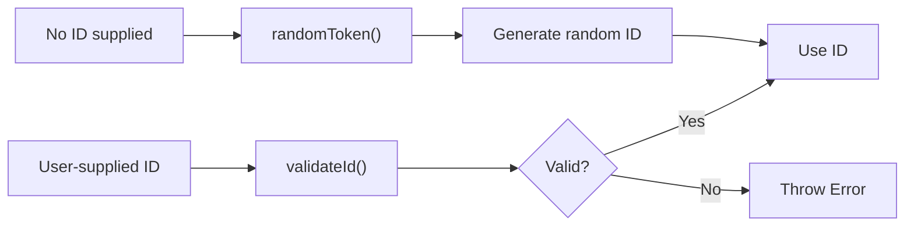
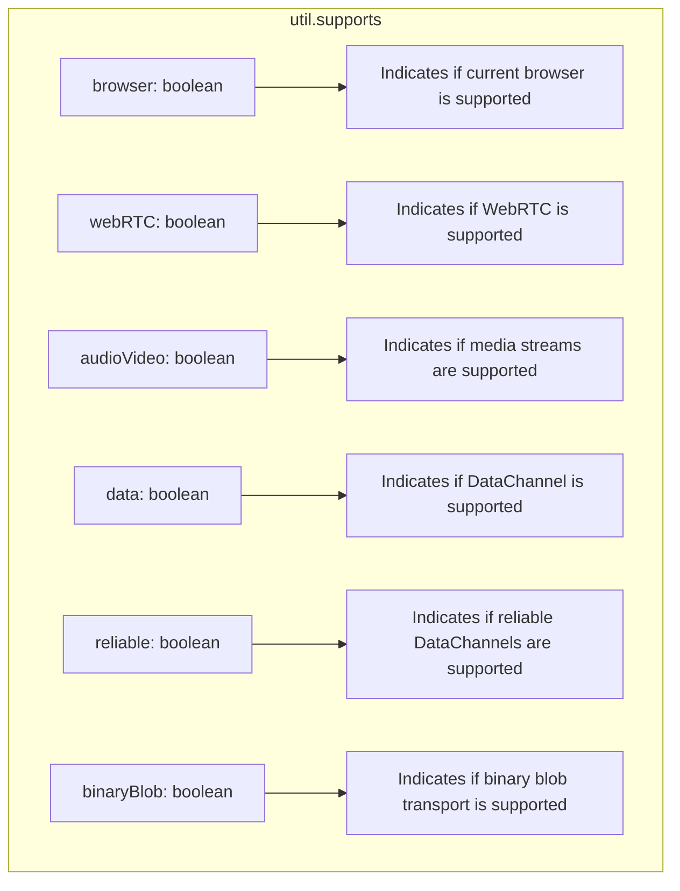
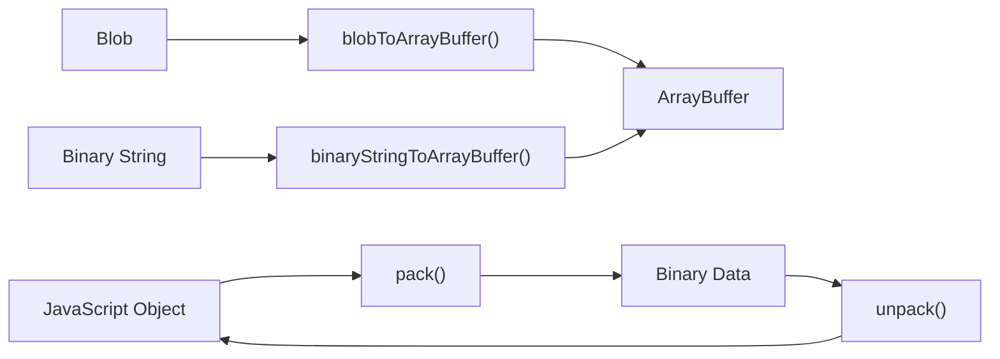
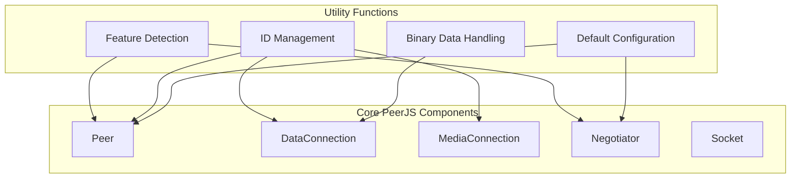

# Utility Functions

<details>
<summary>관련 소스 파일</summary>

이 위키 페이지를 생성하는 컨텍스트로 다음 파일들이 사용되었습니다:

- [lib/util.ts](lib/util.ts)

</details>


## 목적과 범위

이 페이지는 PeerJS가 제공하는 유틸리티 함수를 문서화합니다. 이 함수들은 라이브러리 전반에서 사용되는 공통 기능을 제공합니다. 이러한 유틸리티는 브라우저 호환성 감지, 바이너리 데이터 조작, ID 검증, 기본 구성 설정과 같은 작업을 처리합니다. 유틸리티 함수는 PeerJS의 핵심 구성 요소가 peer-to-peer 연결을 설정하고 유지하는 데 필요한 기반 도구 역할을 합니다.

특히 브라우저 지원 감지에 대한 정보는 [Browser Support](#4.2)를 참고하세요. 오류 처리 메커니즘은 [Error Handling](#4.3)을 참고하세요.

## Util 클래스 개요

PeerJS의 `Util` 클래스는 라이브러리의 다양한 핵심 기능을 지원하는 헬퍼 메서드와 속성 모음을 제공합니다. 이 유틸리티들은 `util`이라는 singleton 인스턴스를 통해 노출됩니다.



Sources: [lib/util.ts:53-158](), [lib/util.ts:7-36]()

## 핵심 유틸리티 함수

유틸리티 함수는 PeerJS 동작에 필수적인 기능을 제공합니다:

| Function | Purpose | Source |
|----------|---------|--------|
| `validateId(id)` | ID가 영숫자이며 유효한지 확인 | [lib/util.ts:126]() |
| `randomToken()` | ID로 사용할 랜덤 토큰 생성 | [lib/util.ts:127]() |
| `noop()` | 아무 작업도 하지 않는 빈 함수 | [lib/util.ts:54]() |
| `isSecure()` | 현재 연결이 HTTPS를 사용하는지 확인 | [lib/util.ts:155-157]() |

### ID 검증과 생성

PeerJS는 peer ID가 요구되는 형식을 따르는지 확인하기 위해 ID 검증을 사용하며, 고유 ID 생성을 위한 랜덤 토큰 생성기도 제공합니다:



Sources: [lib/util.ts:126-127]()

## 브라우저 및 기능 감지

PeerJS의 핵심 유틸리티 중 하나는 브라우저 호환성과 기능 감지 시스템입니다. 이는 `supports` 객체를 통해 구현되며, 현재 브라우저 환경에서의 WebRTC 지원 정보를 제공합니다.

### `supports` 객체

`supports` 객체는 어떤 WebRTC 기능을 사용할 수 있는지 나타내는 boolean 플래그를 포함합니다:



Sources: [lib/util.ts:78-123]()

### 브라우저 감지

PeerJS는 브라우저별로 연결 처리를 최적화하기 위해 브라우저 감지 기능을 포함합니다:

| Property | Description |
|----------|-------------|
| `browser` | 현재 브라우저 식별자 (예: `'firefox'`, `'chrome'`, `'safari'`, `'edge'`) |
| `browserVersion` | 현재 브라우저의 버전 |
| `chunkedBrowsers` | 데이터 청킹이 필요한 브라우저를 식별하는 객체 |

Sources: [lib/util.ts:65-66](), [lib/util.ts:60]()

## 바이너리 데이터 처리

PeerJS는 peer 간 효율적인 데이터 전송에 필수적인 바이너리 데이터 조작 유틸리티를 제공합니다:

### 바이너리 변환 함수

| Function | Description |
|----------|-------------|
| `blobToArrayBuffer(blob, cb)` | FileReader를 사용해 Blob을 ArrayBuffer로 변환 |
| `binaryStringToArrayBuffer(binary)` | 바이너리 문자열을 ArrayBuffer로 변환 |
| `pack` and `unpack` | BinaryPack을 사용해 데이터를 직렬화 및 역직렬화 |



Sources: [lib/util.ts:129-154](), [lib/util.ts:68-69]()

## 상수와 기본 구성

Util 클래스는 PeerJS 전반에서 사용되는 중요한 상수와 기본 구성을 제공합니다:

### 기본 ICE 서버 구성

PeerJS는 ICE 서버(STUN 및 TURN)를 위한 기본 구성을 제공합니다:

```
defaultConfig = {
  iceServers: [
    { urls: "stun:stun.l.google.com:19302" },
    {
      urls: [
        "turn:eu-0.turn.peerjs.com:3478",
        "turn:us-0.turn.peerjs.com:3478",
      ],
      username: "peerjs",
      credential: "peerjsp",
    },
  ],
  sdpSemantics: "unified-plan",
}
```

### 클라우드 서비스 구성

PeerJS는 기본 클라우드 서비스 상수를 정의합니다:

| Constant | Value | Purpose |
|----------|-------|---------|
| `CLOUD_HOST` | "0.peerjs.com" | 기본 PeerJS 서버 호스트 |
| `CLOUD_PORT` | 443 | 기본 PeerJS 서버 포트 |

Sources: [lib/util.ts:56-57](), [lib/util.ts:38-51](), [lib/util.ts:63]()

## PeerJS 구성 요소와의 통합

유틸리티 함수는 다양한 PeerJS 구성 요소와 통합되어 이를 지원합니다:



Sources: [lib/util.ts]()

## 사용 예시

다음은 PeerJS 내부에서 유틸리티 함수가 사용되는 몇 가지 예시입니다:

1. **브라우저 지원 확인**:
   ```javascript
   if (util.supports.data) {
     // Create data connection
   } else {
     // Data channels not supported
   }
   ```

2. **Peer ID 검증**:
   ```javascript
   if (util.validateId(id)) {
     // Use the ID
   } else {
     // ID is invalid
   }
   ```

3. **보안 연결 여부 확인**:
   ```javascript
   if (util.isSecure()) {
     // Using HTTPS
   } else {
     // Using HTTP, show security warning
   }
   ```

4. **바이너리 데이터 처리**:
   ```javascript
   util.blobToArrayBuffer(blob, (arrayBuffer) => {
     // Process the ArrayBuffer
   });
   ```

Sources: [lib/util.ts]()
