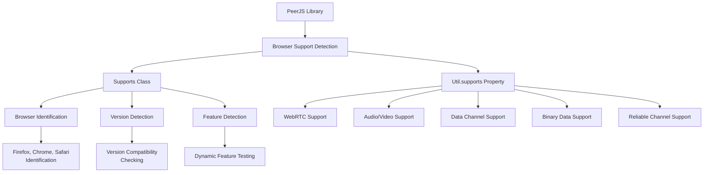
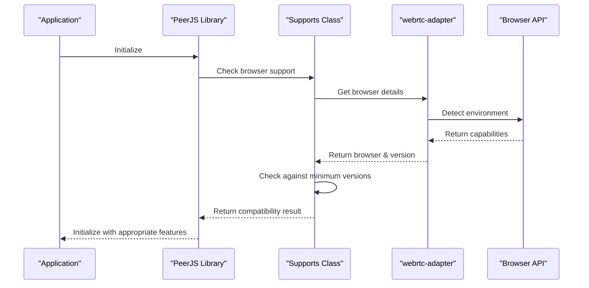
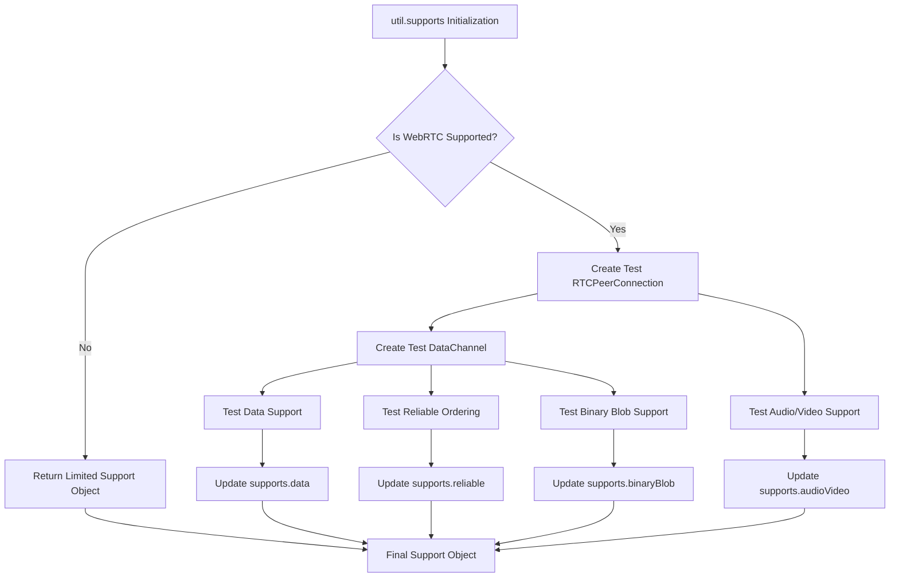
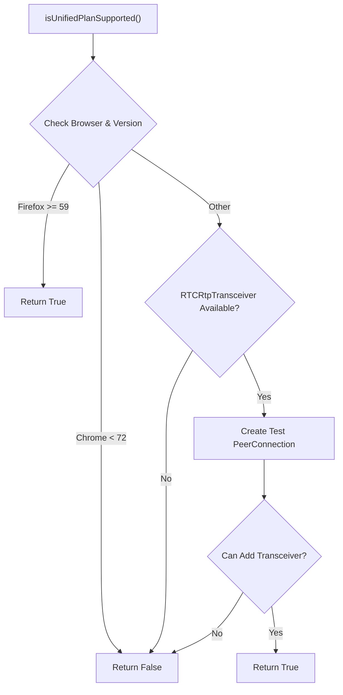

# Browser Support

<details>
<summary>관련 소스 파일</summary>

이 위키 페이지를 생성하는 컨텍스트로 다음 파일들이 사용되었습니다:

- [lib/supports.ts](lib/supports.ts)
- [lib/util.ts](lib/util.ts)

</details>


이 페이지는 PeerJS가 서로 다른 브라우저 기능을 어떻게 감지하고 이에 적응하는지 문서화합니다. 브라우저 감지 메커니즘, 지원되는 브라우저와 기능, 기능 가용성에 따라 PeerJS가 어떻게 동작을 조정하는지를 설명합니다. 브라우저 비호환성과 관련된 오류 처리 정보는 [Error Handling](#4.3)을 참고하세요.

## 개요

PeerJS는 서로 다른 브라우저와 버전 간 호환성을 보장하기 위해 견고한 브라우저 기능 감지 시스템을 사용합니다. 라이브러리는 현재 브라우저 환경이 peer-to-peer 연결에 필요한 WebRTC 기능을 지원하는지 판별하기 위해 기능 검사를 수행합니다.



Sources: [lib/supports.ts:7-84](), [lib/util.ts:78-123]()

## 지원 브라우저와 버전

PeerJS는 라이브러리를 효과적으로 사용할 수 있는 주요 브라우저별 최소 버전을 정의합니다:

| Browser | Minimum Version | Notes |
|---------|----------------|-------|
| Chrome  | 72             | 완전한 WebRTC 지원 |
| Firefox | 59             | 완전한 WebRTC 지원 |
| Safari  | 605            | iOS Safari는 지원되지 않음 |

라이브러리는 현재 브라우저와 버전을 감지한 뒤, 최소 요구 사항을 충족하는지 판별하는 메서드를 포함합니다.

Sources: [lib/supports.ts:12-16]()

## 브라우저 감지 메커니즘

PeerJS는 `webrtc-adapter` 라이브러리를 사용해 브라우저를 정확히 식별하고, 브라우저 간 WebRTC 구현 차이를 정규화합니다. 이 접근 방식은 user agent 문자열이 혼동을 줄 수 있는 경우에도 일관된 브라우저 식별을 제공합니다.



`Supports` 클래스는 브라우저 감지를 위한 몇 가지 핵심 메서드를 제공합니다:

- `getBrowser()`: 현재 브라우저 이름 반환 (예: `'chrome'`, `'firefox'`, `'safari'`)
- `getVersion()`: 브라우저 버전 번호 반환
- `isBrowserSupported()`: 현재 브라우저와 버전이 지원되는지 확인
- `isWebRTCSupported()`: 현재 환경에서 WebRTC가 지원되는지 확인

Sources: [lib/supports.ts:18-44]()

## 기능 감지

기본적인 브라우저 식별을 넘어서, PeerJS는 실제 기능 사용 가능 여부를 확인하기 위해 임시 WebRTC 객체를 생성해 테스트를 수행합니다. 이 실용적인 접근 방식은 이론적인 지원이 실제 기능 가용성으로 이어지는지 보장합니다.

### WebRTC 기능 테스트

`util.supports` 속성은 다음 방식으로 포괄적인 기능 감지 메커니즘을 제공합니다:

1. 임시 RTCPeerConnection 생성
2. 오디오/비디오 지원 테스트
3. 데이터 채널 생성 및 기능 테스트
4. 바이너리 데이터 지원 테스트
5. 신뢰성 있는 채널 순서 보장 테스트



기능 감지 결과는 다음 속성을 가진 `util.supports` 객체를 통해 노출됩니다:

- `browser`: 브라우저가 지원되는지 나타내는 boolean
- `webRTC`: WebRTC가 지원되는지 나타내는 boolean
- `audioVideo`: 미디어 스트림이 지원되는지 나타내는 boolean
- `data`: 데이터 채널이 지원되는지 나타내는 boolean
- `binaryBlob`: 바이너리 blob 데이터가 지원되는지 나타내는 boolean
- `reliable`: 신뢰성 있는 데이터 채널이 지원되는지 나타내는 boolean

Sources: [lib/util.ts:78-123]()

## iOS 지원

PeerJS는 iOS 기기에 대해 특별한 처리를 합니다. 라이브러리는 iOS 기기를 감지하고 특정 제한 사항을 적용합니다:

- iOS의 Safari는 지원 브라우저로 간주되지 않음
- iOS에서는 바이너리 blob 처리에 특정 제한이 있음

감지는 플랫폼이 `"iPad"`, `"iPhone"`, `"iPod"` 중 하나인지 확인하는 방식으로 수행됩니다.

Sources: [lib/supports.ts:8-11](), [lib/util.ts:107]()

## Unified Plan 지원

PeerJS는 고급 WebRTC 기능에 중요한 `"Unified Plan"` SDP 형식의 지원 여부를 확인합니다:



이 검사는 peer 연결 설정에 사용할 협상 방식을 결정하는 데 중요합니다.

Sources: [lib/supports.ts:46-73]()

## 브라우저별 동작 조정

PeerJS는 감지된 브라우저 기능에 따라 동작을 조정합니다:

1. **대용량 데이터 청킹**: PeerJS는 대용량 데이터 전송 시 청킹이 필요한 브라우저를 식별합니다
   ```javascript
   readonly chunkedBrowsers = { Chrome: 1, chrome: 1 };
   ```

2. **기본 구성**: RTCPeerConnection을 위한 브라우저 독립적인 기본 구성을 제공합니다
   ```javascript
   readonly defaultConfig = DEFAULT_CONFIG;
   ```

3. **바이너리 데이터 처리**: 브라우저 기능에 따라 바이너리 데이터 처리 방식을 조정합니다

Sources: [lib/util.ts:60-63]()

## 브라우저 지원 정보 사용하기

PeerJS를 사용하는 개발자는 `util` 객체를 통해 브라우저 지원 정보에 접근할 수 있습니다:

```javascript
// Check if the current browser is supported
if (util.supports.browser) {
  // PeerJS can work in this browser
}

// Check what browser is being used
if (util.browser === 'firefox') {
  // Firefox-specific code
}

// Check if data channels are supported
if (util.supports.data) {
  // Can use data channels
}

// Check if media is supported
if (util.supports.audioVideo) {
  // Can use audio/video
}
```

`browser` 속성은 `'firefox'`, `'chrome'`, `'safari'`, `'edge'` 또는 지원되지 않음을 나타내는 메시지 값을 가질 수 있습니다.

Sources: [lib/util.ts:7-36](), [lib/util.ts:65-66]()

## 내부 테스트와 진단

디버깅 목적으로 `Supports` 클래스는 현재 브라우저 환경 세부 정보를 출력하는 `toString()` 메서드를 제공합니다:

```
Supports:
    browser:chrome
    version:96
    isIOS:false
    isWebRTCSupported:true
    isBrowserSupported:true
    isUnifiedPlanSupported:true
```

이 정보는 브라우저 호환성과 관련된 문제를 진단하는 데 유용할 수 있습니다.

Sources: [lib/supports.ts:75-83]()
