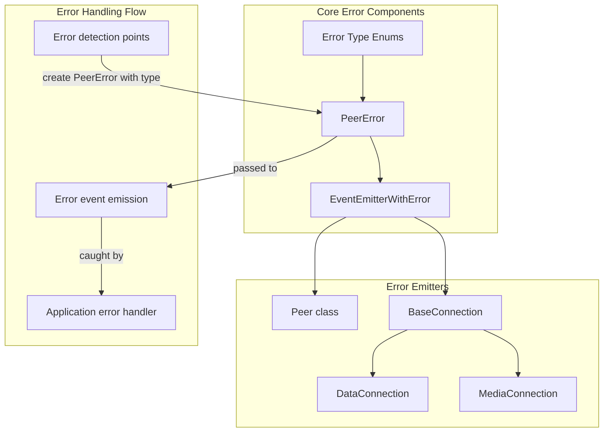
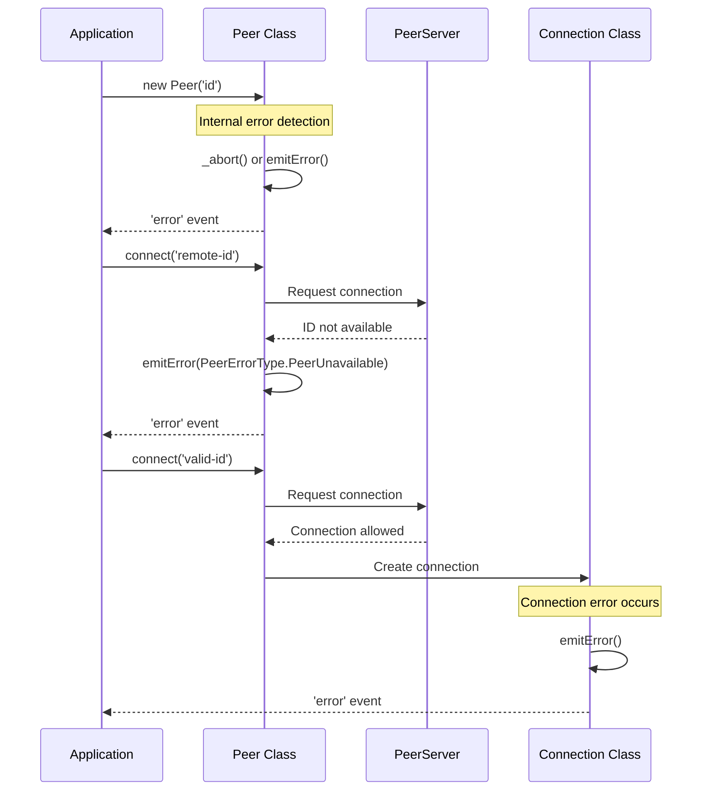
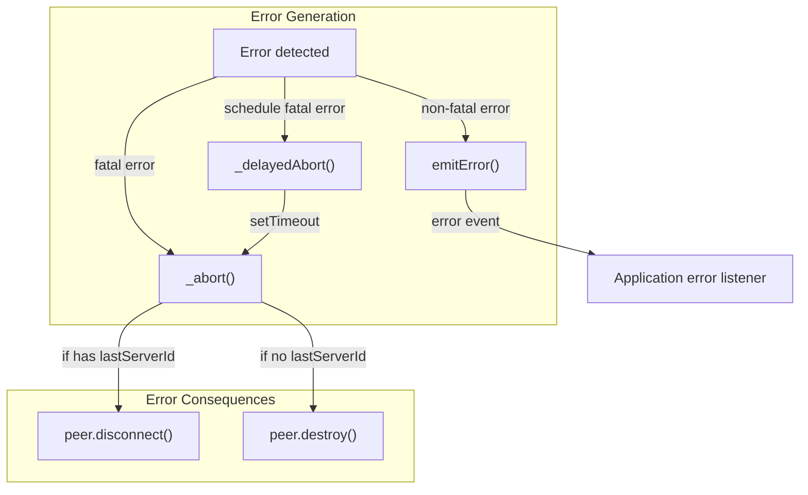

# Error Handling

<details>
<summary>관련 소스 파일</summary>

이 위키 페이지를 생성하는 컨텍스트로 다음 파일들이 사용되었습니다:

- [e2e/peer/disconnected.html](e2e/peer/disconnected.html)
- [e2e/peer/id-taken.html](e2e/peer/id-taken.html)
- [e2e/peer/peer.page.ts](e2e/peer/peer.page.ts)
- [e2e/peer/peer.spec.ts](e2e/peer/peer.spec.ts)
- [e2e/peer/server-unavailable.html](e2e/peer/server-unavailable.html)
- [lib/baseconnection.ts](lib/baseconnection.ts)
- [lib/enums.ts](lib/enums.ts)
- [lib/exports.ts](lib/exports.ts)
- [lib/peer.ts](lib/peer.ts)
- [lib/servermessage.ts](lib/servermessage.ts)

</details>


이 문서는 PeerJS 라이브러리 사용자에게 오류가 어떻게 처리되고 노출되는지 설명합니다. 시스템에 정의된 오류 유형, 오류가 애플리케이션을 통해 전파되는 방식, 그리고 PeerJS를 사용하는 애플리케이션에서의 오류 처리 모범 사례를 다룹니다.

유틸리티 함수에 대한 정보는 [Utility Functions](#4.1)을, 브라우저 지원 감지에 대한 정보는 [Browser Support](#4.2)를 참고하세요.

## 오류 아키텍처 개요

PeerJS는 이벤트 기반의 일관된 오류 처리 아키텍처를 구현합니다. 라이브러리는 서로 다른 오류 시나리오를 분류하기 위해 커스텀 오류 유형을 사용하며, 이를 통해 애플리케이션 개발자가 특정 오류를 적절히 처리할 수 있게 합니다.



Sources: [lib/peer.ts:23-23](), [lib/baseconnection.ts:6-9](), [lib/enums.ts:6-71]()

## 오류 유형

PeerJS는 오류 원인과 가능한 해결책을 파악하기 쉽도록 오류를 구분된 유형으로 분류합니다. 이들은 코드베이스에서 enum으로 정의되어 있습니다.

### Peer 오류 유형

이 오류들은 peer 인스턴스와 시그널링 서버와의 연결과 관련됩니다:

| Error Type | Description | Common Cause |
|------------|-------------|--------------|
| `BrowserIncompatible` | 클라이언트 브라우저가 필요한 WebRTC 기능을 지원하지 않음 | 오래된 브라우저 사용 또는 WebRTC 지원이 제한된 브라우저 |
| `Disconnected` | 이 peer는 이미 서버와 연결이 끊어진 상태임 | `.disconnect()` 호출 후 다시 연결 시도 |
| `InvalidID` | Peer 생성자에 전달한 ID에 허용되지 않는 문자가 포함됨 | ID에 허용되지 않는 특수 문자 사용 |
| `InvalidKey` | API 키가 유효하지 않음 | 잘못된 API 키 제공 |
| `Network` | 시그널링 서버와의 연결 손실 | 네트워크 장애, 서버 문제 |
| `PeerUnavailable` | 연결하려는 peer가 존재하지 않음 | peer가 연결 해제되었거나 ID가 잘못됨 |
| `SslUnavailable` | PeerJS가 secure 모드를 사용하지만 서버가 SSL을 지원하지 않음 | 서버 구성 문제 |
| `ServerError` | 서버에 도달할 수 없음 | 서버 다운 또는 잘못된 구성 |
| `SocketError` | 내부 소켓에서 발생한 오류 | 네트워크 또는 연결 문제 |
| `SocketClosed` | 내부 소켓이 예기치 않게 닫힘 | 서버 측 또는 네트워크 문제 |
| `UnavailableID` | Peer 생성자에 전달한 ID가 이미 사용 중임 | 다른 사용자와의 ID 충돌 |
| `WebRTC` | 네이티브 WebRTC 오류 | 다양한 WebRTC 내부 문제 |

Sources: [lib/enums.ts:6-61]()

### 연결 오류 유형

이 오류들은 peer 간 연결과 관련됩니다:

| Error Type | Description |
|------------|-------------|
| `NegotiationFailed` | WebRTC 협상 과정 실패 |
| `ConnectionClosed` | 연결이 닫힘 |

Sources: [lib/enums.ts:63-66]()

### 데이터 연결 오류 유형

데이터 연결에 특화된 오류입니다:

| Error Type | Description |
|------------|-------------|
| `NotOpenYet` | 연결이 설정되기 전에 데이터 전송 시도 |
| `MessageToBig` | 메시지가 크기 제한을 초과함 |

Sources: [lib/enums.ts:68-71]()

## 오류 이벤트와 처리

### Error 이벤트

`Peer` 클래스와 연결 클래스는 모두 오류가 발생하면 `error` 이벤트를 발생시킵니다. 이벤트 핸들러는 위에서 설명한 오류 유형 중 하나와 대응되는 `type` 속성을 가진 `PeerError` 객체를 받습니다.

```typescript
// Example of handling errors on a Peer instance
const peer = new Peer('your-id');
peer.on('error', (error) => {
  console.log(`Error type: ${error.type}`);
  
  // Handle specific error types
  if (error.type === 'unavailable-id') {
    console.log('The ID is taken, try another one');
  } else if (error.type === 'network') {
    console.log('Connection to server lost, will try to reconnect');
  }
});
```

Sources: [lib/peer.ts:108-108](), [lib/baseconnection.ts:28-28]()

### 오류 흐름 다이어그램



Sources: [lib/peer.ts:107-108](), [lib/peer.ts:607-628](), [lib/baseconnection.ts:35-38]()

## PeerJS 내부의 오류 처리

PeerJS에는 오류를 처리하고 전파하기 위한 여러 내부 메커니즘이 있습니다:

### `emitError` 메서드

`Peer`와 연결 클래스는 모두 `EventEmitterWithError`를 상속하며, 이 클래스는 `emitError` 메서드를 제공합니다. 이 메서드는 `PeerError` 객체를 생성하고 이를 `'error'` 이벤트로 발생시킵니다.

### Abort 메커니즘

`Peer` 클래스는 치명적인 오류를 처리하기 위해 `_abort` 및 `_delayedAbort` 메서드를 구현합니다:

1. `_delayedAbort`: 현재 실행 컨텍스트 이후에 abort 작업이 실행되도록 예약
2. `_abort`: 오류를 발생시키고, 상태에 따라 peer를 destroy하거나 disconnect



Sources: [lib/peer.ts:607-628](), [lib/peerError.ts]()

### 치명적 오류와 비치명적 오류

PeerJS는 치명적 오류와 비치명적 오류를 구분합니다:

- **치명적 오류**: peer가 더 이상 기능할 수 없게 만드는 오류(예: 브라우저 비호환, SSL 미지원)
- **비치명적 오류**: peer가 계속 동작할 수 있는 오류(예: 특정 peer와의 연결 실패)

`PeerEvents` 인터페이스 문서에는 다음과 같이 명시되어 있습니다: "Errors on the peer are almost always fatal and will destroy the peer."

Sources: [lib/peer.ts:104-108]()

## 오류 처리 모범 사례

PeerJS를 사용할 때는 다음 오류 처리 모범 사례를 따르세요:

1. **항상 error 이벤트를 수신하세요**:
   ```typescript
   peer.on('error', (error) => {
     console.error('PeerJS error:', error.type, error);
   });
   
   connection.on('error', (error) => {
     console.error('Connection error:', error.type, error);
   });
   ```

2. **특정 오류 유형별로 다르게 처리하세요**:
   ```typescript
   peer.on('error', (error) => {
     switch(error.type) {
       case 'unavailable-id':
         // Suggest alternative ID or generate random one
         break;
       case 'network':
         // Show network reconnection interface
         break;
       case 'browser-incompatible':
         // Show browser compatibility warning
         break;
       // etc.
     }
   });
   ```

3. **적절한 경우 재연결 로직을 구현하세요**:
   ```typescript
   peer.on('error', (error) => {
     if (error.type === 'network' || error.type === 'socket-error') {
       attemptReconnection();
     }
   });
   
   function attemptReconnection() {
     if (peer.disconnected && !peer.destroyed) {
       peer.reconnect();
     }
   }
   ```

4. **오류뿐 아니라 disconnected 이벤트도 처리하세요**:
   ```typescript
   peer.on('disconnected', (peerId) => {
     console.log(`Disconnected from server, was using ID: ${peerId}`);
     // Decide whether to reconnect
   });
   ```

Sources: [e2e/peer/id-taken.html:36-47](), [e2e/peer/disconnected.html:25-33](), [lib/peer.ts:709-730]()

## 오류 테스트 예시

PeerJS 코드베이스에는 오류 처리를 보여주는 여러 end-to-end 테스트가 포함되어 있습니다:

1. **ID taken scenario**: 이미 사용 중인 ID를 사용하려 할 때 오류가 어떻게 처리되는지 테스트
2. **Server unavailable scenario**: 서버에 도달할 수 없을 때의 오류 처리 테스트
3. **Disconnected scenario**: 연결 해제 후 연결을 설정하려 할 때 발생하는 오류 테스트

이 테스트들은 실제 상황에서 특정 오류 유형에 대응하는 실용적인 예시를 보여줍니다.

Sources: [e2e/peer/id-taken.html](), [e2e/peer/server-unavailable.html](), [e2e/peer/disconnected.html](), [e2e/peer/peer.spec.ts:4-20]()

## PeerError 클래스 구현

`PeerError` 클래스는 JavaScript의 네이티브 `Error` 클래스를 확장하며, 오류 유형 enum과 일치하는 특정 타입을 가진 구조화된 오류 객체를 생성하는 데 사용됩니다. 이를 통해 애플리케이션 전반에서 일관된 오류 처리가 가능해집니다.

이 커스텀 오류 구현은 PeerJS 오류 처리의 핵심 기반이며, 오류를 분류하고 식별하고 적절히 처리할 수 있게 합니다.

Sources: [lib/peer.ts:23-23](), [lib/exports.ts:26-26]()
